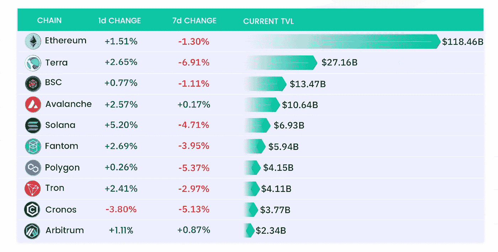
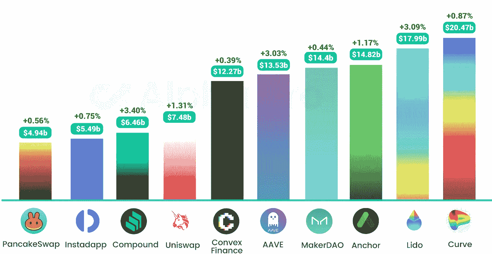
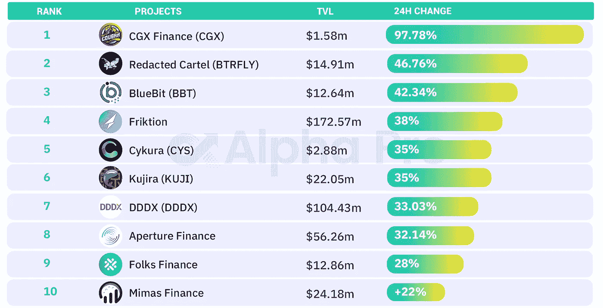
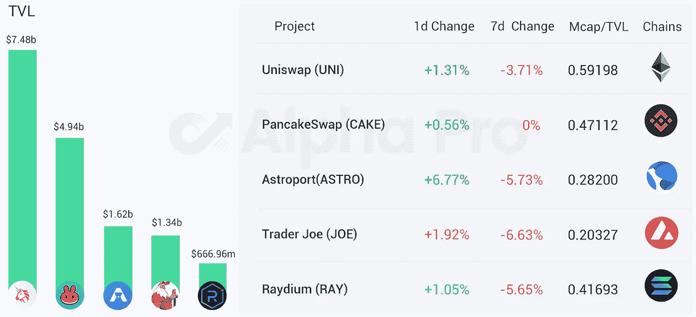
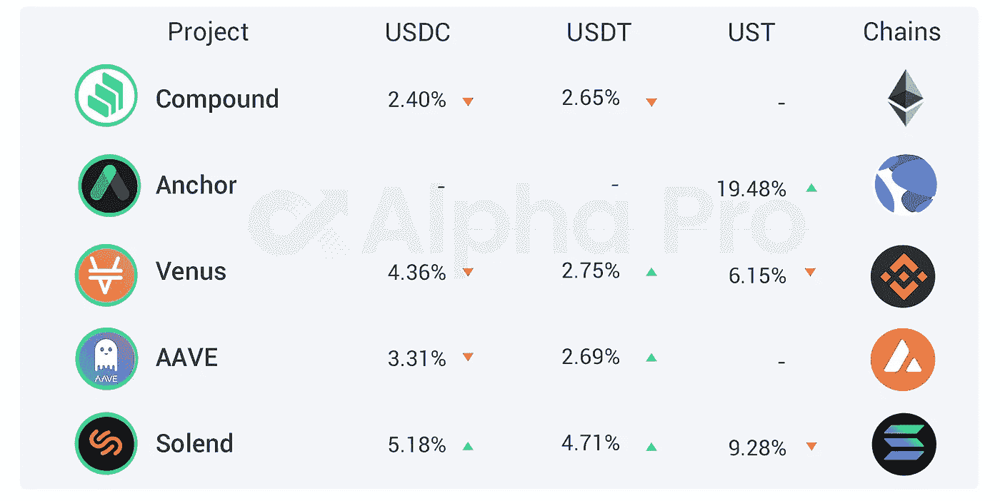

# 打破货币市场清算的设计空间

> 原文：<https://medium.com/coinmonks/defi-insight-breaking-down-the-design-space-of-money-market-liquidations-754f2a7b9461?source=collection_archive---------33----------------------->

## 2022 年 4 月 14 日

*今日 DeFi 数据&由 DeFi Insight 为您带来的新闻。*

> 清算是加密资产市场中的一个流行概念。crypto 的波动性带来了有利可图的机会，但正如俗话所说，没有风险就没有回报。清算是指杠杆头寸由于即将破产的风险而被平仓的过程。当这种情况发生时，借款人/交易商用于担保还款的资产被部分或全部扣押。
> 
> 交易加密衍生品或从 DeFi 货币市场贷款的用户将熟悉清算的概念。虽然基于衍生工具的清算更为普遍，但出于本报告的目的，我们将集中讨论以货币市场为中心的清算。[德尔福数码 ](https://members.delphidigital.io/reports/breaking-down-the-design-space-of-money-market-liquidations)

# 最新消息

## 贷款

**[d force](https://dforcenet.medium.com/dforce-is-coming-to-avalanche-4979cee70710)即将雪崩**

****[Jet 协议](https://www.jetprotocol.io/posts/jetgovern-process)宣布关于 DAO 治理和 Jet 空投的细节****

## ****指标****

******[新月](https://crescentnetwork.medium.com/crescent-network-now-live-on-mainnet-12122ee3948d)网络现在在 Mainnet 上直播******

## ******AMM******

********AMM 协议[克洛诺斯财经](https://twitter.com/CronusFinance/status/1514274531443048453) Testnet 现已上线********

## ******稳定币******

********、** Anchor 协议和 Acala 整合，联合 Terra 和 Polkadot DeFi 生态系统，发展分散的[稳定的市场](/acalanetwork/anchor-protocol-and-acala-integrating-to-unite-terra-and-polkadot-defi-ecosystems-and-grow-9684aa90a81d)******

****Instadapp 推出 eth 2.0 USDC 收益产品****

****Terraform Labs 额外捐赠 1000 万卢纳给 LFG****

******Terraform Labs 与包括 JUMP Crypto、Delphi Digital、Outlier Ventures 等在内的合作伙伴一起推出了[全球创始人奖学金](https://finance.yahoo.com/news/terraform-labs-launches-global-founder-160000391.html)******

## ******|合并******

********以太坊核心开发者:[尚未确定合并日期](https://github.com/timbeiko/eth-roadmap-faq#merge-timelines)，暗影分叉将定期重新运行********

## ******钱包******

********[币安](https://twitter.com/binance/status/1514526061794668544?s=20&t=fSncpdUNMhj57t3aiXJcCg):多个网络的钱包维护时间延长了约三个小时，至 2022 年 4 月 14 日 11:30 (UTC)********

******StarkWare 和 Web3Auth 合作消除 StarkNet 钱包的种子短语&dapp******

********[幻影](https://twitter.com/phantom/status/1514046389013159941)钱包发布安卓公测********

## ******支付******

******在监管不确定的情况下，印度的加密交易所暂停存款******

## ******政策与法规******

********巴西参议院宣布即将批准[“比特币法”](https://cointelegraph.com/news/brazilian-senate-announces-incoming-approval-of-the-bitcoin-law)********

## ******NFT******

******NFT 世界创世纪头像在 5 月 1 日公开铸造******

********[STEPN](https://twitter.com/Stepnofficial/status/1514409753975279619)宣布开始 GMT 回购销毁，计划每天投入 10000 索尔，直到资金耗尽********

********[【杰克·多西推特】](https://www.coindesk.com/layer2/2022/04/13/buyer-of-jack-dorsey-tweet-nft-is-out-of-prison-and-under-fire-from-investors/) NFT 的买家已经出狱，并受到投资者的抨击********

********[**波布**](https://twitter.com/AzukiOfficial/status/1514292933175828482)**将成为第一个通过莱杰把私人钥匙送上太空的 NFT**********

## ******基金******

******艾娃实验室以 50 亿美元的估值筹集资金******

********[联合公司](https://www.finextra.com/pressarticle/92235/coinpanion-raises-seed-round-to-55-million)向€融资 550 万美元********

******克莱顿承诺投入 2000 万美元用于推进区块链的研究******

********A16z 领投 400 万美元的 Web 3 定期支付种子基金[初创公司](https://www.coindesk.com/business/2022/04/13/a16z-leads-4m-seed-round-for-web-3-recurring-payments-startup/)********

********[流体](https://www.investing.com/news/cryptocurrency-news/fluid-to-disrupt-liquidity-in-the-space-raises-10m-in-funding-2803259)扰乱空间中的流动性，筹集 1000 万美元资金********

# ******数据和分析******

## ******TVL 增长排名前 10 的连锁店******

************

## ******最新 TVL 十大项目******

************

## ******过去 24 小时 TVL 变化的前 10 个项目******

************

## ******德克斯 TVL 排名******

******指数中涨幅最大的是 [Astroport](https://defillama.com/protocol/astroport) ，上涨 6.77 **%********

********

## ****APY DeFi 贷款公司****

*****USDC:最高贷款利率:**[*索伦德*](https://solend.fi/dashboard)*APY******

******USDT:最高贷款利率:* [*索伦德*](https://solend.fi/dashboard)*4.71% APY******

**********

# *****深潜*****

*******14 个永恒的教训** [**密码市场**](https://twitter.com/route2fi/status/1514244551392772100)*****

*******如何找到&赛道** [**领跑者**](https://twitter.com/blockanalia/status/1514007497111179267)*****

# *****报告*****

*******[**区块链缩放**](https://www.theblockresearch.com/a-summary-of-blockchain-scaling-139203)**_ the block research*********

> *******自 2017 年 CryptoKitties 和 2020 年 DeFi Summer 造成拥堵以来，区块链扩展一直是一个焦点。
> 到目前为止，大多数扩展解决方案都专注于部署汇总和使用替代层 1。
> 从数据可用性层到第 0 层解决方案，有一些解决扩展问题的新方法。
> 虽然这些方法中的大部分在实施上有所不同，但它们都有一个共同的理念，即在分散的网络中抽象职责。*******

*********[**筒仓财务**](https://research.thetie.io/permissionless-lending-silo/) **:孤立优势** _thetie.io*********

*******[**沙盒**](https://messari.io/article/state-of-the-sandbox-q1-2022)**Q1 2022**_ messari . io 的状态*******

*****一场一场**的较量:*******

*****DeFi Insight 是顶级 DeFi 和加密新闻和更新的来源。*****

*******https://twitter.com/AlphaPro_io**❤*****

*********https://medium.com/feed/@alphapro.project RSS:*********

*******提供的信息应被视为发展新闻，而不是投资建议。*******

> ********加入 Coinmonks* [*电报频道*](https://t.me/coincodecap) *和* [*Youtube 频道*](https://www.youtube.com/c/coinmonks/videos) *了解加密交易和投资********

# *******另外，阅读*******

*   *******[有哪些交易信号？](https://coincodecap.com/trading-signal) | [Bitstamp vs 比特币基地](https://coincodecap.com/bitstamp-coinbase) | [买索拉纳](https://coincodecap.com/buy-solana)*******
*   *******[ProfitFarmers 回顾](https://coincodecap.com/profitfarmers-review) | [如何使用 Cornix 交易机器人](https://coincodecap.com/cornix-trading-bot)*******
*   *******[十大最佳加密货币博客](https://coincodecap.com/best-cryptocurrency-blogs) | [YouHodler 评论](https://coincodecap.com/youhodler-review)*******
*   *******[MyConstant Review](https://coincodecap.com/myconstant-review) | [8 款最佳摇摆交易机器人](https://coincodecap.com/best-swing-trading-bots)*******
*   *******[MXC 交易所评论](/coinmonks/mxc-exchange-review-3af0ec1cba8c) | [Pionex vs 币安](https://coincodecap.com/pionex-vs-binance) | [Pionex 套利机器人](https://coincodecap.com/pionex-arbitrage-bot)*******