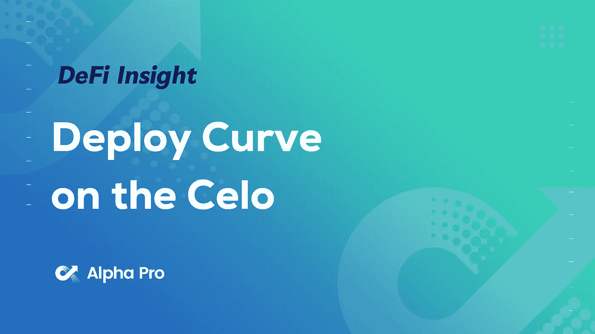
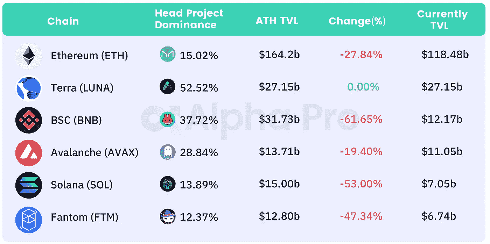
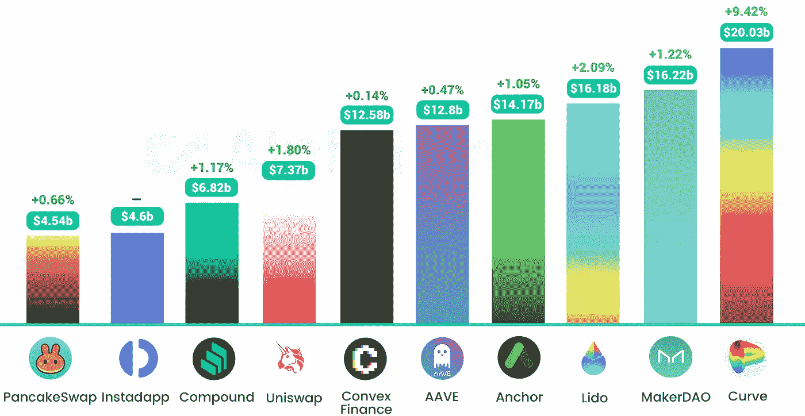
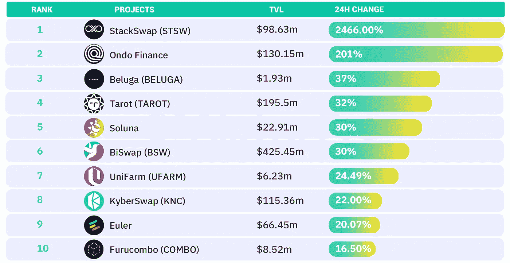
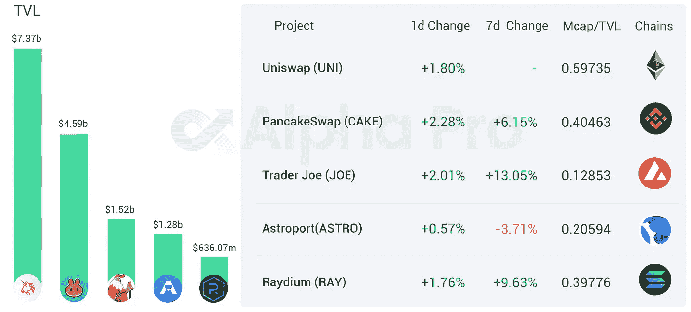
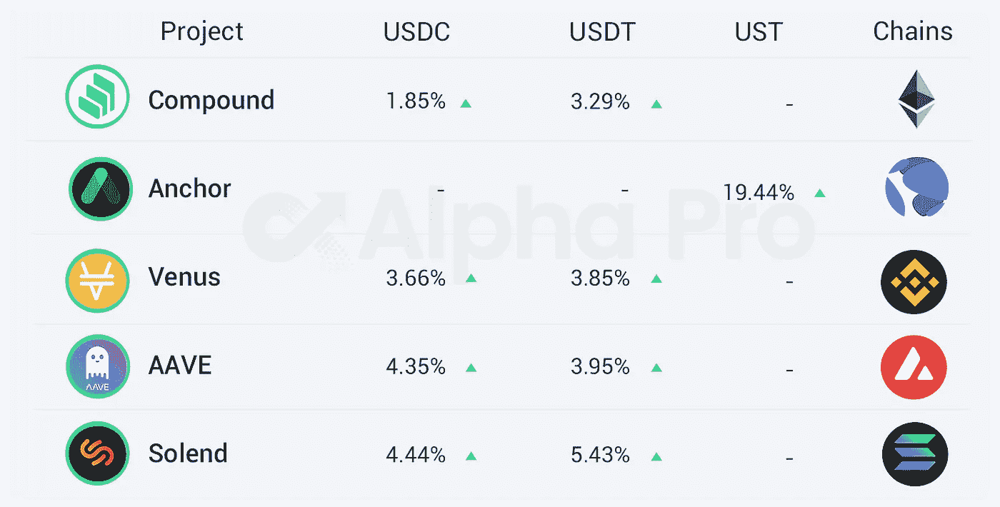

# DeFi Insight | Celo 社区批准在 Celo 区块链上部署 Curve 的提案

> 原文：<https://medium.com/coinmonks/defi-insight-celo-community-approves-proposal-to-deploy-curve-on-the-celo-blockchain-b6de3ab35d75?source=collection_archive---------33----------------------->

## 2022 年 3 月 22 日

*今日 DeFi 数据&由 DeFi Insight 为您带来的新闻。*

> [**Celo 社区**](https://snapshot.org/#/curve.eth/proposal/0xa11d4d1800b91746afe8ead922eb1d37225a32145adf30bbda0cbdba2ef97bd3) 今天早些时候通过了一项治理提案，在 Celo 区块链上部署 Curve。通过 1 亿美元的“DeFi for the People”计划，Celo 基金会将向 Curve 的流动性提供商提供价值 700 万美元的 CELO 代币奖励。

# 最新消息

## 定义

**,**FTX 欧洲总部计划“谨慎”扩张进入[英国市场](https://www.theblockcrypto.com/post/138582/ftxs-european-head-plots-cautious-expansion-into-uk-market)

FTX 风险投资公司向戴夫投资 1 亿美元

南森:前十大主流网络 7 天总活跃地址约[834 万](https://twitter.com/nansen_ai/status/1505945918394171392)

**Blockchain.com 密码交易所收购 Altonomy 的 [OTC 柜台](https://www.coindesk.com/business/2022/03/21/crypto-exchange-blockchaincom-acquires-altonomys-otc-desk/)**

****[雷伊·达里奥布里奇沃特](https://www.coindesk.com/business/2022/03/21/ray-dalios-bridgewater-investing-in-crypto-fund-sources/)投资加密基金****

******英国广告监管机构发布关于[加密广告](https://www.coindesk.com/policy/2022/03/22/uk-advertising-regulator-issues-red-alert-guidance-on-crypto-ads/)的“红色警报”指南******

********、**加密部门连续第二周公布资金外流- [CoinShares](https://www.reuters.com/technology/crypto-sector-posts-outflows-2nd-straight-week-coinshares-2022-03-21/)******

******Coincheck 通过与雷桥资本合伙公司整合，转型为在纳斯达克上市的子公司******

********[秘密骗局](https://www.bloomberg.com/news/articles/2022-03-21/crypto-scam-couple-seeks-delay-in-case-amid-plea-discussions)一对夫妇在辩诉交易中寻求延期********

******Delta 区块链基金技术合作伙伴 Mudit Gupta 担任 [Polygon](https://twitter.com/Mudit__Gupta/status/1505918543766122500) 首席信息安全官******

## ******协议******

*******[Compound](/chainsecurity/trueusd-compound-vulnerability-bc5b696d29e2)在审计过程中发现并修复与 TUSD 合同相关的关键漏洞，防止数百万美元的可能损失******

******DeFi 贷款协议 [Euler](https://docs.euler.finance/governance/distribution) 将发布治理令牌 EUL******

******加密投资平台 [NeoFi](https://cryptoflash.org/crypto-investment-platform-neofi-secures-2-1m-of-strategic-funding/) 获得 210 万美元的战略资金******

*******[Perp v2](https://blog.perp.fi/perp-v2-goes-open-source-d0bcdbaddd9)开源******

******Delta 区块链基金技术合作伙伴 Mudit Gupta 担任 [Polygon](https://twitter.com/Mudit__Gupta/status/1505918543766122500) 首席信息安全官******

******下一个纪元的[合成议会的提名现已开始](https://blog.synthetix.io/nominations-for-the-next-epochs-synthetix-councils/)******

******加密数据公司 [The TIE](https://www.theblockcrypto.com/post/138516/the-tie-crypto-data-series-a-round) 在首轮融资中融资 900 万美元******

******Umee 的安全审计报告******

******【[雪崩行情](https://governance.aave.com/t/avalanche-market-add-savax-to-aave-v3-raise-ltv-of-avax/7588)——将 sAVAX 加入 aave v3，提升 AVAX 的 LTV******

******基于雪崩的 DeFi 平台 [Struct Finance](https://cryptopotato.com/avalanche-based-defi-platform-struct-finance-raises-3-9m-in-seed-funding/) 筹集了 390 万美元的种子资金******

******与 Wintermute、Amber Group 和 Folkvang 借款人池一起于 3 月 23 日启动 Clearpool Mainnet******

******乐观将于本周四启动[呼叫数据压缩](https://twitter.com/optimismPBC/status/1505907455817039873)******

******“T2”号快艇现在在月球光束上直播******

*******[智通基金会](https://snapshot.org/#/gitcoindao.eth/proposal/0xd7e430bdbff261f3b32738e44f91efe85512f9a3359e38fa3c4c3c86f380b47e)收购智通控股资产的议案通过******

******0xMaki 在 [Sushi](https://forum.sushi.com/t/enter-the-stargate-omnichain-strategy/9741) 治理论坛上发起了一个提案，建议 Sushi 集成 Stargate，一个基于 LayerZero 的跨链桥******

******[THORChain](https://twitter.com/THORChain/status/1506098305985826817) 网络已完成硬分叉升级******

******[APE coin](https://twitter.com/galiano_don/status/1505884841828487168) 的新项目买入期权(Bored Apes Yacht Club NFT 市场)——500 万美元保险库买入期权******

*******[SushiSwap](/sushiswap-org/the-new-miso-a-permissionless-launchpad-a6c7aa4fd0e8)推出 MISO 新版本，这是一个无需许可的多链令牌发行平台******

## ******稳定币******

********,**Fantom 生态稳定收入优化器 [OneRing](https://twitter.com/peckshield/status/1506070107381919750) 疑似受到攻击******

******[**各国央行**](https://www.bloomberg.com/news/articles/2022-03-22/central-banks-bis-develop-digital-currencies-platform-prototype?utm_source=google&utm_medium=bd&cmpId=google)**，国际清算银行开发数字货币平台雏形********

## ******鲸鱼******

******三箭资本增持[7500 ETH](https://etherscan.io/address/0x4862733b5fddfd35f35ea8ccf08f5045e57388b3)，价值约 2259 万美元******

# ******数据和分析******

## ******TVL 和 ATH 排名前六的连锁酒店对比******

************

******[https://defillama.com/](https://defillama.com/)******

## ******最新 TVL 十大项目******

************

******[https://defillama.com/](https://defillama.com/)******

## ******过去 24 小时 TVL 变化的前 10 个项目******

************

******[https://defillama.com/](https://defillama.com/)******

## ******德克斯 TVL 排名******

******指数中涨幅最大的是 [PancakeSwap](https://defillama.com/protocol/pancakeswap) ，上涨 2 **.28%********

********

****[https://defillama.com/protocol/pancakeswap](https://defillama.com/protocol/pancakeswap)****

## ****APY DeFi 贷款公司****

*****USDC:最高贷款人:索伦德，利率为 4.44% APY*****

*****USDT:最高贷款人:索伦德，利率为 5.43% APY*****

********

# ****深潜****

******赛诺全球:我们为什么投资** [**莱泽罗实验室**](https://sinoglobalcap.medium.com/why-we-invested-in-layerzero-labs-b8f386dfc807)****

> ****随着我们朝着多链多层世界稳步前进，我们相信 LayerZero 的跨链架构将成为核心，成为催化真正无许可、无信任全链未来的关键基础设施层。****

**** [## 我们投资 LayerZero 实验室的原因

### 不是财务建议。

sinoglobalcap.medium.com](https://sinoglobalcap.medium.com/why-we-invested-in-layerzero-labs-b8f386dfc807) 

**[**TheTie**](https://twitter.com/TheTIEIO)**:**[**layer zero**](https://research.thetie.io/layerzero/)**omni chain 互通****

> **L ayerZero 试图通过一个“全链”互操作性协议来解决桥接可伸缩性和集中化之间的权衡，并致力于消除对桥接的需求。他们推出了“超轻型节点”(ULN)，声称拥有轻型节点的所有安全性，以及中间链的成本效益。这是通过按需将块头流式传输到 oracles 来实现的，而不是按顺序保存所有块头。**

** [## LayerZero:全链互操作性 TIE 研究

### 实话实说，桥段烂透了。在过去的一周里，我不止两次不小心把一个稳定的硬币搭在了一个…

研究. thetie.io](https://research.thetie.io/layerzero/)** 

# **报告**

****高波动是在** [**地平线上**](https://insights.glassnode.com/the-week-onchain-week-12-2022/)**

** [## 高波动性即将出现

### 简讯比特币期货和期权市场正在消化近期更高的波动性。同时，在链上…

insights.glassnode.com](https://insights.glassnode.com/the-week-onchain-week-12-2022/) 

**[**复合**](https://messari.io/article/state-of-compound-q4-analyst-call-transcript) **Q4 分析师通话记录****

 **[## 比特币和加密价格，新闻，图表和研究

### 编辑描述

梅萨里·io](https://messari.io/article/state-of-compound-q4-analyst-call-transcript)**** 

****一场 **回合:******

****DeFi Insight 是顶级 DeFi 和加密新闻和更新的来源。****

******https://twitter.com/AlphaPro_io**❤****

********❤RSS:**[**https://medium.com/feed/@alphapro.project**](https://medium.com/feed/@alphapro.project)******

****提供的信息应被视为发展新闻，而不是投资建议。****

> ****加入 Coinmonks [电报频道](https://t.me/coincodecap)和 [Youtube 频道](https://www.youtube.com/c/coinmonks/videos)了解加密交易和投资****

# ****另外，阅读****

*   ****[Bitsgap 审查](/coinmonks/bitsgap-review-a-crypto-trading-bot-that-makes-easy-money-a5d88a336df2) | [Quadency 审查](/coinmonks/quadency-review-a-crypto-trading-automation-platform-3068eaa374e1) | [Bitbns 审查](/coinmonks/bitbns-review-38256a07e161)****
*   ****[密码本交易平台](/coinmonks/top-10-crypto-copy-trading-platforms-for-beginners-d0c37c7d698c) | [Coinmama 审核](/coinmonks/coinmama-review-ace5641bde6e)****
*   ****[印度的加密交易所](/coinmonks/bitcoin-exchange-in-india-7f1fe79715c9) | [比特币储蓄账户](/coinmonks/bitcoin-savings-account-e65b13f92451)****
*   ****[OKEx vs KuCoin](https://coincodecap.com/okex-kucoin) | [摄氏替代品](https://coincodecap.com/celsius-alternatives) | [如何购买 VeChain](https://coincodecap.com/buy-vechain)****
*   ****[币安期货交易](https://coincodecap.com/binance-futures-trading)|[3 commas vs Mudrex vs eToro](https://coincodecap.com/mudrex-3commas-etoro)****
*   ****[如何购买 Monero](https://coincodecap.com/buy-monero) | [IDEX 评论](https://coincodecap.com/idex-review) | [BitKan 交易机器人](https://coincodecap.com/bitkan-trading-bot)********