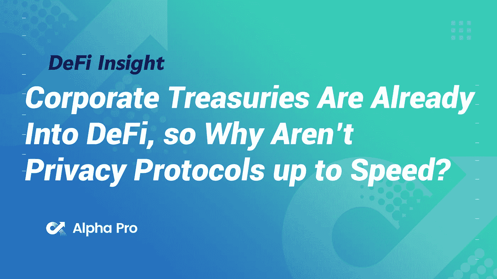
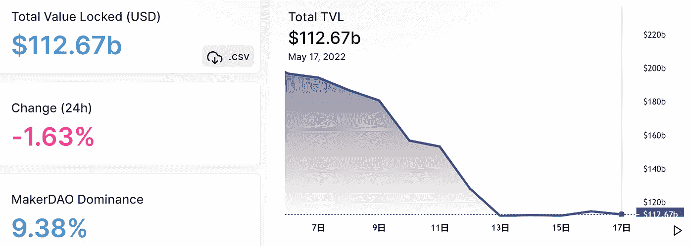
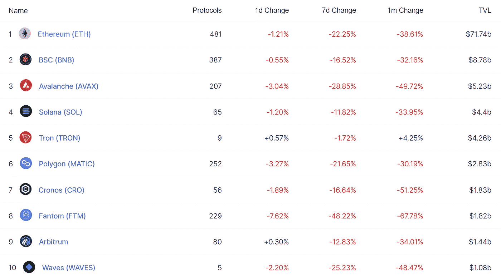
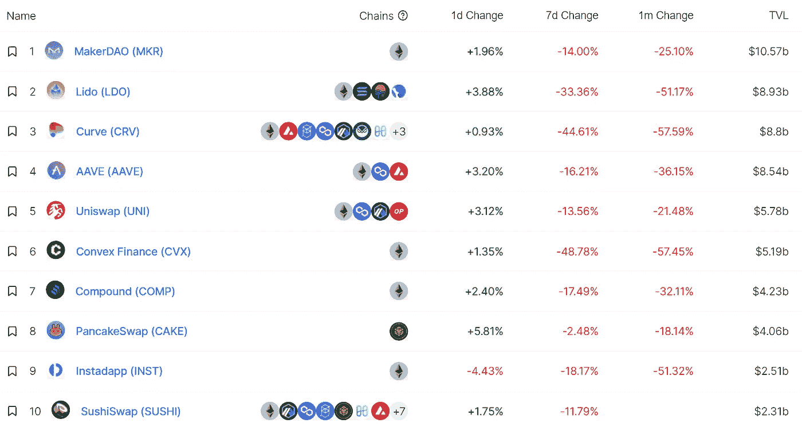
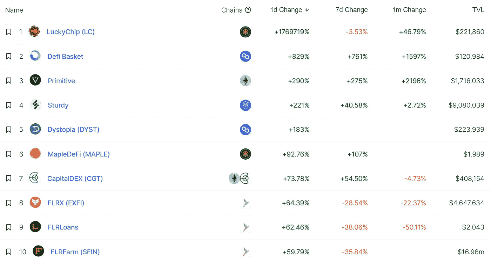
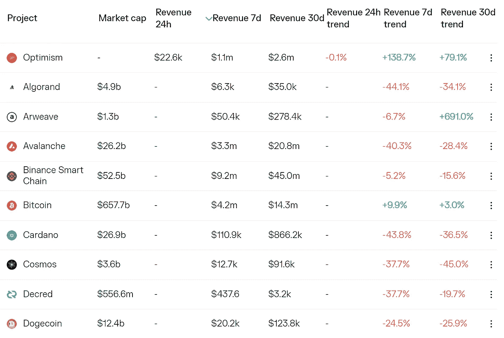
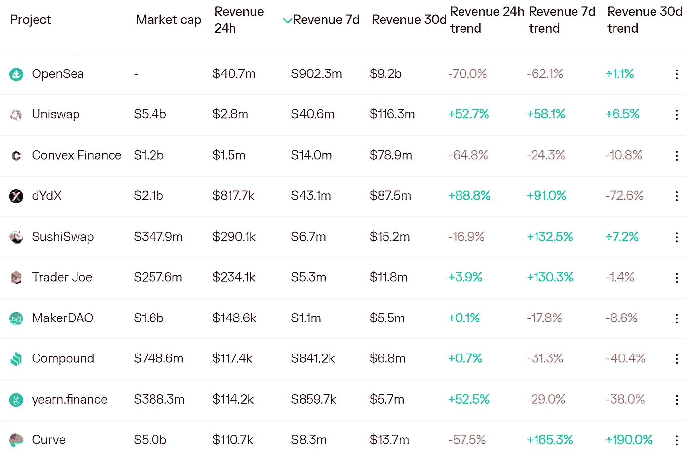
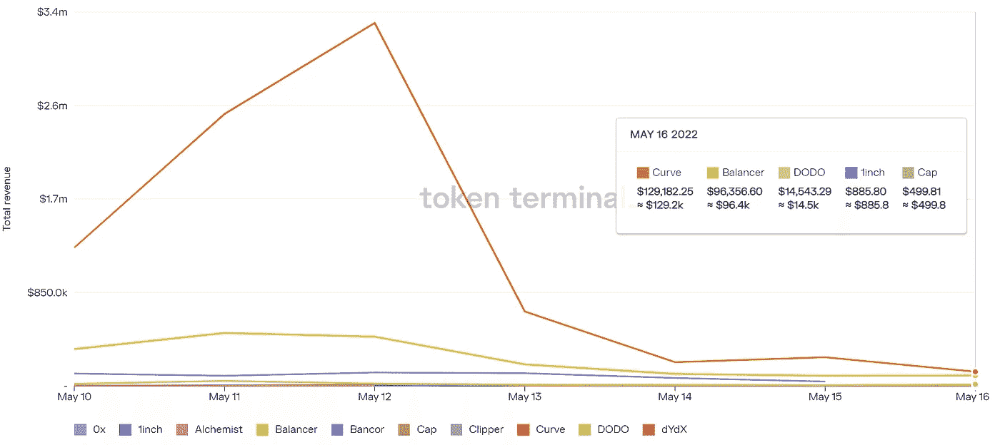
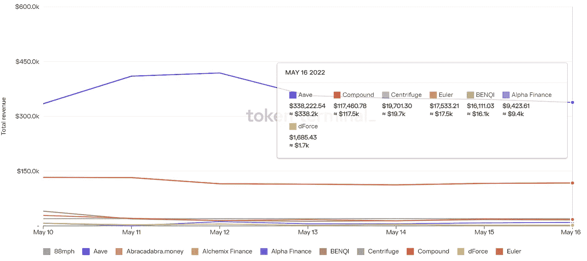

# DeFi Insight |公司财务部门已经进入 DeFi，那么为什么隐私协议没有跟上速度呢？

> 原文：<https://medium.com/coinmonks/defi-insight-corporate-treasuries-are-already-into-defi-so-why-arent-privacy-protocols-up-to-8828721127b?source=collection_archive---------22----------------------->

2022 年 5 月 17 日

*今日 DeFi 数据&由 DeFi Insight 为您带来的新闻。*

> *"* 企业财务部门已经转向更大程度地参与分散式金融(DeFi)，但可用的隐私解决方案远远达不到传统金融的安全水平。在区块链透明度问题得到妥善解决之前，crypto 和 DeFi 的广泛采用将对政府、银行和投资公司构成挑战。*“@*[*来源*](https://www.nasdaq.com/articles/corporate-treasuries-are-already-into-defi-so-why-arent-privacy-protocols-up-to-speed)

# 最新消息

## 外汇

**[比特币基地](https://cointelegraph.com/news/coinbase-unveils-web3-mobile-dapp-and-defi-wallet-and-browser)发布 Web3 移动 Dapp 和 DeFi 钱包及浏览器**

****[巴西证券交易所](https://www.coindesk.com/business/2022/05/16/brazilian-stock-exchange-b3-to-launch-bitcoin-futures-within-six-months/) B3 将在半年内推出比特币期货****

******/**比特币和以太坊仍在盘整， [MKR](https://cryptonews.com/news/bitcoin-and-ethereum-still-consolidate-mkr-outperforms.htm) 表现优于大盘****

******介绍[意式冰淇淋中继](/gelato-network/introducing-gelato-relay-a-fast-reliable-multichain-transaction-api-5e85e86b45c8):快速&可靠的多链事务 API******

## ******稳定币******

******乌克兰战争表明，加密货币无法对冲股票******

## ******交叉链******

********告别[蘑菇](https://blog.mushrooms.finance/farewell-to-mushrooms-dd798c144247)********

## ******第二层******

******多边形与 EY 合作，在 Mainnet 上首次推出 L2 zk 直播******

## ******提议******

******在 Gnosis 和 Moonbeam 链上部署 [Uniswap v3](https://twitter.com/haydenzadams/status/1526260571452186624?s=20&t=ZwPlQF48FGlwzlExWoxgWg) 的提案已经开始投票******

## ******空投******

******锁定了$GNO 的用户现在可以领取[$奶牛](https://twitter.com/StefanDGeorge/status/1526152425731653632)空投奖励******

## ******|警报******

********多链 DeFi 协议 [FEG](https://twitter.com/peckshield/status/1526358728546521088) 再次遭受攻击，损失约 190 万美元********

## ******叉子******

******Do Kwon 提议将 Terra 链分叉成 Terra Classic 和一个没有算法稳定性的新链******

## ******采矿******

********德克萨斯州[太平洋土地公司](https://bitcoinmagazine.com/business/texas-pacific-land-corporation-bitcoin-mining-facility-launching-in-texas)宣布在西德克萨斯州建立新的比特币采矿企业********

## ******政策与法规******

********本次纳税时间 [ATO](https://www.ato.gov.au/Media-centre/Media-releases/Four-priorities-for-the-ATO-this-tax-time/) 的四个优先级********

********[S&P](https://www.coindesk.com/business/2022/05/16/sp-global-ratings-forms-defi-group-to-build-out-crypto-framework/)全球评级组建 DeFi 集团构建加密框架********

******美国机构警告说，朝鲜的 IT 工作者正在网上获得技术和加密工作******

******美国证券交易委员会主席说要做很多事情来保护加密投资者******

## ******NFT******

********,**[索拉纳 NFTs](https://decrypt.co/100591/ethereum-okay-bears-nft-knockoff-solana) 来了个“完整的循环”,奥凯熊山寨版登陆以太坊******

## ****基金****

****比特币游戏工作室为手机游戏筹集了 300 万美元****

****新加坡[淡马锡](https://forkast.news/singapore-temasek-no-bitcoin-prep-tokenized-assets/)表示不拥有比特币，但正在为令牌化资产做准备****

# ****数据和分析****

## ****锁定的总价值(TVL)****

****目前全网 DeFi 总锁定量为 1126.7 亿美元，24 小时下降 1.63%。****

********

## ****TVL 评出的十大连锁酒店****

********

## ****|最新 TVL 十大项目****

********

## ****|过去 24 小时内 TVL 增长的前 10 个项目****

********

## ****协议收入****

## ****|累计总收入最高的项目(24H)_ 区块链(L1)****

********

## ****|累计总收入最高的项目(24H) _Dapps (L2)****

********

## ****|前 10 大交易所的每日收入****

********

## ****|十大贷款协议的每日收入****

********

# ****深潜****

******“并非所有的坏事都是同样的坏事”:为什么 FTX 首席执行官** [**山姆·班克曼-弗里德**](https://www.benzinga.com/markets/cryptocurrency/22/05/27228396/not-all-bad-things-are-the-same-bad-thing-ftx-ceo-sam-bankman-fried-shares-thoughts-on-lun?utm_campaign=partner_feed&utm_source=InvestingUK&utm_medium=partner_feed&utm_content=cryptocurrency) **把卢娜比作网飞？******

**** [## “不是所有的坏事都是同样的坏事”:为什么 FTX 首席执行官山姆·班克曼-弗里德把露娜比作…

### 最大的加密货币平台之一的首席执行官分享了他对 Terra LUNA/USD 崩溃的看法

www.benzinga.com](https://www.benzinga.com/markets/cryptocurrency/22/05/27228396/not-all-bad-things-are-the-same-bad-thing-ftx-ceo-sam-bankman-fried-shares-thoughts-on-lun?utm_campaign=partner_feed&utm_source=InvestingUK&utm_medium=partner_feed&utm_content=cryptocurrency) 

**关于** [**FRAX 算法稳定币**](/coinmonks/5-things-you-need-to-know-about-frax-algorithmic-stablecoin-eb7792054965) 你需要知道的 5 件事

 [## 关于 FRAX 算法稳定币你需要知道的 5 件事

### FRAX 是新的 UST 吗？

medium.com](/coinmonks/5-things-you-need-to-know-about-frax-algorithmic-stablecoin-eb7792054965) 

**[**甲骨文网络**](https://research.thetie.io/blockchain-oracle-comparison/) **:深入探讨数据桥接解决方案****

** [## Oracle Networks:深入研究数据桥接解决方案 TIE 研究

### 区块链 oracle 是第三方数据馈送，充当区块链和现有数据之间的桥梁…

研究. thetie.io](https://research.thetie.io/blockchain-oracle-comparison/)** 

# **报告**

****[**不稳定**](https://insights.glassnode.com/the-week-onchain-week-20-2022/) **硬币**_ 玻璃节点****

> ****加密货币市场经历了历史性波动和混乱的一周，UST 和 USDT 这两个稳定货币的汇率成为焦点。短短几天内，市值排名前十的两家数字资产公司(露娜和 ust)蒸发了近 400 亿美元的投资者价值。UST 完全失去了与 1 美元挂钩的汇率，由于供应过度膨胀，LUNA 的价格跌至 0.00001 美元。因此，卢纳基金会警卫队(LFG)部署了他们最近才建立的 80，394 BTC 储备来捍卫联系汇率，虽然没有成功。****

******折扣，&**[**Crypto**](https://members.delphidigital.io/reports/gbtc-discount-btcs-surging-dominance-crypto-hell-week)**地狱周** _delphidigital****

******[**羊驼金融**](https://messari.io/article/alpaca-finance-a-leveraged-defi-product-suite) **:一个杠杆化的 DeFi 产品套件** _messari******

******安** [**概述**](https://www.theblockresearch.com/gpu-mining-economics-ethereum-merge-147003)**GPU 矿业经济学融入以太坊合并** _theblockresearch****

******数字资产** [**资金流量**](https://coinshares.com/research/digital-asset-fund-flows) **每周** _coinshares****

******关于:******

****DeFi Insight 是顶级 DeFi 和加密新闻和更新的来源。****

******https://twitter.com/AlphaPro_io 推特:******

********❤RSS:**[**https://medium.com/feed/@alphapro.project**](https://medium.com/feed/@alphapro.project)******

****提供的信息应被视为发展新闻，而不是投资建议。****

> ****加入 Coinmonks [电报频道](https://t.me/coincodecap)和 [Youtube 频道](https://www.youtube.com/c/coinmonks/videos)了解加密交易和投资****

# ****另外，阅读****

*   ****[非洲最佳加密交易所](https://coincodecap.com/crypto-exchange-africa) | [胡交易所评论](https://coincodecap.com/hoo-exchange-review)****
*   ****[eToro vs robin hood](https://coincodecap.com/etoro-robinhood)|[MoonXBT vs by bit vs Bityard](https://coincodecap.com/bybit-bityard-moonxbt)****
*   ****[有哪些交易信号？](https://coincodecap.com/trading-signal) | [比特斯坦普 vs 比特币基地](https://coincodecap.com/bitstamp-coinbase)****
*   ****[ProfitFarmers 回顾](https://coincodecap.com/profitfarmers-review) | [如何使用 Cornix 交易机器人](https://coincodecap.com/cornix-trading-bot)****
*   ****[如何在势不可挡的域名上购买域名？](https://coincodecap.com/buy-domain-on-unstoppable-domains)****
*   ****[印度的加密税](https://coincodecap.com/crypto-tax-india) | [altFINS 审查](https://coincodecap.com/altfins-review) | [Prokey 审查](/coinmonks/prokey-review-26611173c13c)****
*   ****[赢取注册奖金——10 大最佳加密平台](https://coincodecap.com/earn-sign-up-bonus)********