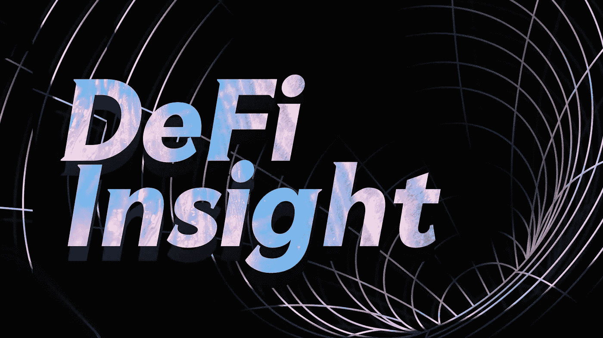
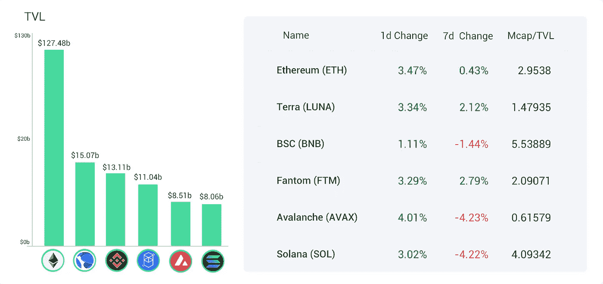
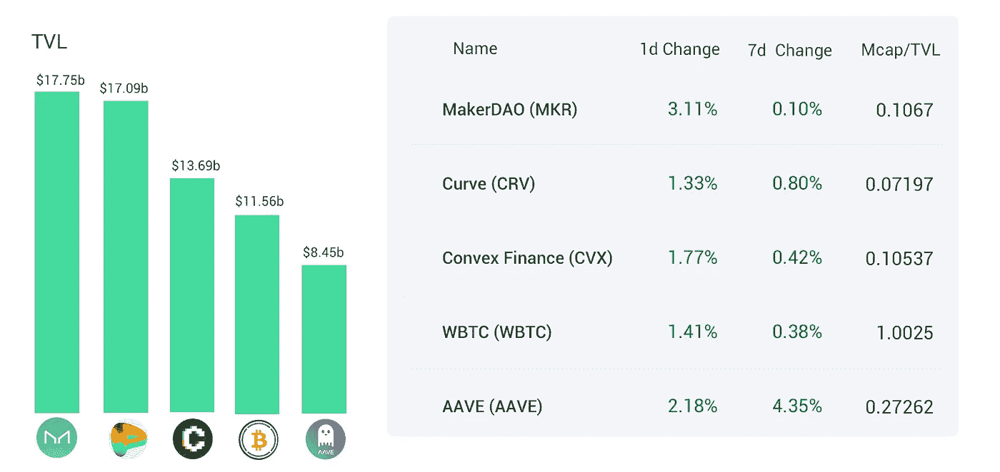
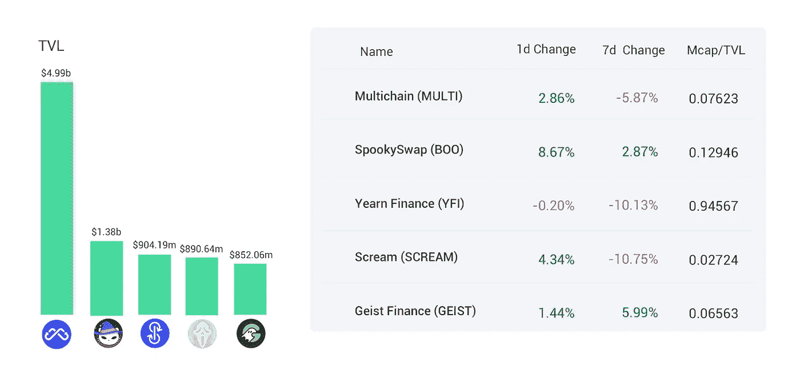
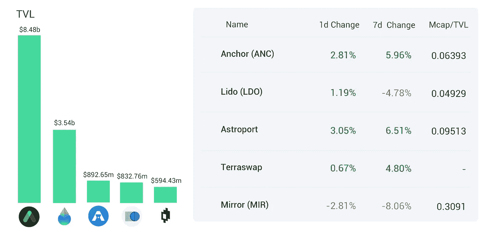
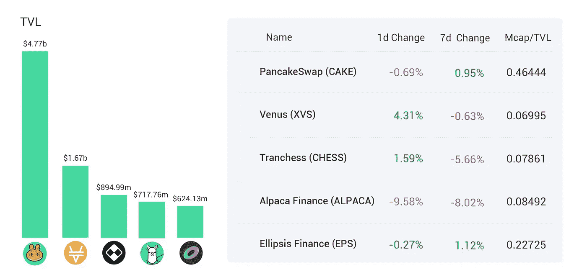
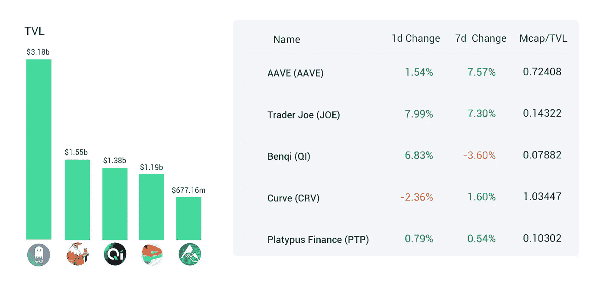
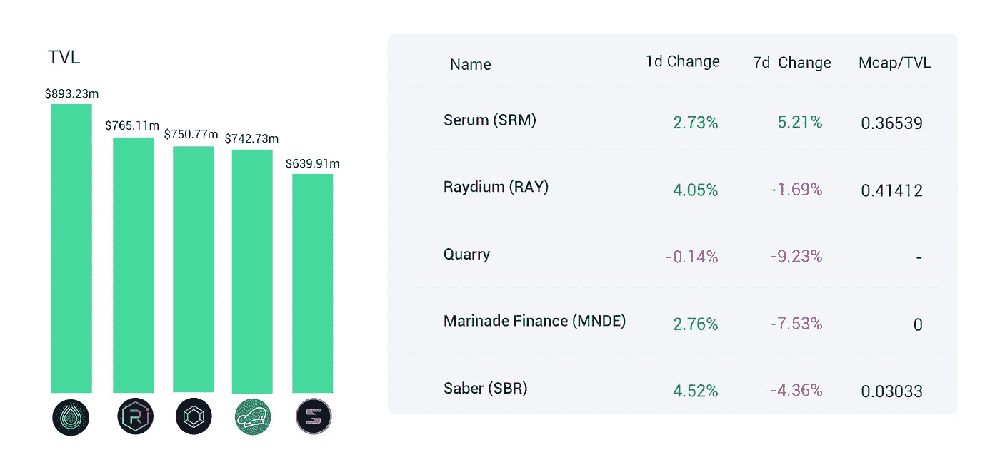
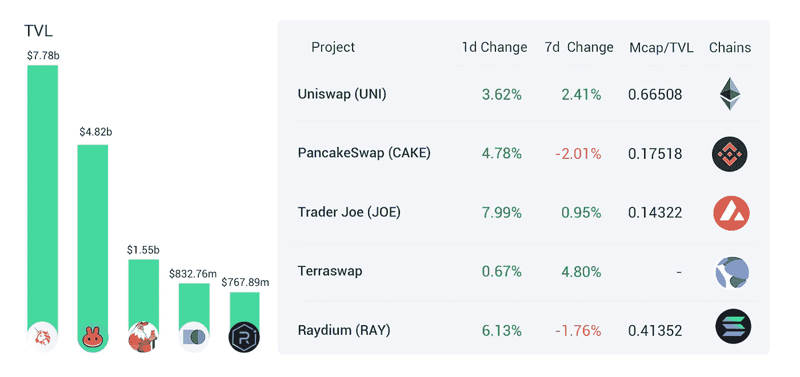
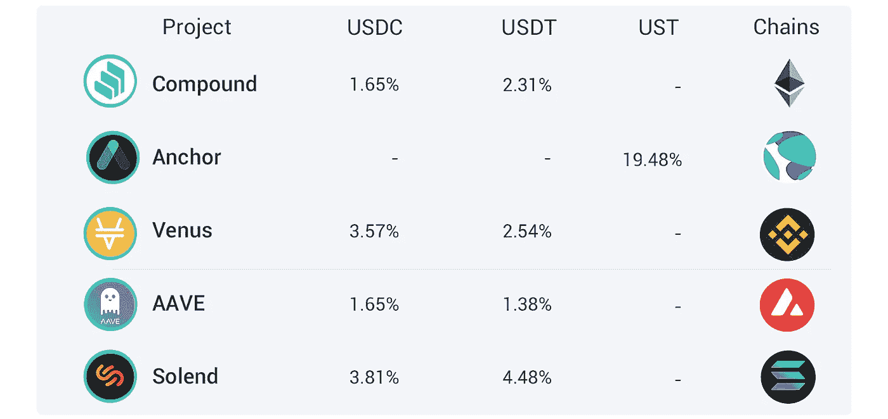

# DeFi Insight | Crypto 创始人在 1.25 亿美元的社会工程骗局中被盯上；币安智能连锁更名为 BNB 连锁

> 原文：<https://medium.com/coinmonks/defi-insight-crypto-founder-targeted-in-125m-social-engineering-scam-attempt-binance-smart-32cdc571c433?source=collection_archive---------19----------------------->

## 2022 年 2 月 16 日

*今日 DeFi 数据&由 DeFi Insight 为您带来的新闻。*

**宏观趋势:【BlockFi 与 SEC 的**1 亿美元**和解对 [DeFi lending](https://techcrunch.com/2022/02/14/what-blockfis-100m-settlement-with-the-sec-means-for-future-of-defi-lending/?guccounter=1&guce_referrer=aHR0cHM6Ly9uZXdzLmdvb2dsZS5jb20v&guce_referrer_sig=AQAAAE_BcNCmVQO4c7G8ARGkry5SXGFWucPbgnaj7BMSyYY34cr8awbMvpJma7bS3xusZBi6Q_mlaIGweiKaeJSASrWdnYvtc-bKx1h2YWegxbRB3_8_-oXD0BcpZN3VEefOkvaND6IlLNDrgLCWERifZC2crTAIbYr4ouzBsb5MDJUM) 的未来意味着什么**

**TVL 走势:**[总 TVL](https://defillama.com/) 在过去 24 小时内上涨了 **4.06%**

**德指动态:**德指涨幅最大的是[操盘手](https://defillama.com/protocol/trader-joe)，上涨 **7.99%**

**稳定币:**美国财政部副部长:[稳定币赎回问题](https://seekingalpha.com/news/3800194-are-stablecoins-stable-us-treasurys-liang-says-not-true-points-to-run-risk)最终会产生挤兑风险

# 最新消息

**💥Crypto 创始人在**[**【1.25 亿美元】社会工程骗局**](https://twitter.com/thomasg_eth/status/1492663192404779013?s=20&t=130tqZqWb_UJdZBk11VCrA) **企图**

> 简而言之，Arrow DAO 的创始人躲过了一场“极其彻底”的社会工程骗局，这场骗局可能让他损失 1.25 亿美元。
> 
> Thomasg.eth 详细描述了骗子在试图窃取他的金钱时所做的大量工作，包括为他的项目制作作品。
> 
> 骗局失败只是因为创始人决定使用新的以太坊地址。

## 定义

SEC 调查加密巨头[币安美国分公司](https://www.wsj.com/articles/sec-probes-trading-affiliates-of-crypto-giant-binances-u-s-arm-11644948162?st=t9a5ict2z1n92bh&reflink=share_mobilewebshare)的交易关联公司

区块链风险公司 Woodstock 从美国投资者[处筹集 1 亿美元](https://blockworks.co/blockchain-venture-firm-woodstock-raising-100m-from-us-investors/)

## 借出

Aurigami 完成了一轮投资

## 互换

*[Sushiswap](https://twitter.com/SushiSwap/status/1493545509365194762)推出免费限价单功能

卡尔达诺: [SundaeSwap](https://ambcrypto.com/cardano-sendaeswap-announces-reverse-iso-proposal-and-heres-what-it-means/) 宣布逆向 ISO 提案，其含义如下

Gamma 与 Olympus Pro 集成用于 [Uniswap v3 债券](https://gammastrategies.medium.com/gamma-integrates-with-olympus-pro-for-uniswap-v3-bonds-204ad2571ca5)

## 稳定币

Frax Finance 将部署 [$FRAX](https://evmos.blog/frax-is-coming-to-evmos-61837abb2fa9) Stablecoin 到 Evmos

## 协议

币安智能连锁品牌更名为 [BNB 连锁](https://www.binance.com/en/blog/ecosystem/introducing-bnb-chain-the-evolution-of-binance-smart-chain-421499824684903434)

Polkadot parachain Astar Network 宣布为区块链建立[“苹果应用商店”](https://twitter.com/AstarNetwork/status/1493711580265021442)

*[rabbit hole](https://rabbithole-gg.notion.site/rabbithole-gg/RabbitHole-Series-A-c53d24be57284b779365cbb129d58e24)完成由格雷洛克和 TCG 加密公司牵头的 1800 万美元首轮融资

*[Polygon](https://www.aliens.com/livenews/latest/polygon-responds-to-the-question-of-too-centralized-it-is-planning-to-improve-and-will-gradually-withdraw-from-the-multi-signature-mechanism)回应“过于集中”问题:正在计划改进，将逐步退出多重签名机制

介绍 Sushimi: [SUSHI 的 NFT PFP 项目](https://forum.sushi.com/t/introducing-sushimi-sushis-nft-pfp-project/9534)

*[伞状网络](https://www.theblockbeats.info/flash/67458)与领投融资达成合作伙伴关系

交易所推出虫洞驱动的跨链存款

曼塔网络获得币安实验室的战略投资

分散交易终端 DexGuru 完成了 500 万美元的融资，火币风险投资公司和其他公司也参与了融资

# 数据和分析

## 锁定的总价值(TVL)

## TVL 的六大连锁品牌

*哪些*链/协议*目前在其智能合同中存放了最多的资产？*

> **以太坊**TVL 五大协议

> TVL 的五大协议

> TVL 制定的 Terra 五大协议

> **BNB**TVL 的五大协议

> **雪崩**TVL 五大协议

> TVL 的五大协议

## 德克斯 TVL 排名

DEX 指数中涨幅最大的是 Trader Joe，上涨了 7.99%

## APY DeFi 贷款公司

*USDC:最高贷款人:索伦德，利率为 3.81% APY*

*USDT:最高贷款人:索伦德，利率为 4.48% APY*

# 深潜

 [## 制造商:过去、现在和未来

### 我写这篇文章是为了描述从那时到现在道中思想的演变，以及我在哪里…

hexonaut.medium.com](https://hexonaut.medium.com/maker-past-present-and-future-9fd67da4f229)  [## 区块链分析:理解加密的终极工具

### 随着区块链在现实世界中的使用量的增加，区块链分析的重要性也在增加。在这个…

www.nansen.ai](https://www.nansen.ai/research/blockchain-analytics-the-ultimate-tool-to-understanding-crypto) 

**👉@alpha_pls:如何做基本面分析**

一个一个**值得信赖的资源，为一切事物 DeFi**

> 一场回合:
> 
> 分散金融(DeFi)指的是从传统的中央金融系统向区块链促成的点对点金融系统的转变。
> 
> DeFi Insight 是顶级 DeFi 和加密新闻和更新的来源。
> 
> 提供的信息应被视为发展新闻，而不是投资建议。

> 加入 Coinmonks [电报频道](https://t.me/coincodecap)和 [Youtube 频道](https://www.youtube.com/c/coinmonks/videos)了解加密交易和投资

## 另外，阅读

*   [3 商业评论](/coinmonks/3commas-review-an-excellent-crypto-trading-bot-2020-1313a58bec92) | [Pionex 评论](https://coincodecap.com/pionex-review-exchange-with-crypto-trading-bot) | [Coinrule 评论](/coinmonks/coinrule-review-2021-a-beginner-friendly-crypto-trading-bot-daf0504848ba)
*   [莱杰 vs n 格拉夫](/coinmonks/ledger-vs-ngrave-zero-7e40f0c1d694) | [莱杰纳诺 s vs x](/coinmonks/ledger-nano-s-vs-x-battery-hardware-price-storage-59a6663fe3b0) | [币安评论](/coinmonks/binance-review-ee10d3bf3b6e)
*   [Bybit 交易所评论](/coinmonks/bybit-exchange-review-dbd570019b71) | [Bityard 评论](https://coincodecap.com/bityard-reivew) | [Jet-Bot 评论](https://coincodecap.com/jet-bot-review)
*   [3 commas vs crypto hopper](/coinmonks/3commas-vs-pionex-vs-cryptohopper-best-crypto-bot-6a98d2baa203)|[赚取加密利息](/coinmonks/earn-crypto-interest-b10b810fdda3)
*   最好的比特币[硬件钱包](/coinmonks/hardware-wallets-dfa1211730c6) | [BitBox02 回顾](/coinmonks/bitbox02-review-your-swiss-bitcoin-hardware-wallet-c36c88fff29)
*   [block fi vs Celsius](/coinmonks/blockfi-vs-celsius-vs-hodlnaut-8a1cc8c26630)|[Hodlnaut 审核](/coinmonks/hodlnaut-review-best-way-to-hodl-is-to-earn-interest-on-your-bitcoin-6658a8c19edf) | [KuCoin 审核](https://coincodecap.com/kucoin-review)
*   [Bitsgap 审查](/coinmonks/bitsgap-review-a-crypto-trading-bot-that-makes-easy-money-a5d88a336df2) | [Quadency 审查](/coinmonks/quadency-review-a-crypto-trading-automation-platform-3068eaa374e1) | [Bitbns 审查](/coinmonks/bitbns-review-38256a07e161)
*   [最佳网上赌场](https://coincodecap.com/best-online-casinos) | [期货交易机器人](/coinmonks/futures-trading-bots-5a282ccee3f5)
*   [分散交易所](https://coincodecap.com/what-are-decentralized-exchanges) | [比特 FIP](https://coincodecap.com/bitbns-fip) | [宾邦评论](https://coincodecap.com/bingbon-review)
*   [用信用卡购买密码的 10 个最佳地点](https://coincodecap.com/buy-crypto-with-credit-card)
*   [加拿大最佳加密交易机器人](https://coincodecap.com/5-best-crypto-trading-bots-in-canada) | [Bybit vs 币安](https://coincodecap.com/bybit-binance-moonxbt)
*   [阿联酋 5 大最佳加密交易所](https://coincodecap.com/best-crypto-exchanges-in-uae) | [SimpleSwap 评论](https://coincodecap.com/simpleswap-review)
*   [购买 Dogecoin 的 7 种最佳方式](https://coincodecap.com/ways-to-buy-dogecoin) | [ZebPay 评论](https://coincodecap.com/zebpay-review)
*   [最佳期货交易信号](https://coincodecap.com/futures-trading-signals) | [流动性交易所评论](https://coincodecap.com/liquid-exchange-review)
*   [火币加密交易信号](https://coincodecap.com/huobi-crypto-trading-signals) | [Swapzone 审查](/coinmonks/swapzone-review-crypto-exchange-data-aggregator-e0ad78e55ed7)