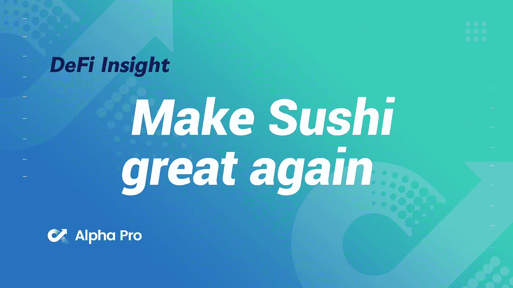
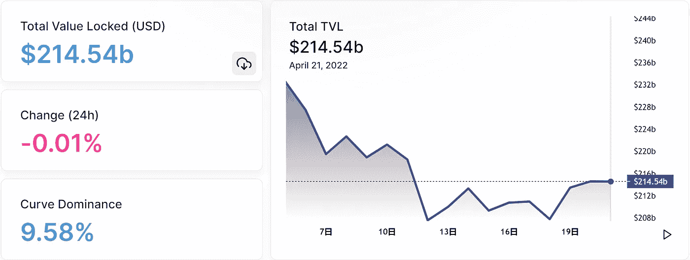
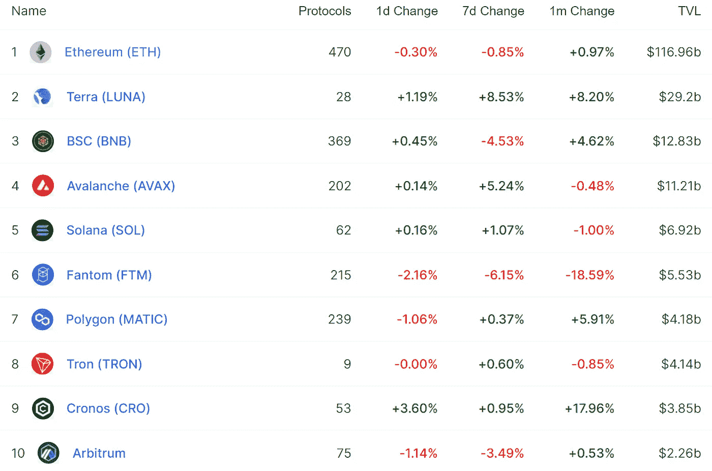
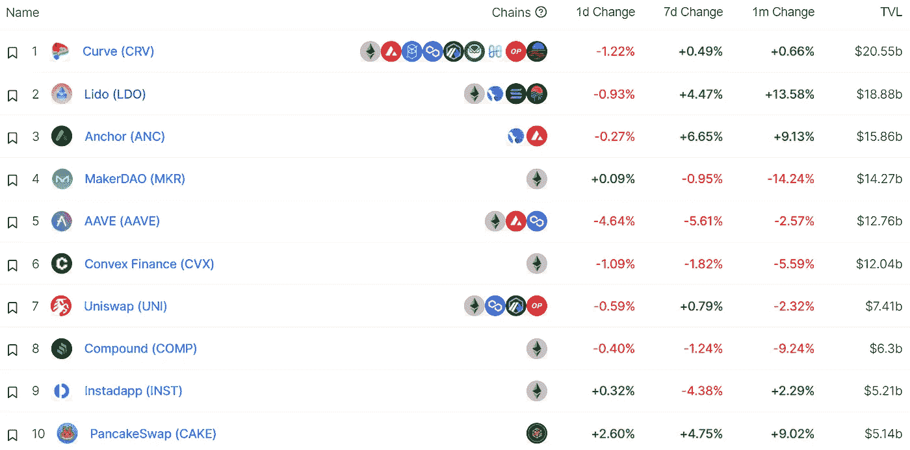
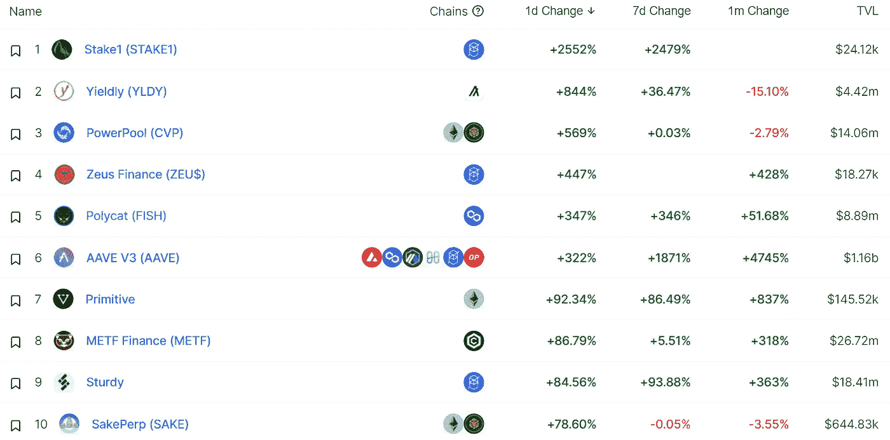
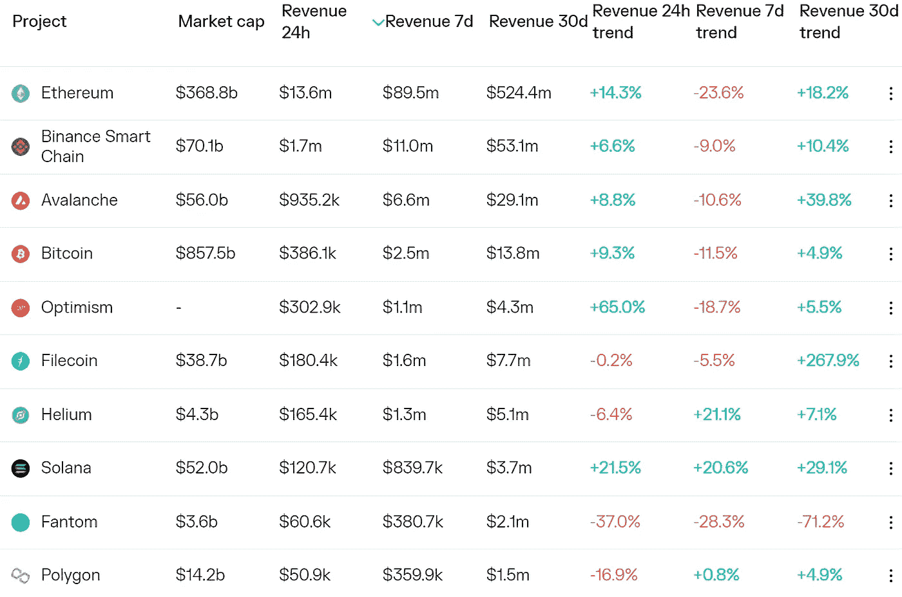
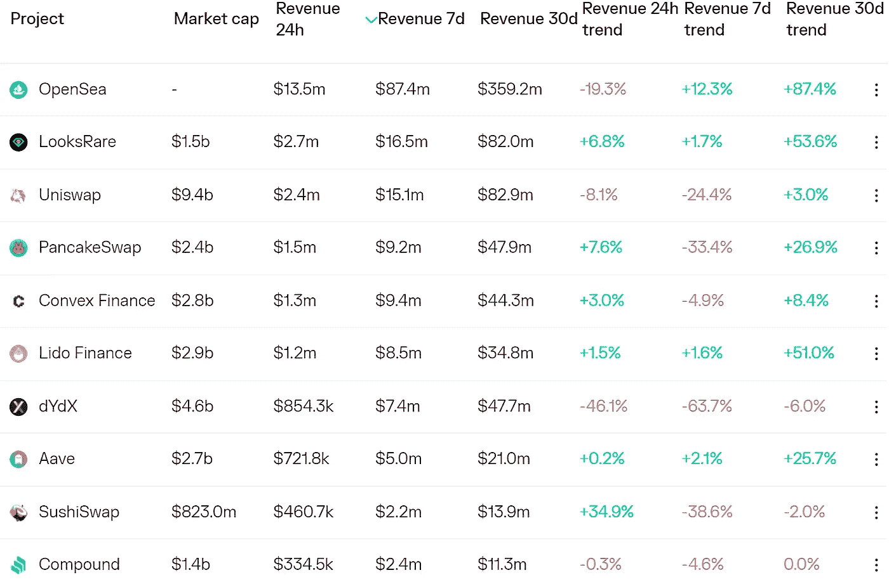
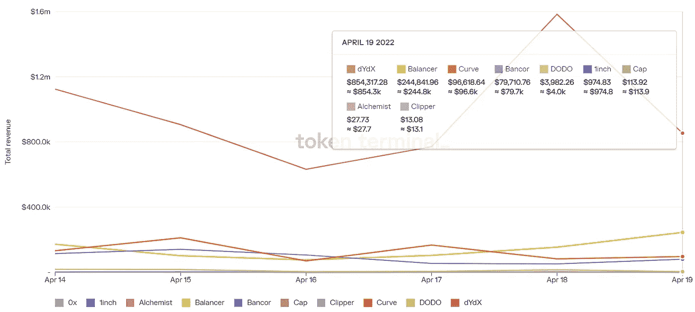
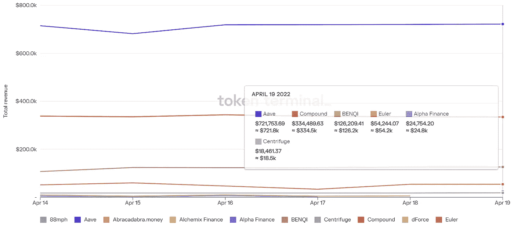

# DeFi Insight |加密基金 DeFi Wonderland 发布 SushiSwap 大修提案

> 原文：<https://medium.com/coinmonks/defi-insight-crypto-fund-defi-wonderland-releases-sushiswap-overhaul-proposal-d28f48a01c4a?source=collection_archive---------26----------------------->

2022 年 4 月 21 日

*今日 DeFi 数据&由 DeFi Insight 为您带来的新闻。*

> “加密基金 DeFi Wonderland 发布了一项改革 SushiSwap 的提案，其中包括放弃$xSUSHI，将原本属于$xSUSHI 的收益转移到 SushiDAO，提高透明度，使国库资产多样化，并启用$veSUSHI tokenomic 模型。此外，DeFi Wonderland 表示，他们预计 SushiSwap 将提供 500 万美元的寿司来支持他们的倡议，并根据寿司价格是否达到既定目标来发放代币。*[***forum . sushi***](https://forum.sushi.com/t/fukkatsu-make-sushi-great-again/10030)*

# **最新消息**

## **TVL**

**乐观情绪 TVL 创下 5.46 亿美元的历史新高**

## **贷款**

****/**新的固定速率切换功能是[元素协议上的 Live](https://twitter.com/element_fi/status/1516876991898824706?s=20&t=PRkUx1s0MN-rFmH0lzYCGQ)**

****[Compound 提出的](https://compound.finance/governance/proposals/100)结束现有流动性开采活动的提案未获通过****

****基于 Near 的 DeFi Protocol Bastion 以 1 . 8 亿美元的估值推出 BSTN 令牌****

****瑞士银行推出 DeFi 产品，为客户提供区块链信贷服务****

******、**锚协议将[停止](https://forum.anchorprotocol.com/t/redirect-remaining-anchor-airdrops-to-community-implementation-plan/4426?u=bitn8) ANC 空投****

## ******|德克斯******

****Ushiswap 推出了 m ISO v2——一款完全无权限的多链令牌发射台****

## ****产量****

******Frax，Terra-Backed 4pool 在 Fantom Network 上线，[吸引了](https://www.coindesk.com/tech/2022/04/21/frax-terra-backed-4pool-goes-live-on-fantom-network-attracts-31m/)3100 万美元******

## ******稳定币******

********近生态币 USN 已经[在近公共测试网](https://wallet.testnet.near.org/)上线********

********USDT 市值超过 830 亿美元********

**********俄央行不会推迟 [CBDC 测试](https://www.iqstock.news/n/digital-ruble-needed-russias-central-bank-wont-delay-testing-3765598/)，数字卢布‘急需’**********

## ********桥梁********

**********[特提斯金融](https://twitter.com/tethysfinance/status/1516495905595162624)推出跨链桥特提斯桥，已支持 Metis、以太坊等网络**********

## ********|子网********

**********雪崩 DFK 子网已经处理了超过 400 万笔[交易](https://twitter.com/avalancheavax/status/1516944832463355906)，市值 3.6 亿美元**********

## ********|选项********

**********[丝带金融](https://www.ribbon.finance/)发起丝带覆盖呼叫熔断池**********

## ********支付********

**********,**阿联酋交付公司现在接受加密货币作为[支付](https://www.khaleejtimes.com/cryptocurrency/uae-delivery-firm-now-accepts-cryptocurrency-as-payment)********

## ******导数******

********[介绍](/synfutures/introducing-the-synfutures-v2-testnet-3e6eb5c6770d)新期货 V2 测试网********

## ********钱包********

**********Fantom[wallet](https://fantom.foundation/blog/fwallet-v2-beta-now-released/)fWallet 推出 v2 beta 版，新增治理投票、交易、跨链等功能**********

## ********空投********

**********国家 3 [道](https://app.nation3.org/claim)空投现在可以申领了**********

## ********政策与法规********

**********澳大利亚保诚[监管机构](https://www.forexlive.com/Cryptocurrency/australia-prudential-regulator-outlines-policy-roadmap-for-crypto-assets-20220421/)概述加密资产的政策路线图**********

## ********数据库********

**********coin telegraph:风险投资[数据库](https://research.cointelegraph.com/reports/detail/cl27npyvv031hufpd93r0t2y6)**********

## ********NFT********

**********NBAxNFT:为智能合约问题导致的提前售罄道歉，正在识别白名单中无法铸造[NFT](https://twitter.com/NBAxNFT/status/1516929175986212865?s=20&t=KYL1Z3CHNOGvFnmh9oO8hw)的钱包**********

********矮胖的企鹅可能会发起一个新的元宇宙[项目](https://twitter.com/pudgypenguins/status/1516969645751812098)********

**********[NFT](https://twitter.com/nftworldsNFT/status/1516985507787378688?s=20&t=8ZL5b0qVkZYEB3GnBDCy-A)Worlds 发布路线图 2.0 白皮书**********

**********Cricket[NFTs](https://economictimes.indiatimes.com/tech/technology/cricket-nfts-platform-rario-raises-120-million-led-by-dream-capital/articleshow/90963022.cms)平台 Rario 融资 1.2 亿美元由梦想资本领投**********

**********[OpenSea](https://twitter.com/opensea/status/1516877146567806976)现在支持索拉纳 beta 中的 MCC**********

********Coop 的新的 NFT 指数基金包括像 crypto 朋克和 Bored Apes 这样的蓝筹股********

**********月鸟#6610 在 150 ETH 成交，创下了 [NFT](https://nftgo.io/collection/moonbirds/overview) 系列的最高美元成交金额纪录**********

********SoundMint 筹集了 170 万美元的种子资金，由 Animoca Brands 领投，经过 3000 万美元的评估********

## ********基金********

**********宣布 555 万美元的战略[资金](/ipor-labs/announcing-5-55m-in-funding-for-the-ipor-protocol-109470d9e5a2)用于建立 IPOR 协议作为 DeFi 信贷市场的基础**********

# ********数据和分析********

## ********锁定的总价值(TVL)********

********目前全网 DeFi 锁定总量为 2145.4 亿美元，24 小时下降 0.01%********

****************

## ********TVL 评出的十大连锁酒店********

****************

## ********|最新 TVL 十大项目********

****************

## ********|过去 24 小时内 TVL 增长的前 10 个项目********

****************

# ********协议收入********

## ********|累计总收入最高的项目(24H)_ 区块链(L1)********

****************

## ********|累计总收入最高的项目(24H) _Dapps(L2)********

****************

## ********|前 10 大交易所的每日收入********

****************

## ********|十大贷款协议的每日收入********

****************

# ********深潜********

**********牛市案例为 CC0**[NFTs](https://newsletter.banklesshq.com/p/the-bull-case-for-cc0-nfts?utm_source=%2Finbox&utm_medium=reader2&s=r)********

 ******[## 重定向你-媒体

### 编辑描述

medium.com](https://medium.com/r?url=https%3A%2F%2Fnewsletter.banklesshq.com%2Fp%2Fthe-bull-case-for-cc0-nfts%3Futm_source%3D%252Finbox%26utm_medium%3Dreader2%26s%3Dr)****** 

********沙丘:数据必须** [**流向**](https://www.readthegeneralist.com/briefing/dune)******

****** [## CC0 NFTs 的牛市案例

### 亲爱的无银行国家，NFT 以一种没人能预料到的奇怪而疯狂的方式起飞了。感谢不变性…

newsletter.banklesshq.com](https://newsletter.banklesshq.com/p/the-bull-case-for-cc0-nfts?utm_source=%2Finbox&utm_medium=reader2&s=r)****** 

# ******报告******

********分析师注:比特币基地 NFT** [**优点**](https://messari.io/article/analyst-notes-coinbase-nft-advantages)**_ 梅萨里********

> ********比特币基地的 NFT 平台旨在通过将市场体验与社交媒体功能相结合，与现有平台区分开来。在资金、托管、分销、品牌、知识产权和合作伙伴关系以及垂直整合方面，比特币基地和 NFT 的中央交易所将拥有显著优势。
> 然而，在列出某些非功能性交易、监管合规性以及未经许可与 Web3 生态系统的其余部分整合方面，集中式交易所也有明显的劣势。********

**********[**比赛**](https://members.delphidigital.io/reports/the-race-to-become-solanas-liquid-staking-winner) **成为索拉纳液体赌注的赢家** _delphidigital**********

********StepN:移动赚取模型** _theblockresearch 的 [**可持续性**](https://www.theblockresearch.com/stepn-the-sustainability-of-move-to-earn-model-142428)******

**********一个** [**看**](https://www.theblockresearch.com/a-look-at-blockchains-as-a-service-139838) **在区块链服务** _theblockresearch********

******一场**回合:********

******DeFi Insight 是顶级 DeFi 和加密新闻和更新的来源。******

********https://twitter.com/AlphaPro_io**❤[t53】](https://twitter.com/AlphaPro_io)******

********❤RSS:**[**https://medium.com/feed/@alphapro.project**](https://medium.com/feed/@alphapro.project)******

******提供的信息应被视为发展新闻，而不是投资建议。******

> *******加入 Coinmonks* [*电报频道*](https://t.me/coincodecap) *和* [*Youtube 频道*](https://www.youtube.com/c/coinmonks/videos) *了解加密交易和投资*******

# ******另外，阅读******

*   ******[3 商业评论](/coinmonks/3commas-review-an-excellent-crypto-trading-bot-2020-1313a58bec92) | [Pionex 评论](https://coincodecap.com/pionex-review-exchange-with-crypto-trading-bot) | [Coinrule 评论](/coinmonks/coinrule-review-2021-a-beginner-friendly-crypto-trading-bot-daf0504848ba)******
*   ******[莱杰 vs n rave](/coinmonks/ledger-vs-ngrave-zero-7e40f0c1d694)|[莱杰 nano s vs x](/coinmonks/ledger-nano-s-vs-x-battery-hardware-price-storage-59a6663fe3b0) | [币安评论](/coinmonks/binance-review-ee10d3bf3b6e)******
*   ******[Bybit Exchange 审查](/coinmonks/bybit-exchange-review-dbd570019b71) | [Bityard 审查](https://coincodecap.com/bityard-reivew) | [Jet-Bot 审查](https://coincodecap.com/jet-bot-review)******
*   ******[3 commas vs crypto hopper](/coinmonks/3commas-vs-pionex-vs-cryptohopper-best-crypto-bot-6a98d2baa203)|[赚取加密利息](/coinmonks/earn-crypto-interest-b10b810fdda3)******
*   ******最好的比特币[硬件钱包](/coinmonks/hardware-wallets-dfa1211730c6) | [BitBox02 回顾](/coinmonks/bitbox02-review-your-swiss-bitcoin-hardware-wallet-c36c88fff29)******
*   ******[block fi vs Celsius](/coinmonks/blockfi-vs-celsius-vs-hodlnaut-8a1cc8c26630)|[Hodlnaut 审核](/coinmonks/hodlnaut-review-best-way-to-hodl-is-to-earn-interest-on-your-bitcoin-6658a8c19edf) | [KuCoin 审核](https://coincodecap.com/kucoin-review)******