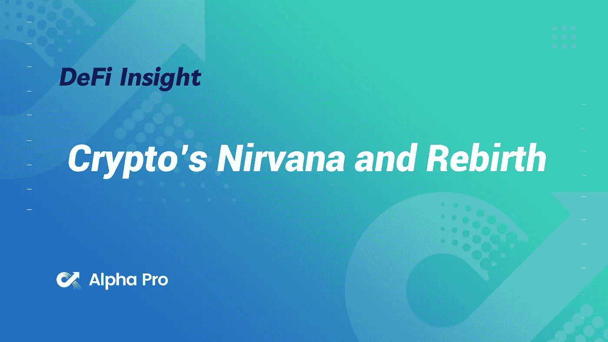
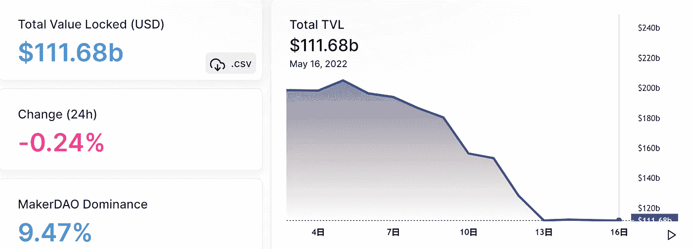
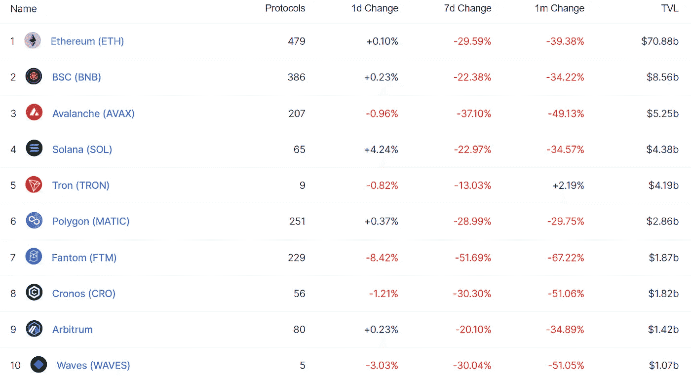
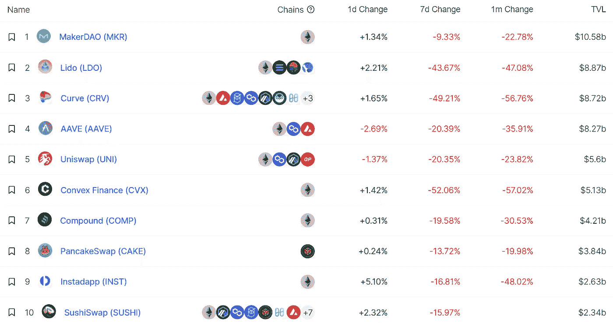
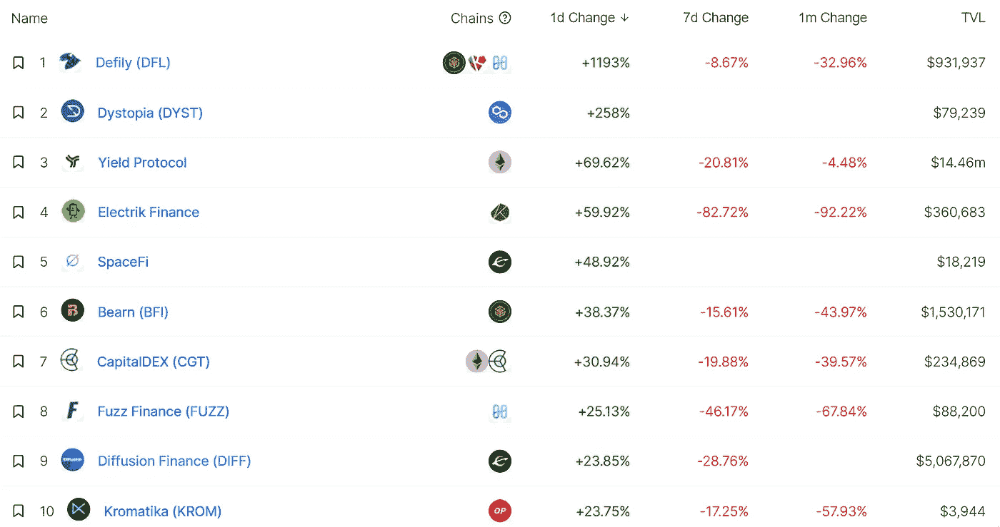
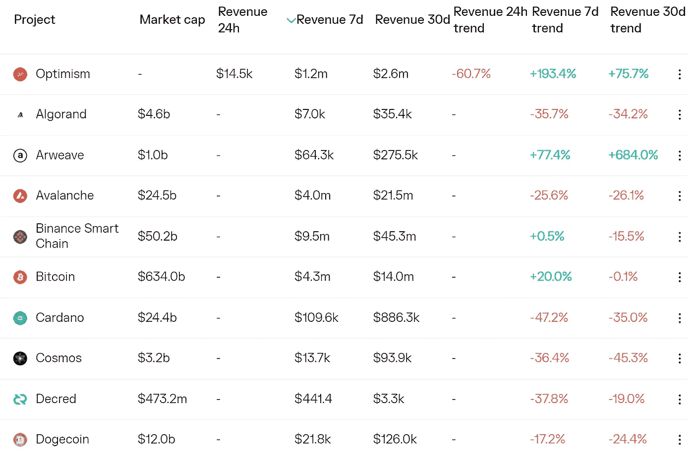
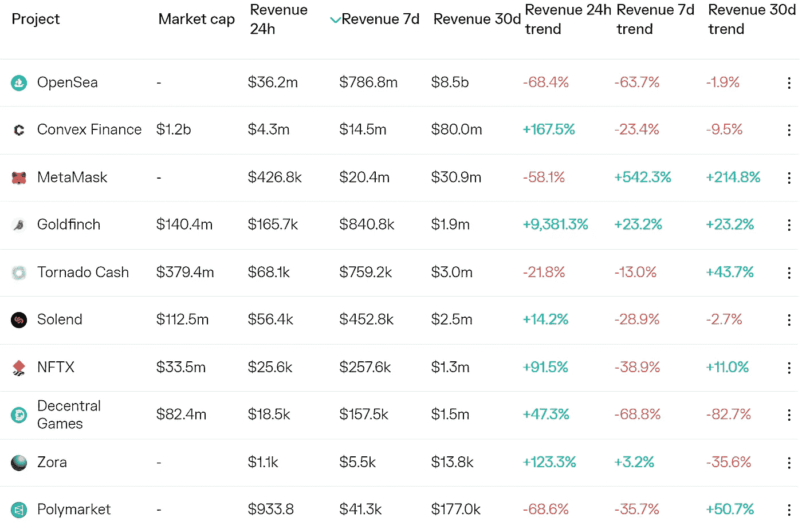
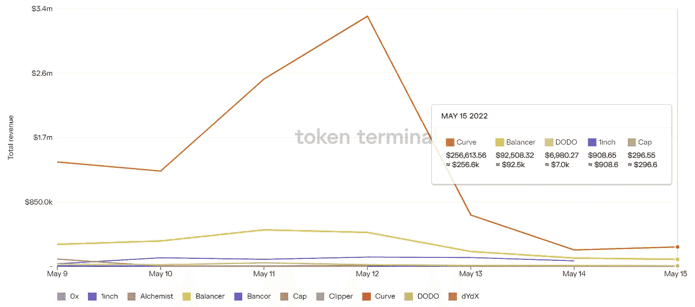
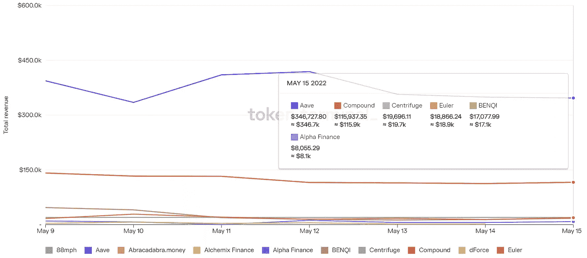

# DeFi Insight |加密的涅槃和重生

> 原文：<https://medium.com/coinmonks/defi-insight-cryptos-nirvana-and-rebirth-b77f79da3229?source=collection_archive---------22----------------------->

2022 年 5 月 16 日

*今日 DeFi 数据&由 DeFi Insight 为您带来的新闻。*

> *"* AC 认为:Crypto 正在走早些年货币政策的老路，重蹈其覆辙。屠龙者可能正在慢慢变成龙。一波又一波的加密技术将它迭代成其他东西。秘密文化扼杀了秘密精神。
> 
> 的确，好像真的是这样。我们不再优先考虑我们的核心价值(去中心化、安全、隐私、所有权、创新)，而是专注于短期贪婪的兴奋(fomo 和炒作)。这是一种可悲的加密状态。*“@*[*来源*](https://mirror.xyz/msfew.eth/WbhjdHPrNzNJsFNp_Dk2WS0C9wywt2yQ5auBkbQ8TmI)

# 最新消息

## 贷款

**[对冲 Mainnet beta](https://hedgelabs.medium.com/hedge-mainnet-beta-and-tokenomics-977d3670820) 和 Tokenomics**

****[金星](https://twitter.com/VenusProtocol/status/1525995894688071680?s=20&t=9bgCRIVjHU0WxS_RsA87Ag)恢复存取款操作，拥有$UST 和$露娜作为抵押品的用户需要补充抵押品以防清算****

## ****外汇****

******、**私人信托交易所名单 [xWEOWNS](https://finance.yahoo.com/news/private-trust-exchange-lists-xweowns-010000930.html)****

## ****稳定币****

******、**维塔利克·布特林:强烈支持[这个](https://twitter.com/VitalikButerin/status/1525561624974700545?s=20&t=qS_kbbahWSZq8sUAUoqV0Q)****

******、** Polygon 工作室帮助 Terra 项目[将](https://twitter.com/Fwiz/status/1525887462093910016?s=20&t=ZPavy90MBlHsIofNOqkh5w)迁移到 Polygon****

****赵希望 Terra“更加透明”****

****顾问公司表示，LFG 的结余准备金会首先补偿小钱包****

## ****|令牌****

****Square Enix 计划发行代币，大举投资 Web3 游戏****

## ****空投****

****五月份，[沙箱](https://twitter.com/TheSandboxGame/status/1525170608484630529)将向所有土地所有者空投 500 万美元的沙子****

## ****|警报****

******[钓鱼广告链接](https://twitter.com/Jon_HQ/status/1525229613898559489?t=q_69ci0B7RnN1ei5jw4kzA&s=19)出现在 Etherscan、CoinGecko 上******

********,**浪人攻击者相关地址[向龙卷风转移](https://etherscan.io/address/0xE8B2B5A8a4174b256828Fca0F40a8831521160e5)3003 $ ETH。现金******

## ****资产管理****

******[埃尔克莱姆资本](https://www.msn.com/en-xl/news/other/elkrem-capital-issues-novel-defi-strategy/ar-AAXiWrt?ocid=BingNewsSearch)发布新颖的 DeFi 战略******

## ******政策与法规******

******44 个国家齐聚萨尔瓦多讨论比特币的推出******

********加密资本收益[澳大利亚税务局](https://cointelegraph.com/news/crypto-capital-gains-one-of-four-key-areas-for-australian-tax-office)的四个关键领域之一********

******Terra 倒闭后，新加坡的监管者将会关注当地的加密公司；比特币反弹******

## ******基金******

******证券巨头 SBI 抢购其加密竞争对手之一 BITPoint 的控股权******

******亚历山大·约塞夫的加密应用[流入](https://afrotech.com/inflow-music-app-cryptocurrency)筹集了 150 万美元的种子资金，帮助艺术家们完全货币化******

******高盛联合牵头埃尔伍德科技公司融资 7000 万美元******

## ******观点******

******FTX 亿万富翁首领称比特币作为支付网络没有未来******

# ******数据和分析******

## ******锁定的总价值(TVL)******

******目前全网 DeFi 总锁定量为 1116.8 亿美元，24 小时下降 0.24%。******

************

## ******TVL 评出的十大连锁酒店******

************

## ******|最新 TVL 十大项目******

************

## ******|过去 24 小时内 TVL 增长的前 10 个项目******

************

## ******协议收入******

## ******|累计总收入最高的项目(24H)_ 区块链(L1)******

************

## ******|累计总收入最高的项目(24H) _Dapps (L2)******

************

## ******|前 10 大交易所的每日收入******

************

## ******|十大贷款协议的每日收入******

************

# ******深潜******

********加密贷款** [**遭遇熊市**](https://dappradar.com/blog/crypto-lending-suffers-amidst-bear-market-terra-ust-debacle)**&特拉 UST 崩溃********

**** [## 加密贷款在熊市和特拉 UST 崩溃中遭受损失

### 随着投资者开始将代币转换为稳定的货币，关键贷款协议锁定的总价值正在下降

dappradar.com](https://dappradar.com/blog/crypto-lending-suffers-amidst-bear-market-terra-ust-debacle) 

**[**NFTs**](/coinmonks/nfts-social-tokens-and-scores-3e0dbf08b886)**，社会代币和分数****

** [## 非功能性测试、社会标志和分数

### 声誉得分的未来将是特定于社区的

medium.com](/coinmonks/nfts-social-tokens-and-scores-3e0dbf08b886) 

**[**如何**](https://economictimes.indiatimes.com/markets/cryptocurrency/how-to-earn-interest-on-stablecoins-5-ways-to-do-it/articleshow/91590056.cms) **赚取稳定利息——5 种方法****

** [## 如何在 Stablecoins 上赚取利息——5 种方法

### 交易可能是从加密中获得回报的最主要方式之一，但你也可以通过下注来获得回报

economictimes.indiatimes.com](https://economictimes.indiatimes.com/markets/cryptocurrency/how-to-earn-interest-on-stablecoins-5-ways-to-do-it/articleshow/91590056.cms) 

**Terra 还没有** [**杀了**](https://www.bloomberg.com/news/articles/2022-05-15/terra-ust-luna-hasn-t-killed-crypto-but-it-was-a-narrow-escape) **的 Crypto，却死里逃生**

 [## 如何在 Stablecoins 上赚取利息——5 种方法

### 交易可能是从加密中获得回报的最主要方式之一，但你也可以通过下注来获得回报

economictimes.indiatimes.com](https://economictimes.indiatimes.com/markets/cryptocurrency/how-to-earn-interest-on-stablecoins-5-ways-to-do-it/articleshow/91590056.cms) 

# 报告

**TI**[**评级**](https://tokeninsight.com/en/report/2931) **报告:AirCoin** _tokeninsight

> AirCoin DAO Labs 是一个社区驱动、多子社区管理的 DAO，拥有不同的语言用户群，它构建了三个主要产品:AirCoin、AIRNFT 和 AirCash。
> 
> 目前，AirCash 是一个分散的加密 OTC 平台，是 AirCoin DAO Labs 现在运营的相对成熟的产品。AirCash 旨在成为加密现金进出的最佳解决方案。
> 
> 空气是空气币的统治象征。空气的最大供应量是 10 万亿分之一。
> 
> TokenInsight 给 AirCoin 的评级为 CC，正面稳定。

**[**氦**](https://messari.io/article/helium-laying-the-foundation-for-a-telecom-network-deployment-platform) **:为电信网络部署平台奠定基础** _messari**

****[**解读**](https://www.theblockresearch.com/deciphering-the-metaverse-the-blank-slate-of-art-nfts-146872) **元宇宙:艺术的白板******

******关于:******

****DeFi Insight 是顶级 DeFi 和加密新闻和更新的来源。****

******https://twitter.com/AlphaPro_io 推特:******

********❤RSS:**[**https://medium.com/feed/@alphapro.project**](https://medium.com/feed/@alphapro.project)******

****提供的信息应被视为发展新闻，而不是投资建议。****

> ****加入 Coinmonks [电报频道](https://t.me/coincodecap)和 [Youtube 频道](https://www.youtube.com/c/coinmonks/videos)了解加密交易和投资****

# ****另外，阅读****

*   ****[Bookmap 评论](https://coincodecap.com/bookmap-review-2021-best-trading-software) | [美国 5 大最佳加密交易所](https://coincodecap.com/crypto-exchange-usa)****
*   ****最佳加密[硬件钱包](/coinmonks/hardware-wallets-dfa1211730c6) | [Bitbns 评论](/coinmonks/bitbns-review-38256a07e161)****
*   ****[新加坡十大最佳加密交易所](https://coincodecap.com/crypto-exchange-in-singapore) | [购买 AXS](https://coincodecap.com/buy-axs-token)****
*   ****[红狗赌场评论](https://coincodecap.com/red-dog-casino-review) | [Swyftx 评论](https://coincodecap.com/swyftx-review) | [造币厂评论](https://coincodecap.com/coingate-review)****
*   ****[投资印度的最佳密码](https://coincodecap.com/best-crypto-to-invest-in-india-in-2021)|[WazirX P2P](https://coincodecap.com/wazirx-p2p)|[Hi Dollar Review](https://coincodecap.com/hi-dollar-review)****
*   ****[加拿大最佳加密交易机器人](https://coincodecap.com/5-best-crypto-trading-bots-in-canada) | [库币评论](https://coincodecap.com/kucoin-review)************