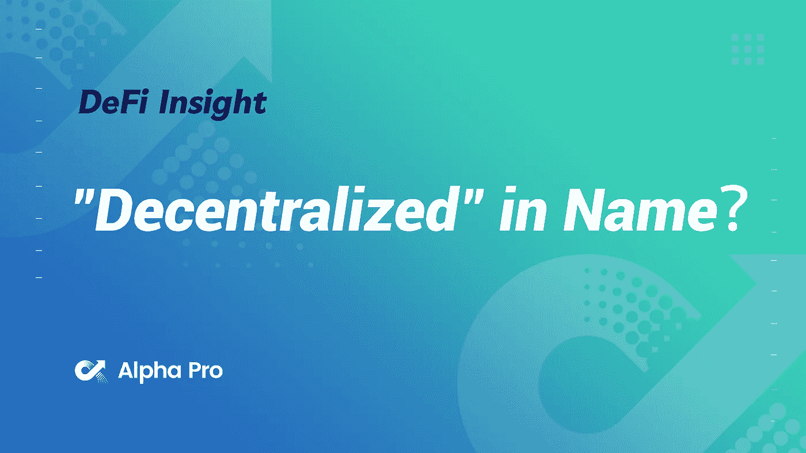
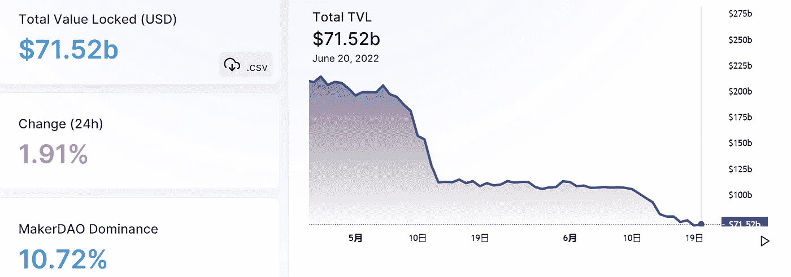
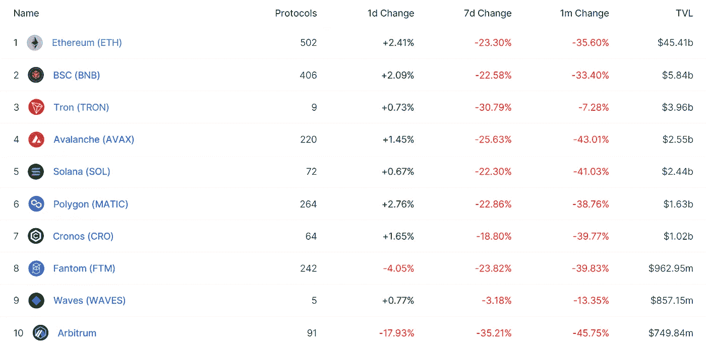
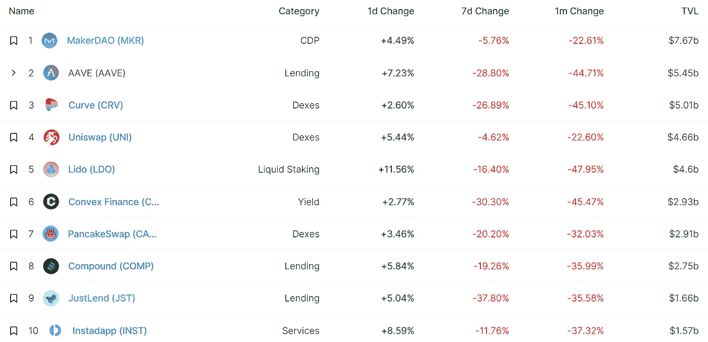
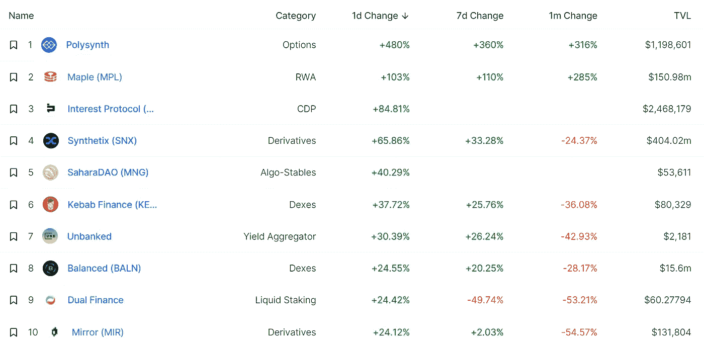
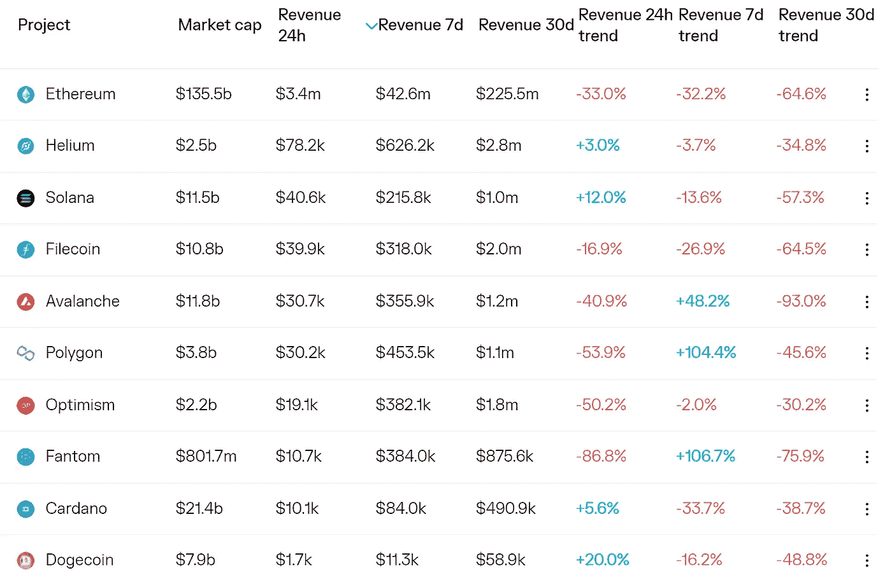
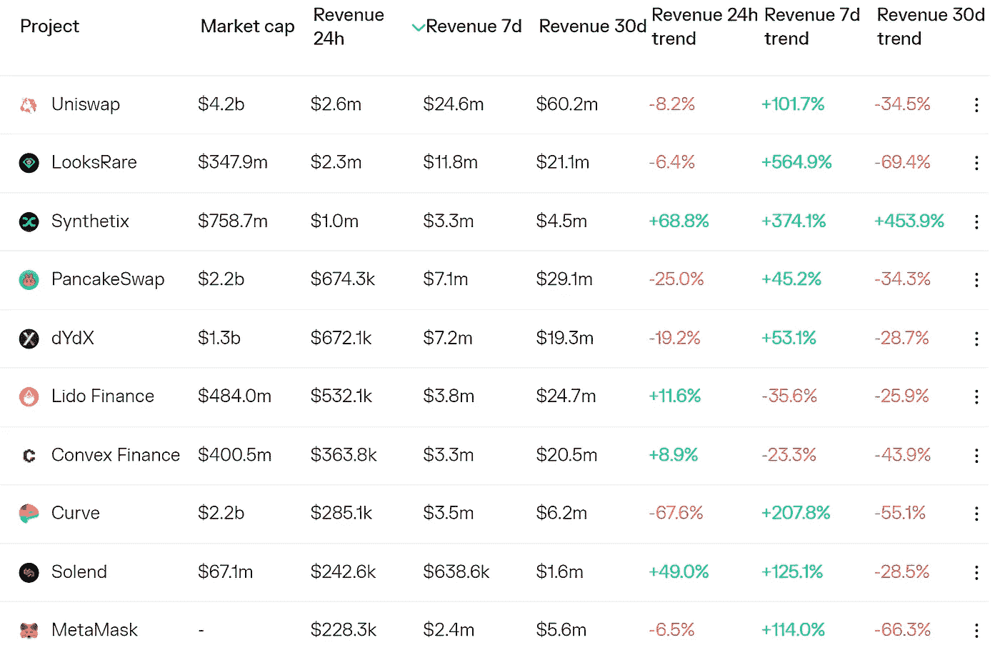
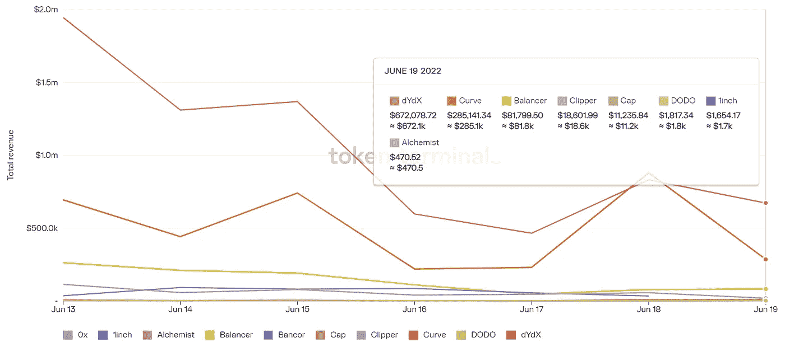
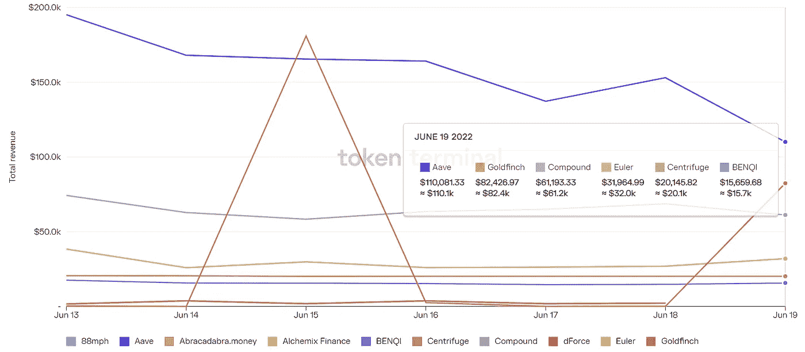

# DeFi Insight |“去中心化”在名义上？

> 原文：<https://medium.com/coinmonks/defi-insight-decentralized-in-name-a2cf2d2e3387?source=collection_archive---------26----------------------->

2022 年 6 月 20 日

*今日 DeFi 数据&由 DeFi Insight 为您带来的新闻*

> 建立在索拉纳基础上的所谓“分散化”贷款协议已经“投票”接管了一个拥有紧急权力的鲸鱼账户，以消除强制清算的可能性。*@*[来源](https://twitter.com/DylanLeClair_/status/1538539508462931970)

# 最新消息

## 贷款

**/**对[摄氏度](https://blog.celsius.network/a-note-to-the-celsius-community-e5af1f5a7998)社区的说明

**[Solend 社区撤销之前接管巨鲸账户的新提案](https://realms.today/dao/7sf3tcWm58vhtkJMwuw2P3T6UBX7UE5VKxPMnXJUZ1Hn/proposal/3geE5P3D7VJRaNNDVfZciGsXgwGiao1hSNpRM6jWNa5A)获得批准**

**当前的情况可能没有传言中的那么糟糕**

## **指标**

****[班科尔](https://blog.bancor.network/market-conditions-update-june-19-2022-e5b857b39336)的无常损失保护暂时暂停****

## ****衍生产品****

****BitMEX 创始人:预计会有更多的$BTC 和$ETH 被强行抛售****

## ****政策与法规****

******[俄罗斯](https://beincrypto.com/russia-develops-blockchain-system-to-replace-swift/)开发区块链系统替代 Swift******

******六个数字交换机推迟推出加密服务******

## ******采矿******

******随着采矿变得无利可图，伊朗的矿工将面临停电******

******尽管 BTC 价格暴跌，马拉松数字公司继续在 T42 采矿******

## ******NFT******

******佳士得 [NFT](https://twitter.com/NonFungibleNoah/status/1538584141419143168?s=20&t=ToLkX6zK5cokmgSKqjFyzA) 负责人 Noah Davis 将担任 crypto 朋克的品牌负责人******

## ******基金******

********新兴密码艺术平台[外域](https://cryptonews.com/news/emerging-crypto-art-platform-outland-raises-5m-seed-round-led-by-okg-ventures.htm)募集 500 万美元种子轮由 OKG 风投领投********

## ******观点******

********[加密导致价格和宏观风险的艰难时期](https://www.coindesk.com/markets/2022/06/19/hard-times-in-crypto-lead-to-price-and-macro-risk/)********

******FTX 首席执行官指责美联储加息导致了加密系统崩溃******

********比特币投资将“无限”增长:[萨尔瓦多总统](https://forkast.news/headlines/bitcoin-invest-grow-el-salvador-president/?utm_source=blockworks-research)********

********[BIS 说](https://blockworks.co/decentralization-proves-to-be-an-illusion-bis-says/)********

******凯文·奥利里说，尽管经济不景气，他也不会出售任何密码——“你只能忍受”******

# ******数据和分析******

## ******锁定的总价值(TVL)******

******目前全网 DeFi 总锁定量为 715.2 亿美元，24 小时增长 1.91%。******

************

## ******TVL 评出的十大连锁酒店******

************

## ******|最新 TVL 十大项目******

************

## ******|过去 24 小时内 TVL 增长的前 10 个项目******

************

## ******协议收入******

## ******|累计总收入最高的项目(24H)_ 区块链(L1)******

************

## ******|累计总收入最高的项目(24H) _Dapps (L2)******

************

## ******|前 10 大交易所的每日收入******

************

## ******|十大贷款协议的每日收入******

************

# ******深潜******

********对比特币市场** [**进一步蔓延**](https://bitcoinmagazine.com/markets/fears-of-further-contagion-in-the-bitcoin-market) **的担忧********

**** [## 对比特币市场进一步蔓延的担忧

### 以下是比特币杂志 Pro 最近一期的免费完整摘录，比特币杂志的溢价市场…

bitcoinmagazine.com](https://bitcoinmagazine.com/markets/fears-of-further-contagion-in-the-bitcoin-market) 

**大赤字** [**去杠杆化**](https://insights.glassnode.com/the-great-defi-deleveraging/)

 [## 伟大的去杠杆化

### 以太坊 DeFi 市场正在经历戏剧性的去杠杆化，仅在六个月内就有超过 1240 亿美元的资本被冲走…

insights.glassnode.com](https://insights.glassnode.com/the-great-defi-deleveraging/) 

******比特币、以太坊、索拉纳、XRP 价格会走多低？******

**** [## 比特币、以太坊、索拉纳、XRP 价格会跌到多低？" NullTX

### 加密货币市场正在经历巨大的抛售，大多数资产的价值损失超过 40%

nulltx.com](https://nulltx.com/how-low-will-bitcoin-ethereum-solana-xrp-price-go/) 

******密码行业如何利用区块链的透明度来了解和防止市场传染******

**** [## 密码行业如何利用区块链的透明度来了解和防止市场…

### Chainalysis 不保证或担保数据的准确性、完整性、及时性、适用性或有效性

blog.chainalysis.com](https://blog.chainalysis.com/reports/2022-crypto-market-contagion-defi-web3-risk/)**** 

# ****报告****

******[**如何**](https://crypto.com/research/connection-between-cryptocurrency-and-financial-markets/) **加密货币与金融市场的联系【2022 年 6 月学者】** _crypto******

> ****加密货币是最新的货币形式。然而，加密市场与传统货币市场有联系吗？本文发现稳定曲线将它们联系在一起。****

******NFTs**_ theblockresearch 的当前 [**状态**](https://www.theblockresearch.com/current-state-of-nfts-152839)****

********[**相对论**](https://messari.io/article/the-theory-of-relativity)**_ 梅萨里**********

********[**新一层区块链**](https://blog.chainalysis.com/reports/web3-layer-1-blockchains/) **正在扩张 DeFi 生态系统但还没有 Eth 杀手**_ chain analysis********

******关于:******

****DeFi Insight 是顶级 DeFi 和加密新闻和更新的来源。****

******https://twitter.com/AlphaPro_io 推特:******

********https://medium.com/feed/@alphapro.project**RSS:******

******提供的信息应被视为发展新闻，而不是投资建议。******

> ******加入 Coinmonks [电报频道](https://t.me/coincodecap)和 [Youtube 频道](https://www.youtube.com/c/coinmonks/videos)了解加密交易和投资******

# ******另外，阅读******

*   ******[印度最佳 P2P 加密交易所](https://coincodecap.com/p2p-crypto-exchanges-in-india) | [柴犬钱包](https://coincodecap.com/baby-shiba-inu-wallets)******
*   ******[八大加密附属计划](https://coincodecap.com/crypto-affiliate-programs) | [eToro vs 比特币基地](https://coincodecap.com/etoro-vs-coinbase)******
*   ******[最佳以太坊钱包](https://coincodecap.com/best-ethereum-wallets) | [电报上的加密货币机器人](https://coincodecap.com/telegram-crypto-bots)******
*   ******[交易杠杆代币的最佳交易所](https://coincodecap.com/leveraged-token-exchanges) | [购买 Floki](https://coincodecap.com/buy-floki-inu-token)******
*   ******[3Commas 对 Pionex 对 Cryptohopper](https://coincodecap.com/3commas-vs-pionex-vs-cryptohopper) | [Bingbon 评论](https://coincodecap.com/bingbon-review)**************