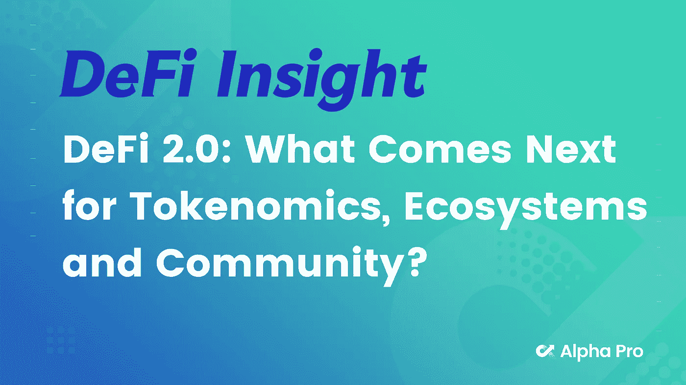
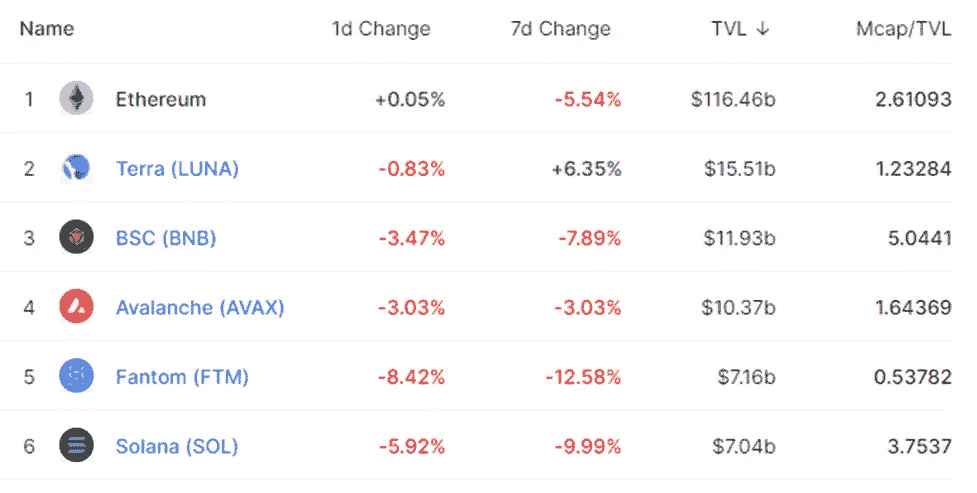
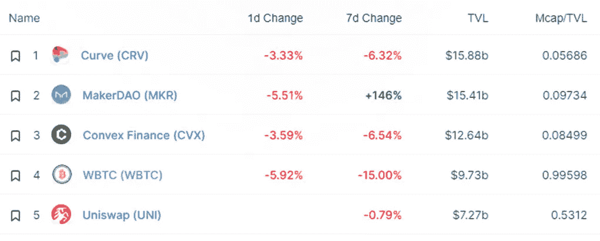
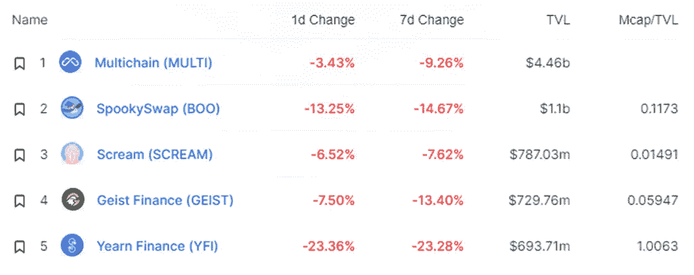
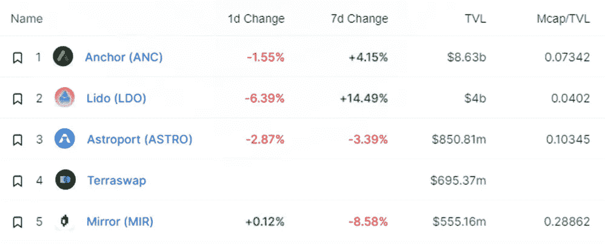
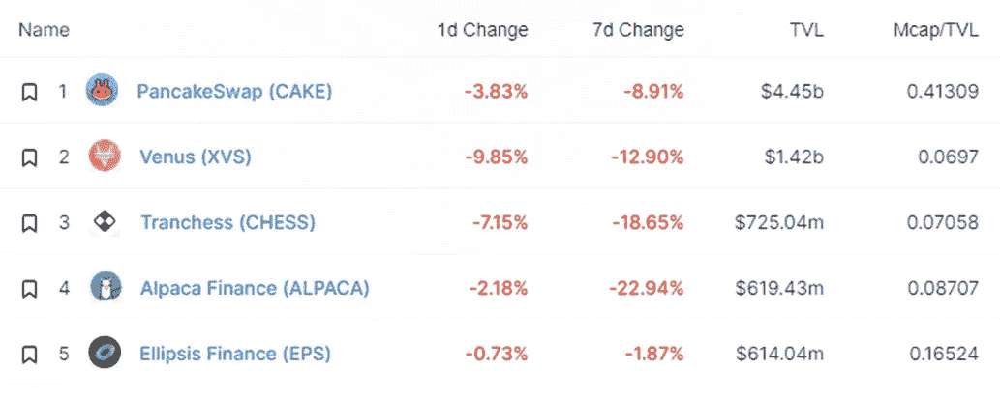
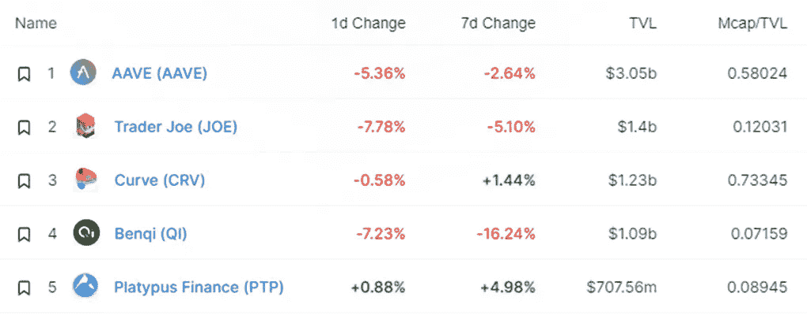
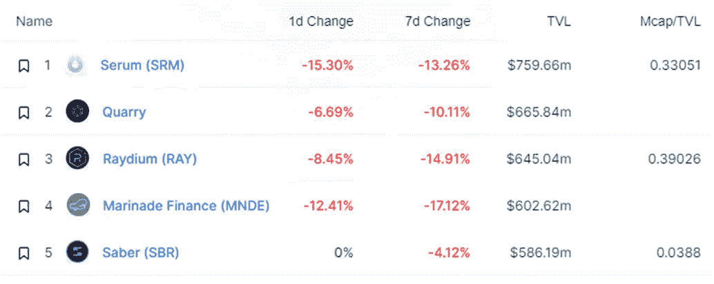
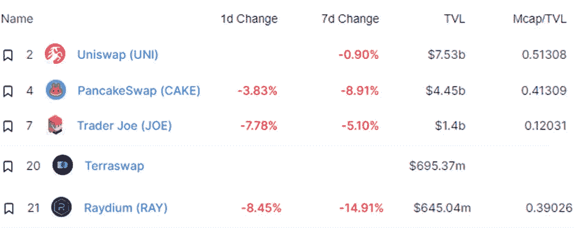
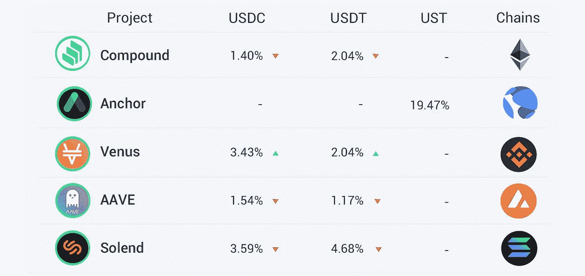

# DeFi Insight |DeFi 2.0:令牌组学、生态系统和社区的下一步是什么？

> 原文：<https://medium.com/coinmonks/defi-insight-defi-2-0-what-comes-next-for-tokenomics-ecosystems-and-community-c5a67005b9b9?source=collection_archive---------31----------------------->

## 2022 年 2 月 22 日

*今日 DeFi 数据&由 DeFi Insight 为您带来的新闻。*

**宏观趋势:**更多韩国[秘密对秘密交易](https://cryptonews.com/news/more-south-korean-crypto-crypto-exchanges-hopeful-of-making-fiat-returns.htm)有望让菲亚特回归

**TVL 走势:**价值锁定德菲受到打击， [TVL 在 24 小时内下跌 1.25%](https://defillama.com/)

**DEX 动态:***DEX 跌幅最大的是*[*Raydium*](https://defillama.com/protocol/raydium)**，损失了 8.45%**

***stable coin:**[01 Exchange](https://01exchange.medium.com/01-exchange-releases-ust-as-collateral-to-trade-luna-perp-other-perpetuals-3c87bfaa2b30)释放 UST 作为交易 LUNA-PERP &其他永久资产的抵押品*

# *最新消息*

## *定义*

***、**南森:9 大网 7 天总活跃地址约 916.3 万， [BNB 链](https://twitter.com/nansen_ai/status/1495756696794595330)占 45%*

*俄罗斯财政部将“关于数字货币”的联邦法律草案送交俄罗斯政府*

## *借出*

*Terra 的租借协议[火星协议](https://twitter.com/mars_protocol/status/1495729110190116870)“锁落”已经开始*

## *互换*

**[DeFi 研究机构 Revert Finance](https://twitter.com/revertfinance/status/1495775516623843332?s=20&t=EKF4J4ZBw0DFGtIZDBYoPA) 发布了一款工具启动器，帮助用户优化 AMM 协议中的 lp 头寸*

## *协议*

*琥珀集团最近一次融资达到 30 亿美元*

**[Tempus](https://twitter.com/TempusFinance/status/1495747382285377538)在 Fantom 上发布*

*AC 在其 Github 主页上增加了一个 zkftm 页面*

*卡达诺创始人:公司“没有秘密”*

**[Plena Finance](https://blogs.plena.finance/)宣布集成多链以支持跨链代币*

*DeFi 甲骨文[保护伞网络](/umbrella-network/umbrella-network-announces-partnership-with-chainwars-ac14f6530162)与 ChainWars 合作*

**[Voltage Finance](https://cointelegraph.com/press-releases/voltage-finance-closes-34m-private-round-releases-details-of-token-launch)结束 340 万美元的私人融资，发布代币发行细节*

*Viabull Labs 发布 DustSweeper，允许用户用小额余额代币交换 ETH，而无需昂贵的天然气交易*

**[轨道飞行器金融](https://twitter.com/Orbiter_Finance/status/1496032403869298688):空投或货币发行尚未开始*

# *数据和分析*

## *锁定的总价值(TVL)*

## *TVL 的六大连锁品牌*

**哪些*链/协议*当前将最多的资产存放在它们的智能合同中？**

**

> *TVL 的五大协议*

**

> *TVL 的五大协议*

**

> *TVL 的五大协议*

**

> ***# BNB**TVL 的五大协议*

**

> *TVL 的五大协议*

**

> *TVL 的五大协议*

**

## *德克斯 TVL 排名*

**DEX 跌幅最大的是*[*Raydium*](https://defillama.com/protocol/raydium)**，损失了 8.45%***

****

## **APY DeFi 贷款公司**

***USDC:最高贷款人:索伦德，利率为 3.59% APY***

***USDT:最高贷款人:索伦德，利率为 4.68% APY***

****

# **深潜**

** [## DeFi 2.0:令牌组学、生态系统和社区的下一步是什么

### DeFi 2.0:缺什么？为社区提供清晰的沟通和教育，并从整体上关注生态系统…

beincrypto.com](https://beincrypto.com/defi-2-0-what-comes-next-for-tokenomics-ecosystems-and-community/)  [## 对于长期加密投资者来说，平均成本可能是一个“伟大的策略”。它是这样工作的

### 对于加密货币投资者来说，波动是生活的现实。但是对于这些新的，有一个老的策略…

time.com](https://time.com/nextadvisor/investing/cryptocurrency/dollar-cost-averaging-crypto-investing/) 

一个 **值得信赖的资源，为一切事物 DeFi**

> 一场回合:
> 
> 分散金融(DeFi)指的是从传统的中央金融系统向区块链促成的点对点金融系统的转变。
> 
> DeFi Insight 是顶级 DeFi 和加密新闻和更新的来源。
> 
> 提供的信息应被视为发展新闻，而不是投资建议。

> *加入 Coinmonks* [*电报频道*](https://t.me/coincodecap) *和* [*Youtube 频道*](https://www.youtube.com/c/coinmonks/videos) *了解加密交易和投资*

# 另外，阅读

*   [3 商业评论](/coinmonks/3commas-review-an-excellent-crypto-trading-bot-2020-1313a58bec92) | [Pionex 评论](https://coincodecap.com/pionex-review-exchange-with-crypto-trading-bot) | [Coinrule 评论](/coinmonks/coinrule-review-2021-a-beginner-friendly-crypto-trading-bot-daf0504848ba)
*   [莱杰 vs n rave](/coinmonks/ledger-vs-ngrave-zero-7e40f0c1d694)|[莱杰 nano s vs x](/coinmonks/ledger-nano-s-vs-x-battery-hardware-price-storage-59a6663fe3b0) | [币安评论](/coinmonks/binance-review-ee10d3bf3b6e)
*   [Bybit Exchange 审查](/coinmonks/bybit-exchange-review-dbd570019b71) | [Bityard 审查](https://coincodecap.com/bityard-reivew) | [Jet-Bot 审查](https://coincodecap.com/jet-bot-review)
*   [3 commas vs crypto hopper](/coinmonks/3commas-vs-pionex-vs-cryptohopper-best-crypto-bot-6a98d2baa203)|[赚取加密利息](/coinmonks/earn-crypto-interest-b10b810fdda3)
*   最好的比特币[硬件钱包](/coinmonks/hardware-wallets-dfa1211730c6) | [BitBox02 回顾](/coinmonks/bitbox02-review-your-swiss-bitcoin-hardware-wallet-c36c88fff29)
*   [BlockFi vs 摄氏度](/coinmonks/blockfi-vs-celsius-vs-hodlnaut-8a1cc8c26630) | [Hodlnaut 点评](/coinmonks/hodlnaut-review-best-way-to-hodl-is-to-earn-interest-on-your-bitcoin-6658a8c19edf) | [KuCoin 点评](https://coincodecap.com/kucoin-review)
*   [Bitsgap 评审](/coinmonks/bitsgap-review-a-crypto-trading-bot-that-makes-easy-money-a5d88a336df2) | [Quadency 评审](/coinmonks/quadency-review-a-crypto-trading-automation-platform-3068eaa374e1) | [Bitbns 评审](/coinmonks/bitbns-review-38256a07e161)**