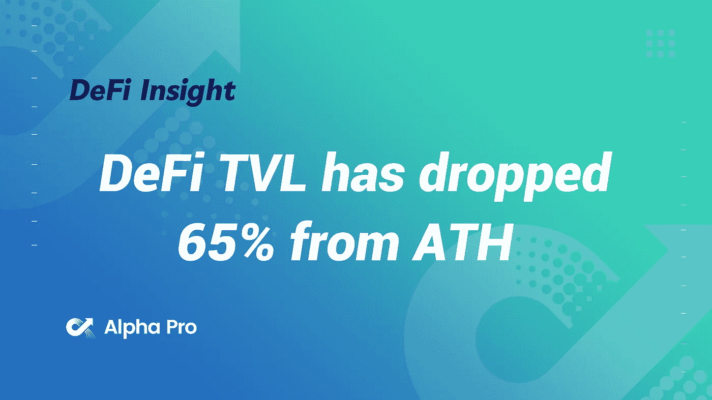
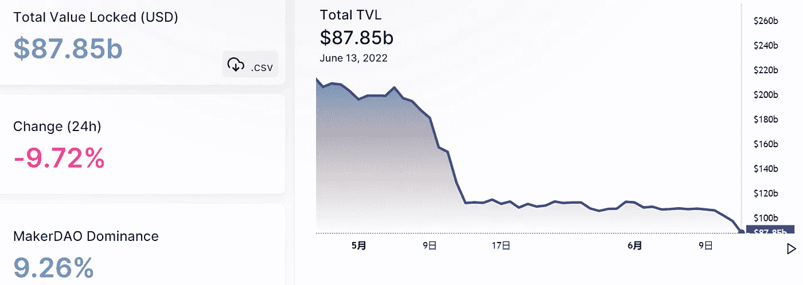
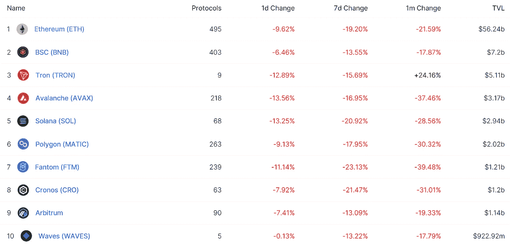
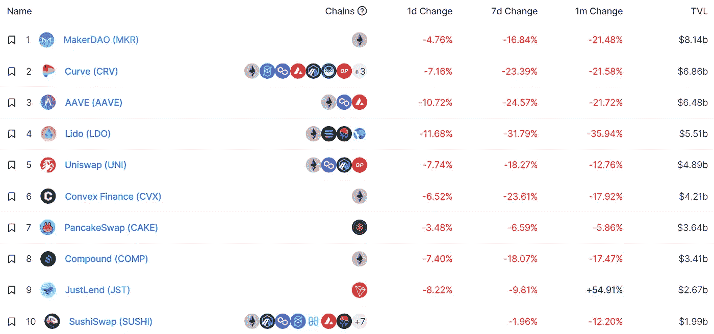
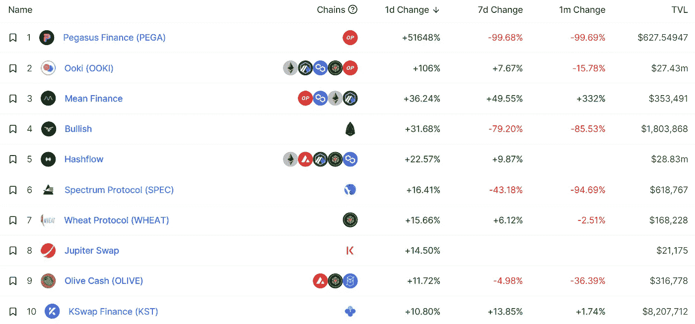
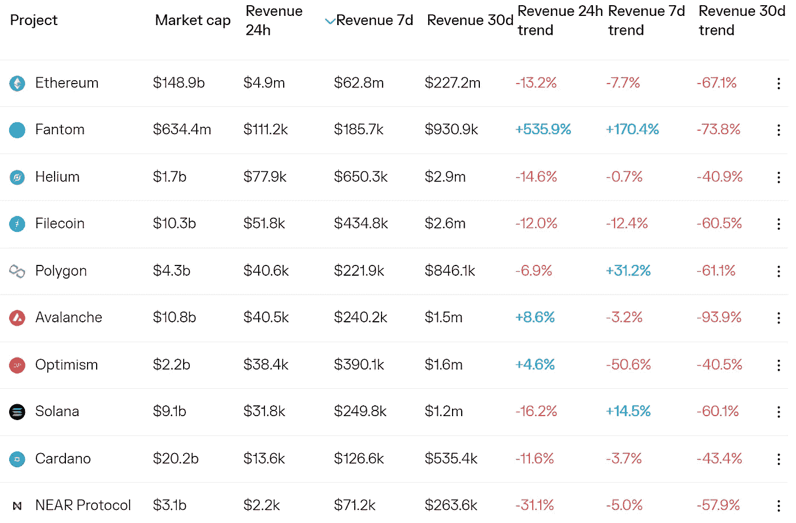
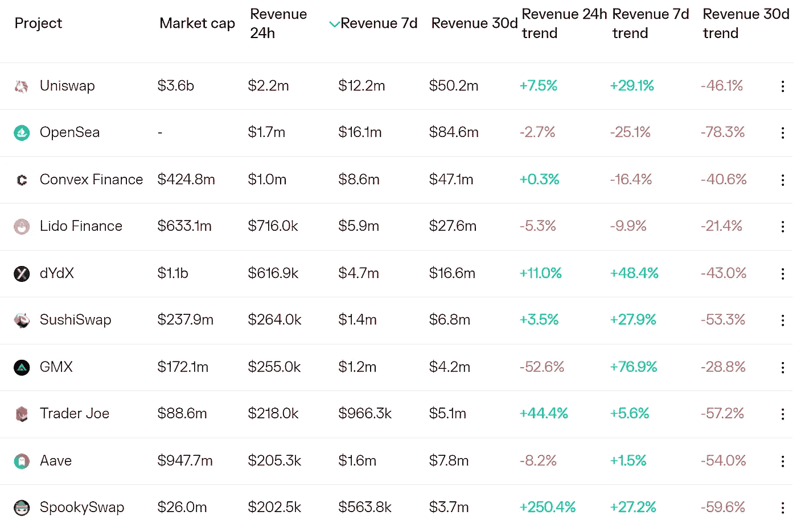
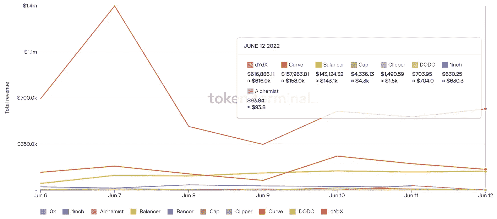
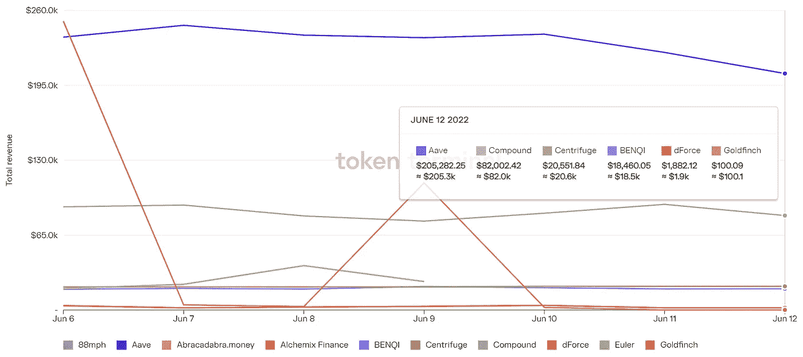

# DeFi Insight | DeFi TVL 从 ATH 下跌了 65%

> 原文：<https://medium.com/coinmonks/defi-insight-defi-tvl-has-dropped-65-from-ath-2412b0513c86?source=collection_archive---------26----------------------->

2022 年 6 月 13 日

*今日 DeFi 数据&由 DeFi Insight 为您带来的新闻*

> 据 [@DefiLlama](http://twitter.com/DefiLlama) 报道，DeFi 协议 TVL 跌至 878.5 亿美元，为 2021 年 5 月 24 日以来最低，前三大协议@MakerDAO、@CurveFinance 和@ AaveAave 分别跌至 81.4 亿美元、68.6 亿美元和 64.8 亿美元。

# 最新消息

## 贷款

**[摄氏度](https://cointelegraph.com/news/celsius-exodus-320m-in-crypto-sent-to-ftx-user-withdrawals-paused)出埃及记:价值 3 . 2 亿美元的密码被发送到 FTX，用户提款暂停**

****/**加密贷款机构 [Nexo](https://twitter.com/Nexo/status/1536217858711101446) 提出收购 Celsius**

## **外汇**

**币安首席执行官赵昌鹏质疑美国证券交易委员会对 BNB 的调查**

****[尼日利亚最大的证券交易所](https://cryptopotato.com/nigerias-largest-stock-exchange-plans-to-adopt-blockchain-for-settling-trades/)计划采用区块链进行交易结算****

******[关于使用可伸缩扩展块(MWEB)存取莱特币(LTC)的通知](https://www.binance.com/en/support/announcement/61d4510b1ada4ba78b5384e8c2d3527c)******

## ******稳定币******

******被控在 UST 倒闭前套现 27 亿美元，泰拉创始人称指控不实******

## ******支付******

******关于接受加密货币支付，有哪些[品牌](https://www.businessoffashion.com/articles/technology/what-brands-need-to-know-about-accepting-cryptocurrency-payments/)需要了解******

********接受加密支付是大多数美国零售商的优先选择:[德勤](https://forkast.news/headlines/crypto-payments-priority-for-us-retailers/?utm_source=blockworks-research)********

******“沙盒 x [万事达卡](https://ambcrypto.com/will-the-the-sandbox-x-mastercard-partnership-generate-positive-returns/?utm_source=blockworks-research)”合作关系会产生正回报吗******

## ******NFT******

********[NFT](https://cointelegraph.com/news/nft-flipping-not-so-profitable-for-more-than-half-of-buyers-survey)调查显示，超过一半的买家认为炒房不太有利可图********

******调查显示大多数人购买 NFT 是为了“赚钱”******

******为了纪念狗狗“吃豆人”,曼尼·帕奎奥推出了 NFTs******

******有史以来第一个苏格兰职业足球联赛******

## ******基金******

********[火币](https://news.bitcoin.com/huobi-launches-blockchain-and-web3-investment-arm-ivy-blocks/)推出区块链和 Web3 投资臂 Ivy Blocks********

## ******观点******

********/**[乔鲁彬](https://www.coindesk.com/layer2/2022/06/13/how-much-eth-does-joe-lubin-hold/?utm_medium=referral&utm_source=rss&utm_campaign=headlines)有多少 ETH？******

****欧盟区块链观察专家[说 DeFi 揭开了金融魔法的帷幕](https://cointelegraph.com/news/defi-pulls-the-curtain-on-financial-magic-says-eu-blockchain-observatory-expert)****

****股票经纪人[说](https://forkast.news/headlines/india-crypto-tax-blessing-in-disguise/?utm_source=blockworks-research)印度的加密税因祸得福****

****经济学家彼得·希夫解释了为什么他预计比特币会随着经济衰退的加深而崩溃——警告“不要买这种下跌”****

# ****数据和分析****

## ****锁定的总价值(TVL)****

****目前全网 DeFi 总锁定量为 878.5 亿美元，24 小时下降 9.72%。****

********

## ****TVL 评出的十大连锁酒店****

********

## ****|最新 TVL 十大项目****

********

## ****|过去 24 小时内 TVL 增长的前 10 个项目****

********

## ****协议收入****

## ****|累计总收入最高的项目(24H)_ 区块链(L1)****

********

## ****|累计总收入最高的项目(24H) _Dapps (L2)****

********

## ****|前 10 大交易所的每日收入****

********

## ****|十大贷款协议的每日收入****

********

# ****深潜****

******[**闪电状态**](https://bitcoinmagazine.com/business/the-state-of-lightning-network-adoption) **网络采用********

**** [## 闪电网络的采用情况

### 以下是一份免费的完整摘录，摘自最近一期的比特币杂志 Pro,《比特币杂志的溢价市场》…

bitcoinmagazine.com](https://bitcoinmagazine.com/business/the-state-of-lightning-network-adoption) 

**[**哪里的**](https://vitalik.ca/general/2022/06/12/nonfin.html) **要在非金融应用中使用区块链？****

** [## 在非金融应用中何处使用区块链？

### 值得缩小范围，问一个更广泛的问题:一般来说，在…中使用区块链有什么意义

vitalik.ca](https://vitalik.ca/general/2022/06/12/nonfin.html) 

**在** [**区块链从哪些方面**](https://www.bitrates.com/news/p/in-what-ways-has-blockchain-simplified-the-world-of-online-trading) **简化了网络交易的世界？**

 [## 区块链在哪些方面简化了在线交易的世界？

### 在探索区块链如何简化网上交易之前，我们需要定义区块链系统，它的历史…

www.bitrates.com](https://www.bitrates.com/news/p/in-what-ways-has-blockchain-simplified-the-world-of-online-trading) 

**[**web 5**](https://cryptoslate.com/web5-announced-by-jack-dorseys-block-to-replace-web3-as-future-of-internet/)**杰克·多西宣布取代 web3 成为互联网的未来****

** [## 杰克·多西集团宣布 Web5 将取代 web3 成为互联网的未来

### 👋想和我们一起工作吗？CryptoSlate 正在招聘几个职位！杰克·多西在 2022 共识会议上宣布…

cryptoslate.com](https://cryptoslate.com/web5-announced-by-jack-dorseys-block-to-replace-web3-as-future-of-internet/) 

**[**急**](https://www.youtube.com/watch?v=sXa6YNUFGEo) **: 8.6%通胀冲击！这是你的密码最糟糕的情况吗？****** 

# ****报告****

******[**了解**](https://messari.io/article/understanding-market-caps-and-flows) **市值和流量** _messari******

> ****流通市值不考虑未来的解锁和排放。在熊市中，随着碳排放在每日交易量中所占的比例越来越大，它们的重要性也越来越大。【Avalanche、Solana 和 NEAR 等代币因其高排放比率而更容易受到熊市流动性状况的不利影响。
> BTC 和瑞士联邦理工学院在 2022 年剩余时间内的通胀率接近 1%，但仍需要引入 120 亿美元的新代币。没有额外的买家流入，象征性排放将继续影响价格。
> 排放量与交易量的比率可以表明熊市何时达到平衡。****

******一看** [**NFT 国债**](https://www.theblockresearch.com/a-look-at-nft-treasury-outflows-151413) **流出** _theblockresearch****

******[**如何在熊市中保持增长**](https://thedefiant.io/intotheblock-ribbon-finance-bear-market/) **一个 DeFi 协议**_ defiant******

******关于:******

****DeFi Insight 是顶级 DeFi 和加密新闻和更新的来源。****

******https://twitter.com/AlphaPro_io 推特:******

********❤RSS:**[**https://medium.com/feed/@alphapro.project**](https://medium.com/feed/@alphapro.project)******

****提供的信息应被视为发展新闻，而不是投资建议。****

> *****加入 Coinmonks* [*电报频道*](https://t.me/coincodecap) *和* [*Youtube 频道*](https://www.youtube.com/c/coinmonks/videos) *了解加密交易和投资*****

# ****另外，阅读****

*   ****[Bookmap 评论](https://coincodecap.com/bookmap-review-2021-best-trading-software) | [美国 5 大最佳加密交易所](https://coincodecap.com/crypto-exchange-usa)****
*   ****最佳加密[硬件钱包](/coinmonks/hardware-wallets-dfa1211730c6) | [Bitbns 评论](/coinmonks/bitbns-review-38256a07e161)****
*   ****[新加坡十大最佳加密交易所](https://coincodecap.com/crypto-exchange-in-singapore) | [收购 AXS](https://coincodecap.com/buy-axs-token)****
*   ****[红狗赌场评论](https://coincodecap.com/red-dog-casino-review) | [Swyftx 评论](https://coincodecap.com/swyftx-review) | [CoinGate 评论](https://coincodecap.com/coingate-review)****
*   ****[投资印度的最佳加密软件](https://coincodecap.com/best-crypto-to-invest-in-india-in-2021)|[WazirX P2P](https://coincodecap.com/wazirx-p2p)|[Hi Dollar Review](https://coincodecap.com/hi-dollar-review)**********