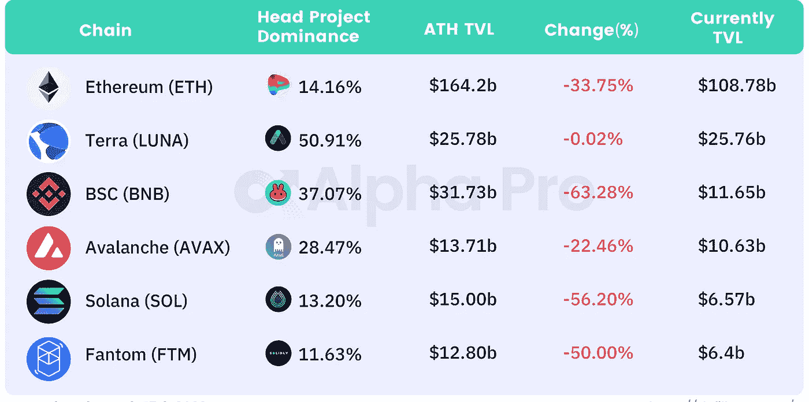
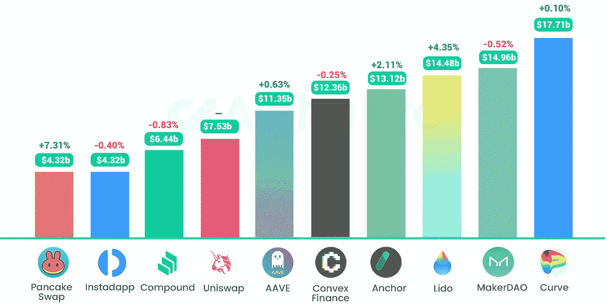
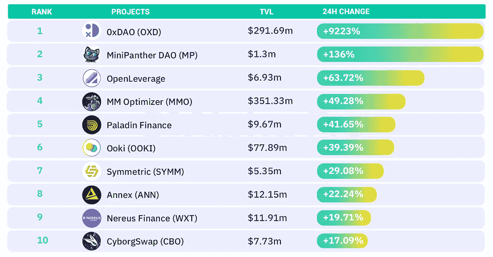
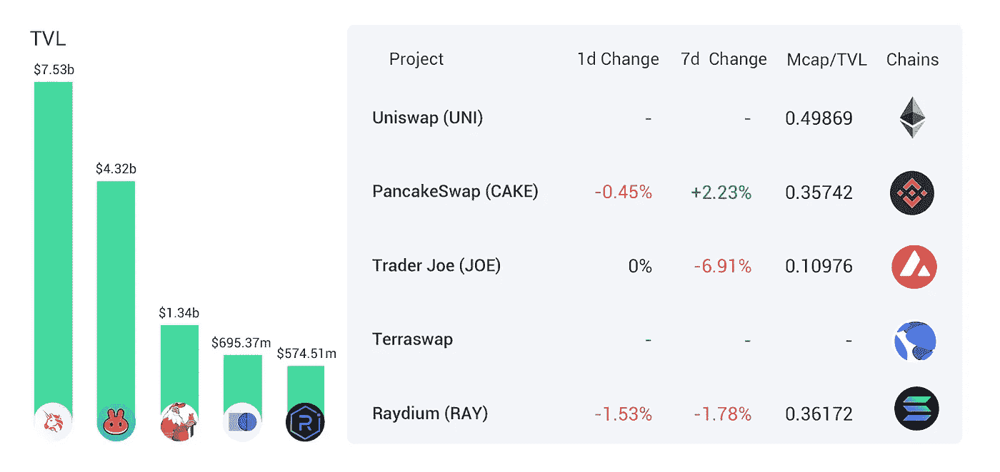
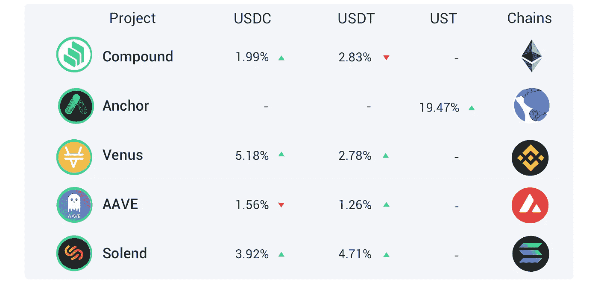
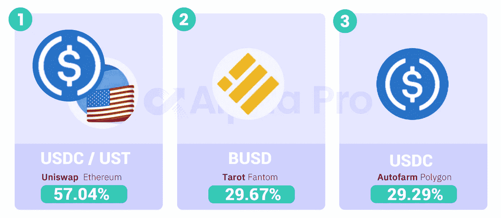

# DeFi Insight |不要睡在合并上；SBF 和 FTX 的未来；在加密中创建系统

> 原文：<https://medium.com/coinmonks/defi-insight-dont-sleep-on-the-merge-sbf-and-the-future-of-ftx-creating-systems-in-crypto-9502c2f39fb6?source=collection_archive---------33----------------------->

## 2022 年 3 月 15 日

*今日 DeFi 数据&由 DeFi Insight 为您带来的新闻。*

**宏观趋势:**欧洲议会投票反对战俘禁令，为[密码产业](https://cointelegraph.com/news/european-parliament-votes-against-pow-ban-providing-huge-relief-to-the-crypto-industry)提供了巨大的救济

**TVL 动向:**目前全网 [DeFi](https://defillama.com/) 总锁定量为 1980 亿美元，24 小时增长 0.93%

**稳定的货币:**稳定的货币经济接近 2000 亿美元， [UST 供应量跃升](https://news.bitcoin.com/stablecoin-economy-nears-200b-ust-supply-jumps-higher-usdn-spikes-43-in-30-days/)，美元在 30 天内飙升 43%

# 最新消息

## 定义

南森:7 天[活跃地址链](https://twitter.com/nansen_ai/status/1503372607894482945)
上周，以太坊、Celo 和乐观上的活跃地址上升，但 Ronin 失去了前 3 名的位置

FTX 风投的 Amy Wu 谈[初创公司估值和利率上调](https://www.theinformation.com/articles/ftx-ventures-amy-wu-on-startup-valuations-and-rate-hikes-stellar-foundation-backs-early-stage-startups)

多国研究显示，只有十分之一的人对投资加密没有兴趣

## 协议

*[内射协议](https://twitter.com/InjectiveLabs/status/1503536479032782850)与 Terra 的跨链桥集成

*[Unloc](https://unlocnft.medium.com/unloc-raises-1-25m-to-develop-financial-solutions-around-nfts-303657c964bf)筹集了 125 万美元，用于开发与非金融交易相关的金融解决方案

无限公司宣布互联网计算机达到了钛里程碑

Terra 社区通过了 323 号提案，为 ZigZag 交易所提供了额外的流动性

奥特莱斯计划推出 [Terra native wallet](https://twitter.com/OutletFinance/status/1503384525598044165)

## 贷款

于 3 月 17 日停止 ANC-UST LP 奖励的锚定协议

在[乐观情绪](https://twitter.com/EqualizerFlash/status/1503364997224833027?s=20&t=4VT1QBUiLV8JP2hyZRxwWQ)上部署均衡融资

固定利率贷款协议[名义](https://blog.notional.finance/introducing-staked-note/)引入票据锁定

## 打桩

以太坊赌注协议[膨胀](https://www.coindesk.com/business/2022/03/14/ethereum-staking-protocol-swell-raises-375m-as-locked-eth-tops-26b/)筹集 375 万美元，锁定的以太坊最高价为 260 万美元

## |警报

PeckShield: [德乌斯金融](https://twitter.com/peckshield/status/1503632734299701250)被黑，黑客赚了近 300 万美元

币安暂停自动存款和取款

## | KOL

*[Terra 创始人](https://twitter.com/stablekwon)追加 1000 万美元赌注

# 数据和分析

## TVL 和 ATH 排名前六的连锁酒店对比

## 最新 TVL 十大项目

## 过去 24 小时 TVL 变化的前 10 个项目

## 德克斯 TVL 排名

*DEX 跌幅最大的是*[*Raydium*](https://defillama.com/protocol/raydium)*，损失了 1.53%*

## APY DeFi 贷款公司

*USDC:最高贷款人:利率为 5.18%的金星 APY*

*USDT:最高贷款人:索伦德，利率为 4.71% APY*

## 稳定的 APY

# 深潜

**无银行:不睡觉** [**上合并**](https://newsletter.banklesshq.com/p/dont-sleep-on-the-merge-lite?s=w)

 [## 不要睡在合并[建兴]

### 获得 1000 美元的工作和银行当你加入亲爱的无银行国家时，在过去的一周里有太多的事情值得报道:但是…

newsletter.banklesshq.com](https://newsletter.banklesshq.com/p/dont-sleep-on-the-merge-lite?s=w) 

**SBF 与 FTX 的**

** [## 🎙 109 - SBF 和 FTX 的未来

### 山姆·班克曼——弗里德——或简称 SBF——是 FTX 的创始人兼首席执行官，该公司是 crypto 最大的交易所之一。在这一集里，我们…

shows.banklesshq.com](https://shows.banklesshq.com/p/-109-sbf-and-the-future-of-ftx-sam?s=r) 

**[**DeFi 预测**](https://stakedsol.substack.com/p/defi-predictions-bet-on-big-and-boring?s=r) **(赌大而无聊)****

** [## 定义预测(赌大而无聊)

### 通常，预测文章是最糟糕的一类子文章，因为它们同时宣称…

stakedsol.substack.com](https://stakedsol.substack.com/p/defi-predictions-bet-on-big-and-boring?s=r) 

**[**在 Crypto** 中创建系统](https://twitter.com/thedefiedge/status/1503433574418059267)**

******一个线程上的选项:** [**卢娜下注**](https://twitter.com/nope_its_lily/status/1503405784125779969)****** 

****一场回合:****

****DeFi Insight 是顶级 DeFi 和加密新闻和更新的来源。****

****提供的信息应被视为发展新闻，而不是投资建议。****

> ****加入 Coinmonks [电报频道](https://t.me/coincodecap)和 [Youtube 频道](https://www.youtube.com/c/coinmonks/videos)了解加密交易和投资****

# ****另外，阅读****

*   ****[Bookmap 评论](https://coincodecap.com/bookmap-review-2021-best-trading-software) | [美国 5 大最佳加密交易所](https://coincodecap.com/crypto-exchange-usa)****
*   ****最佳加密[硬件钱包](/coinmonks/hardware-wallets-dfa1211730c6) | [Bitbns 评论](/coinmonks/bitbns-review-38256a07e161)****
*   ****[新加坡十大最佳加密交易所](https://coincodecap.com/crypto-exchange-in-singapore) | [购买 AXS](https://coincodecap.com/buy-axs-token)****
*   ****[红狗赌场评论](https://coincodecap.com/red-dog-casino-review) | [Swyftx 评论](https://coincodecap.com/swyftx-review) | [CoinGate 评论](https://coincodecap.com/coingate-review)****
*   ****[投资印度的最佳密码](https://coincodecap.com/best-crypto-to-invest-in-india-in-2021)|[WazirX P2P](https://coincodecap.com/wazirx-p2p)|[Hi Dollar Review](https://coincodecap.com/hi-dollar-review)******