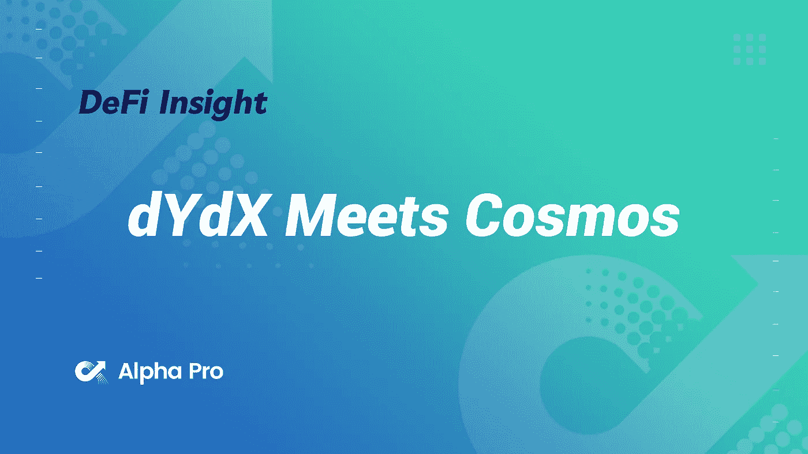
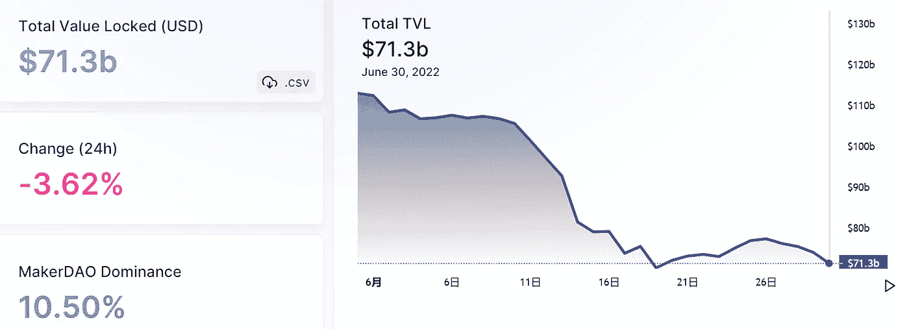
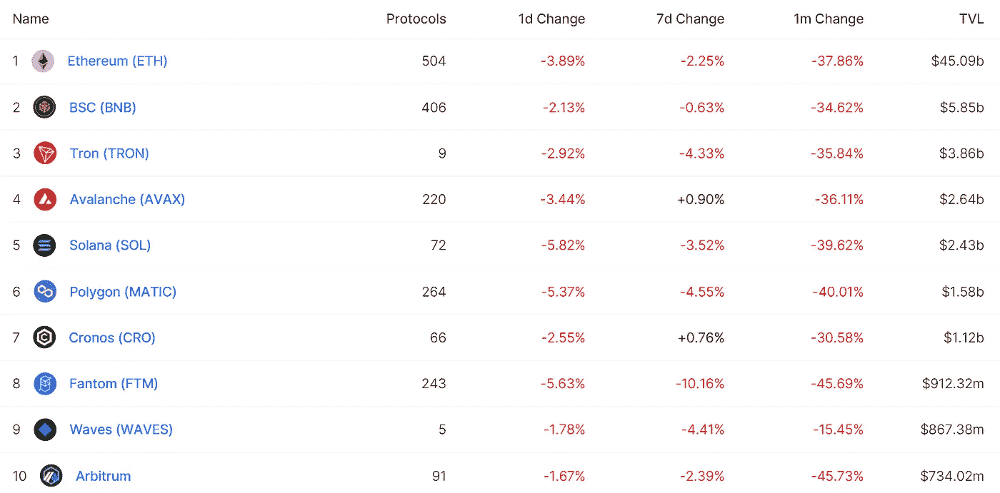
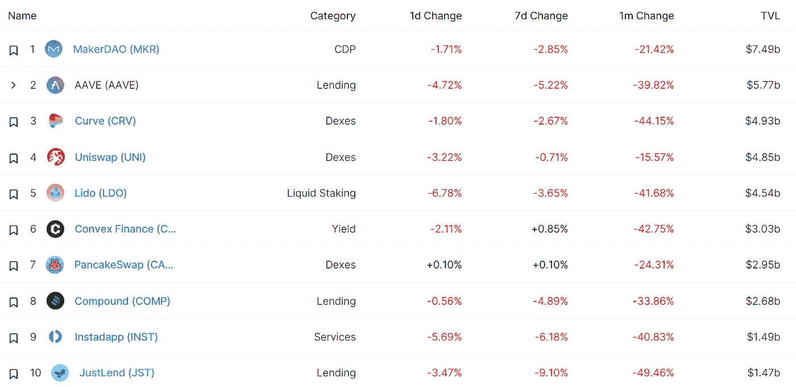
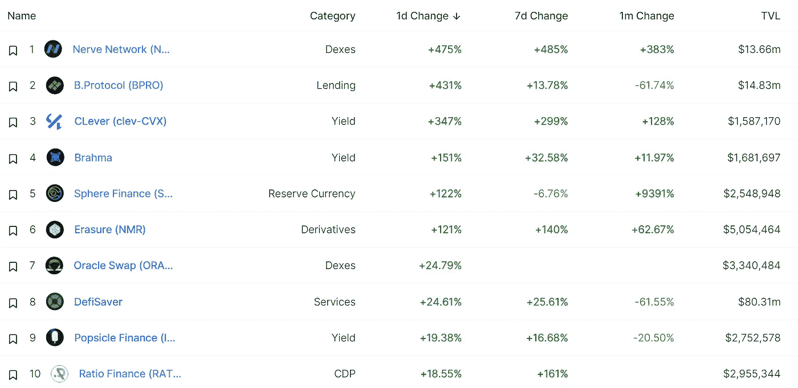
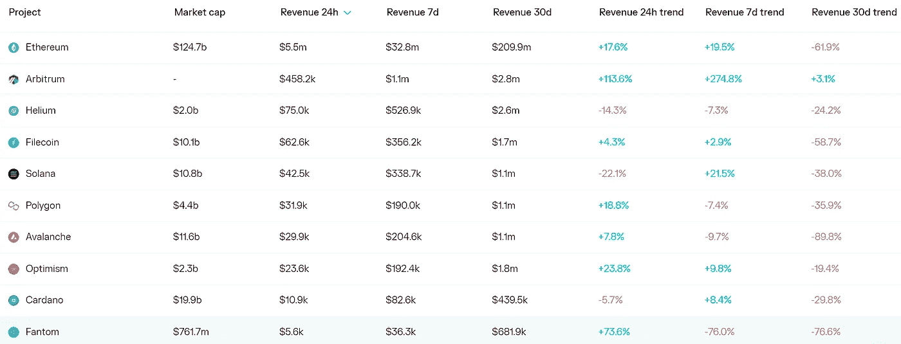
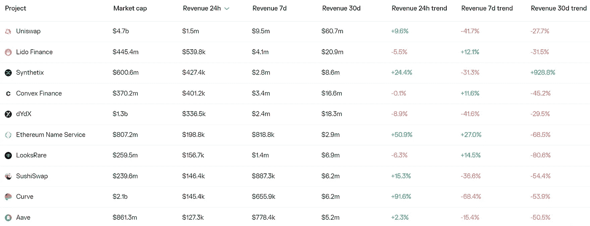
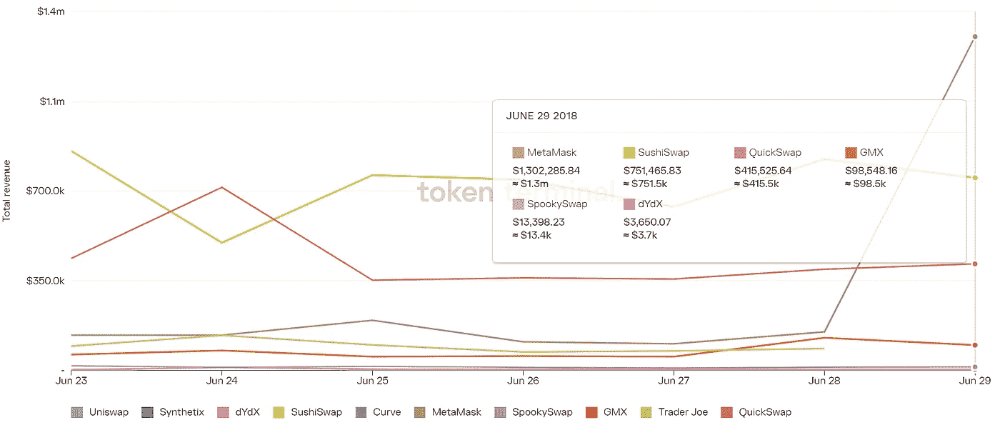
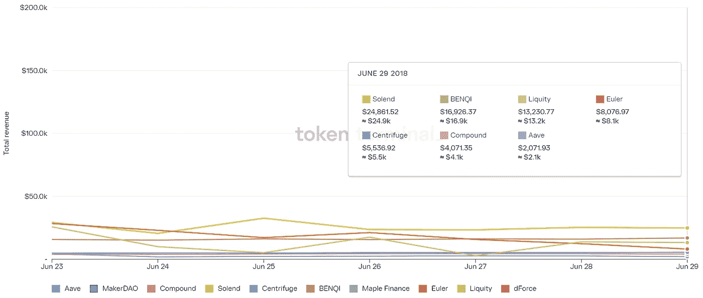

# DeFi Insight | dYdX 遇见宇宙

> 原文：<https://medium.com/coinmonks/defi-insight-dydx-meets-cosmos-1218303bd60e?source=collection_archive---------31----------------------->

2022 年 6 月 30 日

*今日 DeFi 数据&由 DeFi Insight 为您带来的新闻*

> *"* 作为最成功的 DeFi 协议之一，dYdX 计划使用 Cosmos SDK 开发一个新版本。宇宙生态系统已经有一段时间没有好消息了。本文将分为三个部分。首先，介绍 dYdX 及其目前的局限性。第二，Terra 崩溃后宇宙的更新。第三，dYdX 转战 Cosmos 对 dYdX 和 Cosmos 生态系统都有什么意义。*“@*[*来源*](https://tokeninsight.com/en/research/analysts-pick/dydx-meets-cosmos)
> 
> 交易新手？尝试[加密交易机器人](/coinmonks/crypto-trading-bot-c2ffce8acb2a)或[复制交易](/coinmonks/top-10-crypto-copy-trading-platforms-for-beginners-d0c37c7d698c)

# 最新消息

## 贷款

来源:由于 3AC 暴露淹没了密码贷方，创世纪公司面临“数亿”的损失

**[复合](https://www.theblock.co/post/154864/compound-labs-takes-one-step-closer-to-multi-chain-lending-through-newly-released-code)实验室通过新发布的代码向多链借贷迈进了一步**

## **外汇**

**沃伦·巴菲特支持的 Nubank 现在向 5400 万客户提供加密交易**

## **稳定币**

**Frax Finance 社区通过了用 2000 万美元 Frax 回购 FXS 的提案**

## **交叉链**

****跨链桥[星门](https://twitter.com/StargateFinance/status/1542240741484703744)发射$ETH 池****

## ****测试网****

******、**如何在 [AdaSwap](https://adaswap.medium.com/how-to-swap-tokens-on-adaswap-74f3495bec54) 上交换令牌****

## ****空投****

******高达 500 万美元[空投](https://letmespeak.medium.com/up-to-5-million-airdrop-for-early-adopters-and-other-things-to-look-forward-to-fee521a9e984)给早期采用者和其他值得期待的东西******

## ******资产管理******

********[凸金融](https://blockworks.co/unlockening-is-cryptos-latest-test/)“解锁”秘密投资者态度的风向标********

## ******政策与法规******

********[欧盟](https://cryptoslate.com/e-u-moves-further-in-its-crypto-regulation/)在其密码规则中走得更远********

## ******NFT******

********NFT 巨头 [OpenSea](https://cryptonews.com/news/nft-giant-opensea-shares-5-safety-recommendations-as-users-emails-leaked.htm) 分享用户邮件泄露的 5 条安全建议********

********/**涂鸦 2 可穿戴 NFT[创世纪](https://doodles.app/auction)盒子拍卖开始******

******NFT 市场[聚合器](https://twitter.com/gemxyz/status/1542190645225443328) Gem 推出 Live Mints 功能******

## ******基金******

********[交易者联盟](https://www.prnewswire.com/news-releases/league-of-traders-secures-pre-series-a-funding-from-c3-vc-fund-mirana-ventures-and-cadenza-301577697.html)获得了来自 C3 风险投资基金、米拉娜风险投资公司和 Cadenza 的首轮融资********

******投资公司向美国证券交易委员会提起诉讼******

## ******观点******

******Fundstrat 分析师预测最终比特币将达到 1.3 万美元******

******据报道，Crypto 公司第二富有的亿万富翁发出可怕的警告，称更多的数字资产公司将会倒闭******

******摩根大通表示，Crypto 的去杠杆化周期不会持续太久******

# ******数据和分析******

## ******锁定的总价值(TVL)******

******目前全网 DeFi 总锁定量为 713 亿美元，24 小时下降 3.62%。******

************

## ******TVL 评出的十大连锁酒店******

************

## ******|最新 TVL 十大项目******

************

## ******|过去 24 小时内 TVL 增长的前 10 个项目******

************

## ******协议收入******

## ******|累计总收入最高的项目(24H)_ 区块链(L1)******

************

## ******|累计总收入最高的项目(24H) _Dapps (L2)******

************

## ******|前 10 大交易所的每日收入******

************

## ******|十大贷款协议的每日收入******

************

# ******深潜******

******元宇宙的房地产和博彩业正在崛起。 [**VR 和 NFT**](https://blog.chainalysis.com/reports/metaverse-gaming-web3/) **的整合可以进一步推动它们********

**** [## 元宇宙的房地产和博彩业正在崛起。虚拟现实和 NFT 的整合可以推动他们…

### 这个博客是我们的 Web3 状态报告的预览。在此注册以预订您的副本，我们将通过电子邮件向您发送完整的…

blog.chainalysis.com](https://blog.chainalysis.com/reports/metaverse-gaming-web3/) 

**熊市的 7 个心理健康建议**

 [## 熊市的 7 个心理健康建议

### 探索概念金融亲爱的无银行国家，熊市可能会令人失望。除非你是一条巨型加密鲸…

newsletter.banklesshq.com](https://newsletter.banklesshq.com/p/7-mental-health-tips-for-this-bear?utm_source=%2Finbox&utm_medium=reader2) 

**比特币创造了一种新型的** [**财产所有权**](https://bitcoinmagazine.com/culture/bitcoin-creates-a-new-type-of-property-ownership)

 [## 比特币创造了一种新型的财产所有权

### 这是《比特币》杂志撰稿人延斯·布彻(Jens Bucher)的观点社论。比特币是一个令人激动的话题…

bitcoinmagazine.com](https://bitcoinmagazine.com/culture/bitcoin-creates-a-new-type-of-property-ownership) 

**[**奥斯陆自由论坛的三个教训**](https://bitcoinist.com/oslo-freedom-forum-nabourema-likhachevskiy-diop/) **:为什么是 BTC？纳博雷马、利哈切夫斯基、迪奥普****

** [## 奥斯陆自由论坛的三个教训:为什么是 BTC？迪奥普·Bitcoinist.com·纳博雷马

### 奥斯陆自由论坛提供了另一种衡量比特币网络价值的方式。价格行为是好的，但是……

bitcoinist.com](https://bitcoinist.com/oslo-freedom-forum-nabourema-likhachevskiy-diop/)** 

# **报告**

****[**上链取证**](https://www.nansen.ai/research/on-chain-forensics-demystifying-steth-depeg) **:揭秘斯泰斯的“去盯住”**_ 南森****

> ****鉴于最近发生的与 stETH/ETH 价格偏离相关的事件，围绕这个话题出现了许多问题和猜测。看一下 stETH/ETH pool 不平衡曲线，很明显，这种情况可以追溯到 UST/卢纳脱钩时期。****
> 
> ****在这份报告中，我们想要阐明追溯到 UST/月神时期的事件累积，以及最近发生在 6 月初的事件，这些事件完全由南森的链上证据支持。****

******[**灰度-Gensler**](https://messari.io/article/the-grayscale-gensler-stalemate) **相持**_ 梅萨里******

******[**Voltz 协议**](https://www.theblockresearch.com/voltz-protocol-interest-rate-swaps-for-efficient-lending-markets-154109) **:有效借贷市场的利率互换** _theblockresearch******

******[**月度研究**](https://crypto.com/research/monthly-research-roundup-june-2022/) **综述快讯【2022 年 6 月】** _crypto******

******[**索拉纳项目收益**](https://mirror.xyz/0x9b7e7c5B53081d0C6d09b91F13783D58B772b011/jLADYLSsWHHbu-rWK3MaA9lMSvcaOzgZd0A70LbZmTw) **周报 6/30/2022** _DeFi Insight******

******关于:******

****DeFi Insight 是顶级 DeFi 和加密新闻和更新的来源。****

******https://twitter.com/AlphaPro_io 推特:******

********❤RSS:**[**https://medium.com/feed/@alphapro.project**](https://medium.com/feed/@alphapro.project)******

****提供的信息应被视为发展新闻，而不是投资建议。****

> ****加入 Coinmonks [电报频道](https://t.me/coincodecap)和 [Youtube 频道](https://www.youtube.com/c/coinmonks/videos)了解加密交易和投资****

# ****另外，阅读****

*   ****[Bookmap 评论](https://coincodecap.com/bookmap-review-2021-best-trading-software) | [美国 5 大最佳加密交易所](https://coincodecap.com/crypto-exchange-usa)****
*   ****[密码交易机器人](/coinmonks/crypto-trading-bot-c2ffce8acb2a) | [硬币门评论](https://coincodecap.com/coingate-review)****
*   ****最佳加密[硬件钱包](/coinmonks/hardware-wallets-dfa1211730c6) | [Bitbns 评论](/coinmonks/bitbns-review-38256a07e161)****
*   ****[新加坡十大最佳加密交易所](https://coincodecap.com/crypto-exchange-in-singapore) | [收购 AXS](https://coincodecap.com/buy-axs-token)****
*   ****[红狗赌场评论](https://coincodecap.com/red-dog-casino-review) | [Swyftx 评论](https://coincodecap.com/swyftx-review)****
*   ****[投资印度的最佳密码](https://coincodecap.com/best-crypto-to-invest-in-india-in-2021)|[WazirX P2P](https://coincodecap.com/wazirx-p2p)|[Hi Dollar Review](https://coincodecap.com/hi-dollar-review)********