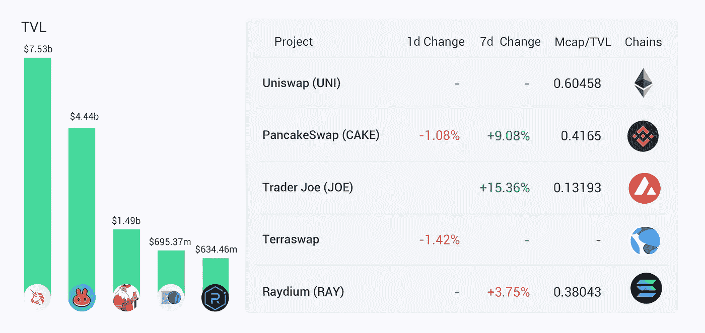

# DeFi Insight |奥林匹克道的经济分析；利多为多边形；AC 表示，稳定的资金是安全的

> 原文：<https://medium.com/coinmonks/defi-insight-economic-analysis-of-olympusdao-lido-for-polygon-ac-stated-that-solid-funds-are-57e237daf183?source=collection_archive---------33----------------------->

## 2022 年 3 月 3 日

*今日 DeFi 数据&由 DeFi Insight 为您带来的新闻。*

**宏观趋势:**耶伦称财政部将[监控加密](https://decrypt.co/94273/yellen-treasury-monitor-crypto-sanctions-evasion)，其他规避制裁的渠道

**TVL 动向:**目前全网 [DeFi](https://defillama.com/) 总锁定量为 2070 亿美元，24 小时内下降 0.91%。

**稳定币:**圈子里的 [USDC 稳定币](https://www.coindesk.com/markets/2022/02/28/circles-usdc-stablecoin-hits-50b-in-circulation/)发行量达到 500 亿美元

# 最新消息

## 定义

南森:9，764 名用户在过去 7 天内将 27.4 亿美元的资产[跨链至 Fantom](https://pro.nansen.ai/multichain/fantom)

CoinShares:数字资产[资金流](/coinshares/volume-68-digital-asset-fund-flows-weekly-report-5fc7bcf65672)周报

*[阿卡姆资本](https://finance.yahoo.com/news/arcanum-capitals-first-fund-closes-140000110.html?guccounter=2&guce_referrer=aHR0cDovL3d3dy50aGVibG9ja2JlYXRzLmluZm8v&guce_referrer_sig=AQAAAFvj0Z6hSYq0zIM64Nvlm750Sj6TFkQQSjNs5Dd6eJ5HinDUMoIVNE4iP8ZQt_3V3SkcWU_dD6ClFstJ_l84iwpollsDOlB7pJ_SEMdElNevksd4TSfGeKV3TSNFOyERKHm8WgN7xngDD9lTKObh6KOu6b_nju9H_mupRfupU63R)首只基金收盘超额认购；投资者包括 Draper University Ventures、Polygon 的 Sandeep Nailwal 和瑞士资产管理公司 Tavis Digital

## 协议

[Evmos](https://twitter.com/EvmosOrg/status/1499119032284246019) 宣布 mainnet 正式上线，空投将陆续发布

*[阿尔格兰德基金会](/algodao-fi/algorand-foundation-joins-algodaos-seed-round-as-strategic-investor-bdbac9952840)作为战略投资者加入阿尔戈道的种子轮

AdaSwap 将推出下一代 Cardano DEX，募集 260 万美元资金

Andre Cronje 声称稳定的资金是安全的

## 借出

*[让步协议](/yield-protocol/yield-protocol-launches-on-arbitrum-31b6d8dd564)在 Arbitrum 上启动

## 互换

*[BENQI 的](https://twitter.com/BenqiFinance/status/1499051930064400384) Liquid Staking App 现已与比特币基地钱包整合

## 打桩

[多边形](https://blog.lido.fi/lido-for-polygon/)的利多

*[Acala](/acalanetwork/acala-launches-initial-aca-staking-program-leveraging-aca-buybacks-with-network-owned-staking-c52819f37fd6)启动初始 ACA 赌注计划，利用网络自有赌注奖励进行 ACA 回购

Saber 在采石场启动 FRAX-UST 三产农场

# 数据和分析

## TVL 和 ATH 排名前六的连锁酒店对比

## 最新 TVL 十大项目

## 过去 24 小时 TVL 变化的前 10 个项目

## 德克斯 TVL 排名

*DEX 跌幅最大的是 T*[*erras WAP*](https://defillama.com/protocol/terraswap)*，损失了 1.42%*

## APY DeFi 贷款公司

*USDC:最高贷款人:索伦德，利率为 3.75% APY*

*USDT:最高贷款人:索伦德，利率为 4.68% APY*

## 稳定的 APY

# 深潜

奥林巴斯道:一个经济分析

【**[**DeFi " 2.0 "**](https://mirror.xyz/0x43930805dEBbF779fB8EDC8E43f988A8448Aad63/Jas0-LxKBHMc3CRQjl6QMdj7DZRRXpLQK5BS6dpfY1Y):一部巨著 Copeus——互联网原生增长战略与流动性价值链**

***[**Aave V3 的特性**](https://twitter.com/lifiprotocol/status/1498964406494924802) 及其如何成为多链流动性协议的目标**

**一个 **值得信赖的资源，为一切事物定义****

> **一场回合:**
> 
> **DeFi Insight 是顶级 DeFi 和加密新闻和更新的来源。**
> 
> **提供的信息应被视为发展新闻，而不是投资建议。**

> **加入 Coinmonks [电报频道](https://t.me/coincodecap)和 [Youtube 频道](https://www.youtube.com/c/coinmonks/videos)了解加密交易和投资**

# **另外，阅读**

*   **[CBET 评论](https://coincodecap.com/cbet-casino-review) | [库科恩 vs 比特币基地](https://coincodecap.com/kucoin-vs-coinbase)**
*   **[折叠 App 审核](https://coincodecap.com/fold-app-review) | [Kucoin 交易机器人](/coinmonks/kucoin-trading-bot-automate-your-trades-8cf0ca2138e0) | [Probit 审核](https://coincodecap.com/probit-review)**
*   **[如何匿名购买比特币](https://coincodecap.com/buy-bitcoin-anonymously) | [比特币现金钱包](https://coincodecap.com/bitcoin-cash-wallets)**
*   **[币安 vs FTX](https://coincodecap.com/binance-vs-ftx) | [最佳(SOL)索拉纳钱包](https://coincodecap.com/solana-wallets)**
*   **[比诺莫评论](https://coincodecap.com/binomo-review) | [斯多葛派 vs 3Commas vs TradeSanta](https://coincodecap.com/stoic-vs-3commas-vs-tradesanta)**
*   **[Capital.com 评论](https://coincodecap.com/capital-com-review) | [香港的加密借贷平台](https://coincodecap.com/crypto-lending-hong-kong)**
*   **[如何在 Uniswap 上交换加密？](https://coincodecap.com/swap-crypto-on-uniswap) | [A-Ads 评论](https://coincodecap.com/a-ads-review)**
*   **[WazirX vs CoinDCX vs bit bns](/coinmonks/wazirx-vs-coindcx-vs-bitbns-149f4f19a2f1)|[block fi vs coin loan vs Nexo](/coinmonks/blockfi-vs-coinloan-vs-nexo-cb624635230d)**
*   **[本地比特币审核](/coinmonks/localbitcoins-review-6cc001c6ed56) | [加密货币储蓄账户](https://coincodecap.com/cryptocurrency-savings-accounts)**
*   **什么是融资融券交易**