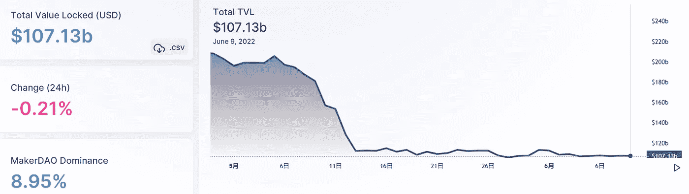
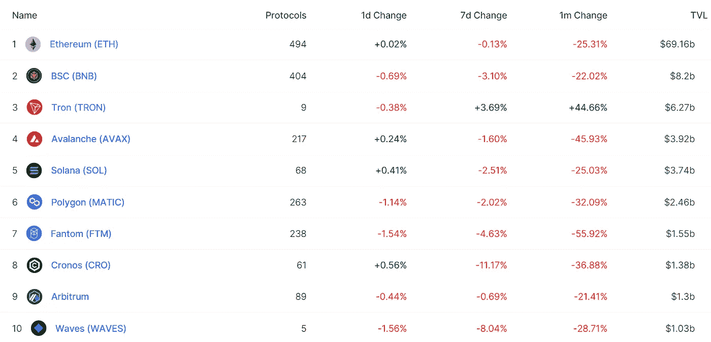
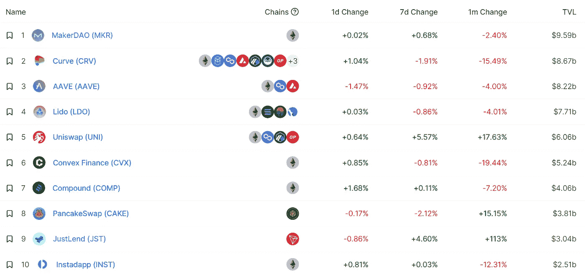
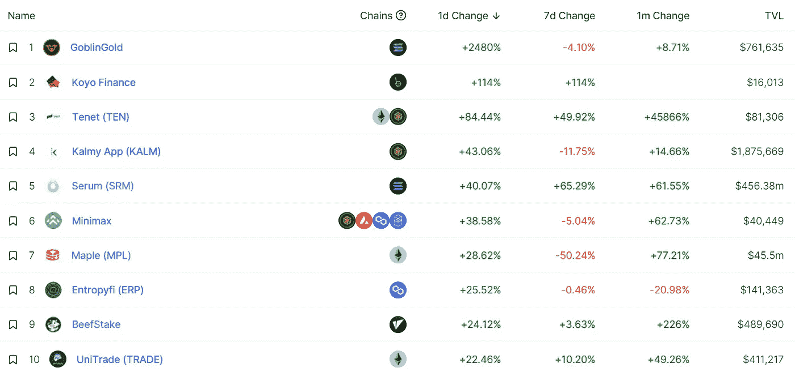
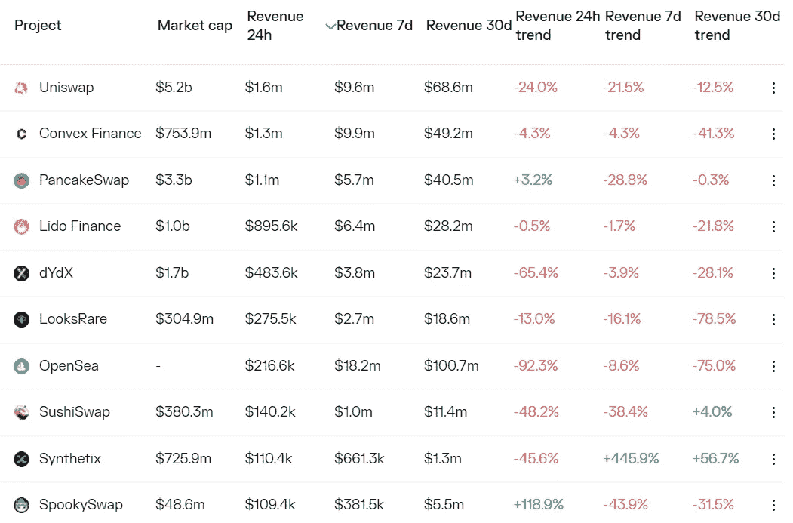
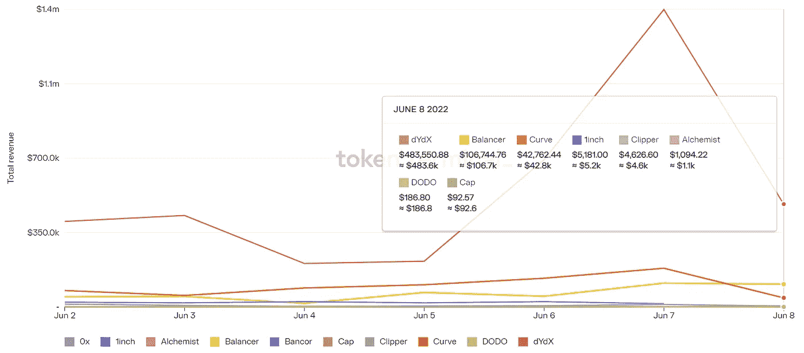
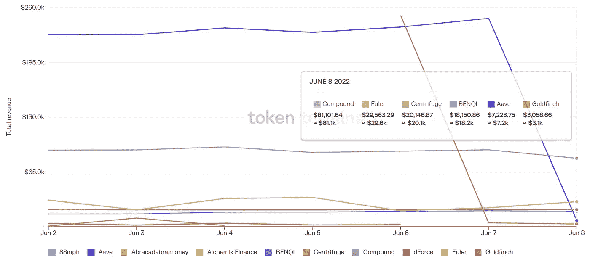

# 完成合并

> 原文：<https://medium.com/coinmonks/defi-insight-ethereum-ropsten-tesnnet-merge-completed-1f985e4a96b3?source=collection_archive---------53----------------------->

2022 年 6 月 9 日

*今日 DeFi 数据&由 DeFi Insight 为您带来的新闻*

> *"* 以太坊 Ropsten testnet 合并于 6 月 8 日 16:00 UTC 左右完成，已从 PoW 移至 PoS。*“@*[*来源*](https://twitter.com/etherchain_org/status/1534568254508875778?s=21&t=SGeuzeF3qEgvn2TLLTFYWg)

# 最新消息

## 贷款

TrueFi 在乐观的基础上推出

## 外汇

**[渗透](https://thedefiant.io/osmosis-5m-exploit/)因合同漏洞被剥削 500 万美元**

****[LBank](https://thenewscrypto.com/lbank-exchange-will-list-source-token-srcx-on-june-10-2022/)交易所将于 2022 年 6 月 10 日上市源令牌(SRCX)****

## ****钱包****

******[氦](https://blog.helium.com/helium-wallet-app-now-available-for-download-b25e9c7ebedd)钱包 App 现已提供下载******

## ******空投******

******跳跃协议的空投明天开放认领******

********[堡垒](https://forta.org/blog/fort-airdrop/)空投:是时候保护 Web3 了********

## ******|警报******

******在温特穆特发送了错误的钱包地址后，攻击者偷走了**、**、[价值 1500 万美元的乐观令牌](https://www.coindesk.com/tech/2022/06/09/15m-of-optimism-tokens-stolen-by-an-attacker-after-wintermute-sent-wrong-wallet-address/?utm_medium=referral&utm_source=rss&utm_campaign=headlines)******

## ****政策与法规****

****CFTC 离成为一级密码监督员越来越近****

****执政党称，T42 的加密交易所准备自我监管****

******[日本](https://cfxmagazine.com/japanese-government-reportedly-set-to-freez-stolen-crypto/)政府据称着手冻结被盗密码******

## ******NFT******

********[阿里云](https://coinquora.com/alibaba-cloud-launches-3-nft-market-solutions-for-creators/)面向创作者推出 3 款 NFT 市场解决方案********

******名人在支持一个 [NFT](https://www.bloomberg.com/news/articles/2022-06-08/celebrity-nfts-what-do-justin-bieber-and-madonna-have-to-disclose-to-fans?srnd=cryptocurrencies-v2#xj4y7vzkg) 时对粉丝有责任吗？******

********[法国世家 NFT](https://nulltx.com/new-details-of-french-family-nft-new-hype-nft-collection-of-french-montana/) 的新细节********

********[安东尼·霍普金斯](https://decrypt.co/102370/anthony-hopkins-adopts-ethereum-name-asks-snoop-for-nft-buying-advice)用以太坊的名字，问史努比狗狗要买什么 NFT********

********[我们遏制欺诈和剽窃的努力——下一步是什么](https://opensea.io/blog/announcements/our-efforts-to-curb-fraud-and-plagiarism-and-whats-next/)********

## ******基金******

******Felix Capital 筹集了 6 亿美元用于加密和 Web3 投资******

******索拉纳启动 1 亿美元基金吸引韩国的加密项目******

******越南获得 600 万美元为 GameFi 开发基础软件******

******来见见这位跨性别的无政府主义创始人，他刚刚获得了 2500 万美元来改革密码的存储方式******

## ******观点******

******银河公司的 T2 迈克·诺沃格拉茨说三分之二的加密对冲基金将会失败******

## ******数据和分析******

## ******锁定的总价值(TVL)******

******目前全网 DeFi 总锁定量为 1056 亿美元，24 小时下降 1.87%。******

************

## ******TVL 评出的十大连锁酒店******

************

## ******|最新 TVL 十大项目******

************

## ******|过去 24 小时内 TVL 增长的前 10 个项目******

************

## ******协议收入******

## ******|累计总收入最高的项目(24H) _Dapps (L2)******

************

## ******|前 10 大交易所的每日收入******

************

## ******|十大贷款协议的每日收入******

************

# ******深潜******

********[**企业区块链**](https://newsletter.banklesshq.com/p/enterprise-blockchain-isnt-boring?utm_source=%2Finbox&utm_medium=reader2&s=r) **不无聊**********

**** [## 企业区块链不无聊

### 使用 MetaMask，您现在可以在浏览器扩展和移动应用程序中跨 6 个不同的平台一步购买您的加密

newsletter.banklesshq.com](https://newsletter.banklesshq.com/p/enterprise-blockchain-isnt-boring?utm_source=%2Finbox&utm_medium=reader2&s=r) 

**[**加密独角兽**](https://www.theblockresearch.com/crypto-unicorn-game-design-analysis-149987) **:游戏设计分析****

** [## 加密独角兽:游戏设计分析

### 2022 年 6 月 8 日上午 10:27 美国东部时间快速采取加密独角兽是一个多边形为基础的农业模拟游戏由拉古纳游戏。比如…

www.theblockresearch.com](https://www.theblockresearch.com/crypto-unicorn-game-design-analysis-149987) 

**[**如何**](https://coinpedia.org/news/activity-on-anchor-protocol-to-come-to-a-halt-after-ust-meltdown/) **在月球和 UST 崩溃后，稳定的版图正在变得多样化****

** [## UST 核泄漏后，锚协议的活动停止

### Terra 最大的 DeFi 平台 Anchor Protocol 已经建议屏蔽 Anchor Earn 和借款服务来保护…

coinpedia.org](https://coinpedia.org/news/activity-on-anchor-protocol-to-come-to-a-halt-after-ust-meltdown/) 

**为股权凭证(PoS)资产的令牌化衍生工具创造效用是 DeFi 增长的** [**关键**](https://dailyhodl.com/2022/06/08/creating-utility-for-tokenized-derivatives-of-proof-of-stake-pos-assets-is-critical-for-defis-growth/)

** [## 为股权证明(PoS)资产的令牌化衍生品创造效用对于 DeFi 的…

### 两个重大事件定义了加密和更广泛的区块链驱动的行业的增长。首先是…

dailyhodl.com](https://dailyhodl.com/2022/06/08/creating-utility-for-tokenized-derivatives-of-proof-of-stake-pos-assets-is-critical-for-defis-growth/) 

**[**弗洛基伊努支付**](https://www.bsc.news/post/floki-inu-payments-how-can-they-boost-businesses) **:他们如何促进商业？****

** [## Floki Inu 支付:它们如何促进商业发展？

### Floki Inu 支付允许商家以一种简单的方式接受 Floki 加密货币形式的商品或服务资金

www.bsc.news](https://www.bsc.news/post/floki-inu-payments-how-can-they-boost-businesses)** 

# **报告**

****[**数字借贷**](https://www.cbinsights.com/research/report/digital-lending-trends-q1-2022/)**Q1 22 年报告** _cbinsights****

> ****全球数字贷款融资环比仅下降 4%——尽管整个风险市场普遍低迷，但仍保持强劲。****
> 
> ****在我们的《Q1 数字借贷状况 22》报告中，我们深入探讨了全球投资趋势，重点关注以下几点:****
> 
> ****见证了创纪录交易活动的地区全球并购复苏，季度环比增长 63%,独角兽数量、独角兽诞生趋势和新的数字借贷独角兽 Q1 22 年数字借贷初创公司的最大投资者，该地区融资大幅反弹，季度环比增长 56%,等等****

******[**FTX**](https://members.delphidigital.io/reports/ftx-overtakes-coinbase-tarot-optimism-pools-decentralized-derivatives)**赶超比特币基地，塔罗乐观池，分散衍生品** _delphidigital******

******新 Dapps 报道:** [**妖精镇**](https://dappradar.com/blog/new-dapps-report-goblin-town-defying-tradition-and-the-bear-market) **—藐视传统与熊市** _dappradar****

******[**阿卡什**](https://messari.io/article/akash-solving-web3-s-centralization-problems) **:解决 Web3 的中心化问题**_ 梅萨里******

******[**索拉纳项目收入**](https://mirror.xyz/0x9b7e7c5B53081d0C6d09b91F13783D58B772b011/HPAIBTx2Pra2oR6dg3uJTWR2wmhEt6hzcJuWum_JLxA) **周报 2022 年 6 月 9 日********

******关于:******

****DeFi Insight 是顶级 DeFi 和加密新闻和更新的来源。****

******https://twitter.com/AlphaPro_io 推特:******

********❤RSS:**[**https://medium.com/feed/@alphapro.project**](https://medium.com/feed/@alphapro.project)******

****提供的信息应被视为发展新闻，而不是投资建议。****

> ****加入 Coinmonks [Telegram group](https://t.me/joinchat/Trz8jaxd6xEsBI4p) 学习加密交易和投资**************