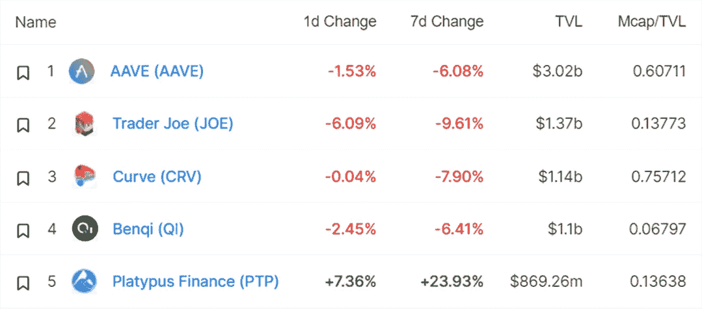

# DeFi Insight |以太坊 2021 年获得超 100 亿美元现金流；Andre Cronje 坚决否认安全问题，DeFi 协议达到 224 亿美元 TVL

> 原文：<https://medium.com/coinmonks/defi-insight-ethereum-to-get-over-10-billion-in-cash-flow-in-2021-andre-cronje-denies-solidly-14f582a3a5ec?source=collection_archive---------21----------------------->

## 2022 年 2 月 28 日

*今日 DeFi 数据&由 DeFi Insight 为您带来的新闻。*

**宏观趋势:** SBF: FTX 欢迎欧洲[数字资产](https://twitter.com/SBF_FTX/status/1498048713406648321)强有力的监管框架

**TVL 走势:**价值锁定德菲受到打击， [TVL 在 24 小时内下跌 3.89%](https://defillama.com/)

**DEX 动态:***DEX 跌幅最大的是* [乔氏](https://defillama.com/protocol/trader-joe) *，跌了 6.09%*

**stable coin:**[Frax Finance](https://www.aliens.com/livenews/latest/frax-finance-invests-in-anzen-and-renaissance-labs-via-community-proposal)通过社区提案投资 Anzen 和 Renaissance Labs

# 最新消息

## 定义

Messari:以太坊将在 2021 年获得超过 100 亿美元的现金流

南森标记了超过 1 亿个钱包，其中只有 4.55 万个(~0.0046%)是[智能货币](https://twitter.com/nansen_ai/status/1497808926414295041)

## 互换

以太坊 2.0 流动性赌注协议[火箭池](https://twitter.com/Rocket_Pool/status/1498119814363041792)的 ETH 赌注超过 100，000

## 协议

Andre Cronje 的新项目[稳稳地](https://defillama.com/protocol/solidly)总锁定超过 20 亿

Panther 宣布实施其[多边形包](https://blog.pantherprotocol.io/moving-to-polygon-1cf95ddb1aa6)

与 [DeFi wallet Frontier](https://smartliquidity.info/2022/02/25/pontoon-partners-with-frontier/) 的跨链流动性协议浮桥合作伙伴

*[Evmos](https://twitter.com/EvmosOrg/status/1498091200267444225)宣布将 mainnet 上线时间推迟至 3 月 3 日，额外增加 2000 万次代币空投

# 数据和分析

## 锁定的总价值(TVL)

## TVL 的六大连锁品牌

*哪些*链/协议*当前将最多的资产存放在它们的智能合约中？*

> TVL 的五大协议

> **# Fantom**TVL 五大协议

> **# Terra**TVL 五大协议

> **# BNB**TVL 的五大协议

> **# Avalanche**TVL 的五大协议

> TVL 的五大协议

## 德克斯 TVL 排名

*DEX 跌幅最大的是* [乔氏](https://defillama.com/protocol/trader-joe) *，跌了 6.09%*

## APY DeFi 贷款公司

*USDC:最高贷款人:索伦德，利率为 3.84% APY*

USDT:最高贷款人:索伦德，利率为 4.11% APY

## APY 稳定币

# 深潜

就 Sifu、ZetaZeroes 和 [DeFi 危险的未来](https://fbifemboy.substack.com/p/interviewing-tuba-on-sifu-zetazeroes?utm_source=url)采访 tuba

 [## 就 Sifu，ZetaZeroes 和 DeFi 的危险未来采访 tuba

### 我非常高兴能够采访到卓越建筑商心理战资本的首席执行官 tuba，就一个…

fbifemboy.substack.com](https://fbifemboy.substack.com/p/interviewing-tuba-on-sifu-zetazeroes?utm_source=url) 

机构投资者与散户[投资者](https://twitter.com/BowTiedNightOwl/status/1497942100528099332)

# 研究

***重新评估加密货币为风险资产类别***[**messari . io**](https://messari.io/article/re-evaluating-cryptocurrency-as-a-risky-asset-class)

虽然自 2008 年比特币白皮书发布以来，加密行业的参与者一直认为这种资产类别是主流，但金融界需要一段时间来适应。我们现在看到比特币和以太坊与其他所有主要资产一起出现在每日价格报价器上，甚至是在主要市场波动期间被提及的少数几个项目之一。

**TI 评级报告:标签基础***[**token insight**](https://tokeninsight.com/en/report/2911)

L ABEL Foundation 是建立在以太坊和 BNB 链(原 BSC)上的 P2P 孵化和 NFT 基础设施。它旨在建立一个利润分享生态系统，帮助内容创作者将他们的知识产权货币化，而没有中间人的负担。LBL 是该项目的效用和治理象征。

一个 **值得信赖的资源，为一切事物定义**

> 一场回合:
> 
> DeFi Insight 是顶级 DeFi 和加密新闻和更新的来源。
> 
> 提供的信息应被视为发展新闻，而不是投资建议。

> 加入 Coinmonks [电报频道](https://t.me/coincodecap)和 [Youtube 频道](https://www.youtube.com/c/coinmonks/videos)了解加密交易和投资

# 另外，阅读

*   [NFT 十大市场造币集锦](https://coincodecap.com/nft-marketplaces)
*   [AscendEx Staking](https://coincodecap.com/ascendex-staking)|[Bot Ocean Review](https://coincodecap.com/bot-ocean-review)|[最佳比特币钱包](https://coincodecap.com/bitcoin-wallets-india)
*   [Bitget 回顾](https://coincodecap.com/bitget-review)|[Gemini vs block fi](https://coincodecap.com/gemini-vs-blockfi)|[OKEx 期货交易](https://coincodecap.com/okex-futures-trading)
*   [美国最佳加密交易机器人](https://coincodecap.com/crypto-trading-bots-in-the-us) | [变化回顾](https://coincodecap.com/changelly-review)
*   [在印度利用加密套利赚取被动收入](https://coincodecap.com/crypto-arbitrage-in-india)
*   [霍比评论](https://coincodecap.com/huobi-review) | [OKEx 保证金交易](https://coincodecap.com/okex-margin-trading) | [期货交易](https://coincodecap.com/futures-trading)
*   [麻雀交换评论](https://coincodecap.com/sparrow-exchange-review) | [纳什交换评论](https://coincodecap.com/nash-exchange-review)