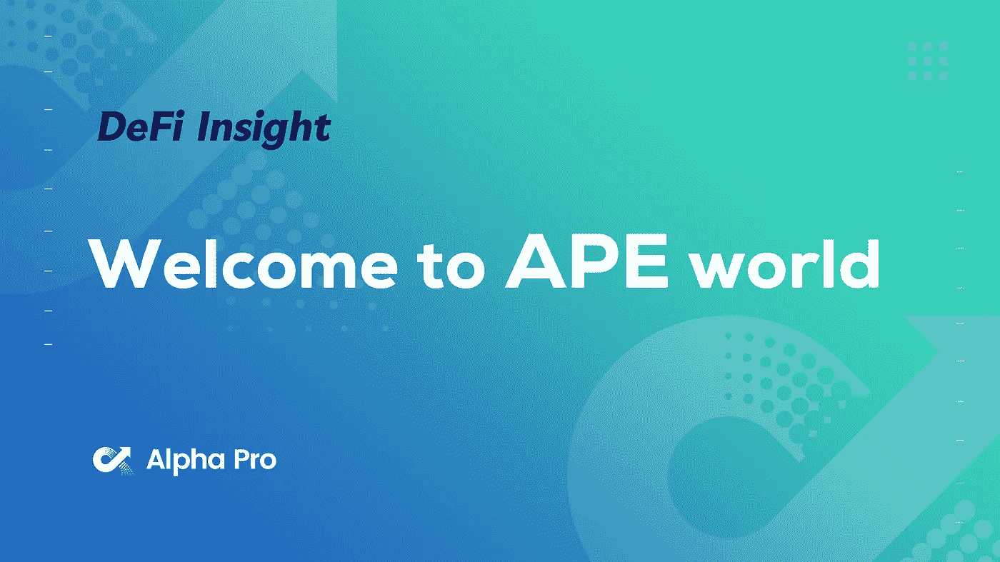
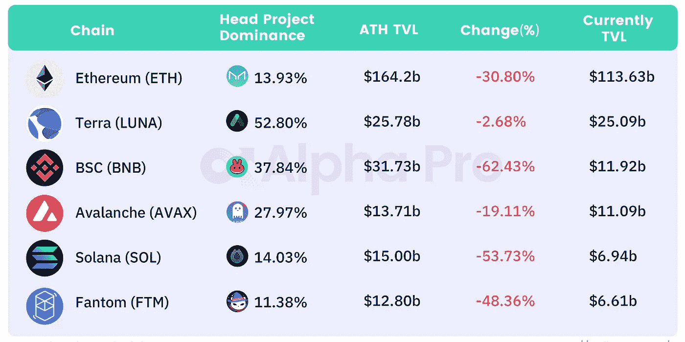
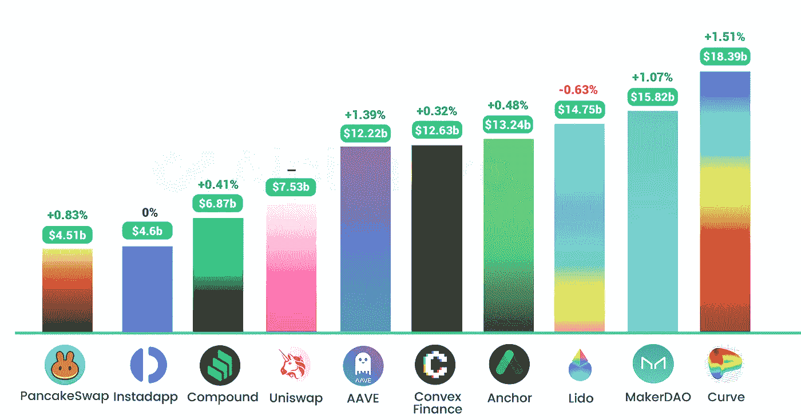
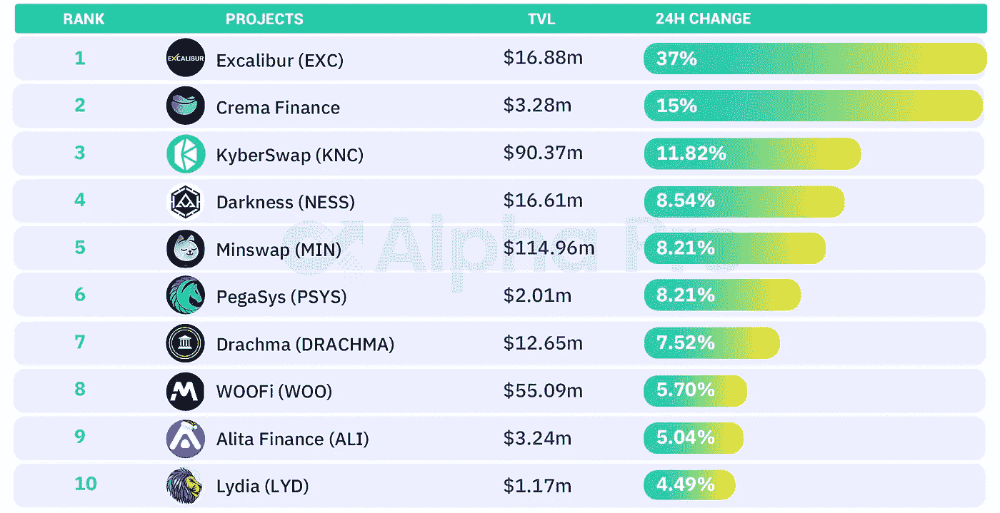
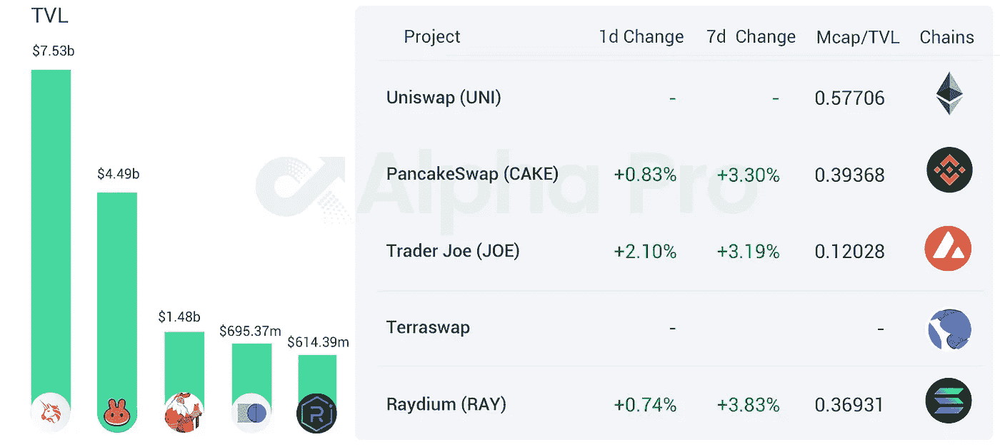
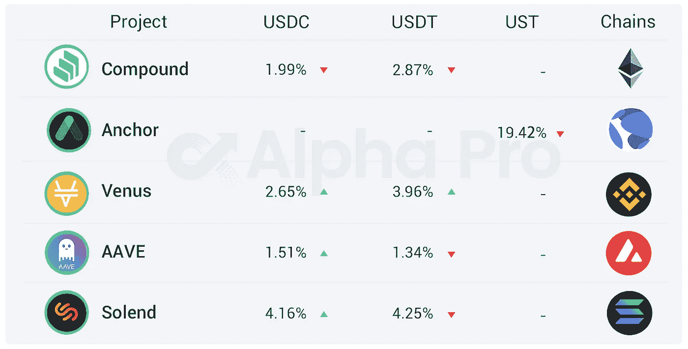

# DeFi Insight |每个人都为‘ape coin’而疯狂；Terra:不止是 stablecoins 部落被低估了吗？

> 原文：<https://medium.com/coinmonks/defi-insight-everybody-is-mad-about-apecoin-terra-more-than-stablecoins-is-tribe-7dec645f11a3?source=collection_archive---------9----------------------->

## 2022 年 3 月 18 日

*今日 DeFi 数据&由 DeFi Insight 为您带来的新闻。*

**宏观趋势:**彭博分析师:[比特币](https://finbold.com/commodity-expert-says-bitcoin-likely-to-continue-outperforming-gold-stock-market/)将继续跑赢黄金和股票

**TVL 动向:**目前整个网络上 [DeFi](https://defillama.com/) 的锁定总量为 2050 亿美元，24 小时增长 0.05%

**Stablecoin:** [UXD 协议](https://uxdprotocol.medium.com/introducing-verev-a-yield-distribution-mechanism-c9243fbbfe3e):引入 veRev —一种收益分配机制

# 最新消息

## |热—— [猿](https://twitter.com/apecoin)💥

TLDR:什么是 ApeCoin？梅萨里

欢迎来到猿类世界

每个人都为“ApeCoin”疯狂

**、**有人如何通过 Flashloan 从 [ApeCoin 的空投](https://cryptopotato.com/how-someone-made-820k-from-apecoins-airdrop-via-flashloan/)中赚到 82 万美元

**SBF 钱包地址转账[17.2 万猿](https://app.zerion.io/0x0f4ee9631f4be0a63756515141281a3e2b293bbe/history)到币安账户**

## **定义**

**参议员沃伦宣布针对加密公司的制裁合规法案**

***[币安智能链](https://beincrypto.com/binance-smart-chain-surpassed-ethereum-transactions-120m-february/)2 月交易量超过以太坊 1.2 亿英镑**

**币安称安大略省的用户被限制使用其平台**

**Paradigm 和 a16z back Ethereum scaling 初创公司[乐观](https://techcrunch.com/2022/03/17/paradigm-and-a16z-back-ethereum-scaling-startup-optimism-at-1-65b-valuation/?tpcc=tcplustwitter)估值 16.5 亿美元**

**[以太坊第二层](https://l2beat.com/projects/zksync/)的 TVL 超过 60 亿美元**

**EIP-4626 通过了以太坊开发团队的审查**

**南森为 Terra 增加了链上[分析](https://pro.nansen.ai/multichain/terra)**

**比特币基地钱包增加对[索拉纳](https://www.theblockcrypto.com/linked/138287/coinbase-wallet-adds-support-for-solana)的支持**

## **协议**

**以太坊的第二层扩展解决方案 [zkSync](https://l2beat.com/projects/zksync/) 锁定超过 1.32 亿美元，创历史新高**

**与 Axelar 合作整合新 EVM 区块链**

**龙卷风。现金清单[流量](https://twitter.com/RunOnFlux/status/1504495391408017413)**

**Zerion 开始对[多链掉期](https://twitter.com/zerion_io/status/1504457354548555780?s=20&t=lV9qddA3KOwcjyJaNVrlGQ)收费**

**引入漩涡:奥卡的集中流动性**

***[Solidit](https://twitter.com/solidity_lang/status/1504162965301436418)y 发布 0.8.13 版本，修复了与 abi.encodeCall 相关的关键 bug**

**更好的扩展到乐观、武断和雪崩**

***[meta mask](https://twitter.com/MetaMask/status/1504514470428688389?s=20&t=WSSXjmAxeZKBcxSj27PUmw)发布浏览器插件钱包的 v10.11.1 更新**

**Diphda 版本—永久期货和[债务池综合](https://blog.synthetix.io/the-diphda-release/)**

***[times WAP](https://twitter.com/TimeswapLabs/status/1504493761828732930):Mainnet 于世界协调时 3 月 21 日下午 4:00 @ 0x polygon 发布**

***[血清](https://projectserum.medium.com/project-serum-announces-500k-ecosystem-prize-for-development-of-a-cross-chain-exchange-1c2b16a791ca)为跨链交易推出 50 万美元奖励**

## **贷款**

**凯蒂·焕的新基金加入了 1000 万美元的波尔卡多特贷款协议[月亮井](https://www.coindesk.com/business/2022/03/17/katie-hauns-new-fund-joins-10m-round-for-polkadot-lending-protocol-moonwell/)**

## **鲸鱼**

**鲸鱼在两个月内积累了价值超过 1000 万美元的 AAVE**

# **数据和分析**

## **TVL 和 ATH 排名前六的连锁酒店对比**

****

**Source:[https://defillama.com/](https://defillama.com/)**

## **最新 TVL 十大项目**

****

**Source:[https://defillama.com/chains](https://defillama.com/chains)**

## **过去 24 小时 TVL 变化的前 10 个项目**

****

**Source: [https://defillama.com/](https://defillama.com/) Projects TVL≥1m**

## **德克斯 TVL 排名**

**DEX 指数中涨幅最大的是 Trader Joe，上涨了 2.10%**

****

**Source: [https://defillama.com/protocols/Dexes](https://defillama.com/protocols/Dexes)**

## **APY DeFi 贷款公司**

***USDC:最高贷款人:索伦德，利率为 4.16% APY***

***USDT:最高贷款人:索伦德，利率为 4.25% APY***

****

# **深潜**

****[**部落**](https://newsletter.banklesshq.com/p/is-tribe-undervalued?s=r) **是否被低估？******

**** [## 部落被低估了吗？

### 亲爱的无银行国家，几个月前，费协议和 Rari 资本做了一个…

newsletter.banklesshq.com](https://newsletter.banklesshq.com/p/is-tribe-undervalued?s=r) 

**下面的全层**

**** [## 下面的全向层

### 如果你读过我以前的任何一篇文章，那么我可能已经说得很清楚了，我们生活在一个多链条中…

rainandcoffee.substack.com](https://rainandcoffee.substack.com/p/the-omni-layer-underneath?s=r) 

**[**TradFi to DeFi**](https://defieducation.substack.com/p/tradfi-to-defi-personal-update?s=r)**:个人更新****

** [## TradFi to DeFi:个人更新

### 欢迎头像！今天，我们从我们的常规帖子中抽出一点时间，为您提供我们的一个…

defieducation.substack.com](https://defieducation.substack.com/p/tradfi-to-defi-personal-update?s=r) 

**[**Crypto**](https://denze.substack.com/p/crypto-protects-our-ability-to-transact?s=r)**保护我们的交易能力****

** [## 加密保护我们的交易能力

### 秘密兔子洞是一个让我放慢脚步，更密切地关注正在发生的事情和我正在学习的东西的空间…

denze.substack.com](https://denze.substack.com/p/crypto-protects-our-ability-to-transact?s=r) 

**[**密码分析师**](https://twitter.com/0xWangarian/status/1504652748276441091?s=20&t=kQ9igNR3ak5pMFqknYfuNA) 的反思**** 

# ****报告****

******[**Terra**](https://twitter.com/terra_money)**:超过**[**stable coins**](https://www.nansen.ai/research/terra-more-than-stablecoins)******

> ****一个真正去中心化的世界需要去中心化的货币。目前，分散融资由集中稳定的信贷支持。这是一个故障点，可能会对使用 DeFi 作为流动性主干的应用程序的整个去中心化生态系统产生级联效应。创建 Terra 是为了提供集中式 stablecoins 的替代方案，其协议已发展成为总锁定价值排名第二的区块链。****

****一场一场**的较量:******

****DeFi Insight 是顶级 DeFi 和加密新闻和更新的来源。****

******https://twitter.com/AlphaPro_io**❤[t27】](https://twitter.com/AlphaPro_io)****

******❤RSS:**[**https://medium.com/feed/@alphapro.project**](https://medium.com/feed/@alphapro.project)****

****提供的信息应被视为发展新闻，而不是投资建议。****

> ****加入 Coinmonks [电报频道](https://t.me/coincodecap)和 [Youtube 频道](https://www.youtube.com/c/coinmonks/videos)了解加密交易和投资****

# ****另外，阅读****

*   ****[如何匿名购买比特币](https://coincodecap.com/buy-bitcoin-anonymously) | [比特币现金钱包](https://coincodecap.com/bitcoin-cash-wallets)****
*   ****[币安 vs FTX](https://coincodecap.com/binance-vs-ftx) | [最佳(SOL)索拉纳钱包](https://coincodecap.com/solana-wallets)****
*   ****[比诺莫评论](https://coincodecap.com/binomo-review) | [斯多葛派 vs 3Commas vs TradeSanta](https://coincodecap.com/stoic-vs-3commas-vs-tradesanta)****
*   ****【Capital.com】|[港加密借贷平台](https://coincodecap.com/crypto-lending-hong-kong)****
*   ****[如何在 Uniswap 上交换加密？](https://coincodecap.com/swap-crypto-on-uniswap) | [A-Ads 评论](https://coincodecap.com/a-ads-review)**************