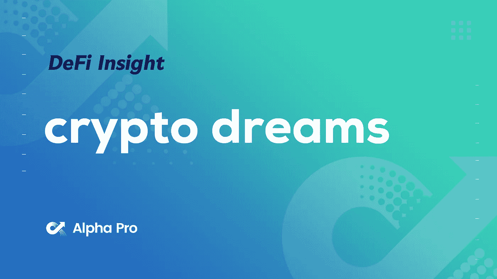
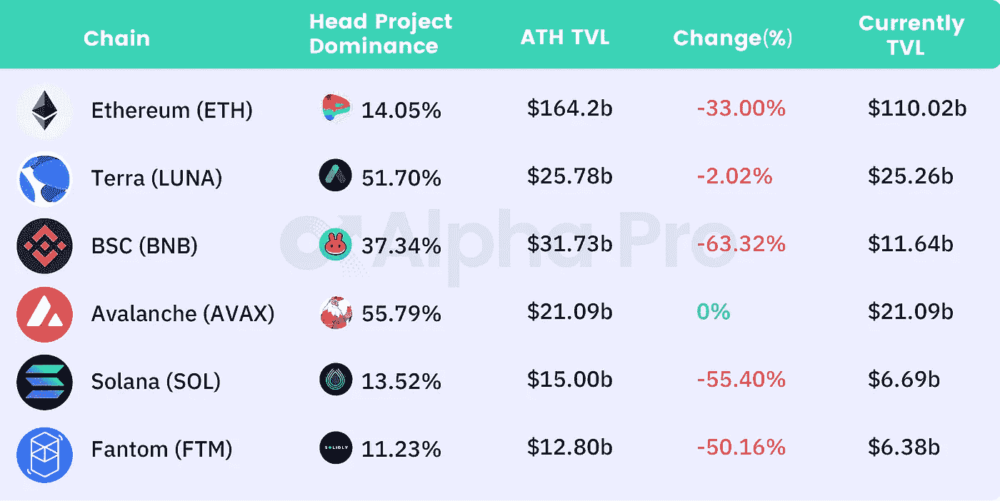
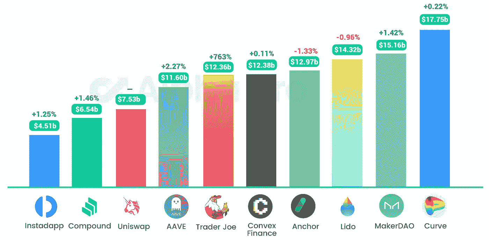
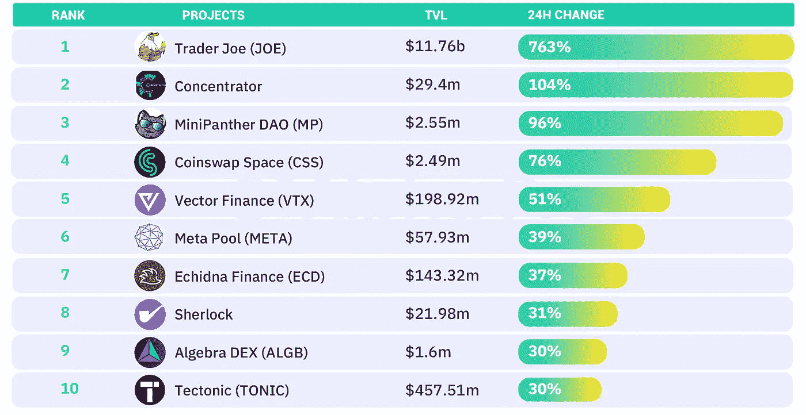
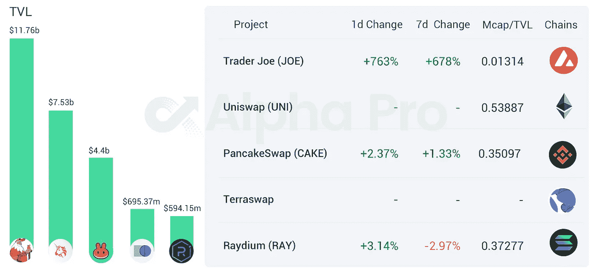
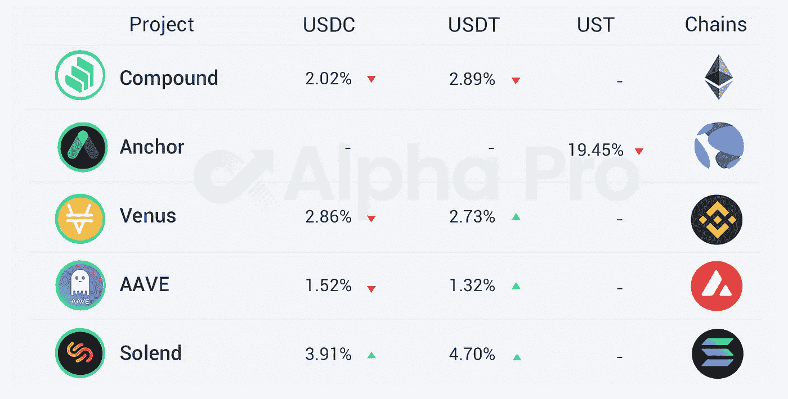

# DeFi Insight |前 Meta 员工从 a16z、Tiger、Multicoin 筹集 2 亿美元，实现脸书的加密梦想

> 原文：<https://medium.com/coinmonks/defi-insight-ex-meta-employees-raise-200m-from-a16z-tiger-multicoin-to-realize-facebooks-2663d3037e33?source=collection_archive---------50----------------------->

## 2022 年 3 月 16 日

*今日 DeFi 数据&由 DeFi Insight 为您带来的新闻。*

**宏观趋势:**比特币被定位于帮助政府创造[更便宜的中央银行](https://cointelegraph.com/news/bitcoin-well-positioned-to-help-governments-create-cheaper-cbdcs-deloitte):德勤

**TVL 动向:**目前全网 [DeFi](https://defillama.com/) 总锁定量为 2124.4 亿美元，24 小时增长 6.94%

**Stablecoin:** LFG 议会已经投票决定再焚烧 400 万辆 luna 来造币

# 最新消息

## 定义

前 Meta 员工从 a16z、Tiger、Multicoin 筹集 2 亿美元，实现脸书的[加密梦想](https://techcrunch.com/2022/03/15/aptos-labs-a16z-multicoin-facebook-diem-blockchain/?guccounter=1)

奥本海默说，比特币基地在风险投资业务中有“隐藏价值”

Luno 启动投资部门，每年支持超过 200 家金融科技和加密/网络 3 初创公司

## 协议

索拉纳工资协议[泽贝奇通过代币销售筹集](https://www.coindesk.com/business/2022/03/15/payroll-protocol-zebec-raises-28m-in-token-sales/)2800 万美元

DeFi 投资分析平台 [Treehouse](https://twitter.com/TreehouseFi/status/1503924057208545282?s=20&t=qdyvfNZElW_OAIFP7t4DrQ) 完成 1800 万美元的种子期

合成资产协议[浮动资本](https://www.theblockbeats.info/flash/71885)完成 500 万美元种子轮

加密储蓄初创公司 [finblox](https://twitter.com/finblox/status/1503668903679229955) 完成 390 万美元的种子轮融资

SushiSwap 的新 AMM 协议 [Trident Beta](https://sushichef.medium.com/launching-trident-phase-1-4e483fad0ae4) 在 Polygon 上发布

液态打桩协议[粘土堆](https://twitter.com/ClayStack_HQ/status/1503961213847609345?s=20&t=YvwGc4op-Ueo3FAJvRkmUA)宣布多边形列表

DeFi 协议[阿尔法·霍莫拉·V2](https://twitter.com/AlphaFinanceLab/status/1503712335424196610?s=20&t=QXtK1KTQ6sF4DeLuh0T2KQ)已经在凡托姆启动

比特币投资协议 [Citadel DAO](https://twitter.com/TheCitadel_DAO/status/1503744907588120586?s=20&t=YvwGc4op-Ueo3FAJvRkmUA) 宣布其代币经济

GetBlock 开始提供对 [Arbitrum 节点 API](https://getblock.io/blog/getblock-starts-providing-access-to-arbitrum-nodes-apis-details/)的访问

## 贷款

为一种新的贷款协议筹集了 390 万美元

DeFi lending protocol[Alchemix](https://twitter.com/scupytrooples/status/1503751703019110410?s=20&t=YkMG-rHS2LII6-0JSH2t7A)宣布发布 v2 版本，用户可以自定义收入聚合器

## 指标

DEX aggregator [ParaSwap](https://twitter.com/paraswap/status/1503767849659248644) 将全面启动对赌注者的气体退款

DEX aggregator [Matcha](https://www.theblockcrypto.com/linked/137962/dex-aggregator-matcha-geoblocks-trades-from-russia) 已经禁止俄罗斯地区的交易

## |警报

[百财和龙舌](https://twitter.com/HundredFinance/status/1503754916300476420)遭遇闪贷袭击，损失 1100 多万美元

## 空投

*[EVNS](https://evmosns.medium.com/evns-airdrop-and-rewards-19de0f807537)空投和奖励

# 数据和分析

## TVL 和 ATH 排名前六的连锁酒店对比

## 最新 TVL 十大项目

## 过去 24 小时 TVL 变化的前 10 个项目

## 德克斯 TVL 排名

DEX 指数中涨幅最大的是交易员乔 T21，上涨了 763%

## APY DeFi 贷款公司

*USDC:最高贷款人:索伦德，利率为 3.91% APY*

*USDT:最高贷款人:索伦德，利率为 4.70% APY*

# 深潜

**[**记号组学**](https://mirror.xyz/0x1e35A719f1d68da02DEf39Bde510c9cc4efDC84B/qe5TdeXrnT8OuuQobQN7kZLhsnQQb92ypSuKyznBlsc) **思考:ve 记号与替代****

** [## 记号组学思考:ve 记号和替代物

### 象征性的投票锁定已经流行了一段时间了。由 Curve、Ribbon、向往等协议开创

镜像. xyz](https://mirror.xyz/0x1e35A719f1d68da02DEf39Bde510c9cc4efDC84B/qe5TdeXrnT8OuuQobQN7kZLhsnQQb92ypSuKyznBlsc) 

**[**天使金库**](/@GoldenbergLior/breaking-down-angel-vaults-eb3659e5b7b3)**

** [## 分解天使金库

### 这是一个疯狂的密码夏天，围绕流动性和资金管理出现了大量创新。奥林普斯普罗，托克马克和…

medium.com](/@GoldenbergLior/breaking-down-angel-vaults-eb3659e5b7b3) 

**解冻** [**资金**](https://wrongalot.substack.com/p/unfollow-the-money?s=r)

 [## 解冻资金

### 最近种子期估值和融资的上升在某种程度上可能是通胀的作用，但也是一个…

wrongalot.substack.com](https://wrongalot.substack.com/p/unfollow-the-money?s=r) 

**[**Mars 协议**](https://consensys.net/blog/cryptoeconomic-research/mars-protocol-decentralized-lending-and-borrowing-on-terra/)**:Terra 上分散借贷****

** [## 火星协议:土地上分散的借贷

### Mars 协议的核心功能是像传统银行一样运作，吸引存款…

consensys.net](https://consensys.net/blog/cryptoeconomic-research/mars-protocol-decentralized-lending-and-borrowing-on-terra/)** 

# **报告**

****[**丽都财经**](https://tokenterminal.substack.com/p/research-series-946?s=r) 的状态****

**** [## 研究系列

### 这是我们研究系列的第二篇文章。在本系列中，我们发布了针对特定领域的数据驱动分析…

tokenterminal.substack.com](https://tokenterminal.substack.com/p/research-series-946?s=r)**** 

****一场比赛:****

****DeFi Insight 是顶级 DeFi 和加密新闻和更新的来源。****

****提供的信息应被视为发展新闻，而不是投资建议。****

> *****加入 Coinmonks* [*电报频道*](https://t.me/coincodecap) *和* [*Youtube 频道*](https://www.youtube.com/c/coinmonks/videos) *了解加密交易和投资*****

# ****另外，阅读****

*   ****[3 商业评论](/coinmonks/3commas-review-an-excellent-crypto-trading-bot-2020-1313a58bec92) | [Pionex 评论](https://coincodecap.com/pionex-review-exchange-with-crypto-trading-bot) | [Coinrule 评论](/coinmonks/coinrule-review-2021-a-beginner-friendly-crypto-trading-bot-daf0504848ba)****
*   ****[莱杰 vs Ngrave](/coinmonks/ledger-vs-ngrave-zero-7e40f0c1d694) | [莱杰 nano s vs x](/coinmonks/ledger-nano-s-vs-x-battery-hardware-price-storage-59a6663fe3b0) | [币安评论](/coinmonks/binance-review-ee10d3bf3b6e)****
*   ****[Bybit Exchange 评论](/coinmonks/bybit-exchange-review-dbd570019b71) | [Bityard 评论](https://coincodecap.com/bityard-reivew) | [Jet-Bot 评论](https://coincodecap.com/jet-bot-review)****
*   ****[3 commas vs crypto hopper](/coinmonks/3commas-vs-pionex-vs-cryptohopper-best-crypto-bot-6a98d2baa203)|[赚取加密利息](/coinmonks/earn-crypto-interest-b10b810fdda3)****
*   ****最好的比特币[硬件钱包](/coinmonks/hardware-wallets-dfa1211730c6) | [BitBox02 回顾](/coinmonks/bitbox02-review-your-swiss-bitcoin-hardware-wallet-c36c88fff29)****
*   ****[BlockFi vs 摄氏](/coinmonks/blockfi-vs-celsius-vs-hodlnaut-8a1cc8c26630) | [Hodlnaut 点评](/coinmonks/hodlnaut-review-best-way-to-hodl-is-to-earn-interest-on-your-bitcoin-6658a8c19edf) | [KuCoin 点评](https://coincodecap.com/kucoin-review)****
*   ****[Bitsgap 审查](/coinmonks/bitsgap-review-a-crypto-trading-bot-that-makes-easy-money-a5d88a336df2) | [Quadency 审查](/coinmonks/quadency-review-a-crypto-trading-automation-platform-3068eaa374e1) | [Bitbns 审查](/coinmonks/bitbns-review-38256a07e161)********