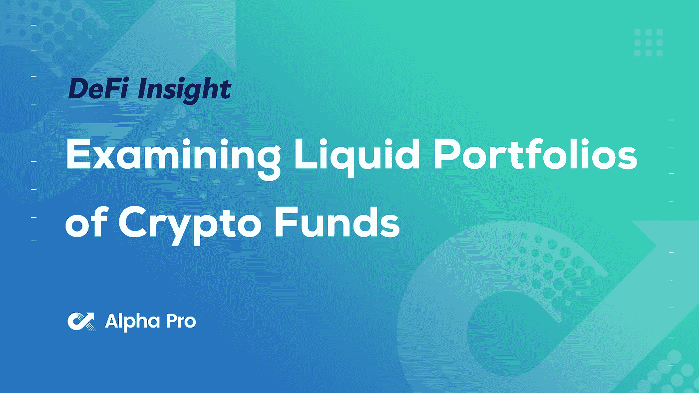
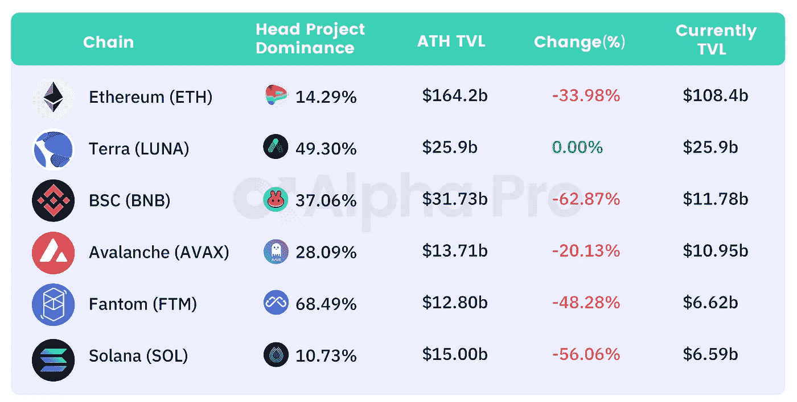
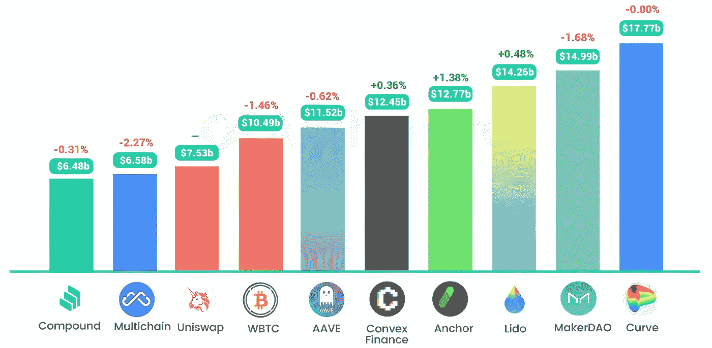
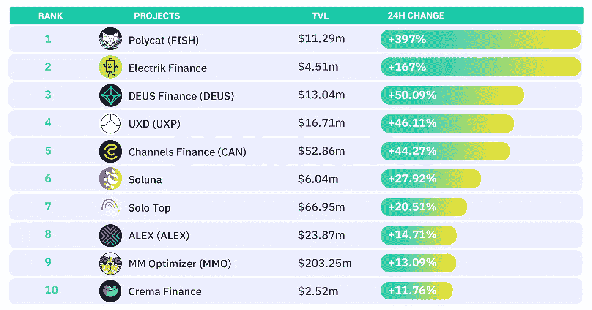
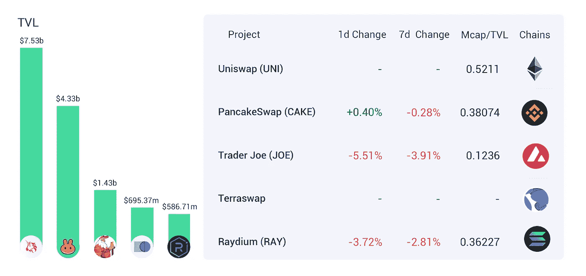
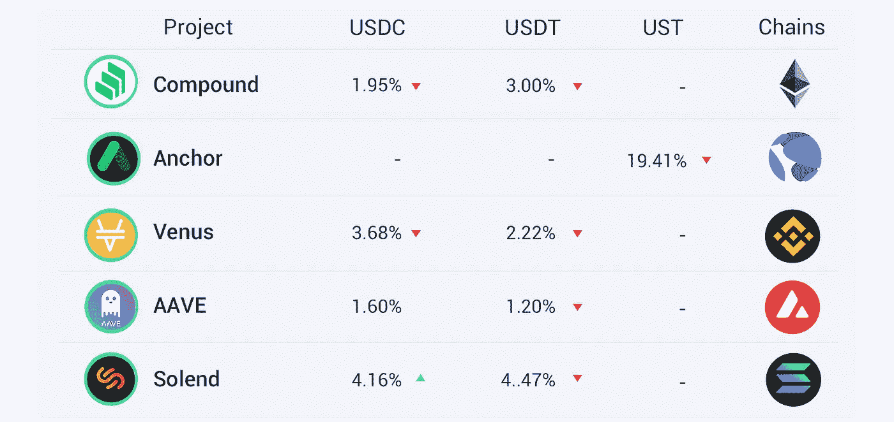
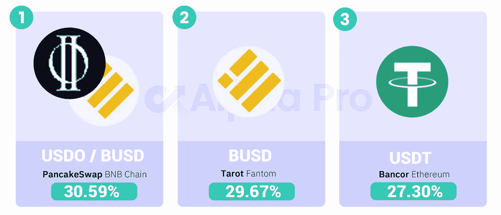

# DeFi Insight |检查加密基金的流动投资组合；锚协议:太大而不能繁荣

> 原文：<https://medium.com/coinmonks/defi-insight-examining-liquid-portfolios-of-crypto-funds-anchor-protocol-too-big-to-thrive-4c96ba22fe56?source=collection_archive---------20----------------------->

## 2022 年 3 月 11 日

*今日 DeFi 数据&由 DeFi Insight 为您带来的新闻。*

**宏观趋势:**美国二月通胀升至 [7.9%，](https://www.coindesk.com/markets/2022/03/10/us-inflation-rises-to-79-in-february-fresh-4-decade-high/)创下 40 年新高

**TVL 动向:**目前全网 [DeFi](https://defillama.com/) 总锁定量为 1990 亿美元，24 小时内下降 2.51%。

在欧洲花掉泰拉的稳定币很快就变得容易了

# 最新消息

## 定义

Okcoin、Stacks 和 More 启动 1.65 亿美元的投资计划，以[推动比特币的采用](https://cointelegraph.com/news/okcoin-launches-165m-collective-investment-to-push-bitcoin-adoption)

CFTC 就 FTX 请求[修订 DCO 登记令](https://www.cftc.gov/PressRoom/PressReleases/8499-22)征询公众意见

*[FTX 选择 Stripe](https://www.coindesk.com/business/2022/03/10/ftx-picks-stripe-to-build-payments-and-risk-mitigation-feature/) 来构建支付和风险缓解功能

## 协议

哈勃交易所筹集 330 万美元将永久期货[推向雪崩](https://decrypt.co/94754/hubble-exchange-raises-3-3m-to-put-perpetual-futures-on-avalanche)

短暂断电后，多边形位置恢复运行

向公众免费提供新的加密制裁监控工具

DeFi 协议[武士刀](https://twitter.com/katana_hq/status/1501964500362223627?s=21)完成由 Framework 牵头的 500 万美元种子轮

分散协议 [Swivel Finance](https://swivel.substack.com/p/swivel-governance-token-genesis?s=r) 推出其治理令牌 SWIV

合成公司正在更新其清算机制

## 稳定币

南森现在免费支持“NFT 指数”和[“稳定币大师”](https://pro.nansen.ai/stablecoin-master)

# 数据和分析

## TVL 和 ATH 排名前六的连锁酒店对比

## 最新 TVL 十大项目

## 过去 24 小时 TVL 变化的前 10 个项目

## 德克斯 TVL 排名

*DEX 跌幅最大的是* [乔氏](https://defillama.com/protocol/trader-joe) *，跌了 5.51%*

## APY DeFi 贷款公司

*USDC:最高贷款人:索伦德，利率为 4.16% APY*

*USDT:最高贷款人:索伦德，利率为 4.47% APY*

## 稳定的 APY

# 深潜

**[**主播协议**](https://dirtroads.substack.com/p/-34-anchor-protocol-too-big-to-thrive?s=r) **:大到不能再大****

** [## # 34 |锚协议:太大而不能茁壮成长

### 我们正生活在一个强烈怀疑的历史时期，被一个旨在推动…

dirtroads.substack.com](https://dirtroads.substack.com/p/-34-anchor-protocol-too-big-to-thrive?s=r) 

**令牌终端研究系列:** [**离心机状态**](https://tokenterminal.substack.com/p/research-series?s=w)

 [## 研究系列

### 这是我们研究系列的第一篇文章。在这个系列中，我们发布了对特定区块链的数据驱动分析…

tokenterminal.substack.com](https://tokenterminal.substack.com/p/research-series?s=w) 

# 报告

**梅萨里基金分析 2011 年第 4 季度:检查** [**加密基金**](https://messari.io/article/messari-fund-analysis-q4-21-examining-liquid-portfolios-of-crypto-funds?referrer=author:mason-nystrom) 的流动性投资组合

> l 虽然 crypto 的草根开端是世界各地个人的结果，但 crypto 投资的机构格局每个季度都在继续增长，新的对冲基金、风险资本(VC)基金、流动性提供商和 Dao 快速进入该行业。这些基金在各个领域寻找最佳投资，包括智能合约、DeFi、资产管理、Web3 基础设施、扩展、NFTs 和游戏。
> 
> Messari 每季度分析和汇编顶级风险投资公司和对冲基金的流动性投资组合(在市场上交易的资产)。这些投资组合不包括任何股权投资或尚未投入使用的项目投资。

**[**市场洞察**](https://members.delphidigital.io/reports/market-insights-rally-rinse-repeat) **—拉升、冲洗、重复@delphidigital****

> **T 鉴于我们刚刚发布了最新的月度图表(“祸不单行”)，本周的市场见解将比平时略短，该图表提供了对加密市场、BTC 市场结构、关键水平以及我们在该领域关注的显著趋势的更深入分析。虽然我们的雷达上有一些有趣的事情，所以当我们期待结束一周的另一个过山车时，我们不禁把一些想法放在一起。**

**一场回合:**

**DeFi Insight 是顶级 DeFi 和加密新闻和更新的来源。**

**提供的信息应被视为发展新闻，而不是投资建议。****