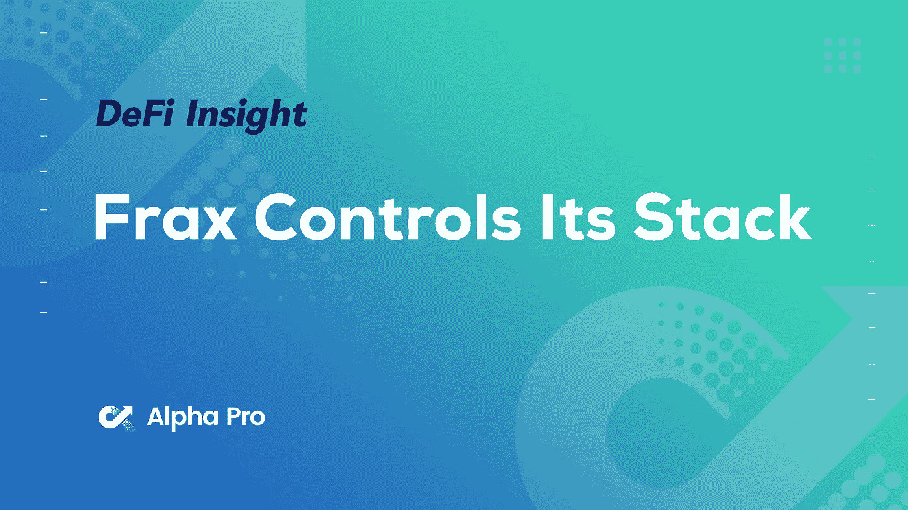
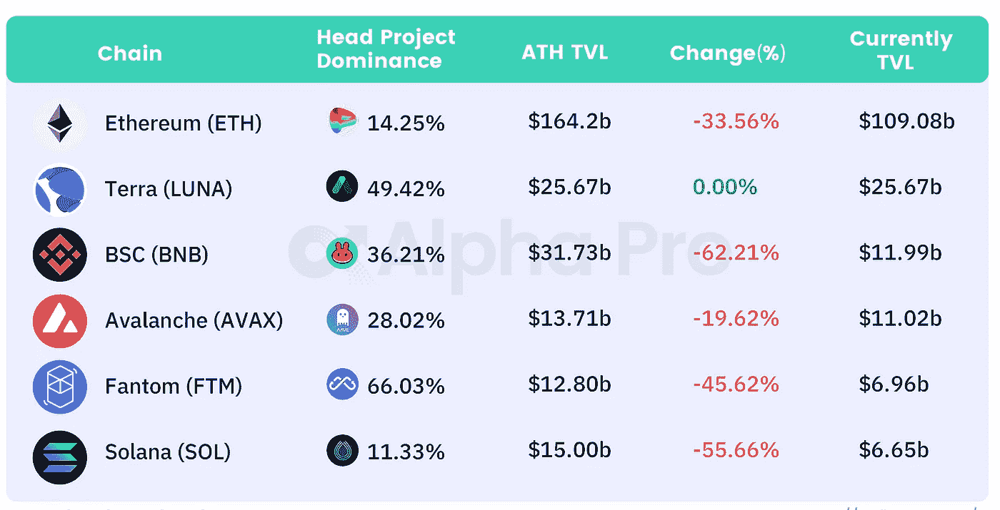
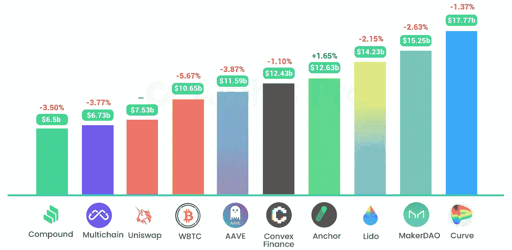
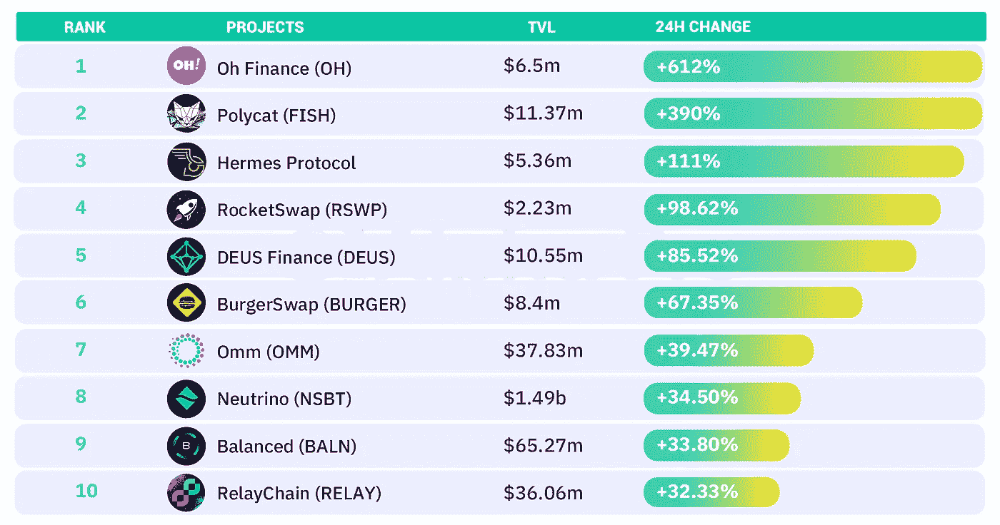
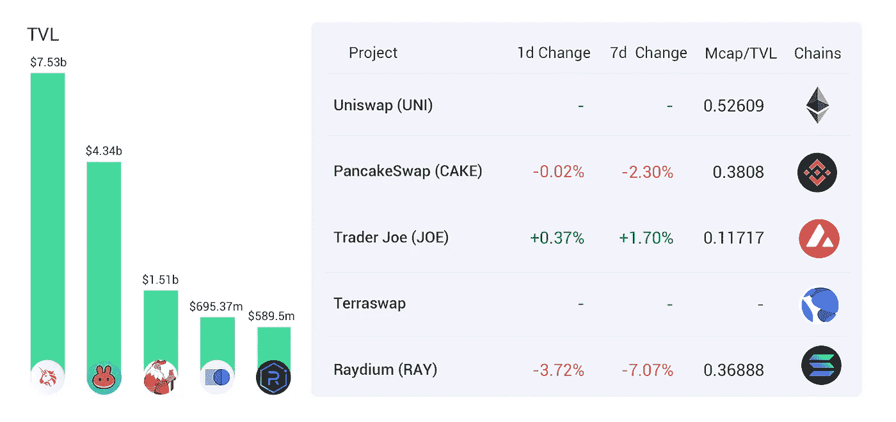
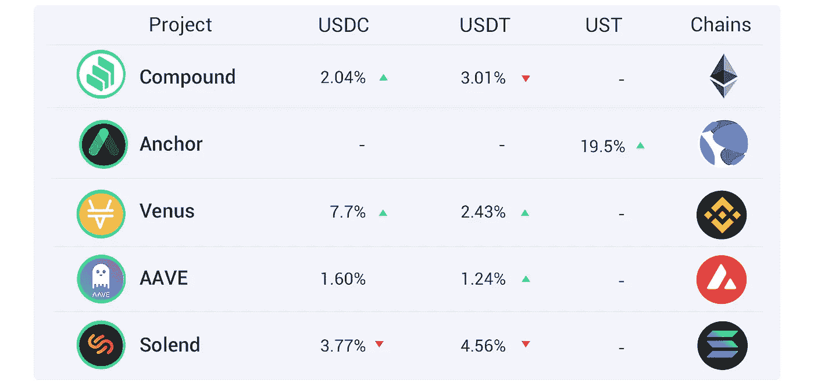
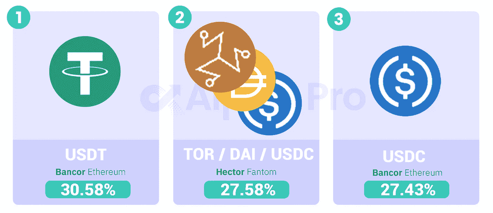

# DeFi Insight | Frax 控制其堆栈；UST 土地生态稳定公司市值超过 SHIB

> 原文：<https://medium.com/coinmonks/defi-insight-frax-controls-its-stack-terra-ecological-stablecoin-ust-surpasses-shib-in-market-9ce019dc91cb?source=collection_archive---------30----------------------->

## 2022 年 3 月 10 日

*今日 DeFi 数据&由 DeFi Insight 为您带来的新闻。*

**宏观趋势:**拜登发布期待已久的美国行政命令[加密](https://www.coindesk.com/policy/2022/03/09/biden-issues-long-awaited-executive-order-on-crypto/)

**TVL 动向:**目前全网 [DeFi](https://defillama.com/) 总锁定量为 2000 亿美元，24 小时增长 1.46%

**稳定币:**土地生态稳定币 [UST 市值超过 SHIB](https://coinmarketcap.com/)

# 最新消息

## 定义

2 月份，加密交易所[的月度网络流量下降了 20%](https://www.theblockcrypto.com/linked/137015/monthly-web-traffic-to-crypto-exchanges-fell-by-20-in-february?utm_source=twitter&utm_medium=social)

系绳首席技术官: [CBDC](https://twitter.com/paoloardoino/status/1501826378613858305?s=20&t=Wo302p3srOLKOwdQfHuCiw) 将取代 SWIFT

BNB 连锁宣布第四批项目加入 MVBIV 孵化计划

## 协议

蛋糕 DeFi 向 CDV 投资 1 亿美元

[本奇](https://aliens.com/livenews/latest/the-pledged-assets-on-benqi-exceeded-100-million-us-dollars)上的质押资产超过 1 亿美元

在 DeFi 合成资产上线后，THORChain 的符文飙升了 37%

Soluna 通过[采矿和空投](/solunadao/soluna-governance-token-slna-799dc04b5e71)发放治理令牌

*[镜头协议](https://twitter.com/LensProtocol/status/1501690534032781315?s=20&t=IDIEvpBOrYaIcbKu3npoGA)在 testnet 上发布测试 API

三叶草金融将更名为 CLV

## 稳定币

LFG 将烧掉国库中剩余的[420 万卢纳](https://twitter.com/LFG_org/status/1501563945076862982)

## 互换

Astroport 提出了升级 [bLUNA-LUNA 泳池](https://twitter.com/astroport_fi/status/1501485500238077956)的提案

DeBank 开发的钱包 Rabby 增加了 [DEX 比价功能](https://twitter.com/Rabby_io/status/1501530185040277504?s=20&t=ipdB_JNPhgayPaYVqp2beA)

# 数据和分析

## TVL 和 ATH 排名前六的连锁酒店对比

## 最新 TVL 十大项目

## 过去 24 小时 TVL 变化的前 10 个项目

## 德克斯 TVL 排名

*DEX 跌幅最大的是* [Raydium](https://defillama.com/protocol/raydium) *，跌了 3.72%*

## APY DeFi 贷款公司

*USDC:最高贷款人:利率为 7.7%的金星 APY*

*USDT:最高贷款人:索伦德，利率为 4.56% APY*

## 稳定的 APY

# 深潜

**[**孙正义**](http://www.theblockbeats.info/flash/70830) 的众多逃出生天**

** [## 孙正义的多次逃脱

### Tron 创始人贾斯汀·孙(Justin Sun)傲慢而直言不讳，在加密领域一直是一个有争议的人物。他有一个冒险的方法…

www.theverge.com](https://www.theverge.com/c/22947663/justin-sun-tron-cryptocurrency-poloniex)** 

# **报告**

****[**DeFi**](https://docsend.com/view/qmdaknmbairxfhgp)**的未来还属于以太坊区块链吗？******

> ****以太坊在加密领域赢得了市场主导地位，但它具备保持这一地位的条件吗？Cointelegraph Research 研究了确保以太坊市场相关性的因素，以及它可能被竞争对手超越的因素。****

******[**Frax**](https://members.delphidigital.io/reports/frax-controls-its-stack/)**控制其堆栈********

> ****RAX 是一种混合算法稳定币，其模型类似于 UST。然而，尽管 UST 现在有 7.5%由外源抵押品支持(即 BTC)，但 FRAX 有 84.5%直接由外源抵押品支持，这使其对算法部分的依赖程度降低。这一模型与过度抵押的稳定币形成对比，如戴，其 CR 范围为 101–175%。重要的是，FRAX 的抵押率不是一成不变的，而是根据对稳定货币的需求而增减。****

******·内射:用于** [**DeFi 市场**](https://messari.io/article/injective-an-interoperable-exchange-infrastructure-protocol-for-defi-markets) 的可互操作交换基础设施协议****

> ****去年，密码行业见证了分散市场的广泛扩张。每个团队都带着自己对 DEX 服务的愿景加入竞争，包括差异化的 exchange 基础架构、覆盖的市场和产品，以及 UX 的优先事项。甚至那些表面上看起来相似的项目在远程设计选择上也有分歧，比如流动性管理、订单清算机制和治理实现。****
> 
> ****Injective 是一个显著的例子，它在 2021 年 11 月推出了 mainnet。由于其独特的技术架构，内射协议提供了基本的完全分散的订单簿交换基础设施，用于以零汽油费访问跨链现货和衍生品市场。****

****一场回合:****

****DeFi Insight 是顶级 DeFi 和加密新闻和更新的来源。****

****提供的信息应被视为发展新闻，而不是投资建议。****