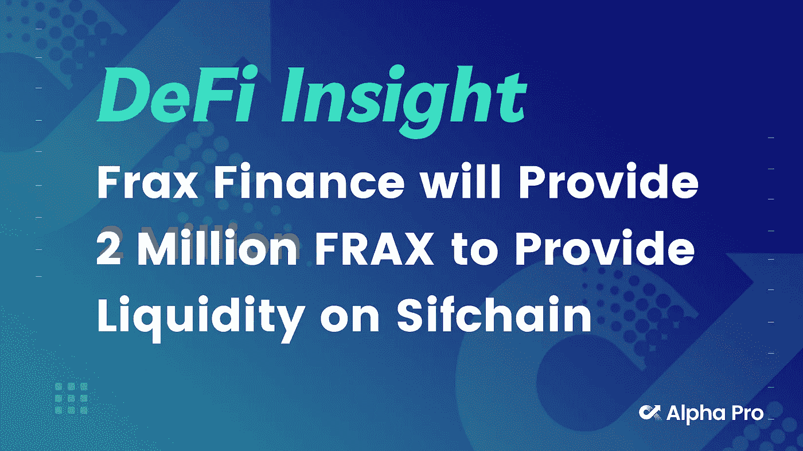
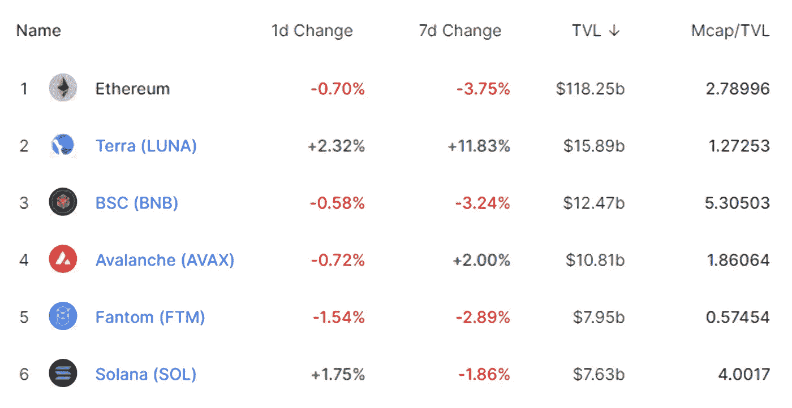
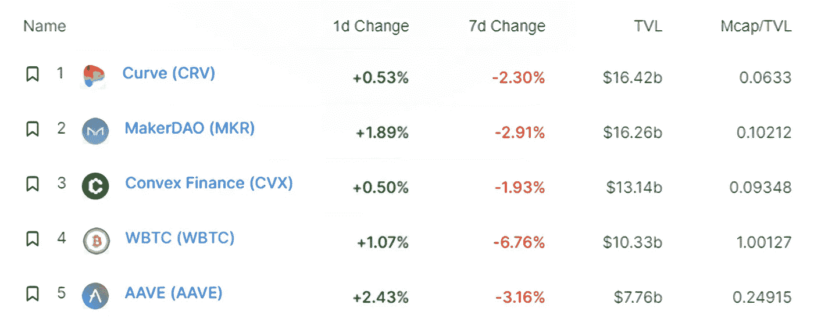
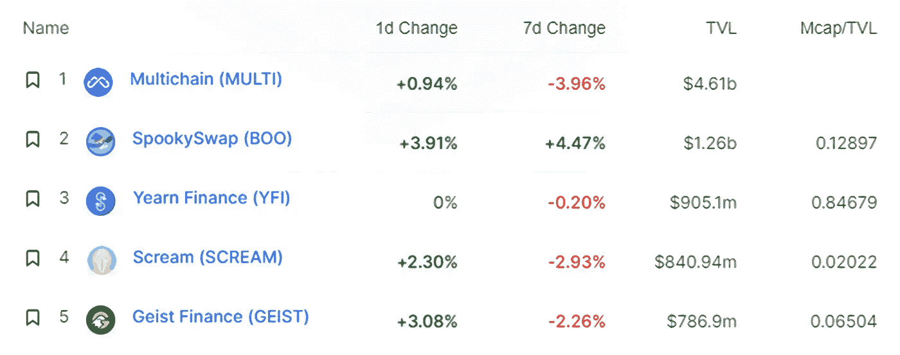
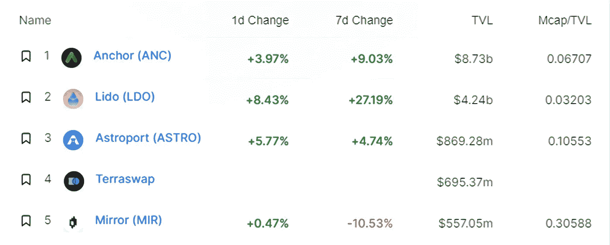
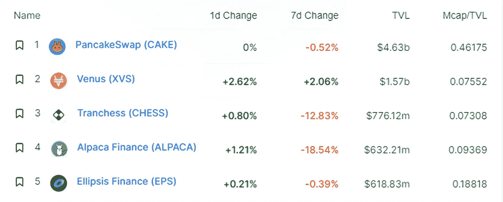
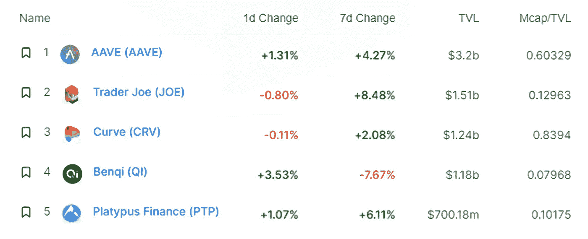
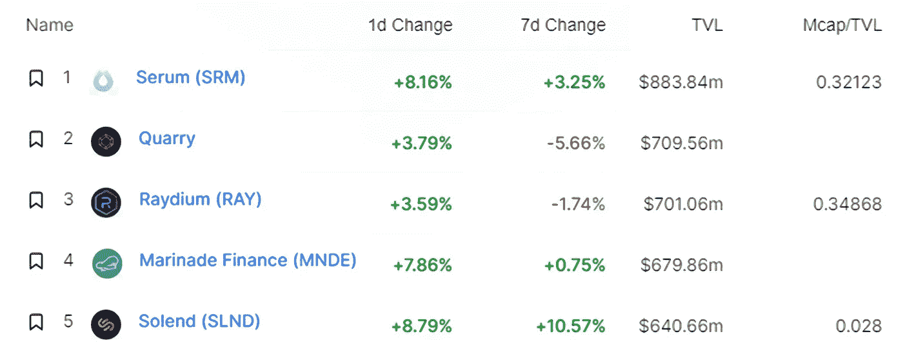
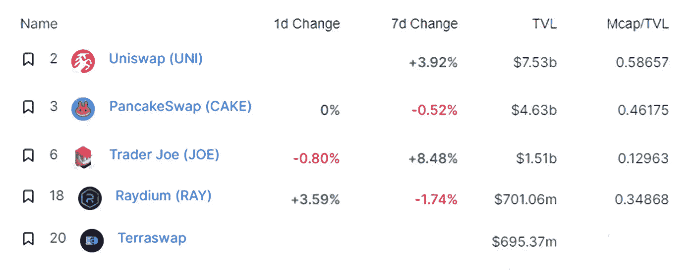
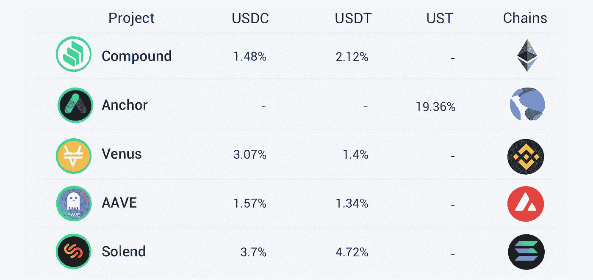

# DeFi Insight |Frax Finance 将提供 200 万 Frax 为 Sifchain 提供流动性

> 原文：<https://medium.com/coinmonks/defi-insight-frax-finance-will-provide-2-million-frax-to-provide-liquidity-on-sifchain-ee5bdc197f45?source=collection_archive---------51----------------------->

## 2022 年 2 月 21 日

*今日 DeFi 数据&由 DeFi Insight 为您带来的新闻。*

**宏观趋势:** [金融的未来](https://cointelegraph.com/news/future-of-finance-us-banks-partner-with-crypto-custodians):美国银行与加密托管机构合作

**TVL 走势:**价值锁定德菲受到一击， [TVL 在 24 小时内下跌 0.14%](https://defillama.com/)

**指数动态:**指数中涨幅最大的是[瑞迪](https://defillama.com/protocol/raydium)，上涨 3.59 **%**

**Stablecoin:** 圆圈和系绳会统治一切吗？美联储预测稳定的发行者双头垄断

# 最新消息

**以太坊创始人布特林称 Crypto** [**【迎来】又一个冬天**](https://indianexpress.com/article/technology/crypto/ethereum-founder-buterin-says-crypto-welcomes-another-winter-7783195/?utm_source=dlvr.it&utm_medium=twitter)

> 布特林在接受彭博采访时说:“深入研究加密，尤其是构建东西的人，他们中的许多人都欢迎熊市。”。“他们欢迎熊市，因为当长期价格大幅上涨时——这显然会让很多人高兴——但也往往会吸引很多非常短期的投机注意力。”

## 定义

名人投资者凯文·奥利里:比特币将在 2-3 年内[‘大幅升值’](https://historianandrew.medium.com/when-celebrity-investor-kevin-oleary-believes-bitcoin-may-hit-300-000-43a3b20acfa5)

摩根士丹利发布以太坊警告，称 [ETH 可能会失去市场份额](https://dailyhodl.com/2022/02/20/morgan-stanley-issues-ethereum-warning-says-eth-may-lose-market-share-to-faster-or-cheaper-challengers/)给更快或更便宜的挑战者

理解[印度的新密码规则](https://www.coindesk.com/policy/2022/02/21/making-sense-of-indias-new-crypto-rules/)

*[活跃开发者数量排名](https://twitter.com/Coin98Analytics/status/1495037596858478593) :1。索拉纳 2 号。以太坊 3。卡尔达诺

## 借出

随着露娜基金会向 DeFi 协议的储备金增加 4 . 5 亿美元，目标锁定 veTokenomics

*[Titano Finance](https://aliens.com/livenews/latest/titano-finance-new-contracts-are-being-deployed-with-certik-audits):新合同正在部署，Certik 审计

## 互换

*[Frax Finance](https://twitter.com/sifchain/status/1495131558520528907)将提供 200 万 Frax 为 Sifchain 提供流动性

之字形交换:部署到 StarkNet 的 Goerli 测试网的猛犸池的 Alpha 版本

## 稳定币

2 月 25 日，USDC 美元永久合约将开始生效

## 协议

*[塔架](https://twitter.com/pylon_protocol/status/1495590685562785793)实施 14 天打桩周期

安全月公司的诉讼目标是杰克·保罗、酱爆弟弟和其他人

# 数据和分析

## 锁定的总价值(TVL)

## TVL 的六大连锁品牌

*哪些*链/协议*当前将最多的资产存放在它们的智能合同中？*

> TVL 的五大协议

> TVL 的五大协议

> TVL 的五大协议

> **# BNB**TVL 五大协议

> TVL 的五大协议

> TVL 的五大礼仪

## 德克斯 TVL 排名

指数中涨幅最大的是[雷迪姆](https://defillama.com/protocol/raydium)，上涨 3.59 **%**

## APY DeFi 贷款公司

*USDC:最高借贷者:索伦德，利率为 3.7% APY*

*USDT:最高贷款人:索伦德，利率为 4.72% APY*

# 深潜

 [## 加密市场的状态:抓住新的叙事来证明新资本的部署…

### 2020 年和 2021 年的最后一个双牛市周期的特点是“叙事”占主导地位，这是一个新的杰出的…

coinyuppie.com](https://coinyuppie.com/the-state-of-crypto-markets-seizing-the-new-narrative-to-justify-the-deployment-of-new-capital/)  [## DeFi 领导频频踏足 NFT 寿司，他们在谋划什么？- CoinYuppie:比特币……

### 经历了去年年底的动荡后，DeFi 领导人今年再次踏足 NFT。是新的布局吗…

coinyuppie.com](https://coinyuppie.com/defi-leaders-frequently-set-foot-in-nft-sushi-what-are-they-planning/) 

一个 **值得信赖的资源，为万物所不容**

> 一场较量:
> 
> 分散金融(DeFi)指的是从传统的中央金融系统向区块链促成的点对点金融系统的转变。
> 
> DeFi Insight 是顶级 DeFi 和加密新闻和更新的来源。
> 
> 提供的信息应被视为发展新闻，而不是投资建议。

> 加入 Coinmonks [电报频道](https://t.me/coincodecap)和 [Youtube 频道](https://www.youtube.com/c/coinmonks/videos)了解加密交易和投资

## 另外，阅读

*   [最佳加密交易信号电报](/coinmonks/best-crypto-signals-telegram-5785cdbc4b2b) | [MoonXBT 评论](/coinmonks/moonxbt-review-6e4ab26d037)
*   [OKEx 评论](/coinmonks/okex-review-6b369304110f) | [Coinswitch 俱吠罗评论](/coinmonks/coinswitch-kuber-review-1a8dc5c7a739) | [比特币基地收费](/coinmonks/coinbase-fees-831e77d4f2c5)
*   [AscendEX 审查](/coinmonks/ascendex-review-53e829cf75fa) | [OKEx 交易机器人](/coinmonks/okex-trading-bots-234920f61e60) | [OKEx 交易机器人](/coinmonks/okex-trading-bots-234920f61e60)
*   [火币交易机器人](https://coincodecap.com/huobi-trading-bot) | [如何购买 ADA](https://coincodecap.com/buy-ada-cardano) | [Geco？一次审查](https://coincodecap.com/geco-one-review)
*   [币安 vs 比特邮票](https://coincodecap.com/binance-vs-bitstamp) | [比特熊猫 vs 比特币基地 vs Coinsbit](https://coincodecap.com/bitpanda-coinbase-coinsbit)
*   [如何购买 Ripple (XRP)](https://coincodecap.com/buy-ripple-india) | [非洲最好的加密交易所](https://coincodecap.com/crypto-exchange-africa)
*   [非洲最佳加密交易所](https://coincodecap.com/crypto-exchange-africa) | [胡交易所评论](https://coincodecap.com/hoo-exchange-review)
*   [eToro vs robin hood](https://coincodecap.com/etoro-robinhood)|[MoonXBT vs Bybit vs Bityard](https://coincodecap.com/bybit-bityard-moonxbt)
*   [Stormgain 评论](https://coincodecap.com/stormgain-review) | [Probit 评论](https://coincodecap.com/probit-review) | [北海巨妖评论](/coinmonks/kraken-review-6165fc1056ac)
*   [如何在势不可挡的域名上购买域名？](https://coincodecap.com/buy-domain-on-unstoppable-domains)