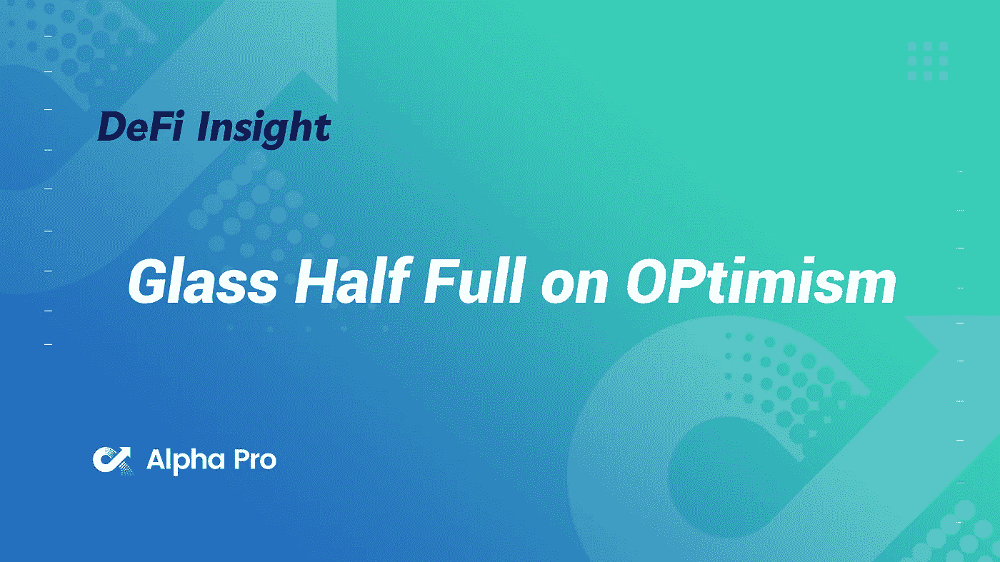
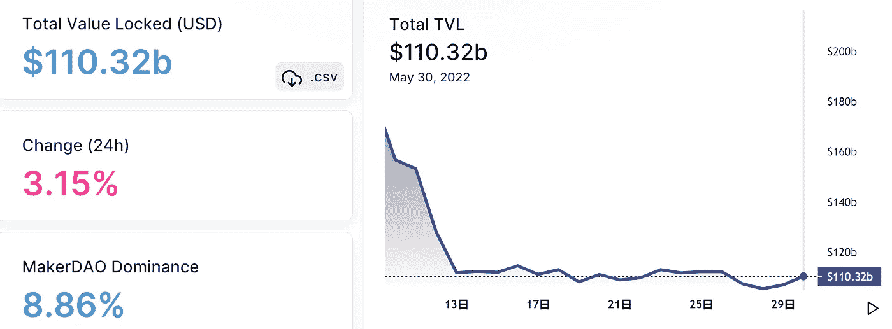
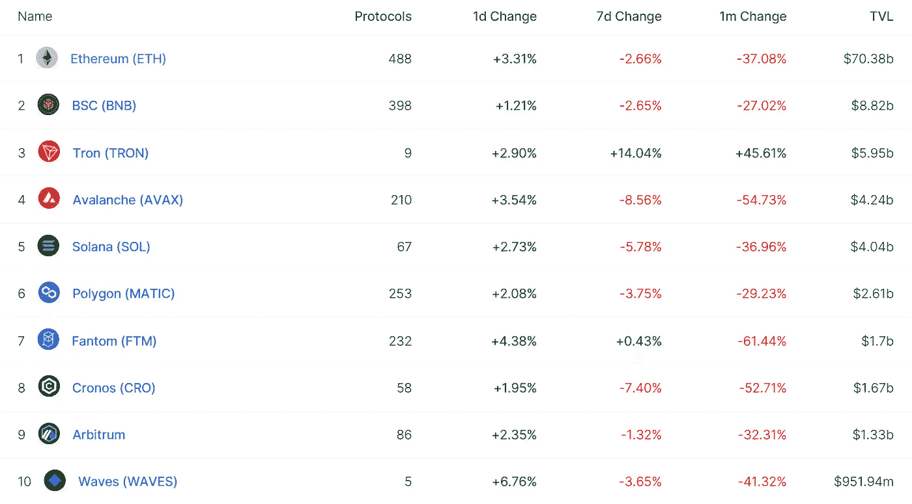
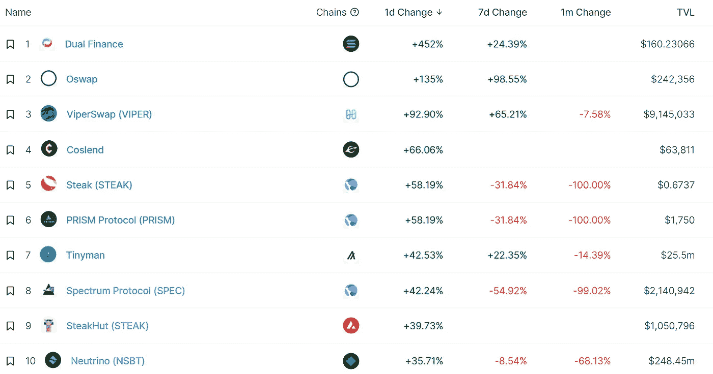
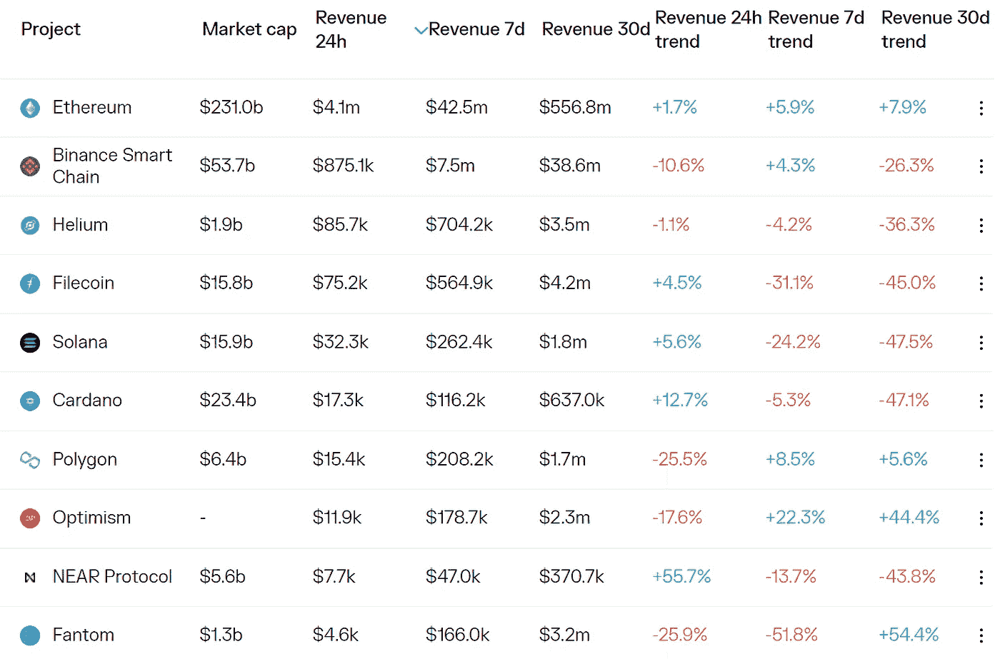
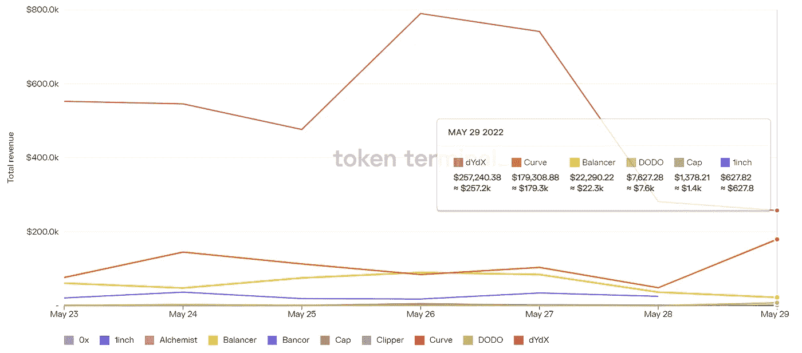
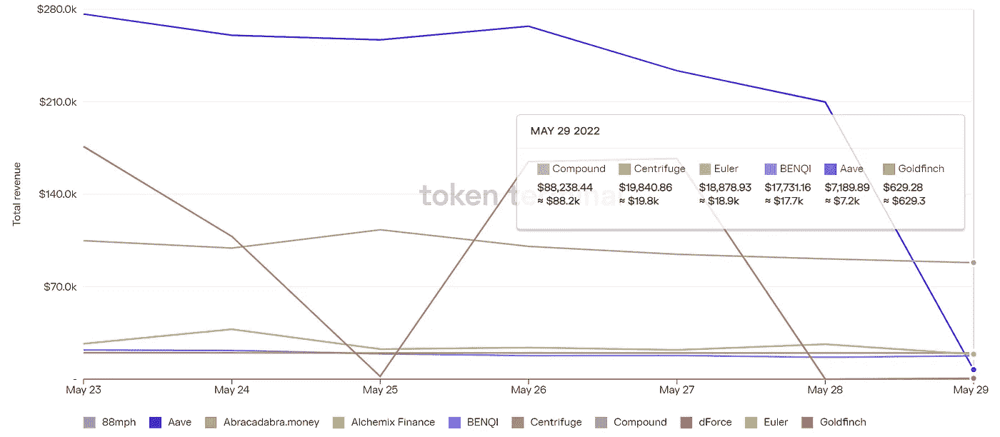

# 乐观的半杯水

> 原文：<https://medium.com/coinmonks/defi-insight-glass-half-full-on-optimism-23c067188c94?source=collection_archive---------22----------------------->

2022 年 5 月 30 日

*今日 DeFi 数据&由 DeFi Insight 为您带来的新闻*

> *维塔利克又做到了。这次以一篇关于灵魂绑定令牌(SBTs)的文章席卷了 Web3 世界——“一种对实体经济的信任网络进行编码以建立出处和声誉的方法”。这份 37 页的报告描述了当今 Web3 中的关键问题，以及灵魂和 SBT 的引入如何解决这些问题。不可转移的灵魂绑定 NFTs 的想法实际上在过去被 Vitalik 玩弄过。乐观主义通过借鉴维塔利克相同的灵魂绑定帖子，创造了“公民”的概念，重新创造了这种灵感。公民身份是乐观主义治理模式的两个组成部分之一，也是其所有新概念的基础。乐观主义本质上是 SBTs 在整个生态系统范围内的第一次公开应用。*“@*[*来源*](https://members.delphidigital.io/reports/glass-half-full-on-optimism)*

# *最新消息*

## *打桩*

***,**$ ADA 和$AVAX 现在可以作为[币安贷款的抵押资产](https://www.cryptoglobe.com/latest/2022/05/ada-and-avax-can-now-serve-as-staking-collateral-assets-on-binance-loans/)*

## *稳定币*

***,**速汇金公司首席执行官在[稳定的货币汇款](https://www.bloomberg.com/news/articles/2022-05-29/moneygram-ceo-sees-a-future-in-stablecoin-remittances?srnd=cryptocurrencies-v2)中看到了未来*

***[Terra Luna 2.0](https://nulltx.com/terra-luna-2-0-continues-to-trade-sideways-lunc-loses-another-zero/)继续横盘，LUNC 又亏零***

***本周对币安的空投可能会导致更大的价格下跌***

*****、**系绳的稳定点在多边形上启动以支持[“历史增长”](https://blockworks.co/tethers-stablecoin-launches-on-polygon-to-support-historical-growth/?utm_source=blockworks-research)***

## ***交叉链***

*****、**跨链协议 [Stargate](https://snapshot.org/#/stgdao.eth/proposal/0xb4e870f6ba82684db3a9d1c32ef4f5ea3429cde40f8603d22226bfc7b90649e6) 将推出$ETH 跨链流动性池并提供激励***

## ***第二层***

*****[不可变 X](https://twitter.com/Immutable/status/1531081329865269248?s=20&t=AeLfI5AzkktrNxwVqMHnBA) 本周收取协议费*****

## *****支付*****

*******连续结算协议泽贝奇合作伙伴与[跨境支付](https://tokeninsight.com/en/news/continuous-settlement-protocol-zebec-partners-with-cross-border-payment-infrastructure-company-link)基础设施公司链接*******

## *******|警报*******

*********/**$ meta mask DAO 是一个[蜜罐](https://twitter.com/PeckShieldAlert/status/1531117192506314754)*******

## *****采矿*****

*******/**区块软件解决方案在西弗吉尼亚州建造 150 兆瓦[比特币采矿设施](https://www.zdnet.com/finance/blockchain/blockware-solutions-to-build-150-megawatt-bitcoin-mining-facility-in-west-virginia/)*****

## *****政策与法规*****

*******[为什么说法语的比特币持有者会与中非共和国当局会面？](https://bitcoinist.com/francophone-bitcoiners-central-african-republic/)*******

*********币安获得[监管部门批准](https://news.bitcoin.com/binance-obtains-regulatory-approval-to-offer-crypto-products-in-italy/)在义大利提供加密产品*********

## *******NFT*******

*******Tezos ，生成性非功能性艺术在香港巴塞尔艺术博览会上备受瞩目*******

*******[为什么](https://ambcrypto.com/the-question-of-why-nfts-have-taken-the-brunt-of-the-crypto-crash-and-will-it-recover/) NFTs 在加密崩溃中首当其冲，它会恢复吗*******

*********、**、[耐克的 RTFKT](https://decrypt.co/101632/nikes-rtfkt-buys-dotswoosh-ethereum-domain-name-for-35k) 以 35K 美元的价格购买了‘dotswosh’以太坊域名*******

## *****基金*****

*****MeMusic 完成了 110 万美元的种子轮融资*****

*******[众筹媒体](https://smallcaps.com.au/crowd-media-raise-advance-ai-based-talking-head-technology-commercialisation/)筹资 210 万美元推进基于人工智能的对话头技术和商业化*******

*********西班牙的 [Komon](https://tech.eu/2022/05/30/exclusive-komon-get-2-million-to-launch-nft-access-to-creative-communities) 获得 200 万美元启动 NFT 访问的创意社区*********

## *******观点*******

*******比特币与股票市场的脱钩还没有发生，但它完全会发生*******

*******蒂姆·德雷珀:女性将推动下一轮比特币牛市*******

*********首先[她](https://www.washingtonpost.com/technology/2022/05/29/molly-white-crypto/)记录了 alt-right。现在她来拿密码了*********

*********根据 [crypto VC Grace Isford](https://techcrunch.com/2022/05/29/web3-hacks-crypto-vc-grace-isford-chain-reaction-podcast/) 的说法，为什么 web3 公司经常被黑*********

*******顶级分析师表示，比特币、以太坊和索拉纳很可能即将上行——以下是他的目标*******

# *******数据和分析*******

## *******锁定的总价值(TVL)*******

*******目前全网 DeFi 总锁定量为 1103.2 亿美元，24 小时增长 3.15%。*******

**************

## *******TVL 评出的十大连锁酒店*******

**************

## *******|最新 TVL 十大项目*******

**************

## *******|过去 24 小时内 TVL 增长的前 10 个项目*******

**************

## *******协议收入*******

## *******|累计总收入最高的项目(24H)_ 区块链(L1)*******

**************

## *******|累计总收入最高的项目(24H) _Dapps (L2)*******

**************

## *******|前 10 大交易所的每日收入*******

**************

## *******|十大贷款协议的每日收入*******

**************

# *******深潜*******

*********打造比特币到** [**持续几个世纪**](https://bitcoinmagazine.com/culture/building-bitcoin-to-last-for-centuries)*******

***** [## 打造持续几个世纪的比特币

### 埃及大金字塔保持最高人造建筑的记录至少 3800 年了，它的 230 万…

bitcoinmagazine.com](https://bitcoinmagazine.com/culture/building-bitcoin-to-last-for-centuries) 

**[**以太坊 Layer-2 锁链**](https://cryptoslate.com/will-ethereum-layer-2-chains-survive-after-the-merge/) **合并后还会存在吗？****

** [## 合并后以太坊第二层链还会存在吗？隐板岩

### 👋想和我们一起工作吗？CryptoSlate 正在招聘几个职位！以太坊最终走向了风险证明…

cryptoslate.com](https://cryptoslate.com/will-ethereum-layer-2-chains-survive-after-the-merge/) 

**[**BTC 追踪纳斯达克**](https://thedefiant.io/bitcoin-stocks-correlation/) **当 Crypto 面临第一次衰退****

** [## BTC 跟踪纳斯达克，因为加密面临第一次衰退-挑衅

### 加密市场市值从 11 月 8 日的高点下跌了 57.7%，经济学家表示，我们可能正处于第一次全球…

thedefiant.io](https://thedefiant.io/bitcoin-stocks-correlation/)** 

# **报告**

****[**在线取证**](https://www.nansen.ai/research/on-chain-forensics-demystifying-terrausd-de-peg) **:揭秘 terra USD De-peg**_ 南森****

> ****鉴于 UST 与美元脱钩过程的突然性，许多市场参与者——无论是否受到直接影响——都渴望了解导致 UST 与美元脱钩的一系列事件。为了揭示这些事件，南森编写了一份深度报告，利用 Terra 和以太坊的链上数据，重现了导致算法稳定币在本月早些时候失去与美元挂钩的链上历史。****
> 
> ****在可能的情况下，我们希望给出一个有链上证据支持的客观描述。此外，我们利用南森的标签试探法为钱包添加一些颜色，并标记其链上行为可能影响去挂钩机制的实体。****
> 
> ****这项研究不包括可能导致 UST 失去联系汇率制的潜在连锁事件。对投资者的影响，钱包之间的净损失细分，以及支持 UST 的 BTC 储备发生了什么问题，都是本报告范围之外的进一步研究的重要领域。****

******[**数字资产**](https://coinshares.com/research/digital-asset-survey) **双月基金经理调查** _coinshares******

******[**破译元宇宙**](https://www.theblockresearch.com/deciphering-the-metaverse-roadmap-fatigue-149188) **:路线图疲劳** _theblockresearch******

******关于:******

****DeFi Insight 是顶级 DeFi 和加密新闻和更新的来源。****

******https://twitter.com/AlphaPro_io 推特:******

********❤RSS:**[**https://medium.com/feed/@alphapro.project**](https://medium.com/feed/@alphapro.project)******

****提供的信息应被视为发展新闻，而不是投资建议。****

> ****加入 Coinmonks [电报频道](https://t.me/coincodecap)和 [Youtube 频道](https://www.youtube.com/c/coinmonks/videos)了解加密交易和投资****

# ****另外，阅读****

*   ****[3 商业评论](/coinmonks/3commas-review-an-excellent-crypto-trading-bot-2020-1313a58bec92) | [Pionex 评论](https://coincodecap.com/pionex-review-exchange-with-crypto-trading-bot) | [Coinrule 评论](/coinmonks/coinrule-review-2021-a-beginner-friendly-crypto-trading-bot-daf0504848ba)****
*   ****[莱杰 vs n rave](/coinmonks/ledger-vs-ngrave-zero-7e40f0c1d694)|[莱杰 nano s vs x](/coinmonks/ledger-nano-s-vs-x-battery-hardware-price-storage-59a6663fe3b0) | [币安评论](/coinmonks/binance-review-ee10d3bf3b6e)****
*   ****[Bybit Exchange 审查](/coinmonks/bybit-exchange-review-dbd570019b71) | [Bityard 审查](https://coincodecap.com/bityard-reivew) | [Jet-Bot 审查](https://coincodecap.com/jet-bot-review)****
*   ****[3 commas vs crypto hopper](/coinmonks/3commas-vs-pionex-vs-cryptohopper-best-crypto-bot-6a98d2baa203)|[赚取加密利息](/coinmonks/earn-crypto-interest-b10b810fdda3)****
*   ****最好的比特币[硬件钱包](/coinmonks/hardware-wallets-dfa1211730c6) | [BitBox02 回顾](/coinmonks/bitbox02-review-your-swiss-bitcoin-hardware-wallet-c36c88fff29)***********