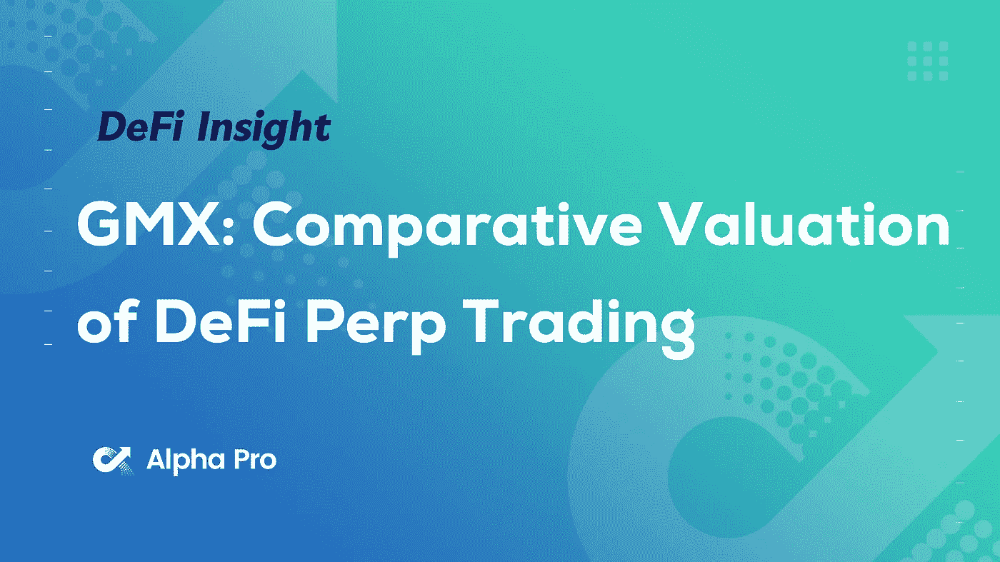
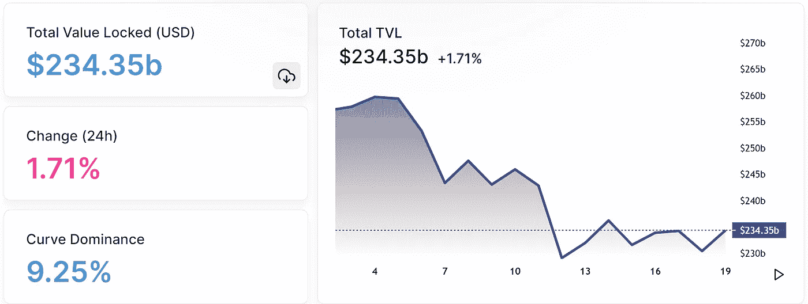
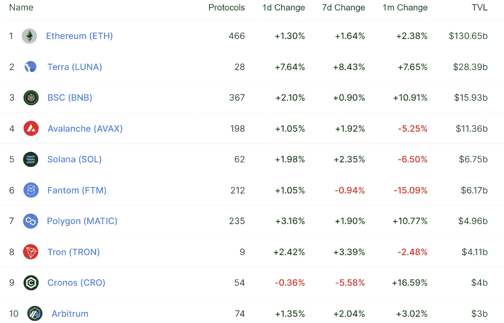
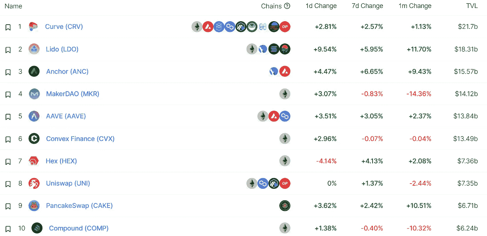
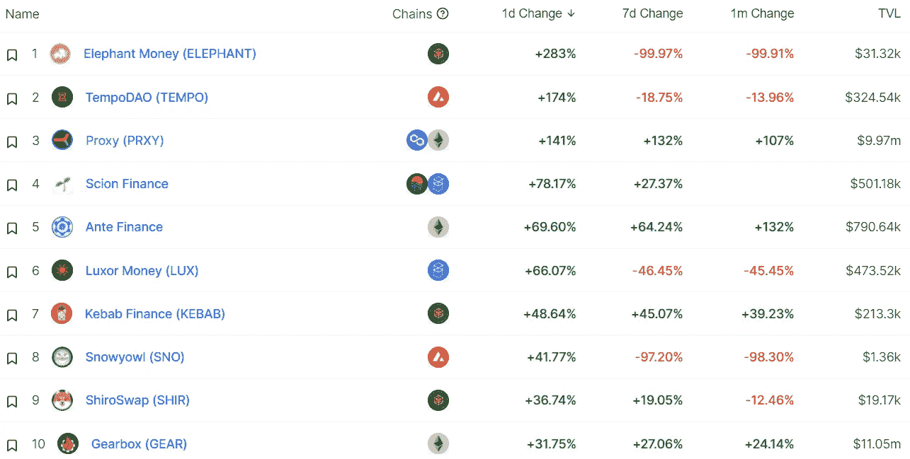
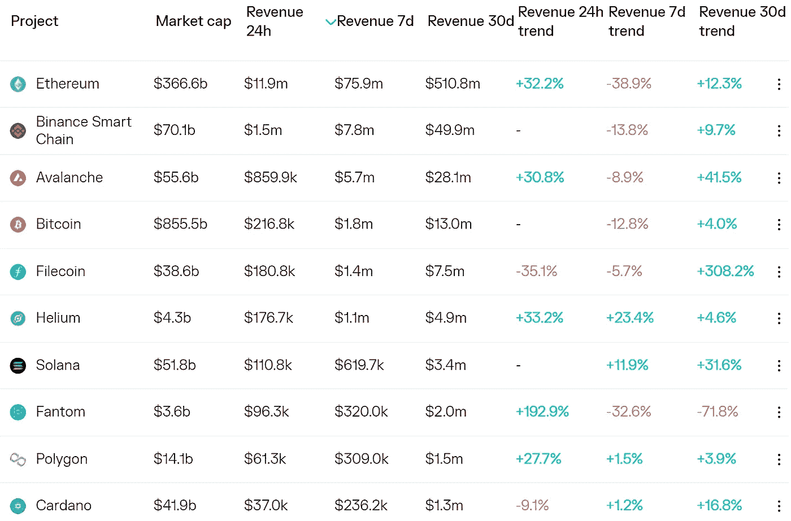
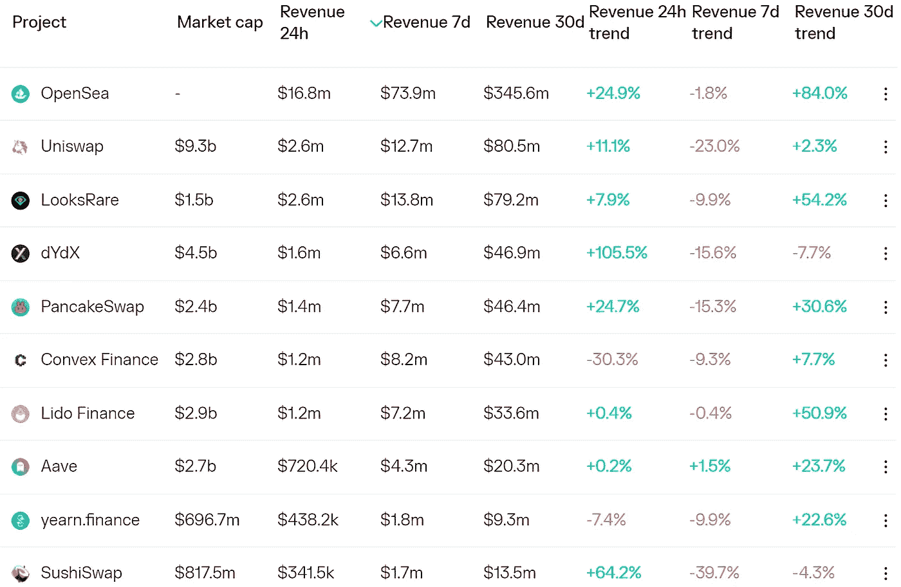
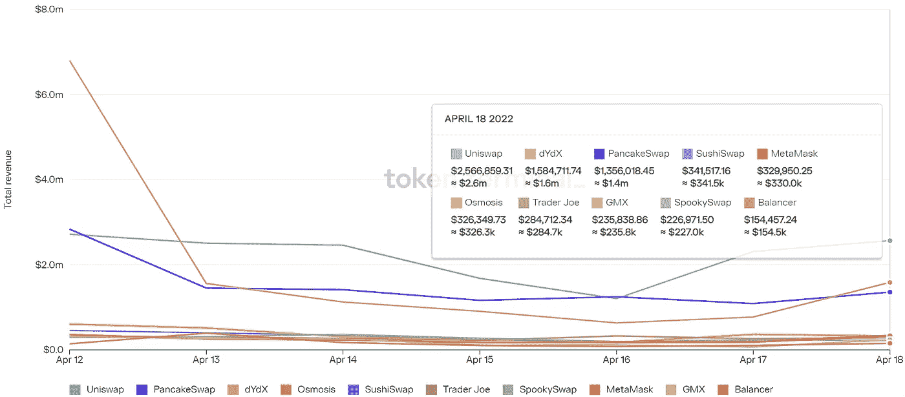
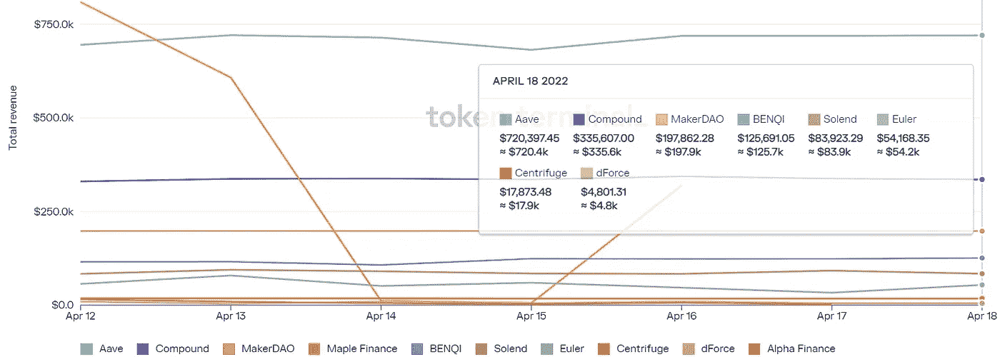

# DeFi Insight | GMX:DeFi Perp Trading 的比较估值

> 原文：<https://medium.com/coinmonks/defi-insight-gmx-comparative-valuation-of-defi-perp-trading-60da4a8a54fc?source=collection_archive---------30----------------------->

## 2022 年 4 月 19 日

*今日 DeFi 数据&由 DeFi Insight 为您带来的新闻。*

> “简而言之，衍生品市场的 TAM 远远大于现货市场。据我估计，如果 crypto 的总市值在 5 年内达到约 10 万亿美元，可能会有 70-100 万亿美元的衍生品交易量。这意味着要捕获 50-80 万亿美元的交易量！”**[【thetie . io](https://research.thetie.io/gmx-valuation-vs-dydx/)**

# **最新消息**

## **指标**

**宇宙生态指数将于 5 月 1 日开放原始代币收集**

## **稳定币**

****,**Tether 首席技术官 Paolo Ardoino 讲述了[“稳定硬币”与 CBDCs 的对比](https://gritdaily.com/tether-cto-paolo-ardoino-tells-all-on-stable-coins-versus-cbdcs/)**

**泰拉创始人:市值增长五倍将使 UST 成为最大的稳定资本**

****俄央行不会推迟 [CBDC 测试](https://www.iqstock.news/n/digital-ruble-needed-russias-central-bank-wont-delay-testing-3765598/)，数字卢布‘急需’****

## ****打桩****

******[押上赌注](https://dune.xyz/queries/64967/129756) TVL 超过 7 万 ETH******

********、**[eth 2.0](https://twitter.com/CryptoGucci/status/1516237818841817088)的下注量超过 1160 万张，占总发行量的近 10%******

## ****测试网****

****Aptos 将于 5 月 16 日发布激励性测试网络****

## ****甲骨文****

******[链环](https://twitter.com/chainlink/status/1516171515116535813)宣布 v1.3.0 发布******

## ******叉子******

********[Gnosis Chain](https://www.xdaichain.com/for-validators/hard-forks/token-contract-bytecode-or-2022-04-20-or-21735000)4 月 20 日进行硬分叉升级********

## ******|令牌******

********泰拉持有超过 220 万 CVX，成为 CVX 最大的刀持有者********

## ******政策与法规******

********[参议院](https://consensys.net/blog/news/consensys-comments-on-sec-proposal-to-broaden-the-definition-of-securities-exchange/)评论 SEC 扩大“证券交易所”定义的提案********

******日本按照瑞典的方式模拟数字日元测试，而不是中国的方式******

********[**a16z**](https://a16z.com/2022/04/18/sec-exchange-act-proposal-comment-a16z-crypto/)**Crypto 对 SEC 交易法案提案的评论**********

******欧洲密码行业领袖呼吁欧盟将像 DeFi 这样的分散项目排除在监管之外******

## ******NFT******

********CBS 为其 [NFT 存储](https://blog.cryptoflies.com/cbs-files-new-trademark-application-for-its-nft-storage-and-experiential-hub-star-trek-continuum/)和体验中心《星际迷航》CONTINUUM 申请新商标********

********、**[Meebits](https://nftgo.io/collection/meebits/overview)系列 NFT 24 小时交易额超过 2700 万美元，地板价超过 6 ETH******

******、**[MAYC](https://nftgo.io/collection/mutant-ape-yacht-club/overview)系列 NFT 24 小时交易额超过 1700 万美元，楼面价超过 29 ETH****

******[STEPN](https://twitter.com/Stepnofficial)推出 v0.6.3 版本更新，新版本支持 BNB 链******

******最近一次更新后，STEPN 遭受了一次 DDOS 攻击******

## ******基金******

******韩国加密交易平台 Bithumb 的子公司 Rotonda 完成了约 850 万美元的融资，IBK 和其他人也参与其中******

# ******数据和分析******

## ******锁定的总价值(TVL)******

******目前全网 DeFi 总锁定量为 2343.5 亿美元，24 小时增长 1.71%******

************

## ******TVL 评出的十大连锁酒店******

************

## ******|最新 TVL 十大项目******

************

## ******|过去 24 小时内 TVL 增长的前 10 个项目******

************

## ******协议收入******

## ******|累计总收入最高的项目(24H)_ 区块链(L1)******

************

## ******|累计总收入最高的项目(24H) _Dapps(L2)******

************

## ******|前 10 大交易所的每日收入******

************

## ******|十大贷款协议的每日收入******

************

# ******深潜******

********[**上的最佳线程链上分析**](https://twitter.com/virtualkenji/status/1515342396640223235?s=21&t=1UE0rINkvAU9z75c9qUOTQ)********

******L1**[**养殖指南**](https://twitter.com/ThorHartvigsen/status/1515290331373346816)****

# ****报告****

******数码奢侈品:将** [**早期的 NFTs**](https://messari.io/article/digital-luxury) **框定为奢侈品 _messari******

> ****早期的非功能性物品与现实世界中的奢侈品功能相似，因为它们除了实用之外，还能满足心理需求。
> 市场领先的超低价 NFT 为低等级 NFT 的价值提供了参考点。
> 已建立的 NFT 项目需要小心，不要试图吸引新的观众，从而稀释自己的价值。****

******Crypto 季报:Q1 2022_** [**币安**](https://www.binance.com/en/blog/futures/crypto-quarterly-report-q1-2022-421499824684903692?ref=AZTKZ9XS&utm_source=BinanceTwitter&utm_medium=GlobalSocial&utm_campaign=GlobalSocial)****

******区块链** [**桥梁**](https://dappradar.com/blog/how-blockchain-bridges-became-hackers-prime-targets) **如何成为黑客的首要目标 _dappradar******

******[**EF**](https://twitter.com/ethereum/status/1515950624592080900)**报告 _ 以太坊********

******[**OpenSea**](https://www.theblockresearch.com/opensea-company-intelligence-142198)**公司情报 _theblockresearch********

******[**音乐 NFTs**](https://members.delphidigital.io/reports/bull-case-for-music-nfts) **:接下来你需要知道的一切。链上艺术的 WAV _ Delphi digital********

****AT2 回合:****

*****DeFi Insight T5 是您获取顶级 DeFi 和 Crypto 新闻和更新的资源。*****

******❤推特:**[**https://twitter.com/AlphaPro_io**](https://twitter.com/AlphaPro_io)****

******❤RSS:**[https://medium.com/feed/@alphapro.project](https://medium.com/feed/@alphapro.project)****

****提供的信息应被视为发展新闻，而不是投资建议。****

> ****加入 Coinmonks [电报频道](https://t.me/coincodecap)和 [Youtube 频道](https://www.youtube.com/c/coinmonks/videos)了解密码交易和投资****

# ****此外，请阅读****

*   ****[链上数据的最佳加密分析](https://coincodecap.com/blockchain-analytics) | [Bexplus Review](https://coincodecap.com/bexplus-review)****
*   ****[10 大 NFT 市场打造精品系列](https://coincodecap.com/nft-marketplaces)****
*   ****[excendex Staking](https://coincodecap.com/ascendex-staking)|[Bot Ocean Review](https://coincodecap.com/bot-ocean-review)|[最佳比特币钱包](https://coincodecap.com/bitcoin-wallets-india)****
*   ****[Bitget Review](https://coincodecap.com/bitget-review)|[Gemini vs BlockFi](https://coincodecap.com/gemini-vs-blockfi)|[OKEx 期货交易](https://coincodecap.com/okex-futures-trading)****
*   ****[美国最佳密码交易机器人](https://coincodecap.com/crypto-trading-bots-in-the-us) | [变化回顾](https://coincodecap.com/changelly-review)****
*   ****[在印度使用密码套利获取被动收入](https://coincodecap.com/crypto-arbitrage-in-india)****
*   ****[霍比评论](https://coincodecap.com/huobi-review) | [OKEx 保证金交易](https://coincodecap.com/okex-margin-trading) | [期货交易](https://coincodecap.com/futures-trading)****