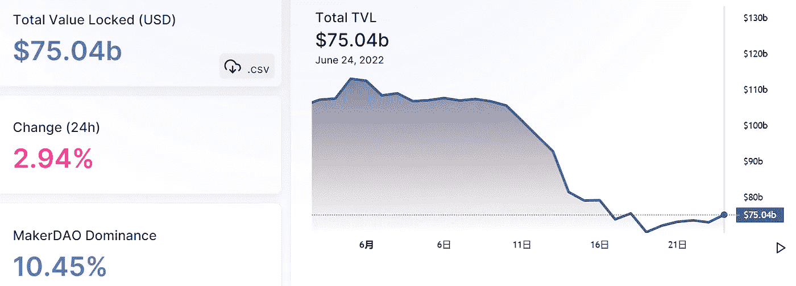

# DeFi Insight |治理很难，但风险控制是基础

> 原文：<https://medium.com/coinmonks/defi-insight-governance-is-hard-but-risk-control-is-basic-9c201f02bb64?source=collection_archive---------44----------------------->

2022 年 6 月 24 日

*今日 DeFi 数据&由 DeFi Insight 为您带来的新闻*

> *熊市期间从来不缺乏戏剧性。Solend 是 Solana 上最大的贷款协议，于 6 月 20 日通过了一项治理提案，接管鲸鱼的抵押品，以避免级联清算。并且，提出并通过了一个新的提案，使同一天通过的接管提案无效。然后在 6 月 21 日，第三个提案被提出并被批准，以改变一些借出参数并对协议施加借出限制。这三个有趣的治理提案标志着该协议于 2021 年 8 月在 mainnet 上上线后首次提出的三个提案。索伦德是什么？它发生了什么事？这部剧的寓意是什么？*“@*[*来源*](https://twitter.com/harmonyprotocol/status/1540110924400324608?ref_src=twsrc%5Etfw%7Ctwcamp%5Etweetembed%7Ctwterm%5E1540110924400324608%7Ctwgr%5E%7Ctwcon%5Es1_&ref_url=https%3A%2F%2Fbeincrypto.com%2Fharmony-horizon-bridge-loses-100m-in-latest-crypto-exploit%2F)*

# *最新消息*

## *贷款*

*巨鲸在索伦的债务头寸已经低于 5000 万美元*

## *外汇*

***[dYdX](https://thedefiant.io/dydx-chain-cosmos/)在 Cosmos 上部署自己的区块链***

*****加密期货交易所 [CoinFlex](https://beincrypto.com/crypto-futures-exchange-coinflex-suspends-withdrawals-ounterparty-uncertainty/) 以交易对手“不确定性”为由暂停提款*****

*******[币安](https://fortune.com/2022/06/23/binance-crypto-bear-market-2018-bailouts/)展示了现在和 2018 年秘密熊市的“关键”区别*******

*******比特币基地推出首个针对散户的加密衍生产品*******

*******币安为 NFT 新合同签下克里斯蒂亚诺罗纳尔多*******

## *******市场*******

*********索拉纳移动堆栈和旗舰设备[传奇](https://solana.com/news/solana-mobile-stack-saga-anatoly-yakovenko)改变了一切*********

## *******衍生产品*******

*********基于索拉纳的 DeFi 衍生协议 [Cega](https://cegafi.medium.com/cega-mainnet-launch-c57739bcba9c) 在 Mainnet 上发布*********

## *******第二层*******

*********/**[乐观](https://gov.optimism.io/t/voting-cycle-2-roundup/2754)启动治理提案第二轮投票*******

## *****鲸鱼*****

*******/**[加密鲸](https://www.cryptoglobe.com/latest/2022/06/crypto-whale-accumulation-behind-the-scenes-triggers-900-surge-for-embattled-asset/?utm_source=blockworks-research)积累“幕后”引发四面楚歌的资产激增 900%*****

## *****政策与法规*****

*****西班牙政府希望密码持有者从 2023 年开始报告他们的交易*****

*****参议员在 GitHub 上发布加密货币法案，混乱随之而来*****

*****SEC 主席敦促为加密制定“一个规则手册”以避免监管漏洞*****

*****霍斯金森向国会推销软件加密自我监管*****

## *****NFT*****

*****纽约的 NFT 之夏正在密密麻麻的冬季中如火如荼地进行着*****

*******[宾利汽车](https://cryptoslate.com/bentley-motors-gears-up-to-drop-its-genesis-nft-collection-on-polygon/)准备将它的创世纪 NFT 系列投放到多边形上*******

## *******基金*******

*********[系统 9](https://www.prnewswire.com/news-releases/system-9-closes-5-7m-series-a-funding-round-to-expand-operations-301574266.html) 完成 570 万美元的 A 轮融资以扩大运营*********

# *******数据和分析*******

## *******锁定的总价值(TVL)*******

*******目前全网 DeFi 总锁定量为 750.4 亿美元，24 小时增长 2.94%。*******

**************

## *******TVL 评出的十大连锁酒店*******

**************

## *******|最新 TVL 十大项目*******

**************

## *******|过去 24 小时内 TVL 增长的前 10 个项目*******

**************

## *******协议收入*******

## *******|累计总收入最高的项目(24H)_ 区块链(L1)*******

**************

## *******|累计总收入最高的项目(24H) _Dapps (L2)*******

**************

## *******|前 10 大交易所的每日收入*******

**************

## *******|十大贷款协议的每日收入*******

**************

# *******深潜*******

*********[**3 个标志**](https://newsletter.banklesshq.com/p/3-signs-a-crypto-project-is-ngmi?utm_source=%2Finbox&utm_medium=reader2) **一个加密项目是 NGMI***********

***** [## 3 标志一个加密项目是 NGMI

### 探索名义金融亲爱的无银行国家，聪明的投资者知道什么时候坚持，什么时候推动，什么时候灵活…

newsletter.banklesshq.com](https://newsletter.banklesshq.com/p/3-signs-a-crypto-project-is-ngmi?utm_source=%2Finbox&utm_medium=reader2) 

**[**航海家**](https://bitcoinmagazine.com/business/voyager-announces-large-exposure-to-three-arrows-capital) **宣布大曝三箭资本****

** [## 航海家宣布大量接触三箭资本

### 以下节选自比特币杂志 Pro 的最近一期，比特币杂志的高级市场时事通讯…

bitcoinmagazine.com](https://bitcoinmagazine.com/business/voyager-announces-large-exposure-to-three-arrows-capital) 

**财务顾问应如何看待** [**密码崩溃**](https://www.coindesk.com/markets/2022/06/23/how-financial-advisors-should-think-about-the-crypto-crash/)

 [## 金融顾问应该如何看待加密崩溃

### CFP 的亚当·布伦伯格也是 Interaxis 公司的联合创始人和首席教育家，该公司试图弥合教育差距…

www.coindesk.com](https://www.coindesk.com/markets/2022/06/23/how-financial-advisors-should-think-about-the-crypto-crash/) 

**[**Web 3.0 建设者应该关注哪些**](https://dailyhodl.com/2022/06/23/what-should-web-3-0-builders-focus-on-to-emerge-stronger-from-the-bear-market/) **才能在熊市中脱颖而出？****

** [## Web 3.0 构建者应该关注什么才能在熊市中脱颖而出？-霍德尔日报

### 所有市场都是周期性的，Web 3.0 也不例外。这里是社区需要努力的地方，以刺激下一个牛市…

dailyhodl.com](https://dailyhodl.com/2022/06/23/what-should-web-3-0-builders-focus-on-to-emerge-stronger-from-the-bear-market/)** 

# **报告**

****[**陶瓷网络**](https://www.theblockresearch.com/ceramic-network-building-a-decentralized-network-of-composable-data-152446) **:构建可组合数据的分散网络** _theblockresearch****

> ****陶瓷网络是一个分散的网络，支持应用程序生态系统中可变和可组合的数据流。
> 网络基础设施以用户数据流和分散识别为中心，允许用户完全控制自己的数据，同时允许不同的应用程序从中构建功能。****

******[**总督**](https://messari.io/article/governor-insights-1) **见解# 1**_ 梅萨里******

******[**Arbitrum Odyssey**](https://members.delphidigital.io/reports/arbitrum-odyssey-beings-top-nft-collections-intro-to-my-pet-hooligan)**众生，NFT 顶级收藏，我的宠物小流氓简介** _delphidigital******

******关于:******

****DeFi Insight 是顶级 DeFi 和加密新闻和更新的来源。****

******https://twitter.com/AlphaPro_io 推特:******

********❤RSS:**[**https://medium.com/feed/@alphapro.project**](https://medium.com/feed/@alphapro.project)******

****提供的信息应被视为发展新闻，而不是投资建议。****

> *****加入 Coinmonks* [*电报频道*](https://t.me/coincodecap) *和* [*Youtube 频道*](https://www.youtube.com/c/coinmonks/videos) *了解加密交易和投资*****

# ****另外，阅读****

*   ****[3 商业评论](/coinmonks/3commas-review-an-excellent-crypto-trading-bot-2020-1313a58bec92) | [Pionex 评论](https://coincodecap.com/pionex-review-exchange-with-crypto-trading-bot) | [Coinrule 评论](/coinmonks/coinrule-review-2021-a-beginner-friendly-crypto-trading-bot-daf0504848ba)****
*   ****[莱杰 vs n rave](/coinmonks/ledger-vs-ngrave-zero-7e40f0c1d694)|[莱杰 nano s vs x](/coinmonks/ledger-nano-s-vs-x-battery-hardware-price-storage-59a6663fe3b0) | [币安评论](/coinmonks/binance-review-ee10d3bf3b6e)****
*   ****[加密交易机器人](/coinmonks/crypto-trading-bot-c2ffce8acb2a) | [Bingbon 审查](https://coincodecap.com/bingbon-review)****
*   ****[Bybit Exchange 评论](/coinmonks/bybit-exchange-review-dbd570019b71) | [Bityard 评论](https://coincodecap.com/bityard-reivew) | [Jet-Bot 评论](https://coincodecap.com/jet-bot-review)****
*   ****[3 commas vs crypto hopper](/coinmonks/3commas-vs-pionex-vs-cryptohopper-best-crypto-bot-6a98d2baa203)|[赚取加密利息](/coinmonks/earn-crypto-interest-b10b810fdda3)***********