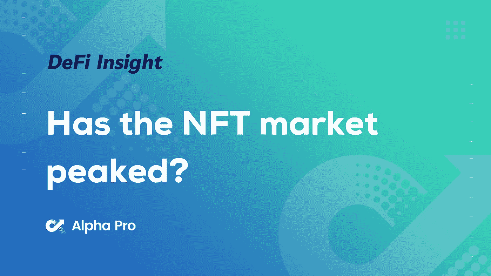
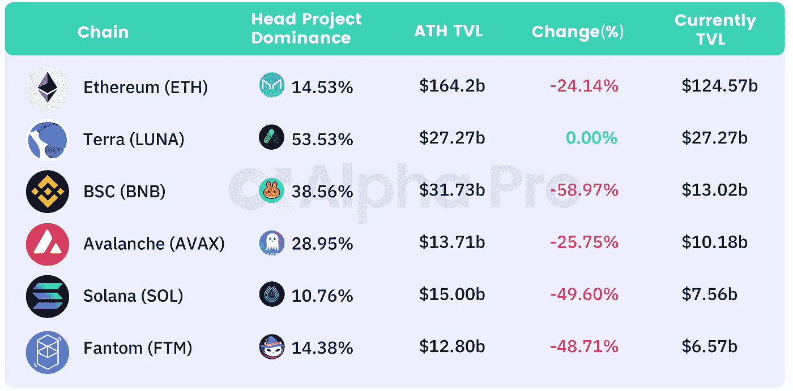
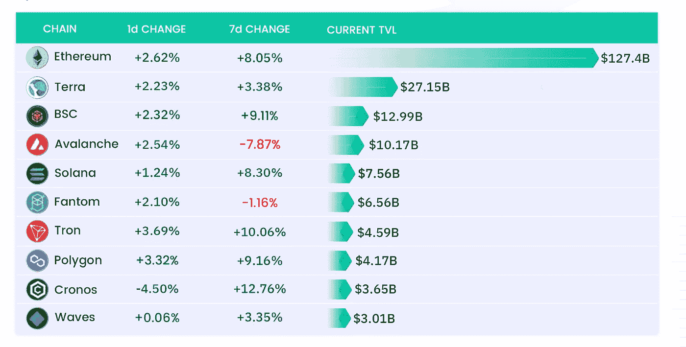
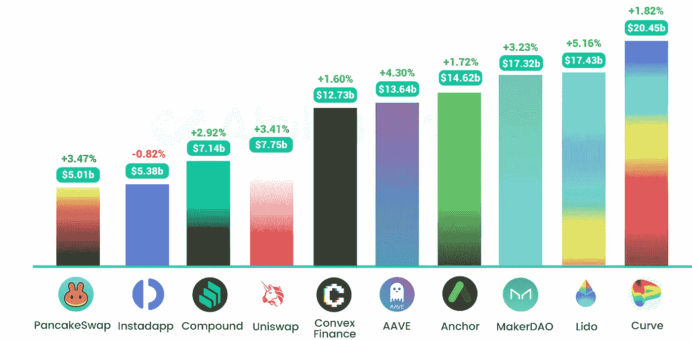
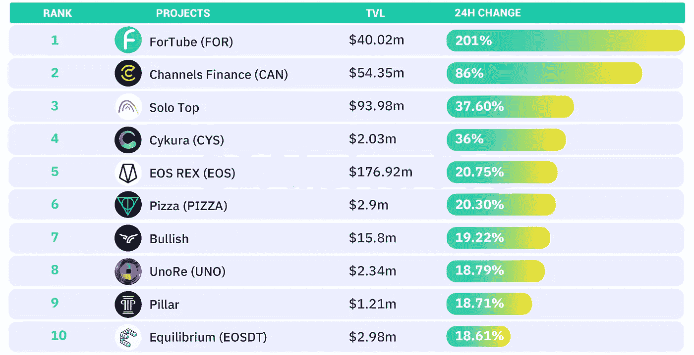
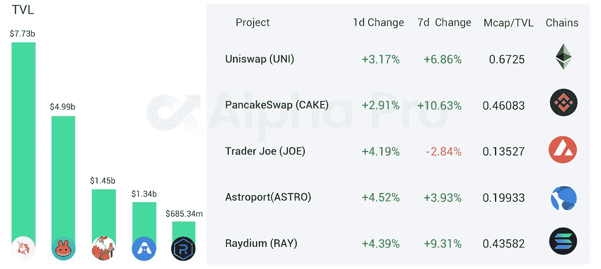
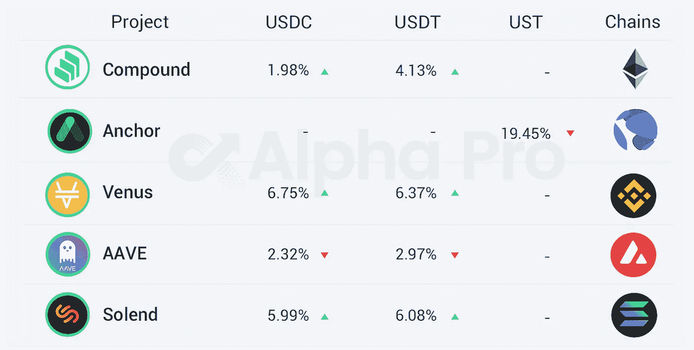

# NFT 市场已经见顶了吗？取决于你问谁

> 原文：<https://medium.com/coinmonks/defi-insight-has-the-nft-market-peaked-depends-on-who-you-ask-bc159fa9536f?source=collection_archive---------54----------------------->

## 2022 年 3 月 28 日

*今日 DeFi 数据&由 DeFi Insight 为您带来的新闻。*

> 区块链分析公司 Chainalysis 的数据显示，3 月份 NFTs 的平均周交易量比 2 月份下降了 54%。根据 NFT 数据聚合公司 Nonfungible 的数据，3 月份记录的 NFT 卖家数量只有 7219 个，比 1 月份的 21296 个大幅下降。同期，买家数量也从 28，207 人降至 7，894 人。DappRadar 首席分析师 Pedro Herrara 表示，由于地缘政治的不确定性和货币政策的收紧，避险情绪正在 NFT 市场蔓延。【 [**来源**](https://finance.yahoo.com/news/nft-market-peaked-223733954.html)

# 最新消息

## 定义

谷歌趋势数据:[加密搜索](https://beincrypto.com/google-trend-data-shows-crypto-interest-plunged-80-us/)对美国的兴趣下降了 80%

英国警方向[诈骗受害者返还被盗加密货币](https://usethebitcoin.com/british-police-return-stolen-cryptocurrency-to-scam-victims/)

比特币基地[收购巴西最大加密交易所的所有者 2TM 集团](https://www.coindesk.com/business/2022/03/27/coinbase-said-near-deal-to-buy-owner-of-brazils-largest-crypto-exchange-report/)

英国将在未来几周透露[加密监管](https://www.cnbc.com/2022/03/27/crypto-britain-to-reveal-stablecoin-regulation-plans-sources-say.html)计划

索拉纳的市值超过 355 亿美元

DefiLlama 推出[“令牌水龙头”](https://twitter.com/DefiLlama/status/1508163494713212929)

## 稳定币

**秘密网络创始人寻求复制 [UST 经济模式](https://forum.scrt.network/t/scrt-as-a-focal-currency/5683)**

**雪崩链上的 USDC 发行突破 9 亿美元创历史新高**

## **打桩**

****押在利多的 ETH 比[莱特币](https://twitter.com/ASvanevik/status/1507667479824412672)大****

****黑豹修复多边形打桩 bug，提取[200 万 ZKP](https://www.aliens.com/livenews/latest/panther-fixes-polygon-staking-bug-withdraws-2-million-zkp-to-pay-rewards) 支付奖励****

## ****空投****

******A16z 宣布推出使用零知识证明技术的[空投认领工具](https://a16z.com/2022/03/27/crypto-airdrop-privacy-tool-zero-knowledge-proofs/)******

## ******公共产品******

********/**DeFi public product[JPEG ' d](https://twitter.com/JPEGd_69/status/1508140380059017224)提议在 CVX 购买 1500 万美元用于流动性池投票******

## ****ETP****

******、**由 [ETC 集团](https://u.today/avalanche-cosmos-and-polygon-etps-launched-by-etc-group)推出的 Avalanche、Cosmos 和 Polygon ETPs****

## ****|警报****

******,**死后:[收银员黑掉](/@saberlabs/postmortem-cashio-hack-ecaf45301f48)****

## ****鲸鱼****

****以太坊的长期持有者在几周内就在 ETH 积累了 120 亿美元****

## ****NFT****

****BAYC 市值突破 35 亿美元****

******[女人世界银河](https://nftgo.io/collection/world-of-women-galaxy/overview)总交易额突破 5000 万美元******

********Real Vision 首席执行官 [Raoul Pal](https://raoulpal.substack.com/p/the-monkey-network?utm_source=twitter&s=r) 以 140 ETH 收购 BAYC #7894********

# ******数据和分析******

## ******TVL 和 ATH 排名前六的连锁酒店对比******

************

## ******TVL 增长排名前 10 的连锁店******

************

## ******最新 TVL 十大项目******

************

## ******过去 24 小时 TVL 变化的前 10 个项目******

************

## ******德克斯 TVL 排名******

******指数中涨幅最大的是 [Astroport](https://defillama.com/protocol/astroport) ，上涨 4.52 **%********

********

## ****APY DeFi 贷款公司****

*****USDC:最高贷款利率:*[*V*enus](https://app.venus.io/market)*6.75% APY*****

*****USDT:最高贷款利率:*[*V*enus](https://app.venus.io/market)*6.37% APY*****

********

# ****深潜****

****合并会杀死第一层的 alt [**吗？**](https://www.thedefiedge.com/will-the-merge-kill-alt-layer-1s/)****

**** [## 合并会杀死第一层吗？

### 以太坊的“合并”将于 6 月 22 日到来。很多人都在想，“所有的……会发生什么事情？”

www.thedefiedge.com](https://www.thedefiedge.com/will-the-merge-kill-alt-layer-1s/) 

**[**战俘与战俘辩论**](https://shows.banklesshq.com/p/the-pow-vs-pos-debate-lyn-alden-and?s=r) **|林恩·奥尔登&贾斯汀·德雷克****

** [## 权力与权力之争|林恩·奥尔登&贾斯汀·德雷克

### 加入无银行优质收听这一集的无广告版本，并听取瑞安和大卫的独家汇报…

shows.banklesshq.com](https://shows.banklesshq.com/p/the-pow-vs-pos-debate-lyn-alden-and?s=r) 

**如何阅读** [**智能合约**](https://defieducation.substack.com/p/how-to-read-smart-contracts-part-a6e?s=r)

 [## 如何阅读智能合同第 1 部分

### 欢迎头像！今天我们有一篇来自 BowTiedPickle 的关于如何阅读智能合同的客座博文。第一部分经历了…

defieducation.substack.com](https://defieducation.substack.com/p/how-to-read-smart-contracts-part?s=r)  [## 如何阅读智能合同第 2 部分

### 欢迎头像！今天，我们继续 BowTiedPickle 关于如何阅读智能合同的客座博文的第二部分。公平…

defieducation.substack.com](https://defieducation.substack.com/p/how-to-read-smart-contracts-part-a6e?s=r) 

# 报告

**《米娜协议》——小而强@messari.io**

> 传统的区块链在存储不断增长的数据方面效率低下。这种状态膨胀的问题负面地影响了网络的去中心化，因为较少的用户能够参与链验证。Mina 协议是新一代的第一层区块链，它解决了状态膨胀的问题。Mina 使用 zk-SNARKs 的强大功能保持大约 11 kB 的固定小大小。除了去中心化，zk-SNARKs 还让米娜比其他连锁店更私人、更高效。
> 其他新一代区块链针对区块链三难困境中的可扩展性进行了优化，在流程的分散化方面做出了妥协；Mina 优先考虑权力下放。理论上，任何智能手机或浏览器都可以在 Mina 上运行完整的节点。然而，Mina 的许多开创性功能仍在开发中。产品路线图雄心勃勃；团队的交付能力将决定协议的成功。

一场一场**的较量:**

DeFi Insight 是顶级 DeFi 和加密新闻和更新的来源。

**https://twitter.com/AlphaPro_io 推特:**

****❤RSS:**[**https://medium.com/feed/@alphapro.project**](https://medium.com/feed/@alphapro.project)**

**提供的信息应被视为发展新闻，而不是投资建议。**

> **加入 Coinmonks [电报频道](https://t.me/coincodecap)和 [Youtube 频道](https://www.youtube.com/c/coinmonks/videos)了解加密交易和投资**

# **另外，阅读**

*   **[我的加密副本交易经历](/coinmonks/my-experience-with-crypto-copy-trading-d6feb2ce3ac5) | [比特币基地评论](/coinmonks/coinbase-review-6ef4e0f56064)**
*   **[CoinFLEX 评论](https://coincodecap.com/coinflex-review) | [AEX 交易所评论](https://coincodecap.com/aex-exchange-review) | [UPbit 评论](https://coincodecap.com/upbit-review)**
*   **[AscendEx 保证金交易](https://coincodecap.com/ascendex-margin-trading) | [Bitfinex 赌注](https://coincodecap.com/bitfinex-staking) | [bitFlyer 点评](https://coincodecap.com/bitflyer-review)**
*   **[麻雀交换评论](https://coincodecap.com/sparrow-exchange-review) | [纳什交换评论](https://coincodecap.com/nash-exchange-review)**
*   **[维护卡审核](https://coincodecap.com/uphold-card-review) | [信任钱包 vs 元掩码](https://coincodecap.com/trust-wallet-vs-metamask)**
*   **[Exness 评测](https://coincodecap.com/exness-review)|[moon xbt Vs bit get Vs Bingbon](https://coincodecap.com/bingbon-vs-bitget-vs-moonxbt)********