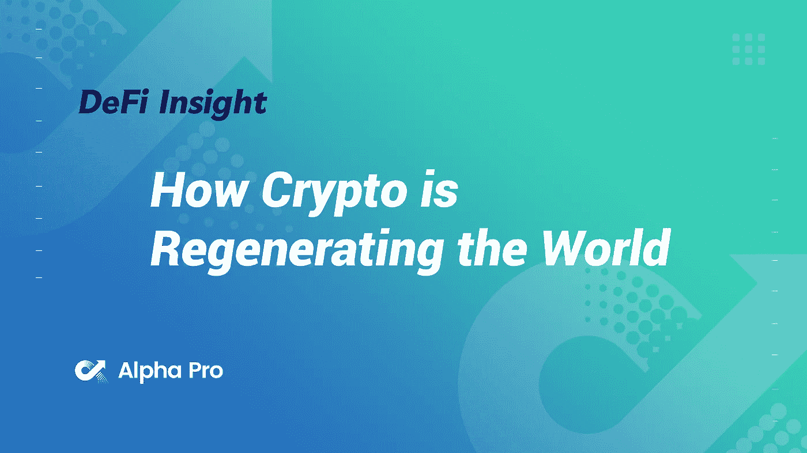
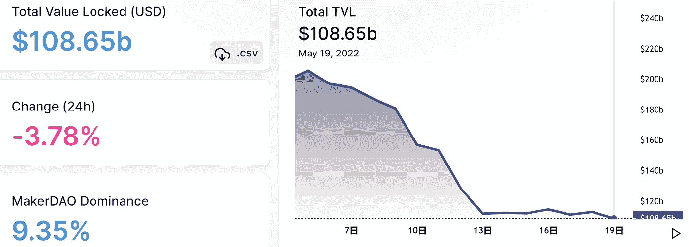
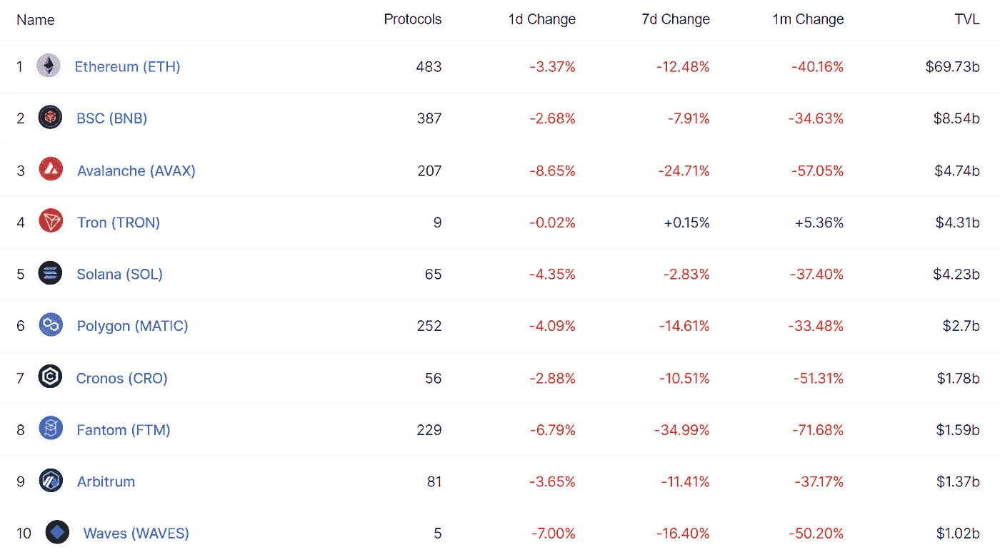
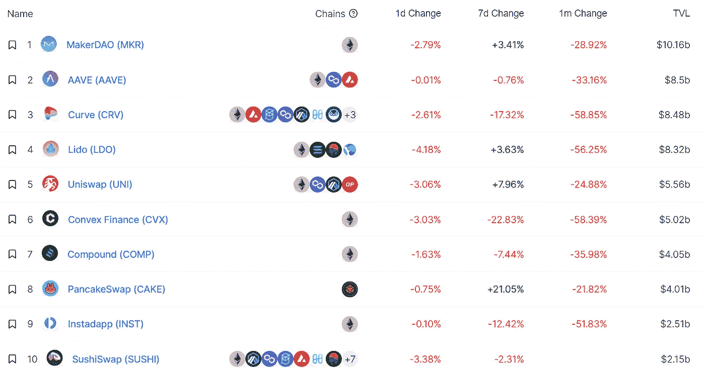
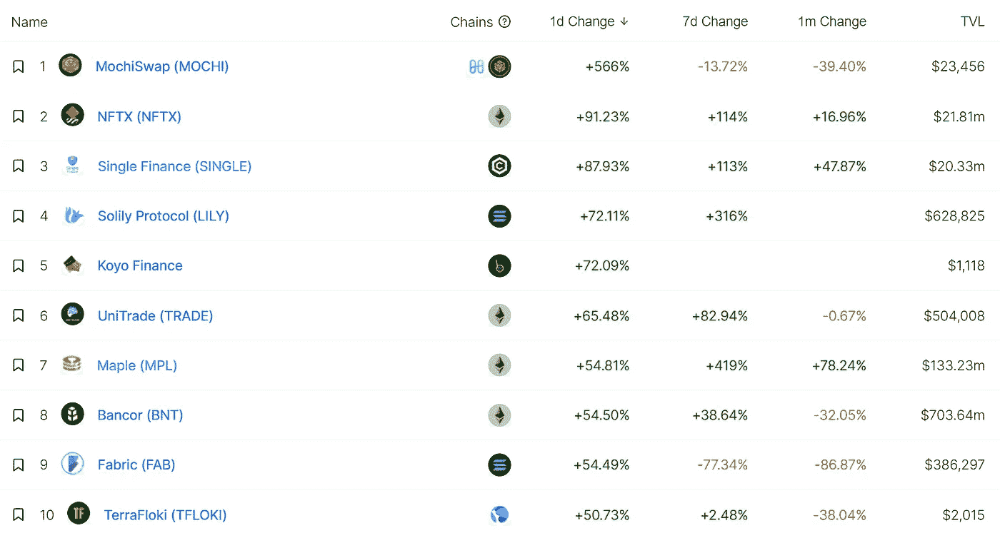
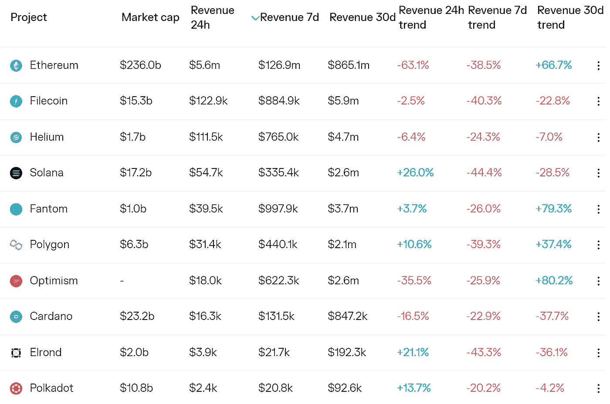
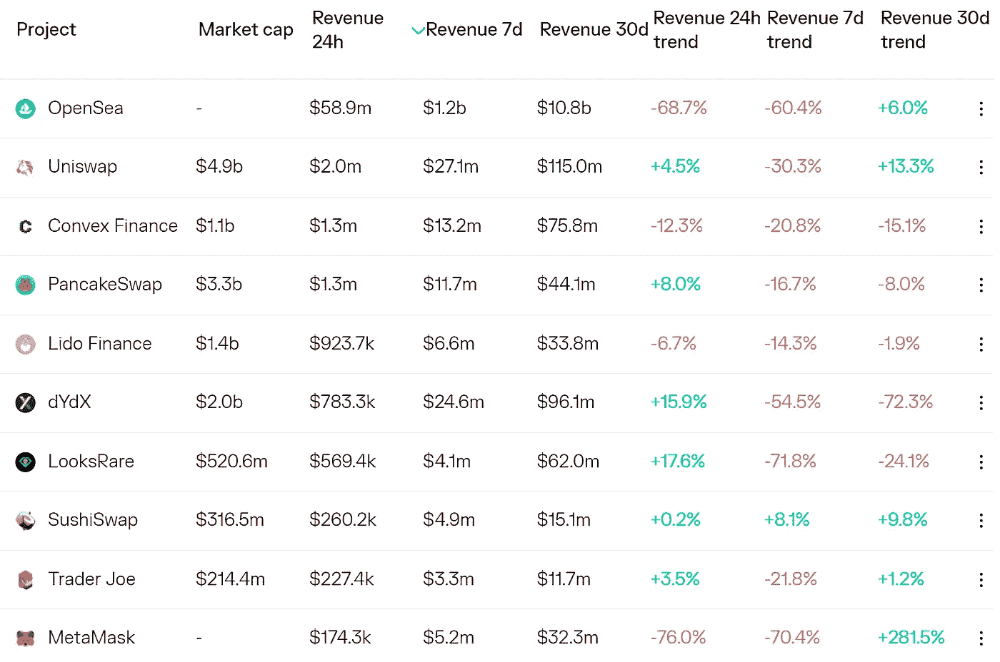
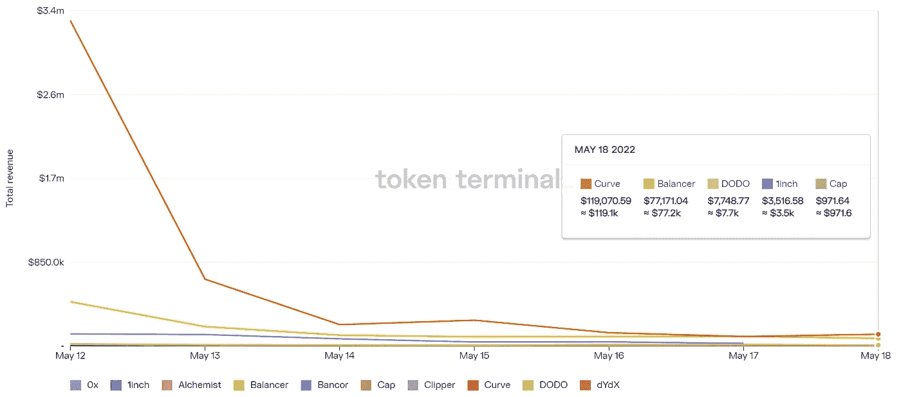
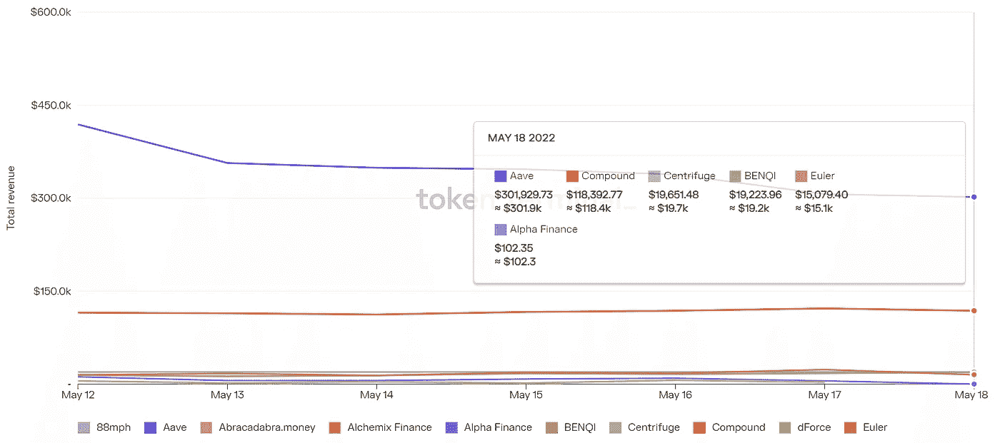

# DeFi Insight |加密如何重塑世界

> 原文：<https://medium.com/coinmonks/defi-insight-how-crypto-is-regenerating-the-world-542a29e0a0a9?source=collection_archive---------32----------------------->

2022 年 5 月 19 日

*今日 DeFi 数据&由 DeFi Insight 为您带来的新闻。*

> *"* 如今，许多进入 crypto 的人都被它所吸引，因为他们的好奇心被高 APYs 和比特币/NFT 百万富翁的故事所激起。
> 
> 在致富捷径的诱惑下，许多人为了追求一夜暴富而首次涉足 Web3。如果你只对这个感兴趣，没问题。
> 
> 但是，如果这就是 Web3 必须向世界提供的全部，那么对于金融界之外的任何人来说，它都不会是一个令人信服的卖点。
> 
> 更重要的是，它不值得关注。*“@*[*来源*](https://newsletter.banklesshq.com/p/how-crypto-is-regenerating-the-world?utm_source=%2Finbox&utm_medium=reader2&s=r)

# 最新消息

## 贷款

**[Aave](https://twitter.com/Blockworks_/status/1526935147089735683)正在内部测试使用非金融债券作为抵押品**

****/**使用[结实的](https://sturdyfinance.medium.com/earn-10x-more-yield-on-your-curve-lp-tokens-with-sturdy-515435ca7408)在您的曲线 LP 代币上赚取 10 倍以上的收益**

## **指标**

*******制度性 DeFi 的促成者？数据公司 [Kaiko](https://www.coindesk.com/business/2022/05/19/institutional-defi-enabler-data-firm-kaiko-probes-dex-liquidity-with-new-product/) 用新产品探索指数流动性**

## **产量**

**基于索拉纳的 DeFi 协议[奇异市场](https://twitter.com/exotic_markets_/status/1526965213395820547?s=21&t=0MW3lEbgKWdM2RAEv0U4Tw)现已在 Mainnet 上线**

## **外汇**

****[比特币基地](https://twitter.com/CoinbaseAssets/status/1526954657763020801)要列出美元流量****

****比特币基地组建[秘密智囊团](https://www.coindesk.com/business/2022/05/18/coinbase-forms-crypto-think-tank-names-hermine-wong-as-director/)，任命黄敏贤为主任****

## ****稳定币****

****到目前为止，Stablecoins 是 Crypto 的黑仔应用——只是不是 Terra****

******[银河数码创始人](https://twitter.com/GalaxyDigitalHQ/status/1526986040514433024?s=20&t=hdqeK0sAUw-A1yqeCTyzTQ)发布公开信******

********[曲线](https://gov.curve.fi/t/proposal-to-remove-ust-pool-gauges/3939)社区提议移除$UST 池量表********

********Fantom 的[尖叫](https://thedefiant.io/scream-fantom-bad-debt/)在算法稳定积分导致坏账后下跌 50%********

## ******交叉链******

********先睹为快[跨越‘V2](/across-protocol/a-sneak-peek-into-across-v2-2b4d0bd95b97)********

## ******第二层******

********倒计时[阿兹特克连接](/aztec-protocol/countdown-to-aztec-connect-b7b754b1e539)********

## ******测试网******

********以太坊的主[测试网](https://www.theblockcrypto.com/post/147604/ethereums-main-testnet-set-for-proof-of-stake-merge-in-early-june)定于六月初进行股权证明合并********

## ******提议******

********[ape coin](https://snapshot.org/#/apecoin.eth)完成对两个社群提案的投票********

## ******政策与法规******

******CFTC 主席表示该机构将加强加密执法:报告******

******巴拿马总统将拒绝签署当前形式的加密法******

******商务部有 17 个问题来帮助开发一个加密框架******

## ******基金******

********【3B】的 6 亿美元小费本月流向了元宇宙和 Web3 gaming********

********[coins . ph](https://youker.info/coins-ph-raises-30m-in-series-c-funding-to-accelerate-investment-in-web3-and-further-expand-its-presence-in-southeast-asia/)在 C 轮融资中筹集 3000 万美元，以加速对 Web3 的投资，并进一步扩大其在东南亚的业务********

********[node real](https://www.digitaljournal.com/pr/nodereal-announces-16m-in-series-a-funding-led-by-sky9-capital-to-build-one-stop-infrastructure-for-web3)宣布获得由 Sky9 Capital 领投的 1600 万美元首轮融资，为 Web3 打造一站式基础设施********

## ******观点******

********CFTC 首脑[抱怨](https://u.today/cftc-head-complains-about-bitcoins-energy-use)比特币的能源使用********

********/**关于美国为什么需要[网络 3 监管改革的两党案例](https://forkast.news/why-we-need-better-web3-regulations/)******

# ****数据和分析****

## ****锁定的总价值(TVL)****

****目前全网 DeFi 总锁定量为 1086.5 亿美元，24 小时下降 3.78%。****

********

## ****TVL 评出的十大连锁酒店****

********

## ****|最新 TVL 十大项目****

********

## ****|过去 24 小时内 TVL 增长的前 10 个项目****

********

## ****协议收入****

## ****|累计总收入最高的项目(24H)_ 区块链(L1)****

********

## ****|累计总收入最高的项目(24H) _Dapps (L2)****

********

## ****|前 10 大交易所的每日收入****

********

## ****|十大贷款协议的每日收入****

********

# ****深潜****

******Crypto 中的** [**熊市**](https://www.barrons.com/articles/stock-investors-are-now-starting-to-feel-the-5-stages-of-bear-market-grief-11652774279) **正在消灭潜在用途******

**** [## 股票投资者现在开始感受到熊市悲伤的 5 个阶段

### 股市的熊市还没有结束。事实上，它可能还有很长的路要走。这是因为——即使标准普尔 500 有 16%……

www.barrons.com](https://www.barrons.com/articles/stock-investors-are-now-starting-to-feel-the-5-stages-of-bear-market-grief-11652774279) 

**[**死亡螺旋**](https://www.wsj.com/podcasts/the-journal/the-death-spiral-of-a-stablecoin/6c09080e-ee6e-4dd9-9a1d-78eb20034679?mod=Searchresults_pos5&page=1) **【稳定币】中的一个****

** [## 一个稳定的“死亡螺旋”——日记。-《华尔街日报》播客

### 加密货币不稳定，但所谓的稳定货币应该是例外。但是一个专业之后…

www.wsj.com](https://www.wsj.com/podcasts/the-journal/the-death-spiral-of-a-stablecoin/6c09080e-ee6e-4dd9-9a1d-78eb20034679?mod=Searchresults_pos5&page=1) 

**背后**[**zkLend**](https://cryptoslate.com/behind-zklend-a-dual-solution-money-market-protocol-for-institutions-and-retail/)**，一个面向机构和散户的双重解决方案货币市场协议**

 [## zkLend 背后，面向机构和零售的双重解决方案货币市场协议| CryptoSlate

### zkLend 是建立在 StarkNet 基础上的 L2 货币市场协议，结合了 zk-rollups 和以太坊的优点，带来了更多…

cryptoslate.com](https://cryptoslate.com/behind-zklend-a-dual-solution-money-market-protocol-for-institutions-and-retail/) 

**[**加密货币抛售**](https://www.economist.com/leaders/2022/05/18/the-cryptocurrency-sell-off-has-exposed-those-swimming-naked) **暴露了那些裸泳者****

** [## 加密货币抛售暴露了那些裸泳者

### 在每个金融周期，投资者都会抛出金融格言。想想“买谣言，卖事实”…

www.economist.com](https://www.economist.com/leaders/2022/05/18/the-cryptocurrency-sell-off-has-exposed-those-swimming-naked)** 

# **报告**

****解剖** [**验证器**](https://coinshares.com/research/the-anatomy-of-validator-yield) **产量** _coinshares**

> **如果您关注加密货币，您可能会遇到与各种加密资产和应用程序相关的术语“赌注”。随着生态系统的发展，我们发现“跑马圈地”这个词已经变成了一个更宽泛的术语，指的是用户之间的多种不同做法，这导致了本已复杂的行业出现混乱。**

****[**上周的学习**](https://members.delphidigital.io/reports/learnings-from-last-week)**_ Delphi digital******

********Messari**[**介绍**](https://messari.io/article/messari-introduces-upgraded-version-of-web3-governance-platform-governor) **升级版 Web3 治理平台总督** _messari******

******打开** [**技术电源**](https://www.theblockresearch.com/on-the-tech-powering-decentralized-storage-145960) **分散存储**_ 阻塞研究****

******关于:******

****DeFi Insight 是顶级 DeFi 和加密新闻和更新的来源。****

******https://twitter.com/AlphaPro_io**❤****

********❤RSS:**[**https://medium.com/feed/@alphapro.project**](https://medium.com/feed/@alphapro.project)******

****提供的信息应被视为发展新闻，而不是投资建议。****

> ****加入 Coinmonks [电报频道](https://t.me/coincodecap)和 [Youtube 频道](https://www.youtube.com/c/coinmonks/videos)了解加密交易和投资****

# ****另外，阅读****

*   ****[Bookmap 点评](https://coincodecap.com/bookmap-review-2021-best-trading-software) | [美国五大最佳数字加密货币交易所](https://coincodecap.com/crypto-exchange-usa)****
*   ****[如何在 FTX 期货交易所进行期货交易](https://coincodecap.com/ftx-futures-trading) | [OKEx vs 币安](https://coincodecap.com/okex-vs-binance)****
*   ****[coin loan Review](https://coincodecap.com/coinloan-review)|[you hodler Review](/coinmonks/youhodler-4-easy-ways-to-make-money-98969b9689f2)|[block fi Review](https://coincodecap.com/blockfi-review)****
*   ****[为《币安评论》获利贸易 PP](https://coincodecap.com/profittradingapp-for-binance)|为《XT.COM 评论》获利贸易 PP****
*   ****[SmithBot 点评](https://coincodecap.com/smithbot-review) | [4 款最佳自由开源交易机器人](https://coincodecap.com/free-open-source-trading-bots)**********