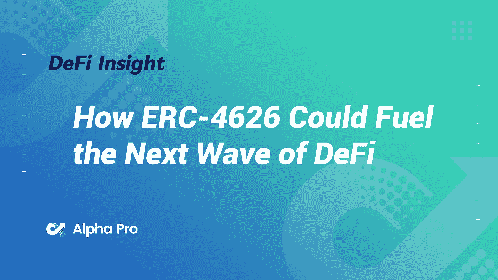
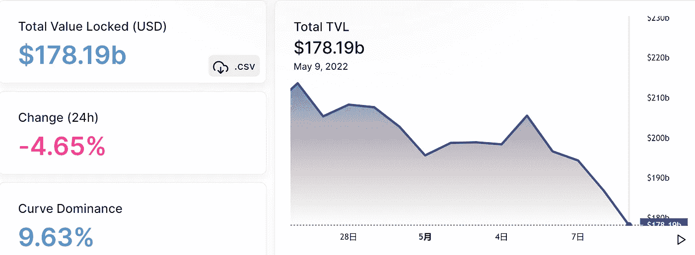
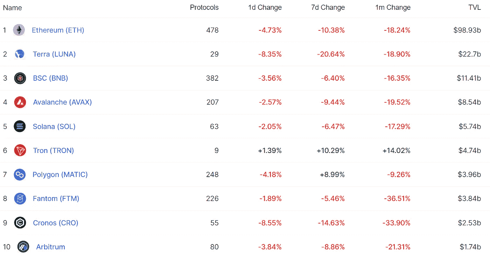
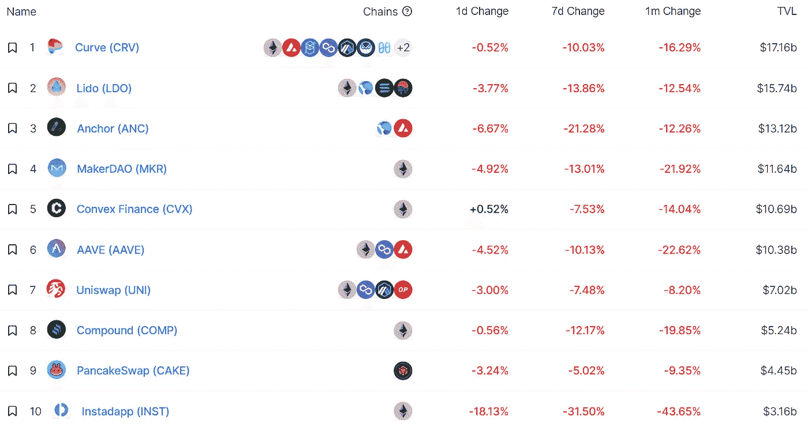
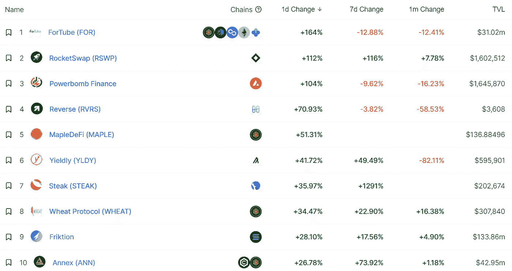
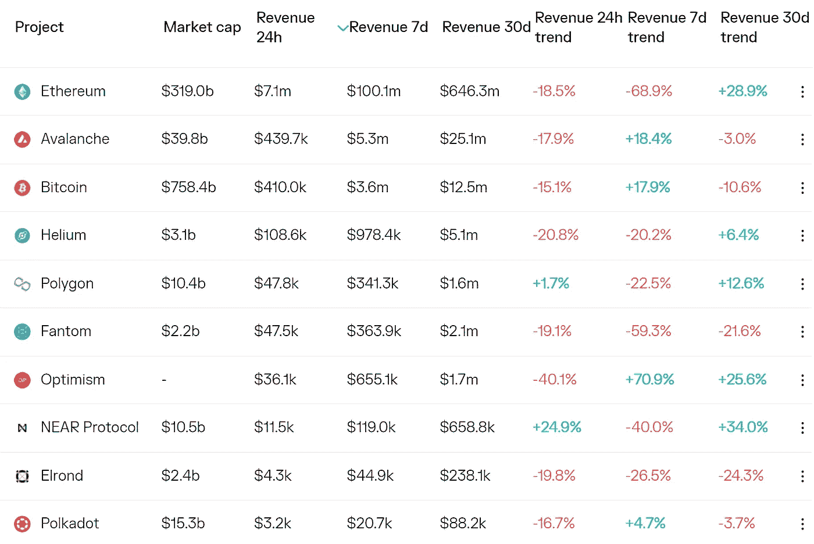
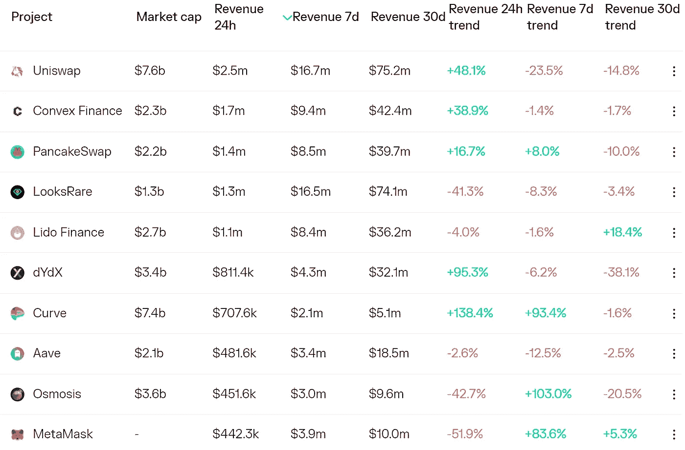
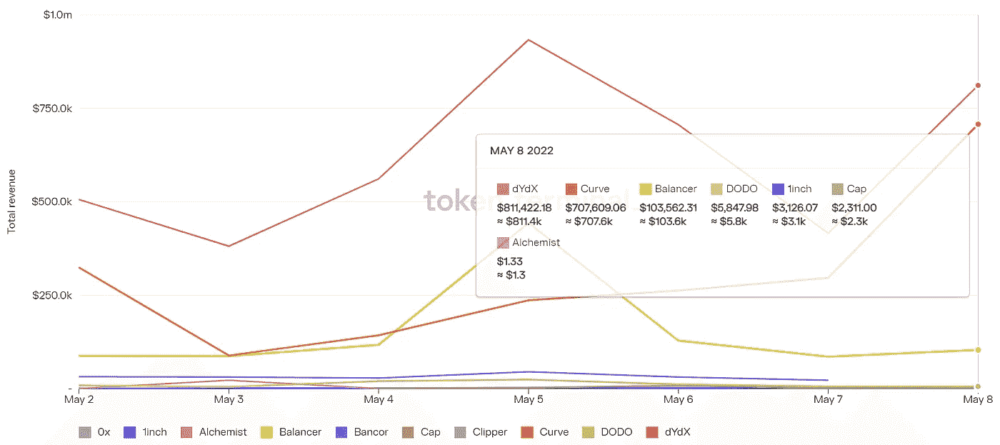
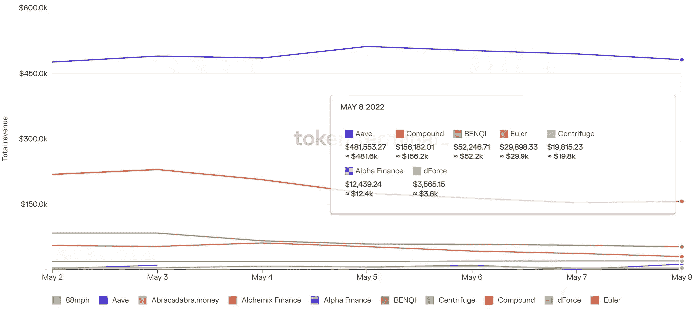

# DeFi Insight | ERC-4626 如何推动下一波 DeFi

> 原文：<https://medium.com/coinmonks/defi-insight-how-erc-4626-could-fuel-the-next-wave-of-defi-950b1f60f357?source=collection_archive---------47----------------------->

2022 年 5 月 9 日

*今日 DeFi 数据&由 DeFi Insight 为您带来的新闻。*

> *"* 建立在 ERC-4626 保险库之上的应用程序可以与所有的 ERC-4626 保险库一起工作，使集成和创新变得更加容易。*“@*[*来源*](https://decrypt.co/99695/how-erc-4626-could-fuel-next-wave-of-defi)

# 最新消息

## 贷款

**[火星协议](https://twitter.com/mars_protocol/status/1522941757939654661) : ANC-UST 矿业战略收入上限增至 1000 万 UST**

## **指标**

****[RAW DAO](https://www.rawdao.zone/vote/1)发起对 Junoswap 启用流动性奖励的议案表决****

******由前 SushiSwap 开发商开发的 O2Dex DEX 产品[将于](https://cointelegraph.com/press-releases/o2dex-dex-product-by-ex-sushiswap-developers-launching-may-public-beta)五月推出公测版******

******多协议分散式交换机将在 Cardano 上推出它的 DEX******

******预计 Bancor 3 将于本周上线******

## ******稳定币******

********[道权](https://twitter.com/stablekwon/status/1523315720012001282) : Terraform 实验室从曲线上移除了 1.5 亿美元的 UST，为 4 号池做准备********

## ******测试网******

********、** Web3 基础设施启动 [Mysten Labs](https://twitter.com/Mysten_Labs/status/1522276310554394626) 发布 Sui testnet Sui DevNet******

## ****|令牌****

******、**、[、$LUNA](https://terra.smartstake.io/history/180) 供液昨天一天就加了 95 万多****

******[zkSync](https://docs.zksync.io/userdocs/tokenomics.html)宣布令牌启动******

## ******钱包******

******智慧树将其即将推出的加密钱包定位为“下一个 20 亿”******

## ******空投******

********[bike rush](https://twitter.com/BikeRush_/status/1523226836443967490)完成了创世纪 NFT 空投的第一轮，并将很快开放应用测试门户********

********[涂鸦](https://twitter.com/doodles/status/1523444112996724736)于 5 月 12 日向持有者空投涂鸦者********

## ******|警报******

********堡垒协议涉嫌[被攻击](https://twitter.com/PeckShieldAlert/status/1523489670323404800)，1,048 ETH 和 40 万戴转龙卷风现金********

## ******NFT******

********[Meta 的 Instagram](https://www.coindesk.com/business/2022/05/08/metas-instagram-to-support-nfts-from-ethereum-polygon-solana-flow/) 支持来自以太坊、多边形、索拉纳、流的 NFTs********

******索拉纳在 NFT 的交易总额超过 21 亿美元******

# ******数据和分析******

## ******锁定的总价值(TVL)******

******目前全网 DeFi 总锁定量为 1781.9 亿美元，24 小时下降 4.65%。******

************

## ******TVL 评出的十大连锁酒店******

************

## ******|最新 TVL 十大项目******

************

## ******|过去 24 小时内 TVL 增长的前 10 个项目******

************

## ******协议收入******

## ******|累计总收入最高的项目(24H)_ 区块链(L1)******

************

## ******|累计总收入最高的项目(24H) _Dapps(L2)******

************

## ******|前 10 大交易所的每日收入******

************

## ******|十大贷款协议的每日收入******

************

# ******深潜******

********[**经济**](https://www.readthegeneralist.com/briefing/social-tokens) **你的**********

**** [## 你|多面手的经济

### FTX 是世界上我最喜欢的公司之一。他们的 FTX 美国应用改变了国内加密投资者的游戏规则。为什么…

www.readthegeneralist.com](https://www.readthegeneralist.com/briefing/social-tokens) 

**[**设计**](https://lyceumgg.substack.com/p/designing-a-sustainable-game-economy?utm_source=%2Finbox&utm_medium=reader2&s=r) **可持续的游戏经济****

** [## 设计可持续的游戏经济

### 在之前的博文中，我们主要关注了迄今为止 web3 游戏经济所经历的各种挑战。在…

lyceumgg.substack.com](https://lyceumgg.substack.com/p/designing-a-sustainable-game-economy?utm_source=%2Finbox&utm_medium=reader2&s=r) 

**1q 22 VC**[**资金市场**](/@richard.galvin/1q22-vc-funding-market-42daa0a8574d)

 [## 1Q22 风险投资融资市场

### 摘要

medium.com](/@richard.galvin/1q22-vc-funding-market-42daa0a8574d) 

# 报告

**A**[**Look**](https://messari.io/article/a-look-at-web3-infra-token-incentives)**At web 3 Infra Token 奖励** _messari

> 代币激励是启动冷启动问题和初始化双边市场的强大机制。
> 
> 然而，各种 Web3 基础设施协议每个季度都在燃烧数千万到数亿的令牌激励。
> 
> Web3 基础设施协议需要分析它们的令牌激励，并确定它们从激励中产生的具体价值。此外，随着协议的扩展，协议需要动态地调整它们的激励。

**关于:**

DeFi Insight 是顶级 DeFi 和加密新闻和更新的来源。

**https://twitter.com/AlphaPro_io 推特:**

****❤RSS:**[**https://medium.com/feed/@alphapro.project**](https://medium.com/feed/@alphapro.project)**

**提供的信息应被视为发展新闻，而不是投资建议。**

> **加入 Coinmonks [电报频道](https://t.me/coincodecap)和 [Youtube 频道](https://www.youtube.com/c/coinmonks/videos)了解加密交易和投资**

# **另外，阅读**

*   **[最佳比特币保证金交易](/coinmonks/bitcoin-margin-trading-exchange-bcbfcbf7b8e3) | [萝莉点评](/coinmonks/lolli-review-e6ddc7895ad8) | [比特币保证金交易](https://coincodecap.com/bityard-margin-trading)**
*   **[创造并出售你的第一个 NFT](https://coincodecap.com/create-nft) | [密码交易机器人](https://coincodecap.com/best-crypto-trading-bots)**
*   **如何在 CoinDCX 上购买柴犬(SHIB)硬币？**
*   **[CBET 评论](https://coincodecap.com/cbet-casino-review) | [库科恩 vs 比特币基地](https://coincodecap.com/kucoin-vs-coinbase) | [拜比特 vs 比特币基地](https://coincodecap.com/bybit-vs-coinbase)**
*   **[折叠 App 回顾](https://coincodecap.com/fold-app-review) | [本地比特币回顾](/coinmonks/localbitcoins-review-6cc001c6ed56) | [Bybit vs 币安](https://coincodecap.com/bybit-binance-moonxbt)********