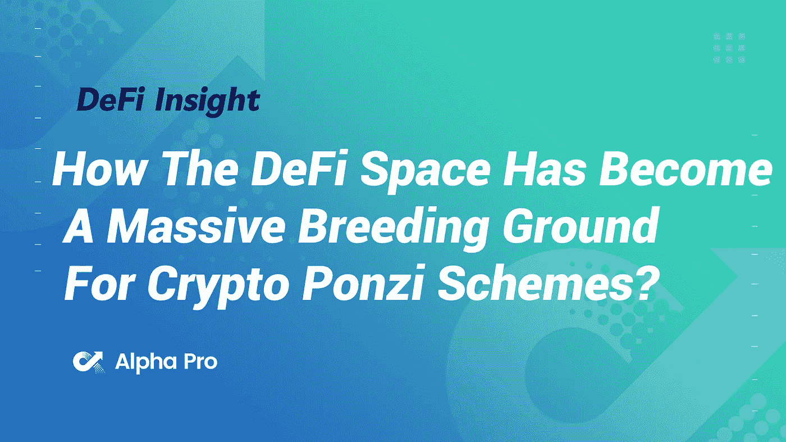
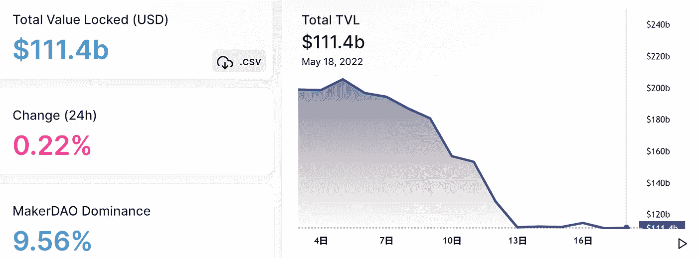
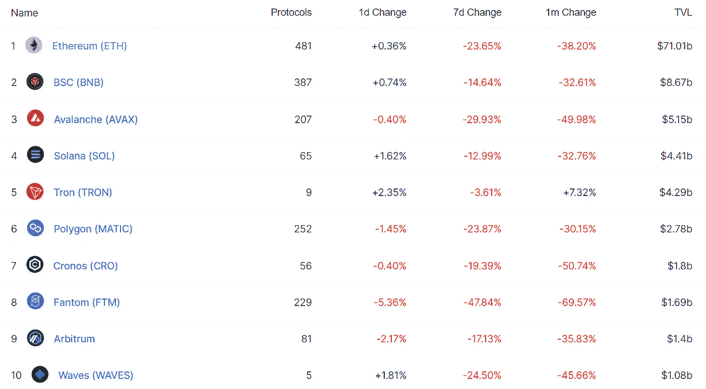
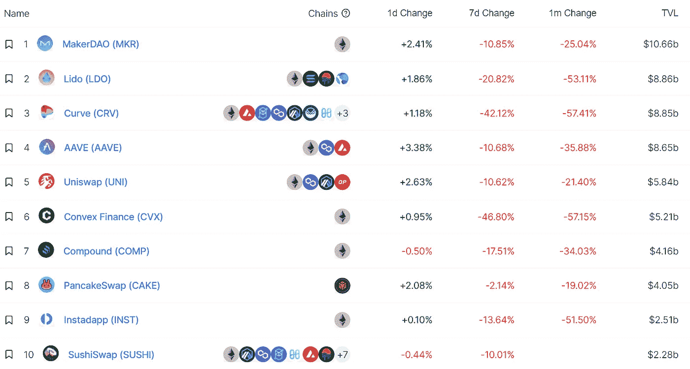
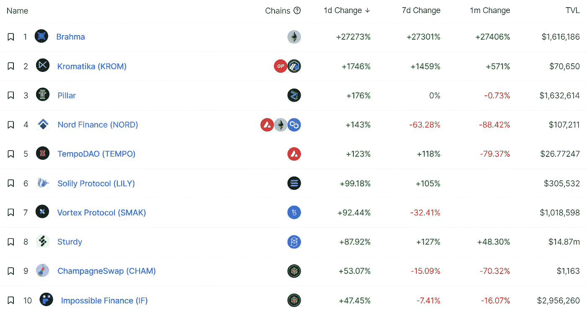
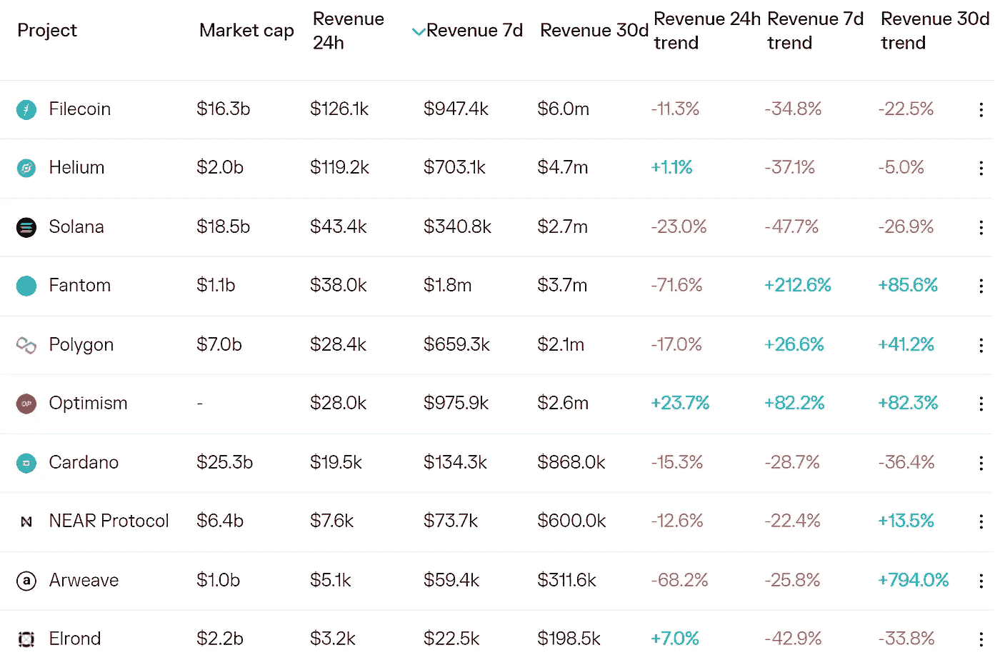
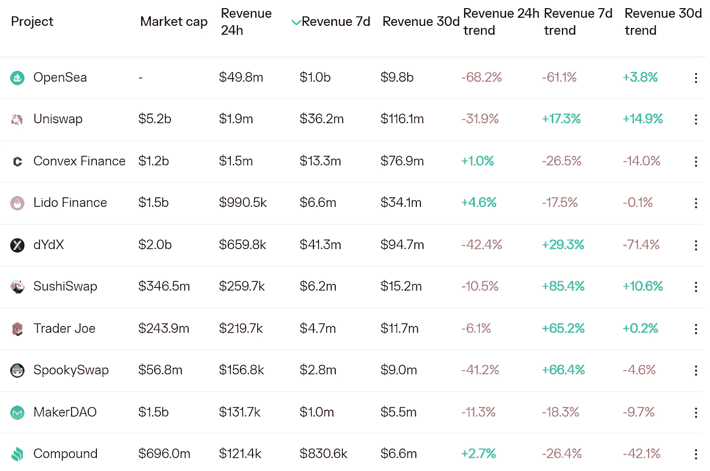
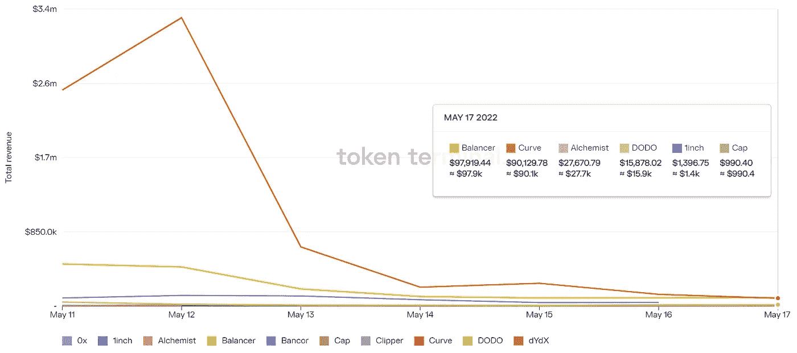
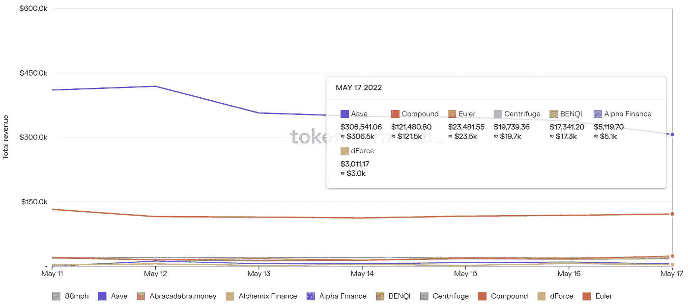

# DeFi Insight | DeFi 空间如何成为加密庞氏骗局的大量滋生地

> 原文：<https://medium.com/coinmonks/defi-insight-how-the-defi-space-has-become-a-massive-breeding-ground-for-crypto-ponzi-schemes-8309d58c4ca5?source=collection_archive---------23----------------------->

2022 年 5 月 18 日

*今日 DeFi 数据&由 DeFi Insight 为您带来的新闻。*

> *"* 近来，大量庞氏骗局利用分散金融(DeFi)基础设施来欺诈客户。本文探讨了 DeFi 生态系统，以及欺诈者如何能够利用它来窃取加密新手的信息。*“@*[*来源*](https://www.forbes.com/sites/rufaskamau/2022/05/17/how-the-defi-space-has-become-a-massive-breeding-ground-for-crypto-ponzi-schemes/?sh=62664f823e89)

# 最新消息

## 打桩

**企业级液体[标桩](https://blog.coinbase.com/enterprise-grade-liquid-staking-standard-with-support-of-coinbase-cloud-and-figment-3b0c6dbb6210)比特币基地云和 fig 的支持**

## **第二层**

****[这个](https://optimism.mirror.xyz/r888e4B5iiNQi-3_mO26ixgv-plQ099XWgqEOv9iWKA)治理将[自毁](https://optimism.mirror.xyz/r888e4B5iiNQi-3_mO26ixgv-plQ099XWgqEOv9iWKA)****

## ****测试网****

****第二阶段****

## ****钱包****

******[robin hood](https://www.theblockcrypto.com/linked/147333/robinhood-launches-defi-wallet-to-rival-metamask)推出 DeFi 钱包与 Metamask 竞争******

********[总账](https://twitter.com/Ledger/status/1526640176730087424)添加浏览器扩展，将硬件钱包连接到 Web3 应用********

********币安将于 5 月 19 日对多个网络进行[钱包维护](https://twitter.com/binance/status/1526747121667297280?s=20&t=LBqd_FDGx94hxo3kEaJ1MA)********

********/**[bit keep](https://blog.bitkeep.com/en/?p=694)将 PlatON (LAT)添加到其支持的 mainnets 列表中******

******[火币钱包](https://www.benzinga.com/pressreleases/22/05/n27269987/huobi-wallet-transforms-to-itoken-adds-decentralized-investment-services)转型 iToken，增加分散投资服务******

## ******|警报******

********[PeckShieldAlert](https://twitter.com/PeckShieldAlert/status/1526748738068156417):几个 NFT 的不和妥协了********

## ******政策与法规******

******法国央行行长表示，七国集团计划讨论加密法规******

******“智能合同”会统治世界吗？也许不在[新加坡](https://forkast.news/will-smart-contracts-rule-the-world/)******

******韩国立法机构正在考虑新的加密许可制度******

## ******NFT******

********Getty Images 将通过 Candy Digital 在 Palm 上推出首款 [NFTs](https://decrypt.co/100681/getty-images-to-launch-first-nfts-on-palm-through-candy-digital)********

********智能令牌实验室支持卡拉·陈和拉·普雷里首发 [NFT 落选](https://blocktelegraph.io/smart-token-labs-supports-carla-chan-and-la-prairie-in-first-nft-drop/)********

## ******基金******

******加密管理公司 Ikigai 为专注于 web3 的风险基金筹集了 3000 万美元******

******分散的体育预测市场 UBet 筹集了 270 万美元的资金******

********web 3 加速器 [Seed Club](https://snapshot.org/#/club.eth/proposal/0x182878f44a586f112f1d6757e7267237e7d99c29ce1ebe1f630323a6502a49ef) 完成了一轮 1500 万美元的融资，Multicoin Capital 和其他公司也参与其中********

********[算法](https://news.bitcoin.com/algoracle-announces-1%e2%80%a45-million-seed-round/)宣布$1․5 百万种子轮********

## ******观点******

******亿万富翁投资者[比尔·阿克曼](https://www.msn.com/en-us/money/markets/billionaire-investor-bill-ackman-says-terras-algorithm-sounds-like-the-crypto-version-of-a-pyramid-scheme/ar-AAXpsOI?ocid=BingNewsSearch)说 Terra 的“算法”听起来像是“传销的加密版本”******

# ******数据和分析******

## ******锁定的总价值(TVL)******

******目前全网 DeFi 总锁定量为 1114 亿美元，24 小时增长 0.22%。******

************

## ******TVL 评出的十大连锁酒店******

************

## ******|最新 TVL 十大项目******

************

## ******|过去 24 小时内 TVL 增长的前 10 个项目******

************

## ******协议收入******

## ******|累计总收入最高的项目(24H)_ 区块链(L1)******

************

## ******|累计总收入最高的项目(24H) _Dapps (L2)******

************

## ******|前 10 大交易所的每日收入******

************

## ******|十大贷款协议的每日收入******

************

# ******深潜******

********BeO sin 安全团队:LUNA 撞车和 DeFi“出逃”后** [**对 Web3 的影响**](https://www.digitaljournal.com/pr/beosin-security-team-what-is-the-impact-on-web3-after-lunas-crash-and-defi-fled) **是什么********

**** [## Beosin 安全团队:LUNA 崩溃和 DeFi“出逃”后对 Web3 有什么影响

### 在连续暴跌之后，加密货币 LUNA 的价格已经从 4 月 5 日的 119.5 美元跌至接近零(并且仍然…

www.digitaljournal.com](https://www.digitaljournal.com/pr/beosin-security-team-what-is-the-impact-on-web3-after-lunas-crash-and-defi-fled) 

**在加密残骸**中寻找相对 [**值**](https://seekingalpha.com/article/4512760-relative-value-in-crypto-wreckage)

** [## 在密码残骸中寻找相对价值

### 我们认为，在加密低迷时期，为第 1 层协议建立底价可能会有所帮助。这是我们的…

seekingalpha.com](https://seekingalpha.com/article/4512760-relative-value-in-crypto-wreckage) 

**真正的** [**原因**](https://news.yahoo.com/real-reasons-behind-crypto-crash-223934303.html)**Crypto 崩盘的背后，我们能从 Terra 的陨落中学到什么**

 [## 密码崩溃背后的真正原因，以及我们能从 Terra 的失败中学到什么

### 电脑屏幕显示 UST 的螺旋下降。信贷饶舌琼斯/彭博通过盖蒂图片加密市场是…

news.yahoo.com](https://news.yahoo.com/real-reasons-behind-crypto-crash-223934303.html) 

亚洲先行者:USDC 没有“颠覆”USDT，但交易者的偏好正在改变； [**隐升**](https://www.coindesk.com/markets/2022/05/17/first-mover-asia-usdc-hasnt-flippened-usdt-but-trader-preferences-are-changing-cryptos-rise-despite-bearishness/) **尽管看跌**

 [## 亚洲先行者:USDC 没有“翻转”USDT，但交易者的偏好正在改变；Cryptos 崛起…

### 达马尼克是 CoinDesk 的一名加密市场分析师，他撰写每日市场总结并提供技术分析…

www.coindesk.com](https://www.coindesk.com/markets/2022/05/17/first-mover-asia-usdc-hasnt-flippened-usdt-but-trader-preferences-are-changing-cryptos-rise-despite-bearishness/) 

# 报告

**·8 个最佳 DeFi** [**钱包**](https://www.business2community.com/cryptocurrency/best-defi-wallets) **2022 —顶级 DeFi 钱包对比** _business2community

> 在过去的几年里，分散金融(DeFi)席卷了加密市场，为市场参与者提供了一种无需集中中介即可开展服务的方式。DeFi 钱包是这个不断增长的行业中的一个重要机制，它允许投资者安全地存储他们的资产，并且具有很高的可访问性。
> 
> 本指南将讨论市场上最好的 DeFi 钱包，重点介绍这些钱包是什么以及它们是如何工作的，然后向您展示如何在几分钟内开始使用顶级 DeFi 钱包提供商的产品。

**[**空投**](https://members.delphidigital.io/reports/airdrops-foreign-stablecoin-pools-impermanent-loss-protection-and-virtual-land-harvesting) **、国外稳定共享池、非永久性损失保护和虚拟土地收获** _delphidigital**

****[**算法交易**](https://messari.io/article/algorithmic-trading-landscape) **风景**_ 梅萨里****

******绘制出** [**乐观**](https://www.theblockresearch.com/mapping-out-optimisms-ecosystem-147119) **的生态系统** _theblockresearch****

******关于:******

****DeFi Insight 是顶级 DeFi 和加密新闻和更新的来源。****

******https://twitter.com/AlphaPro_io 推特:******

********❤RSS:**[**https://medium.com/feed/@alphapro.project**](https://medium.com/feed/@alphapro.project)******

****提供的信息应被视为发展新闻，而不是投资建议。****

> ****加入 Coinmonks [电报频道](https://t.me/coincodecap)和 [Youtube 频道](https://www.youtube.com/c/coinmonks/videos)了解加密交易和投资****

# ****另外，阅读****

*   ****[3 商业评论](/coinmonks/3commas-review-an-excellent-crypto-trading-bot-2020-1313a58bec92) | [Pionex 评论](https://coincodecap.com/pionex-review-exchange-with-crypto-trading-bot) | [Coinrule 评论](/coinmonks/coinrule-review-2021-a-beginner-friendly-crypto-trading-bot-daf0504848ba)****
*   ****[莱杰 vs n rave](/coinmonks/ledger-vs-ngrave-zero-7e40f0c1d694)|[莱杰 nano s vs x](/coinmonks/ledger-nano-s-vs-x-battery-hardware-price-storage-59a6663fe3b0) | [币安评论](/coinmonks/binance-review-ee10d3bf3b6e)****
*   ****[Bybit Exchange 审查](/coinmonks/bybit-exchange-review-dbd570019b71) | [Bityard 审查](https://coincodecap.com/bityard-reivew) | [Jet-Bot 审查](https://coincodecap.com/jet-bot-review)****
*   ****[3 commas vs crypto hopper](/coinmonks/3commas-vs-pionex-vs-cryptohopper-best-crypto-bot-6a98d2baa203)|[赚取加密利息](/coinmonks/earn-crypto-interest-b10b810fdda3)****
*   ****最好的比特币[硬件钱包](/coinmonks/hardware-wallets-dfa1211730c6) | [BitBox02 回顾](/coinmonks/bitbox02-review-your-swiss-bitcoin-hardware-wallet-c36c88fff29)****
*   ****[BlockFi vs 摄氏度](/coinmonks/blockfi-vs-celsius-vs-hodlnaut-8a1cc8c26630) | [Hodlnaut 审核](/coinmonks/hodlnaut-review-best-way-to-hodl-is-to-earn-interest-on-your-bitcoin-6658a8c19edf) | [KuCoin 审核](https://coincodecap.com/kucoin-review)**********