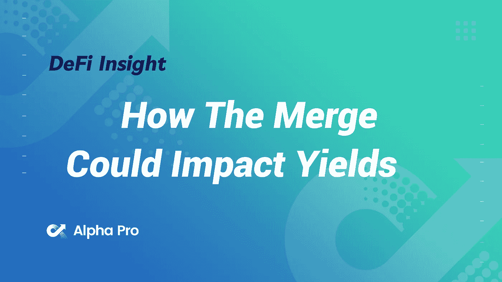
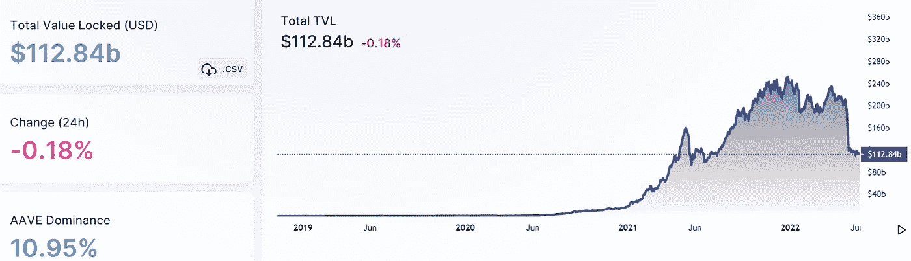
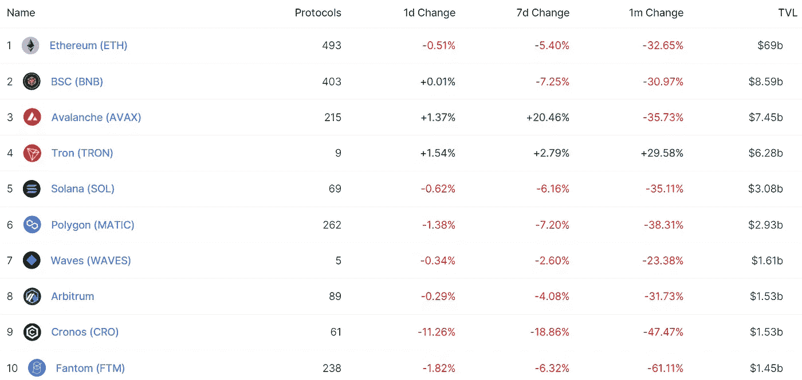
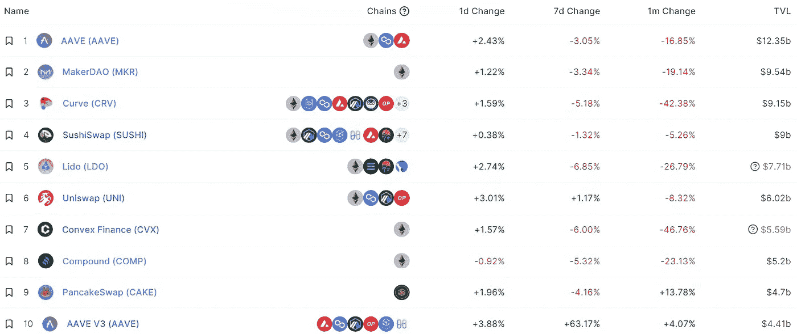
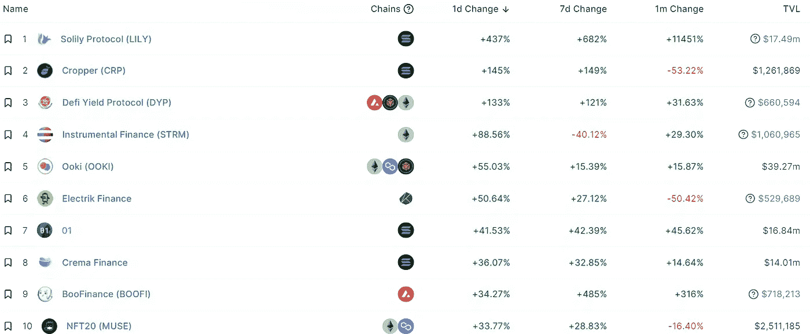
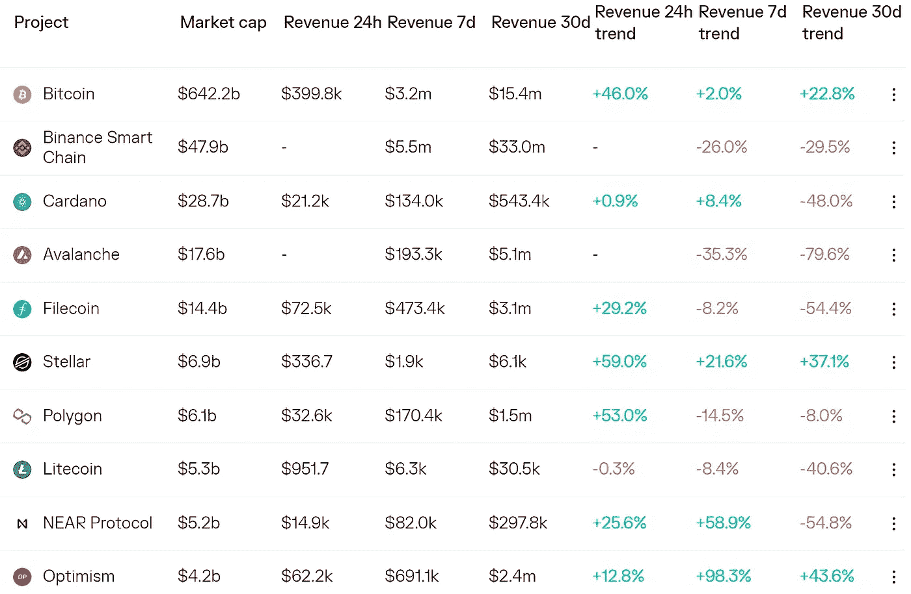
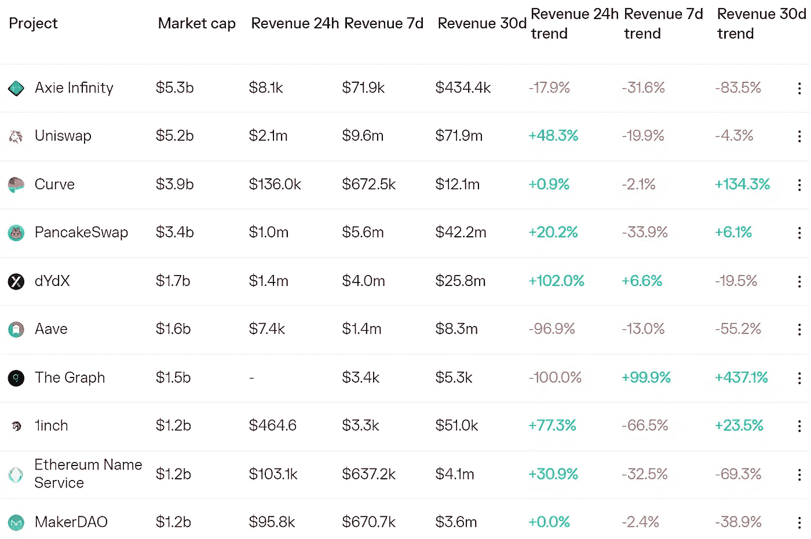
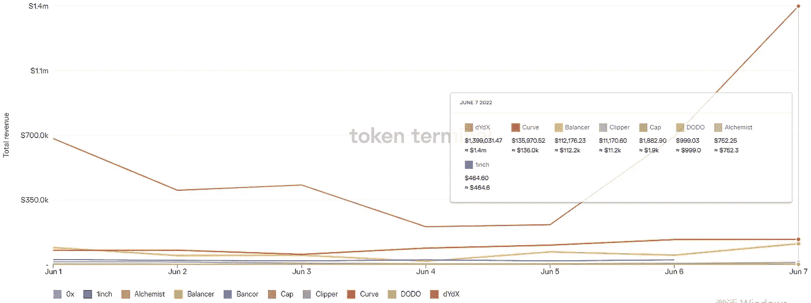
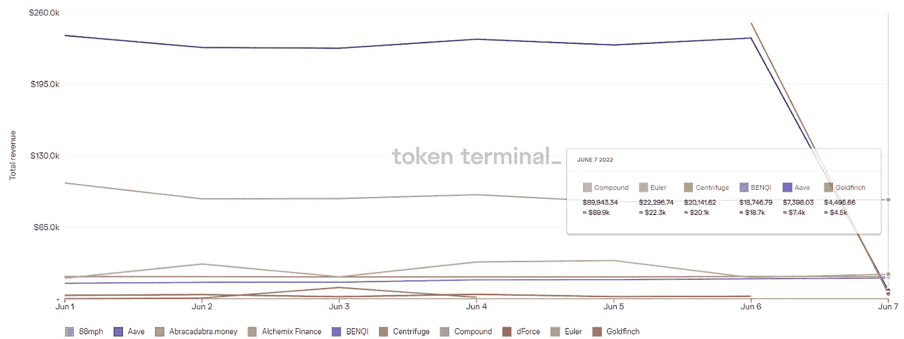

# DeFi Insight |合并如何影响产量

> 原文：<https://medium.com/coinmonks/defi-insight-how-the-merge-could-impact-yields-920a3ff44af0?source=collection_archive---------32----------------------->

2022 年 6 月 8 日

*今日 DeFi 数据&由 DeFi Insight 为您带来的新闻*

> *"* 以太坊不断变化的货币政策使得收入很难以一种精细的方式进行长期预测。然而，需要做出假设，提供潜在产量与实际产量之间可能的不同程度。这包括尚未确定的合并日期，尽管共识似乎是在 2022 年 8 月左右，以及对多个变量输入的乐观或悲观情景。*[*@来源*](https://coinshares.com/research/how-the-merge-could-impact-yields)*

# *最新消息*

## *链条*

***[渗透](https://twitter.com/Flowslikeosmo/status/1534379632966963201)区块链暂停紧急维护，渗透 DEX 和钱包暂时不可用***

*****crypto . com 的 [Cronos](https://cointelegraph.com/news/crypto-com-s-cronos-launches-100m-accelerator-for-defi-and-web3) 为 DeFi 和 Web3 推出 1 亿美元加速器*****

## *****指数/汇率*****

*******二级指标 [DeversiFi](https://www.coindesk.com/tech/2022/06/08/deversifi-launches-cross-chain-swaps-for-bridgeless-defi-transactions/) 推出跨链掉期*******

*********、**新的埃尔隆德和 [Maiar DEX](https://twitter.com/beniaminmincu/status/1534305646262292482?s=20&t=A773u4gzsHf8MVDF_MLawA) 更新*******

*****Citadel 证券公司正在与 Virtu Financial 建立一个加密交易市场*****

*******[**BTC 和 ETH**](https://twitter.com/coinmetrics/status/1534187567616253952)**FTX 现货交易量 5 月首次超过比特币基地*********

## *******稳定币*******

*********/**圆圈将 [$USDC](https://www.prnewswire.com/news-releases/circle-announces-support-for-polygon-usdc-to-help-developers-seamlessly-build-and-transact-in-web3s-largest-ecosystem-301562205.html) 添加到 Web3 支付的多边形中*******

## *****| 借贷*****

*******[锚协议](https://twitter.com/anchor_protocol/status/1534377834063486977)冻结锚赚和锚借功能*******

*******部署在 Ropsten Testnet 上的 Aave V3*******

## *******打桩*******

***********:探索长期目标、路线图和初步实施***********

## *******钱包*******

*********[**PayPal**](https://techcrunch.com/2022/06/07/paypal-is-finally-allowing-users-to-move-their-cryptocurrency-to-other-wallets/)**允许用户向外部钱包转移加密货币***********

## *******NFT*******

*********NFT 贷款协议 [JPEG 格式](/@jpegd/bored-ape-yacht-club-mutant-ape-yacht-club-lending-is-live-b24261d20eb6)启动 BAYC 和 MAYC 贷款*********

## *******基金*******

*********DeFi 风险投资 5 月份的融资额为1.763 亿美元，为 2021 年 9 月以来的最低水平*********

*******索拉纳为韩国 web3 初创公司启动 1 亿美元投资和补助基金*******

*********[Vybe Network](https://www.prnewswire.com/news-releases/vybe-network-secures-10-5-million-usd-in-series-a-funding-301563013.html)获得 1050 万美元的首轮融资*********

*********Haun Ventures 在[以太坊协议 Eul](https://www.theblockcrypto.com/linked/150447/haun-ventures-leads-32-million-round-in-ethereum-protocol-euler) 中领投 3200 万美元*********

***********与关键机构和战略投资者完成 2000 万美元的首轮投资***********

*********新加坡交易平台认可[合格投资者的加密资产](https://www.reuters.com/technology/singapore-trading-platform-recognises-crypto-assets-accredited-investors-2022-06-08/)*********

# *******数据和分析*******

## *******锁定的总价值(TVL)*******

*******目前全网 DeFi 总锁定量为 1128.4 亿美元，24 小时下降 0.18%。*******

**************

## *******TVL 评出的十大连锁酒店*******

**************

## *******|最新 TVL 十大项目*******

**************

## *******|过去 24 小时内 TVL 增长的前 10 个项目*******

**************

## *******协议收入*******

## *******|累计总收入最高的项目(24H)_ 区块链(L1)*******

**************

## *******|累计总收入最高的项目(24H) _Dapps (L2)*******

**************

## *******|前 10 大交易所的每日收入*******

**************

## *******|十大贷款协议的每日收入*******

**************

# *******深潜*******

*********追逐稳定——一个** [**稳定一个**](https://deathereum.substack.com/p/chasing-stability-a-stablecoin-deepdive?s=r) **深潜*********

***** [## 追求稳定——稳定的深潜

### 这篇文章分为三个部分。第一部分-介绍稳定货币+货币的起源和历史第二部分…

deathereum.substack.com](https://deathereum.substack.com/p/chasing-stability-a-stablecoin-deepdive?s=r) 

**你的指南** [**合成**](https://newsletter.banklesshq.com/p/your-guide-to-the-synthetix-ecosystem?utm_source=%2Finbox&utm_medium=reader2&s=r) **生态系统**

 [## 合成生态系统指南

### 使用 MetaMask，您现在可以在浏览器扩展和移动应用程序中跨 6 个不同的平台一步购买您的加密

newsletter.banklesshq.com](https://newsletter.banklesshq.com/p/your-guide-to-the-synthetix-ecosystem?utm_source=%2Finbox&utm_medium=reader2&s=r) 

**[**在 Crypto**](https://shuyao.substack.com/p/what-it-means-to-be-chinese-in-crypto?utm_source=%2Finbox&utm_medium=reader2&s=w) 中是什么意思**

** [## 对中国人来说，密码意味着什么

### 这种场景已经不复存在，因为中国的“零 Covid”政策已经把这个热闹的城市变成了一座鬼城。一些…

shuyao.substack.com](https://shuyao.substack.com/p/what-it-means-to-be-chinese-in-crypto?utm_source=%2Finbox&utm_medium=reader2&s=w)** 

# **报告**

****[**并购**](https://messari.io/article/the-investors-guide-to-the-merge-understanding-and-playing-the-opportunity) **投资者指南:理解和把握机会**_ 梅萨里****

> ****在接下来的几个月里，以太坊将经历一场共识机制的变革，从工作证明到利益证明，这就是所谓的“合并”。****
> 
> ****将吸引投资者的根本性改进包括创建一个更环保的协议、增加可获得的收益率、净通缩基础货币，以及增加分散化/安全性。****
> 
> ****最深刻的短期影响是矿工的淘汰。矿工每天都是乙醚的净销售者。这种卖出压力立即从市场上消失了。如果我们假设并购前的买方需求水平不变，这实际上会导致结构性净购买压力。****
> 
> ****合并似乎很可能发生在 2022 年 8 月至 9 月之间。市场似乎并未将成功转型对以太坊短期和长期基本面的影响计入价格。****
> 
> ****我们构建了一个可定制的产出和 DCF 模型，以进一步探索以太合并后的影响。****

******五月区块链** [**资金重述**](https://www.theblockresearch.com/may-blockchain-funding-recap-150335)**_ the block research******

********6 月** [**调研**](https://www.theblockresearch.com/june-research-and-analysis-report-150441) **及分析报告** _theblockresearch******

******[**NFT**](https://tokeninsight.com/en/research/market-analysis/nft-weekly-recap-june-week1)**每周回顾—六月第一周** _tokeninsight******

******蜡:第一个** [**碳中性区块链**](https://messari.io/article/wax-the-first-carbon-neutral-blockchain) _messari****

******[**区块链**](https://dappradar.com/blog/dappradar-industry-report-may-2022) **行业报告—2022 年 5 月** _DappRadar******

> ****加入 coin monks[Telegram group](https://t.me/joinchat/Trz8jaxd6xEsBI4p)学习加密交易和投资****

******关于:******

****DeFi Insight 是顶级 DeFi 和加密新闻和更新的来源。****

******https://twitter.com/AlphaPro_io**❤[**t51】**](https://twitter.com/AlphaPro_io)****

******❤RSS:**[**https://medium.com/feed/@alphapro.project**](https://medium.com/feed/@alphapro.project)****

****提供的信息应被视为发展新闻，而不是投资建议。*********