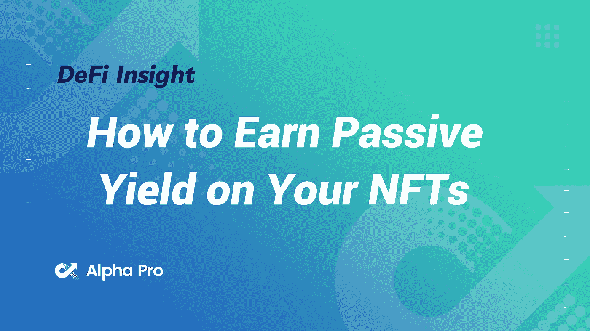
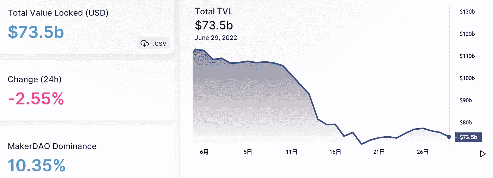
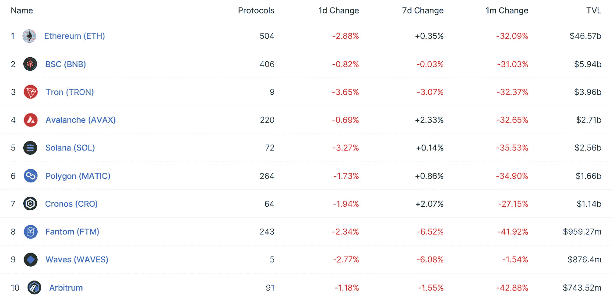
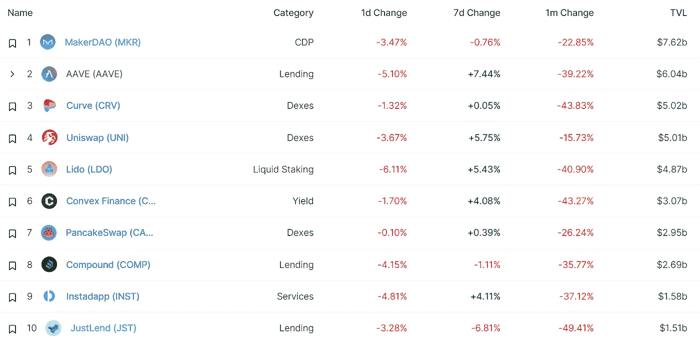
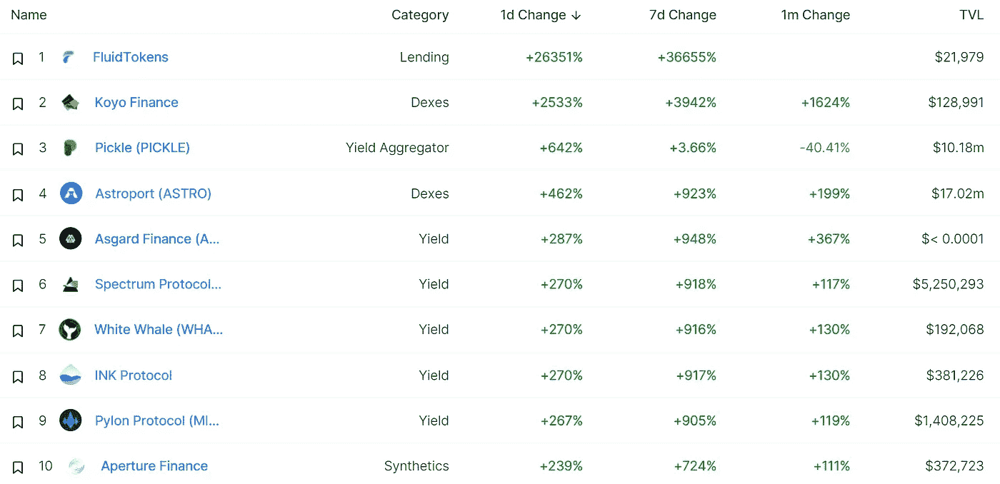
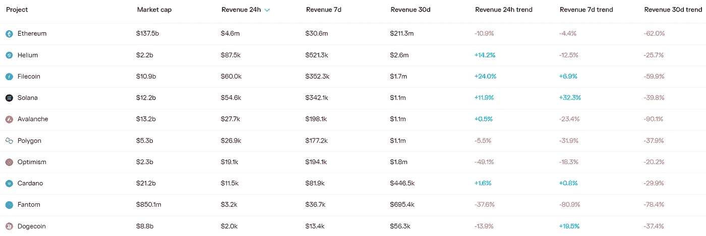
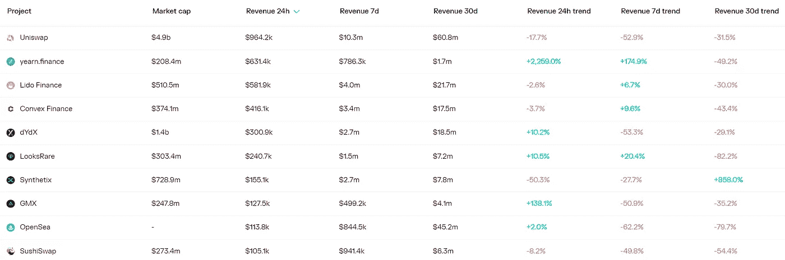
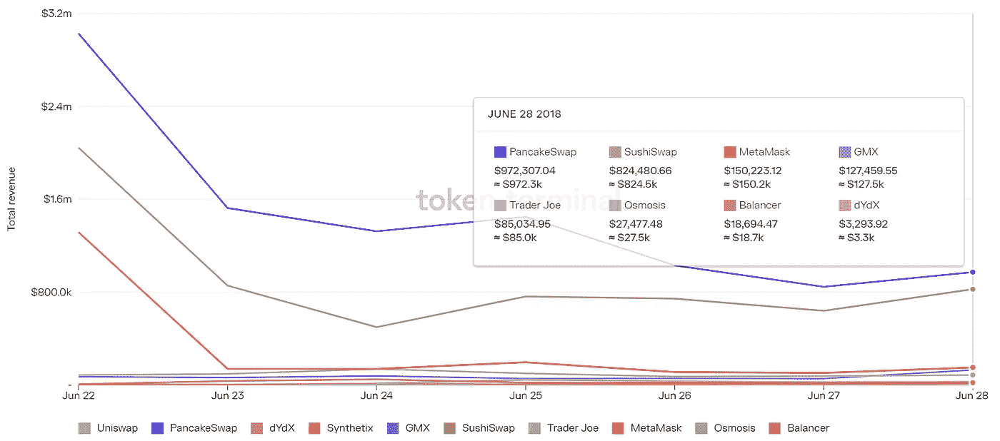
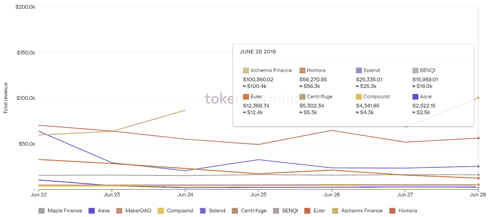

# DeFi Insight |如何在您的 NFT 上获得被动收益

> 原文：<https://medium.com/coinmonks/defi-insight-how-to-earn-passive-yield-on-your-nfts-8513c5e496d3?source=collection_archive---------29----------------------->

2022 年 6 月 29 日

*今日 DeFi 数据&由 DeFi Insight 为您带来的新闻*

> *"* 如果您有 NFT，但您想赚取被动收入，但不想在 IL 上被剁碎，或者您没有资金将 NFT 存入寿司，与 1:1 ETH chaser 进行交易，该怎么办？
> 
> 你很幸运！今年早些时候，NFTX 推出了其新颖的库存堆叠功能，允许用户直接将 NFT 存入 NFTX 金库，而不是采用传统的 LPing 方法来提供 NFT + ETH 流动性。*“@*[*来源*](https://newsletter.banklesshq.com/p/how-to-earn-passive-yield-on-your?utm_source=%2Finbox&utm_medium=reader2)

# 最新消息

## 外汇

**“比特币耶稣”罗杰与加密交易所 [CoinFlex](https://www.bloomberg.com/news/articles/2022-06-28/-bitcoin-jesus-roger-ver-spars-with-exchange-over-margin-call?srnd=cryptocurrencies-v2#xj4y7vzkg) 就保证金要求进行交易**

****/**[21 shares](https://www.prnewswire.com/news-releases/21shares-announces-crypto-winter-suite-301577410.html)公布 Crypto Winter Suite**

## **桥梁**

****[和谐](https://twitter.com/harmonyprotocol/status/1541884483183423488)与 Chainalysis 合作调查地平线大桥事件****

## ****|选项****

****莱拉·阿瓦隆:靠乐观生活****

## ****测试网****

****预计在世界协调时 7 月 3 日进行测试网 Vasil 升级****

## ****钱包****

******索拉纳生态钱包[幻影](https://twitter.com/phantom/status/1541798819003875329)与比特币基地支付整合******

## ******叉子******

********[灰色冰川](https://tokeninsight.com/en/news/gray-glacier-hard-fork-expected-to-activate-at-10-00-utc-on-june-30th)硬分叉预计在世界协调时 6 月 30 日 10:00 激活********

## ******采矿******

******巨大风暴过后两个星期，马拉松矿队的 75%仍处于离线状态******

********[指南针矿业](https://decrypt.co/104039/compass-mining-ceo-and-cfo-resign-citing-multiple-setbacks-and-disappointments)首席执行官和首席财务官辞职，公司称“挫折和失望”********

## ******政策与法规******

********【一本规则书】监管加密，由 [SEC 主席](https://bitcoinist.com/one-rule-book-regulate-crypto-proposed-by-sec-chair/)加里·詹斯勒提出********

********[汽车总裁](https://cryptoslate.com/cars-president-announces-crypto-hub-sango-launch-date/)宣布加密中心“Sango”上市日期********

## ******NFT******

********、** Holograph 与 LayerZero 合作开发[与区块链无关的 NFTs](https://u.today/holograph-partners-with-layerzero-for-blockchain-agnostic-nfts)******

******[志那都红豆](https://twitter.com/AzukiOfficial/status/1541930072403320835)分享拓展志那都红豆宇宙的计划******

## ******基金******

********[a16z](https://www.theblock.co/post/154562/dynamic-web3-authentication-crypto-startup-raises-funding-a16z)领投 750 万美元种子轮，用于 web3 认证初创公司 Dynamic********

********[A16z](https://www.coindesk.com/business/2022/06/28/a16z-leads-6m-seed-funding-round-in-layer-1-blockchain-linera/)在区块链领域领投 600 万美元种子资金********

## ******观点******

******加密货币专家称，现在[可能是涉足](https://www.uppermichiganssource.com/2022/06/29/cryptocurrency-expert-says-now-may-be-time-dabble/)的时候了******

******Cathie Wood : NFTs、DeFi、数字钱包将成为重要的、巨大的机会******

******班克曼-弗里德警告说:一些加密交易所已经“秘密破产”******

# ******数据和分析******

## ******锁定的总价值(TVL)******

******目前全网 DeFi 总锁定量为 735 亿美元，24 小时下降 2.55%。******

************

## ******TVL 评出的十大连锁酒店******

************

## ******|最新 TVL 十大项目******

************

## ******|过去 24 小时内 TVL 增长的前 10 个项目******

************

## ******协议收入******

## ******|累计总收入最高的项目(24H)_ 区块链(L1)******

************

## ******|累计总收入最高的项目(24H) _Dapps (L2)******

************

## ******|前 10 大交易所的每日收入******

************

## ******|十大贷款协议的每日收入******

************

# ******深潜******

********[**L1 复苏**](https://members.delphidigital.io/reports/l1-recovery-gearbox-strategic-raise-searching-for-market-bottoms) **，变速箱战略加注，寻找市场底部**********

**** [## L1 复苏，变速箱战略提升，寻找市场底部

### 披露:德尔福风险投资公司已经投资了 BTC、瑞士联邦理工学院、SOL、AVAX 和 dYdX。我们团队的成员拿着装备，DOT，NEAR…

members.delphidigital.io](https://members.delphidigital.io/reports/l1-recovery-gearbox-strategic-raise-searching-for-market-bottoms) 

**[**Crypto 崩溃**](https://newsroom.unsw.edu.au/news/business-law/crypto-crash-why-has-cryptocurrency-dropped) **:为什么加密货币已经没落了？****

 **[## 加密崩溃:为什么加密货币会消失？

### 像世界上的许多其他市场一样，密码市场现在正在经历一个特别残酷的时期。在…

newsroom.unsw.edu.au](https://newsroom.unsw.edu.au/news/business-law/crypto-crash-why-has-cryptocurrency-dropped)** 

****[**五角大楼**](https://www.techrepublic.com/article/pentagon-finds-concerning-vulnerabilities-on-blockchain/)发现区块链漏洞****

**** [## 五角大楼发现区块链的弱点

### 五角大楼委托的一份报告得出结论说，区块链不是分散的，容易受到攻击，而且…

www.techrepublic.com](https://www.techrepublic.com/article/pentagon-finds-concerning-vulnerabilities-on-blockchain/)**** 

# ****报告****

******[**区块链中的去中心化**](https://crypto.com/research/decentralisation-in-blockchain/) **:多面概述** _crypto******

> ****去中心化是加密生态系统的核心原则之一。在区块链技术的背景下，去中心化是指将治理、控制和决策从一个集中的实体转移到一个由节点组成的分布式网络。****

******在 StarkNet 上建立** [**线上游戏**](https://www.theblockresearch.com/building-on-chain-gaming-on-starknet-154278)**_ the block research******

********揭秘**[**Filecoin**](https://messari.io/article/demystifying-filecoin-s-revenue)**的收入** _messari******

******关于:******

****DeFi Insight 是顶级 DeFi 和加密新闻和更新的来源。****

******https://twitter.com/AlphaPro_io 推特:******

********❤RSS:**[**https://medium.com/feed/@alphapro.project**](https://medium.com/feed/@alphapro.project)******

****提供的信息应被视为发展新闻，而不是投资建议。****

> ****加入 Coinmonks [电报频道](https://t.me/coincodecap)和 [Youtube 频道](https://www.youtube.com/c/coinmonks/videos)了解加密交易和投资****

# ****另外，阅读****

*   ****[OKEx vs KuCoin](https://coincodecap.com/okex-kucoin) | [摄氏替代品](https://coincodecap.com/celsius-alternatives) | [如何购买 VeChain](https://coincodecap.com/buy-vechain)****
*   ****[ProfitFarmers 回顾](https://coincodecap.com/profitfarmers-review) | [如何使用 Cornix Trading Bot](https://coincodecap.com/cornix-trading-bot)****
*   ****[如何匿名购买比特币](https://coincodecap.com/buy-bitcoin-anonymously) | [比特币现金钱包](https://coincodecap.com/bitcoin-cash-wallets)****
*   ****[瓦济里克斯 NFT 评论](https://coincodecap.com/wazirx-nft-review)|[Bitsgap vs Pionex](https://coincodecap.com/bitsgap-vs-pionex)|[丹吉尔评论](https://coincodecap.com/tangem-wallet-review)****
*   ****[如何使用 Solidity 在以太坊上创建 DApp？](https://coincodecap.com/create-a-dapp-on-ethereum-using-solidity)********