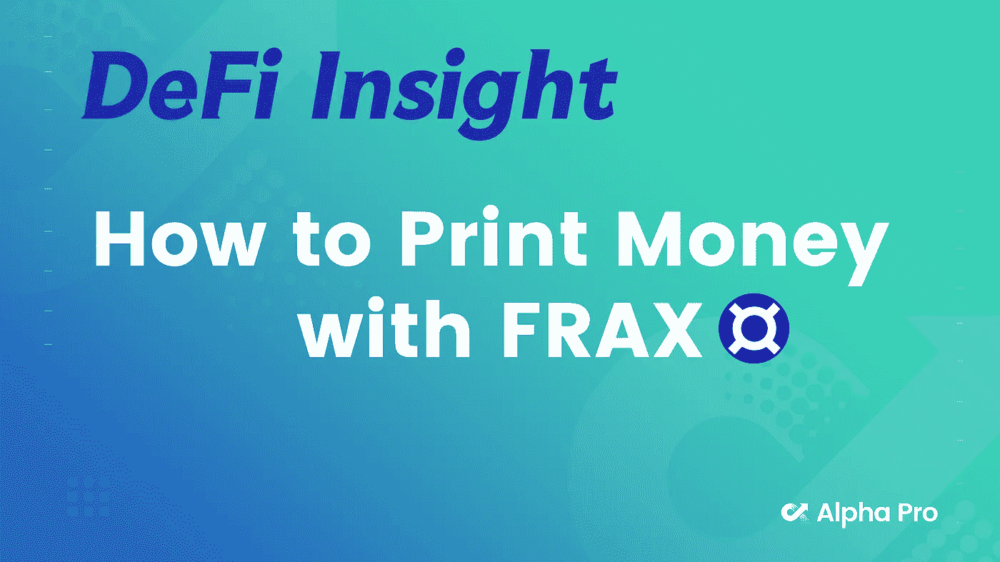
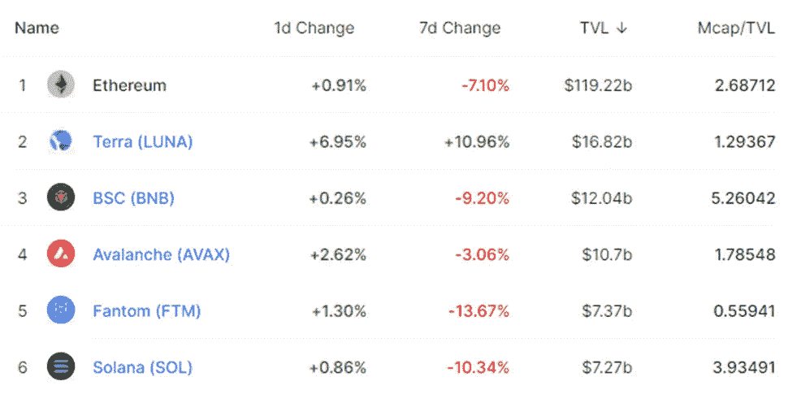
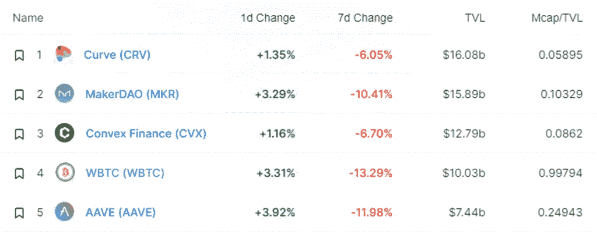
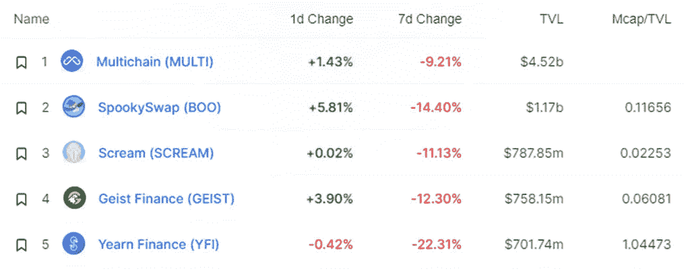
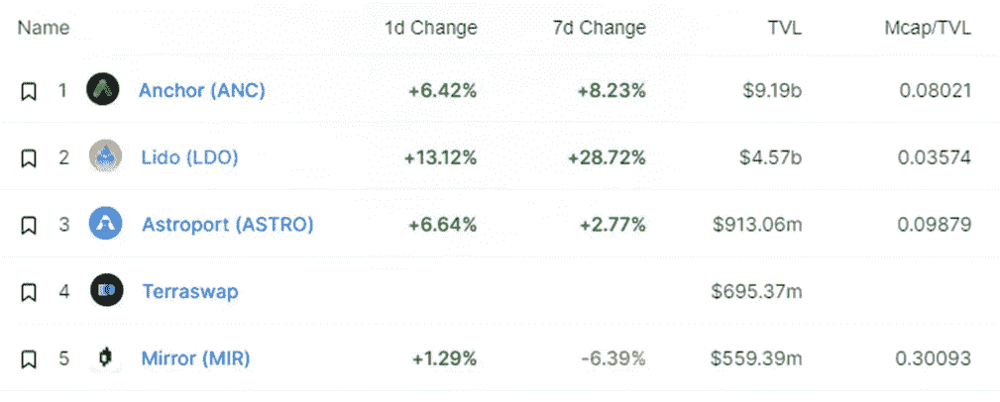
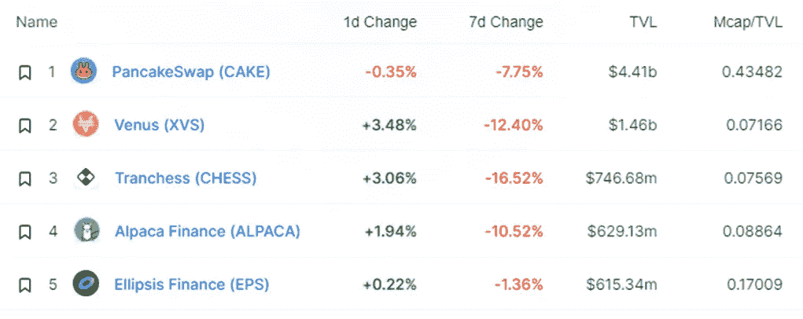
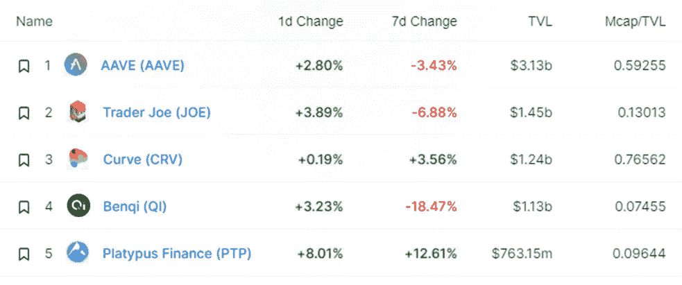
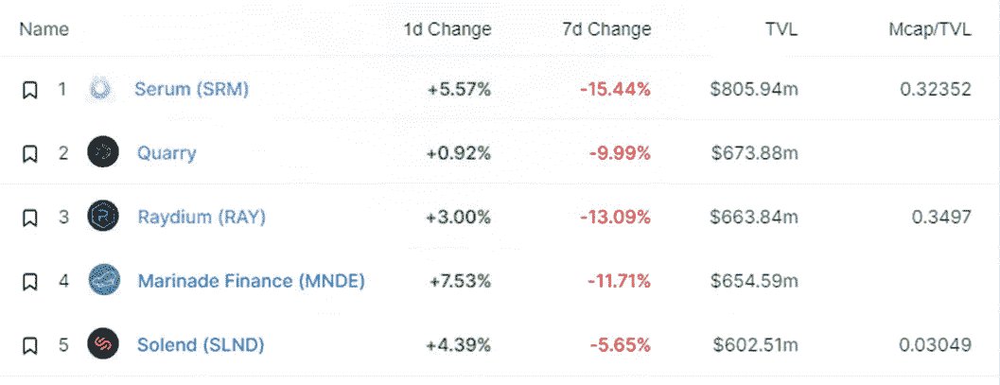
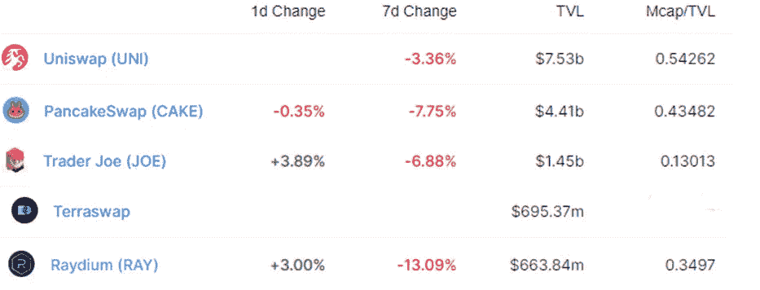
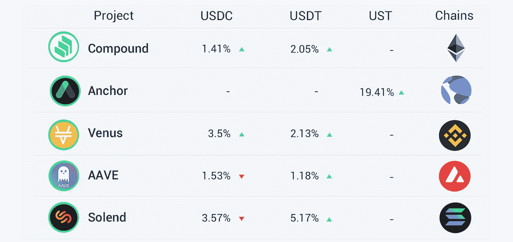

# DeFi Insight |如何用 FRAX 印钞票；Luna Foundation Guard 筹集 10 亿美元为 UST stablecoin 建立比特币储备

> 原文：<https://medium.com/coinmonks/defi-insight-how-to-print-money-with-frax-luna-foundation-guard-raises-1-billion-to-form-b02191da1cc4?source=collection_archive---------37----------------------->

## 2022 年 2 月 23 日

*今日 DeFi 数据&由 DeFi Insight 为您带来的新闻。*

**宏观趋势:** [索拉纳、方托姆](https://cryptobriefing.com/solana-fantom-hard-hit-amid-russia-ukraine-fears/)在俄乌担忧声中遭受重创

**TVL 走势:**[总 TVL](https://defillama.com/) 在过去 24 小时内上涨了 2.47%

**DEX Dynamics:**DEX 中涨幅最大的是 [Trader Joe](https://defillama.com/protocol/trader-joe) ，上涨 3.89 **%**

**稳定币:**露娜基金会守卫筹集 10 亿美元为 [UST 稳定币](https://www.theblockcrypto.com/post/134871/luna-founation-guard-token-sale)建立比特币储备

# 最新消息

## 宏

加密指数提供商 Compass 推出 [DeFi 基本面指数 CCBFDEFI](https://cointelegraph.com/news/swiss-index-provider-launches-new-product-tracking-10-defi-tokens)

被地毯淹没的 DeFi 空间:你应该知道什么来保护你的密码

对欧洲密码产品的兴趣日益高涨，CoinShares 成为最新的受益者

## |新

分散交易平台 [Sat.is](https://twitter.com/SatisDEX/status/1496111195815821313) 将部署到 Arbitrum

Fantom 的链上协议 [Solidex](/@solidsex/solidex-launch-announcement-d14a85f2cd20) 将打开液体锁紧

## 互换

MuesliSwap 将在 Milkomeda 侧链上发布 AMM·德克斯

[网上掉期](https://twitter.com/netswapofficial/status/1496176405721513986?s=20&t=1DkXZTUadWcP7l0KmYXbFQ)的总交易量达到 20 亿美元

## 稳定币

*[系绳](https://tether.to/en/tether-latest-assurance-opinion-reveals-reserves-held-exceeds-liabilities/)公布第四季度储量证明报告

## 协议

疾风金融被利用，相关合同被中止

用转发协议定义 oracle [伞状网络](https://twitter.com/ForwardProtocol/status/1496152938720514067)合作伙伴

泽贝奇已经筹集了 1500 万美元的私人融资

: [WePiggy](https://wepiggy-com.medium.com/wepiggy-leverages-wormhole-to-build-a-cross-chain-defi-ecosystem-610a6a9e8fc9) 和虫洞将合作建立一个跨链的 DeFi 生态系统

分散交易平台 [Hashflow](https://blog.hashflow.com/introducing-the-new-hft-rewards-structure-42d21fb1b3dd) 加入加权系统

# 数据和分析

## 锁定的总价值(TVL)

## TVL 的六大连锁品牌

*哪些*链/协议*当前将最多的资产存放在它们的智能合同中？*

> TVL 的五大协议

> TVL 的五大协议

> TVL 的五大协议

> **# BNB**TVL 的五大协议

> **#雪崩**TVL 五大协议

> TVL 的五大协议

## 德克斯 TVL 排名

DEX 中涨幅最大的是[操盘手](https://defillama.com/protocol/trader-joe)，上涨 3.89 **%**

## APY DeFi 贷款公司

*USDC:最高贷款人:索伦德，利率为 3.57% APY*

*USDT:最高贷款人:索伦德，利率为 5.17% APY*

# 深潜

💹如何用 [FRAX](https://incentivized.substack.com/p/how-to-print-money-without-printing?utm_source=url) 印钞票

> 稳定硬币在加密经济中发挥着至关重要的作用，体现了分散金融的安全保障，同时也提供了更传统的金融资产(如法定货币)的价格稳定性。本系列详细介绍了电源稳定器的工作原理。

 [## 如何用 FRAX 印钞票

### 稳定密码在密码经济中起着至关重要的作用，它体现了分散金融的安全保障，同时也体现了信息安全

incentivized.substack.com](https://incentivized.substack.com/p/how-to-print-money-without-printing?utm_source=url) 

💹[卢娜](https://murrayrudd.substack.com/p/luna-price-model-update-22-feb-2022?utm_source=url)价格模型更新

> 模拟卢纳/UST 价格动态的主要挑战来自燃烧机制的循环性质。要铸造新 UST，需要燃烧等量的月神。

💹哥伦布 5 号:Terra 最新升级的概述

> Terra 的 Columbus-5 升级将 UST 推向了最大的分散稳定中心，并为 LUNA 持有者创造了巨大的价值。此次升级为 UST 在其他 IBC 支持的区块链和主要 L1 上的采用率继续增长铺平了道路。

一个 **值得信赖的资源为所有的事情 DeFi**

> 一场回合:
> 
> 分散金融(DeFi)指的是从传统的中央金融系统向区块链促成的点对点金融系统的转变。
> 
> DeFi Insight 是顶级 DeFi 和加密新闻和更新的来源。
> 
> 提供的信息应被视为发展新闻，而不是投资建议。

> 加入 Coinmonks [电报频道](https://t.me/coincodecap)和 [Youtube 频道](https://www.youtube.com/c/coinmonks/videos)了解加密交易和投资

# 另外，阅读

*   [霍比审核](https://coincodecap.com/huobi-review) | [OKEx 保证金交易](https://coincodecap.com/okex-margin-trading) | [期货交易](https://coincodecap.com/futures-trading)
*   [电网交易机器人](https://coincodecap.com/grid-trading) | [Cryptohopper 审查](/coinmonks/cryptohopper-review-a388ff5bae88) | [Bexplus 审查](https://coincodecap.com/bexplus-review)
*   [7 个最佳零费用加密交易平台](https://coincodecap.com/zero-fee-crypto-exchanges)
*   [氹欞侊贸易评论](https://coincodecap.com/anny-trade-review) | [霍比保证金交易](/coinmonks/huobi-margin-trading-b3b06cdc1519)
*   [分散交易所](https://coincodecap.com/what-are-decentralized-exchanges) | [比特 FIP](https://coincodecap.com/bitbns-fip) | [Pionex 审查](https://coincodecap.com/pionex-review-exchange-with-crypto-trading-bot)
*   [用信用卡购买密码的 10 个最佳地点](https://coincodecap.com/buy-crypto-with-credit-card)
*   [最好的卡达诺钱包](https://coincodecap.com/best-cardano-wallets) | [Bingbon 副本交易](https://coincodecap.com/bingbon-copy-trading)
*   [印度最佳 P2P 加密交易所](https://coincodecap.com/p2p-crypto-exchanges-in-india) | [柴犬钱包](https://coincodecap.com/baby-shiba-inu-wallets)
*   [8 大加密附属计划](https://coincodecap.com/crypto-affiliate-programs) | [eToro vs 比特币基地](https://coincodecap.com/etoro-vs-coinbase)
*   [最佳以太坊钱包](https://coincodecap.com/best-ethereum-wallets) | [电报上的加密货币机器人](https://coincodecap.com/telegram-crypto-bots)