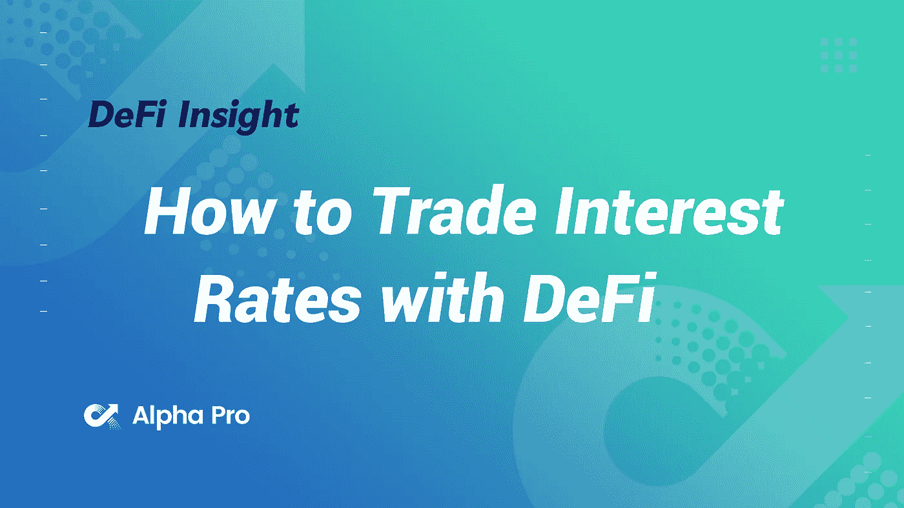
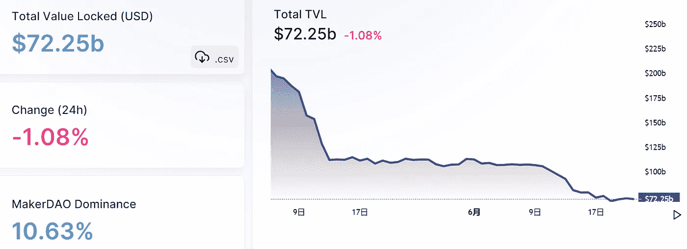
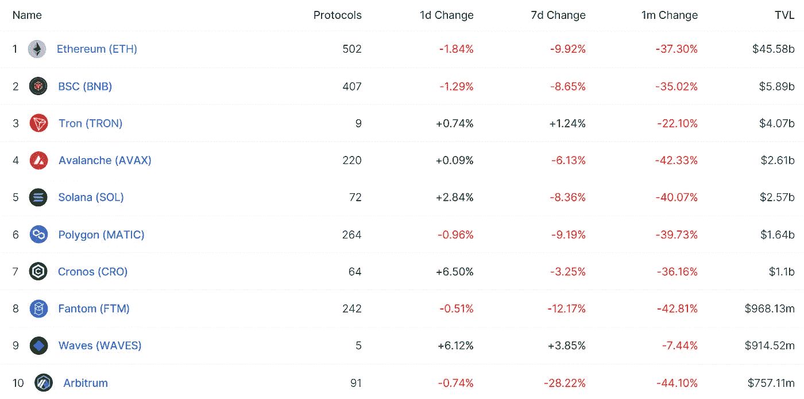
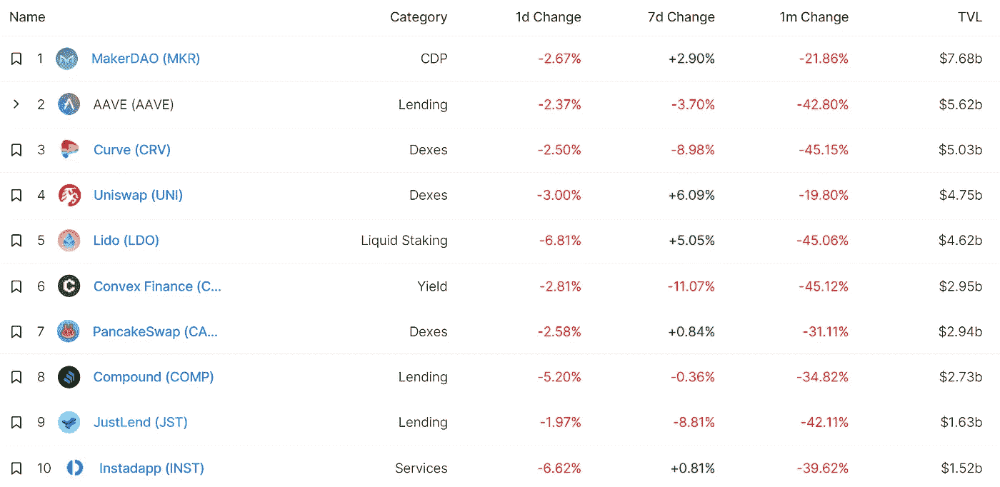
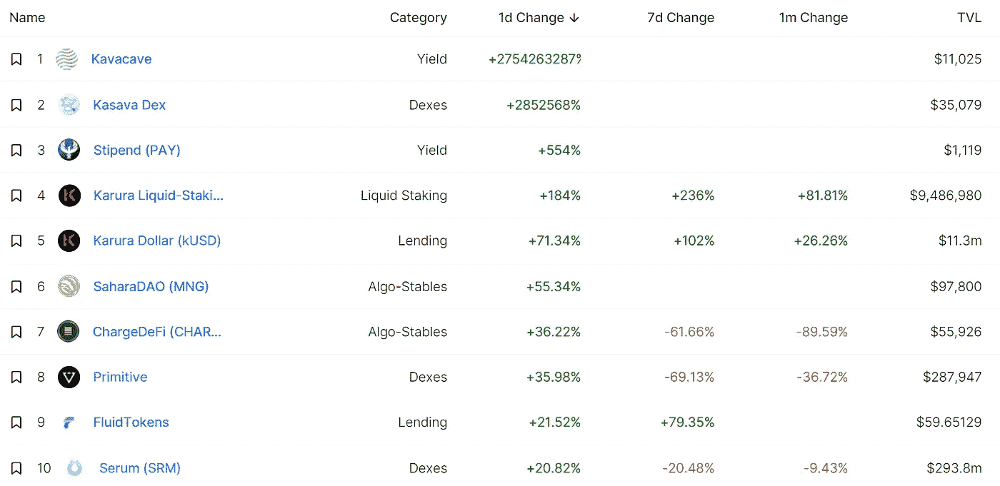
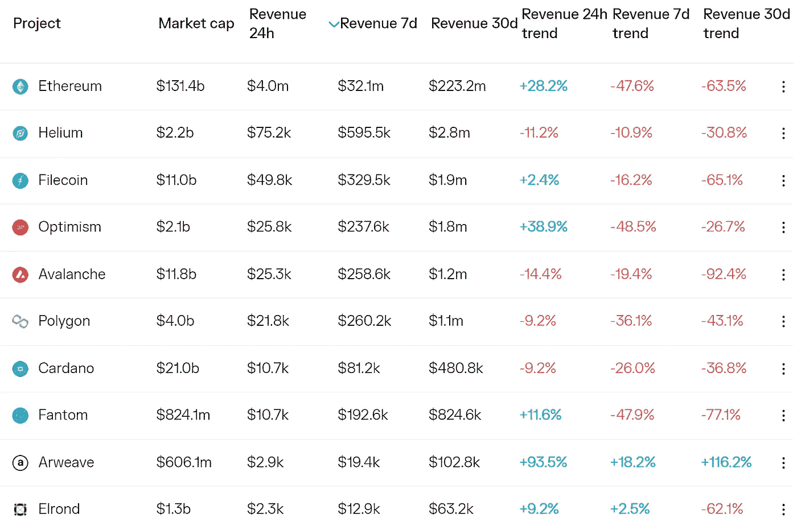
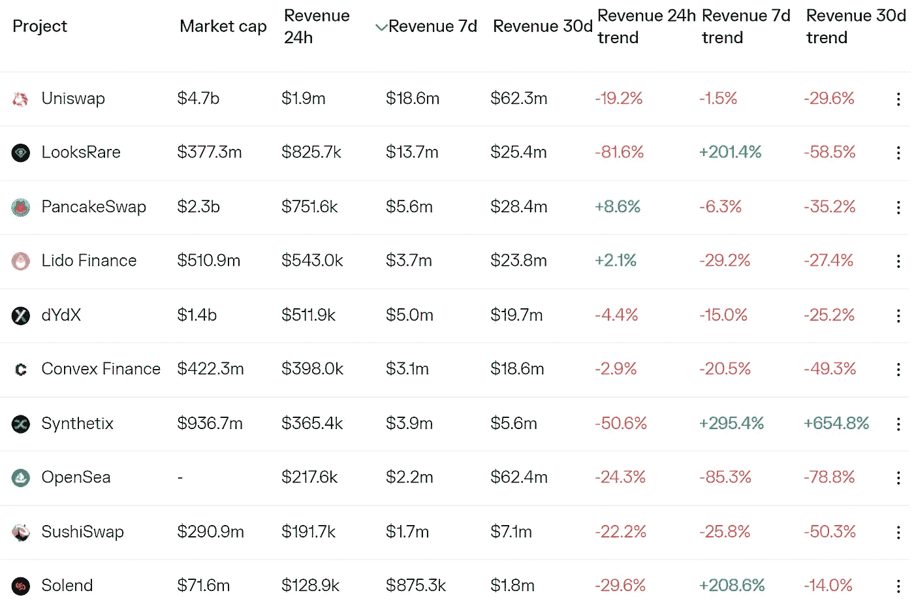
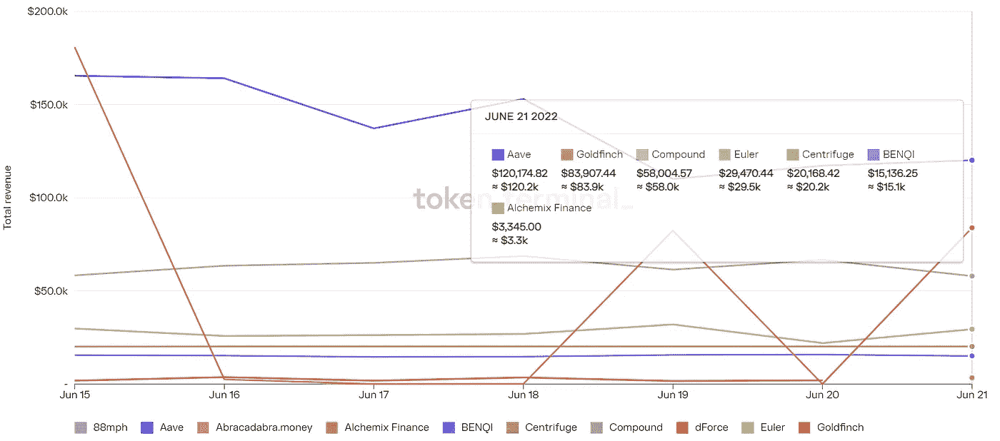

# DeFi Insight |如何用 DeFi 进行利率交易

> 原文：<https://medium.com/coinmonks/defi-insight-how-to-trade-interest-rates-with-defi-d49c0a1538c3?source=collection_archive---------21----------------------->

2022 年 6 月 22 日

*今日 DeFi 数据&由 DeFi Insight 为您带来的新闻*

> “随着 DeFi 继续蚕食 TradFi，我们每天都在寻找与市场互动的新方式。
> 
> 今天，我们有一个你可能还不熟悉的策略。
> 
> 利率互换在 TradFi 中占很大比重。我们谈论的是概念上的万亿。它们代表了全球衍生品市场的很大一部分。但到目前为止，它们只为机构保留。
> 
> 现在，利率互换正与 Voltz 协议发生冲突。” *@* [*来源*](https://newsletter.banklesshq.com/p/how-to-trade-interest-rates-with?utm_source=%2Finbox&utm_medium=reader2)

# 最新消息

## 贷款

**/**[coin loan](https://cryptonews.com/news/coinloan-partners-with-elliptic-maximize-crypto-security.htm)与 Elliptic 合作，最大限度地提高加密安全性

**[摄氏度](https://forkast.news/headlines/celsius-community-squeeze-out-short-sellers/?utm_source=blockworks-research)社区采用 GameStop 战术排挤卖空者**

****关于[摄氏度、3AC、巴别塔](https://maple.finance/news/updates-on-celsius/)的滚动更新****

******【**】柜员协议 l 扩展至以塔基金资本的住房抵押贷款****

## ****外汇****

****Uniswap 收购 Marketplace Genie，将 NFT 交易整合到其指数中****

## ****市场****

****随着对衰退的担忧导致避险情绪回归，比特币再次下跌****

## ****稳定币****

****系绳公司正在推出一种与英镑挂钩的稳定货币****

****随着总供应量达到 55.9 亿，USDC 的“真实体积”在以太坊上翻转系绳****

## ****支付****

******区块链支付公司 [Roxe](https://www.reuters.com/markets/deals/exclusive-blockchain-payment-company-roxe-nears-365-bln-spac-deal-sources-2022-06-21/) 通过 36 亿美元的特殊目的收购公司交易上市******

## ******|令牌******

********[柴犬令牌](https://nulltx.com/shiba-inu-token-soars-40-as-team-continues-massive-token-burn/)飙升 40%,团队继续大规模焚烧令牌********

## ******钱包******

********[Cardano 开发团队](https://bitcoinist.com/cardano-dev-team-set-to-launch-first-light-wallet/)准备推出首款轻便钱包********

## ******政策与法规******

********英国财政部[修订法规](https://bitcoinist.com/regulation-amendments-by-uk-treasury-drops-kyc-restriction-for-non-hosted-wallets/)取消非托管钱包的 KYC 限制********

********第一大监管机构[要求，加密赌注必须与比特币一起监管](https://fortune.com/2022/06/21/crypto-staking-bitcoin-regulate-supervisor-lagarde-europe-celsius/)********

## ******NFT******

******尽管 NFT 经济不景气，索拉纳市场还是获得了更多的资金******

******NFTs 宣布法瑞尔为首席品牌官，由亚历克西斯·奥哈尼安负责筹款******

********、** Animoca Brands 和 Quidd 推出造币产品，授权收藏者铸造和拆卸 [NFTs](https://www.animocabrands.com/animoca-brands-and-quidd-launch-mintables)******

## ****观点****

****“Crypto 以前有过成功，也有过失败”:以太坊的 Vitalik Buterin 对这次崩溃持哲学态度****

******、**称 2018 年熊市触底的交易员[表示](https://dailyhodl.com/2022/06/22/trader-who-called-2018-bear-market-bottom-says-one-altcoin-already-gearing-up-for-next-bull-market/)一个另类投资者已经在为下一轮牛市做准备****

****DeFi 收益率反转[是否有一线希望](https://blockworks.co/is-there-a-silver-lining-in-defi-yield-inversion/)？****

# ****数据和分析****

## ****锁定的总价值(TVL)****

****目前全网 DeFi 总锁定量为 722.5 亿美元，24 小时下降 1.08%。****

********

## ****TVL 评出的十大连锁酒店****

********

## ****|最新 TVL 十大项目****

********

## ****|过去 24 小时内 TVL 增长的前 10 个项目****

********

## ****协议收入****

## ****|累计总收入最高的项目(24H)_ 区块链(L1)****

********

## ****|累计总收入最高的项目(24H) _Dapps (L2)****

********

## ****|前 10 大交易所的每日收入****

********

## ****|十大贷款协议的每日收入****

********

# ****深潜****

******比特币是否是** [**全球去杠杆化**](https://bitcoinmagazine.com/markets/is-bitcoin-a-warning-sign-for-global-deleveraging) **的预警信号？******

**** [## 比特币是全球去杠杆化的警示信号吗？

### 以下是马蒂的 Bent 问题# 1228 的直接摘录:“在世界去杠杆化之前去杠杆化比特币。”注册…

bitcoinmagazine.com](https://bitcoinmagazine.com/markets/is-bitcoin-a-warning-sign-for-global-deleveraging) 

**区块链** [**分权了吗？**](https://blog.trailofbits.com/2022/06/21/are-blockchains-decentralized/)

 [## 区块链是分散的吗？

### 一份新的 Bits 研究报告调查了分布式分类账中的意外集中，区块链可以帮助推动…

blog.trailofbits.com](https://blog.trailofbits.com/2022/06/21/are-blockchains-decentralized/) 

**加密货币对** [**稳定的影响**](https://www.coindesk.com/webinars/cryptocurrencies-impact-on-stablecoins/)

 [## 加密货币对稳定货币的影响

### 由于加密仍然处于监管的前沿，尤其是稳定的加密，Justin Sun 阁下将讨论他的监管…

www.coindesk.com](https://www.coindesk.com/webinars/cryptocurrencies-impact-on-stablecoins/) 

# 报告

**跟随书呆子:了解** [**聪明钱**](https://www.nansen.ai/research/following-the-nerds-understanding-smart-money-labels-and-how-to-use-them) **标签以及如何使用**_ 南森

> 在不受监管的加密世界里，有 101 种方法可以让一个人获得优势。这可能是通过在这个领域工作，认识正确的人，加入正确的 telegram alpha 组，或者只是探索这个链，寻找领先的交易所上市。
> 
> 然而，有一点是清楚的——链条从不说谎。在我们探索发现南森信号的过程中，我们一直致力于分析聪明的资金——那些已经证明是聪明的连锁证据的地址。因此，这将作为一个活的文件，涵盖我们的各种智能货币细分市场。

**[**NFTfi**](https://www.theblockresearch.com/nftfi-non-recourse-loans-through-nfts-152113)**:通过 NFTs 的无追索权贷款** _theblockresearch**

****与** [**海德拉**](https://messari.io/article/hashing-it-out-with-hedera-hashgraph) **哈希图**_ 梅萨里**

****[**流动性枯竭**](https://members.delphidigital.io/reports/liquidity-dries-up-zk-vs-optimistic-rollups-nfts-transforming-shopify) **、ZK vs 乐观上卷、NFTs 转型 Shopify** _delphidigital****

******关于:******

****DeFi Insight 是顶级 DeFi 和加密新闻和更新的来源。****

******https://twitter.com/AlphaPro_io 推特:******

********❤RSS:**[**https://medium.com/feed/@alphapro.project**](https://medium.com/feed/@alphapro.project)******

****提供的信息应被视为发展新闻，而不是投资建议。****

> ****加入 Coinmonks [电报频道](https://t.me/coincodecap)和 [Youtube 频道](https://www.youtube.com/c/coinmonks/videos)了解加密交易和投资****

# ****另外，阅读****

*   ****[用信用卡购买密码的 10 个最佳地点](https://coincodecap.com/buy-crypto-with-credit-card)****
*   ****[加拿大最佳加密交易机器人](https://coincodecap.com/5-best-crypto-trading-bots-in-canada) | [Bybit vs 币安](https://coincodecap.com/bybit-binance-moonxbt)****
*   ****[阿联酋 5 大最佳加密交易所](https://coincodecap.com/best-crypto-exchanges-in-uae) | [SimpleSwap 评论](https://coincodecap.com/simpleswap-review)****
*   ****购买 Dogecoin 的 7 种最佳方式****
*   ****[最佳期货交易信号](https://coincodecap.com/futures-trading-signals) | [期交所评论](https://coincodecap.com/liquid-exchange-review)****
*   ****[用于 Huobi 的加密交易信号](https://coincodecap.com/huobi-crypto-trading-signals) | [Swapzone 审查](/coinmonks/swapzone-review-crypto-exchange-data-aggregator-e0ad78e55ed7)********