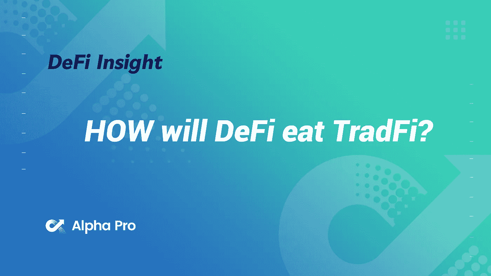
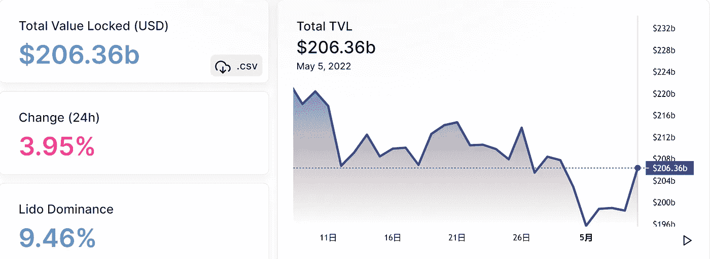
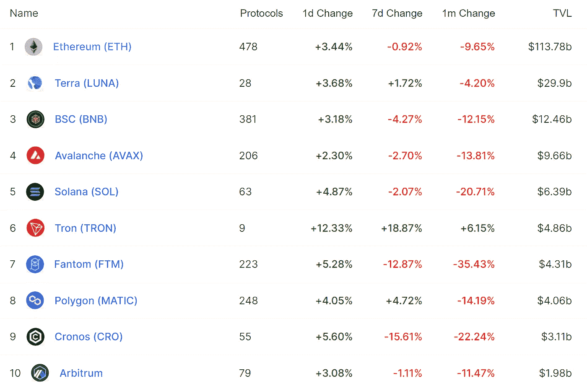
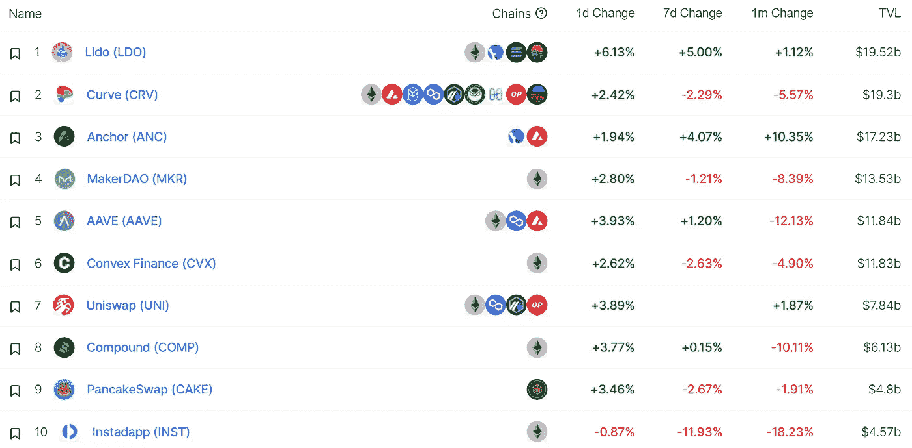
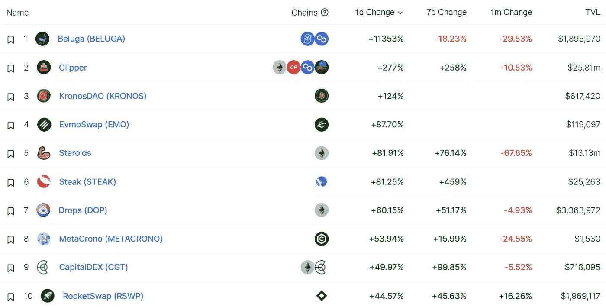
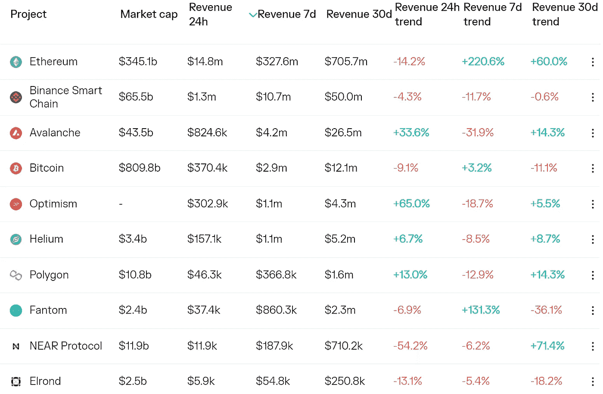
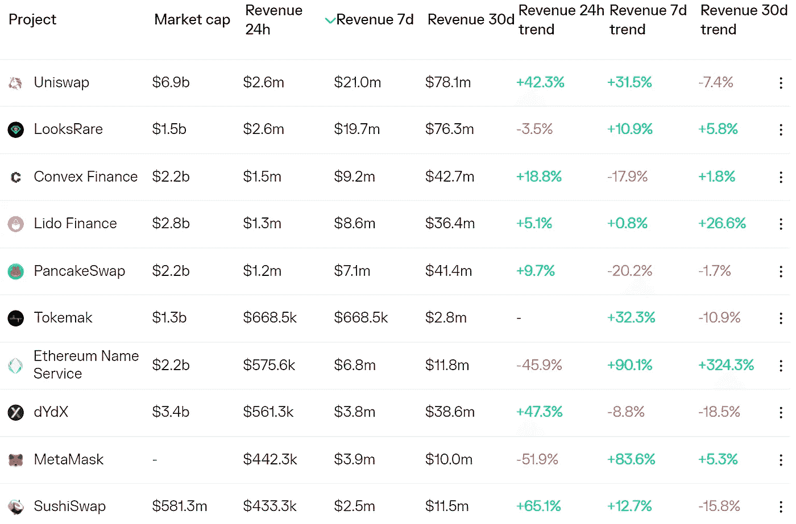
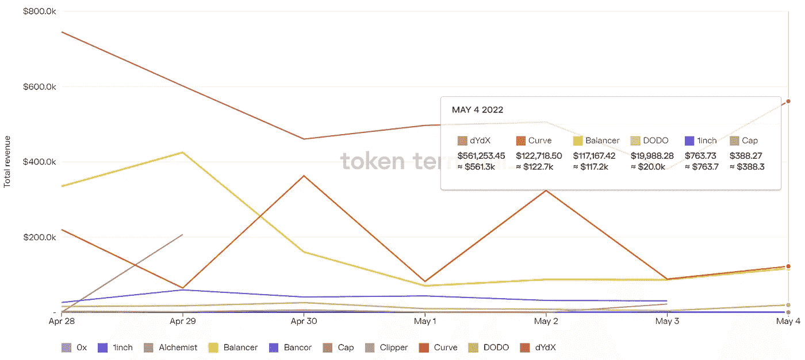
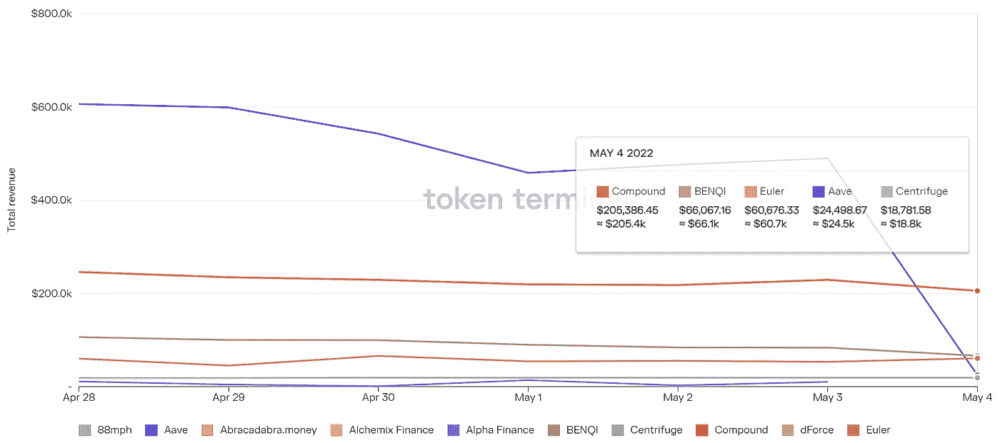

# DeFi Insight | DeFi 会怎么吃 TradFi？

> 原文：<https://medium.com/coinmonks/defi-insight-how-will-defi-eat-tradfi-77d47d198679?source=collection_archive---------44----------------------->

2022 年 5 月 5 日

*今日 DeFi 数据&由 DeFi Insight 为您带来的新闻。*

> “德菲会吃掉特拉菲。
> 10x 创始人和投资者面临的问题是 1)时机，以及 2)定义“咬”从哪里开始。
> 国际货币基金组织如何看待 defi？国际货币基金组织在其 2022 年的报告中专门有一章是关于 DeFi 的。巨大的阿尔法落差！”@ [jackchong.eth](https://twitter.com/jackchong_jc/status/1521603569685872640)

# 最新消息

## 指标

**开放海洋[将](https://openoceanglobal.medium.com/openocean-expands-to-optimism-633546d734ec)扩展至乐观**

****01 Exchange[与索拉纳基金会合作启动](https://twitter.com/01_exchange/status/1521852162933809153) 01 交换赠款计划****

******分散式跨链交易协议 [THORSwap](https://twitter.com/THORSwap/status/1521842790057099265) 正式推出$vTHOR******

## ******产量******

********DeFi 收益聚合器[渴望 v3 金库](https://twitter.com/iearnfinance/status/1521504001941979136)来了********

## ******稳定币******

******首席技术官保罗·阿尔迪诺没有上市的计划******

********[TRON](https://twitter.com/usddio/status/1522068456157622272)正式发布分散算法稳定币$USDD********

********[Terra](https://www.coindesk.com/markets/2022/05/04/terra-to-provide-ust-liquidity-on-polygon-based-synfutures/)为基于多边形的合成期货提供 UST 流动性********

## ******支付******

******奢侈品牌古驰在一些美国商店接受加密支付******

## ******提议******

********[永久协议](https://gov.optimism.io/t/gf-phase-0-proposal-perpetual-protocol/201)发布提案，要求分配 900 万美元运营费以推动其增长********

## ******空投******

********宇宙生态系统游戏公链战队网络将[推出](/@Clan_Netw0rk/clan-network-tokenomics-a-web3-inspired-gaming-economy-790008e812d3)Token $战队和空投********

## ******发射台******

********[BHero](https://elrond.com/blog/bhero-compliant-launchpad-elrond-startups/)launch pad:扩展埃尔隆德创业生态系统********

## ******政策与法规******

******加利福尼亚州州长纽瑟姆发布[行政命令](https://www.wsj.com/articles/california-gov-newsom-issues-executive-order-for-crypto-business-rules-11651700500?mod=latest_headlines)制定商业规则******

## ******NFT******

********NFT 按揭贷款协议[本岛](https://twitter.com/benddao/status/1522045924234592257?s=21&t=zNkUtEkEsiYkF9L8tL1oZA) TVL 超过 10 万 ETH********

******NFT 市场 [Blur](https://twitter.com/blur_io/status/1521910336399364096) 推出了它的测试版******

******ApeCoin 的三项提案 AIP-21、22 和 AIP-7 都已表决通过******

******凯文·梅耶尔和汤姆·斯塔格斯的黑石支持的 Candle Media 正就收购 NFT 知名公司进行谈判，这表明了他们对 Web3 内容的野心******

******比特币基地 NFT 市场[测试版](https://twitter.com/coinbase/status/1521888126934781954)正式对所有用户开放******

********NFT 交易市场[看房](https://docs.looksrare.org/about/rewards/listing-rewards)上市奖励积分即将到来********

# ******数据和分析******

## ******锁定的总价值(TVL)******

******目前全网 DeFi 总锁定量为 2063.6 亿美元，24 小时增长 3.95%。******

************

## ******TVL 评出的十大连锁酒店******

************

## ******|最新 TVL 十大项目******

************

## ******|过去 24 小时内 TVL 增长的前 10 个项目******

************

## ******协议收入******

## ******|累计总收入最高的项目(24H)_ 区块链(L1)******

************

## ******|累计总收入最高的项目(24H) _Dapps(L2)******

************

## ******|前 10 大交易所的每日收入******

************

## ******|十大贷款协议的每日收入******

************

# ******深潜******

********[**农场**](https://defieducation.substack.com/p/stablecoin-farms?s=r)********

**** [## 马厩农场

### 欢迎头像！根据我们的产量农业模型，今天我们将概述农业的风险…

defieducation.substack.com](https://defieducation.substack.com/p/stablecoin-farms?s=r) 

**[**温馨提示**](https://newsletter.banklesshq.com/p/5-tips-to-spot-the-next-big-nft?utm_source=%2Finbox&utm_medium=reader2&s=r) **来点下一个大 NFT****

** [## 发现下一个大 NFT 的 5 个技巧

### 将我升级到高级，享受 25%的优惠！亲爱的无银行国家，每天都有一个“热门”的新 NFT 项目。但只有精选的…

newsletter.banklesshq.com](https://newsletter.banklesshq.com/p/5-tips-to-spot-the-next-big-nft?utm_source=%2Finbox&utm_medium=reader2&s=r) 

**[**以太坊**](https://blog.coinbase.com/the-merge-and-the-ethics-of-ethereum-dec22a43b363) 的合并与伦理**

** [## 融合与以太坊的伦理

### 比特币基地软件工程师宇迦·科勒

blog.coinbase.com](https://blog.coinbase.com/the-merge-and-the-ethics-of-ethereum-dec22a43b363) 

**不太稳定的货币与通货膨胀对冲——一个** [**的演化**](/coinmonks/not-so-stablecoin-and-the-inflation-hedge-an-evolution-of-crypto-monetary-system-d7520224e94d) **的加密货币体系**

 [## 不稳定货币与通货膨胀对冲——一种加密货币体系的演变

### 美国消费物价指数飙升 8.5%，为 1981 年 12 月以来的最高年度增幅。这当然没有考虑到…

medium.com](/coinmonks/not-so-stablecoin-and-the-inflation-hedge-an-evolution-of-crypto-monetary-system-d7520224e94d) 

**[**思考**](https://twitter.com/reganbozman/status/1521549341118255105) **看似即将到来的熊市中的风险投资期权****

# **报告**

****4 月区块链** [**资助**](https://www.theblockresearch.com/april-blockchain-funding-recap-145098) **回顾** _theblockresearch**

> **上个月，将近 41 亿美元被分配给 244 家加密/区块链公司和项目，成为该领域历史上第三高的融资月。
> 每月发生的加密相关交易数量已经连续三个月增加，其中 4 月份是该行业单月交易数量最多的一个月。
> NFTs/游戏仍然是加密生态系统中的主导子行业，上个月控制了 39%的交易，并且是几乎所有主要交易类型(从种子阶段到后期阶段)的领先垂直行业。**

****[**五月**](https://www.theblockresearch.com/may-research-and-analysis-report-145040) **调研分析报告** _theblockresearch****

******[**投入**](https://thedefiant.io/intotheblock-optimism-op/) **:投入乐观和 2s 层【thedefiant 的承诺********

******卖墙&流动性** [**区间**](https://research.thetie.io/sell-walls-and-implied-volatility/) **:隐含波动率交易** _research.thetie****

******[**虎鲸**](https://messari.io/article/orca-solanas-human-friendly-automated-market-maker) **:索拉纳人性化的自动化做市商**_ 梅萨里******

******[**平衡器 Q1**](https://messari.io/article/state-of-balancer-q1-2022)**2022**_ 梅萨里的状态******

******[**loop ring**](https://messari.io/article/loopring-more-than-a-meme)**:不止一个迷因** _messari******

******GameFi:区块链游戏** [**能否重新定义**](https://research-backend.cointelegraph.com/uploads/attachments/cl2rhkglm0e28ufpda9ywhayq-cointelegraph-research-gamefi-report.pdf) **行业？**_ 硬币电报****

******Dapp 行业** [**报道**](https://dappradar.com/blog/dapp-industry-report-april-2022)**—2022 年 4 月** _dappradar****

******关于:******

****DeFi Insight 是顶级 DeFi 和加密新闻和更新的来源。****

******https://twitter.com/AlphaPro_io 推特:******

********❤RSS:**[**https://medium.com/feed/@alphapro.project**](https://medium.com/feed/@alphapro.project)******

****提供的信息应被视为发展新闻，而不是投资建议。****

> ****加入 Coinmonks [电报频道](https://t.me/coincodecap)和 [Youtube 频道](https://www.youtube.com/c/coinmonks/videos)了解加密交易和投资****

# ****另外，阅读****

*   ****[最佳加密分析或链上数据](https://coincodecap.com/blockchain-analytics) | [Bexplus 评论](https://coincodecap.com/bexplus-review)****
*   ****[NFT 十大市场造币集锦](https://coincodecap.com/nft-marketplaces)****
*   ****[AscendEx Staking](https://coincodecap.com/ascendex-staking)|[Bot Ocean Review](https://coincodecap.com/bot-ocean-review)|[最佳比特币钱包](https://coincodecap.com/bitcoin-wallets-india)****
*   ****[Bitget 回顾](https://coincodecap.com/bitget-review)|[Gemini vs block fi](https://coincodecap.com/gemini-vs-blockfi)|[OKEx 期货交易](https://coincodecap.com/okex-futures-trading)****
*   ****[美国最佳加密交易机器人](https://coincodecap.com/crypto-trading-bots-in-the-us) | [变化回顾](https://coincodecap.com/changelly-review)****
*   ****[在印度利用加密套利赚取被动收入](https://coincodecap.com/crypto-arbitrage-in-india)************