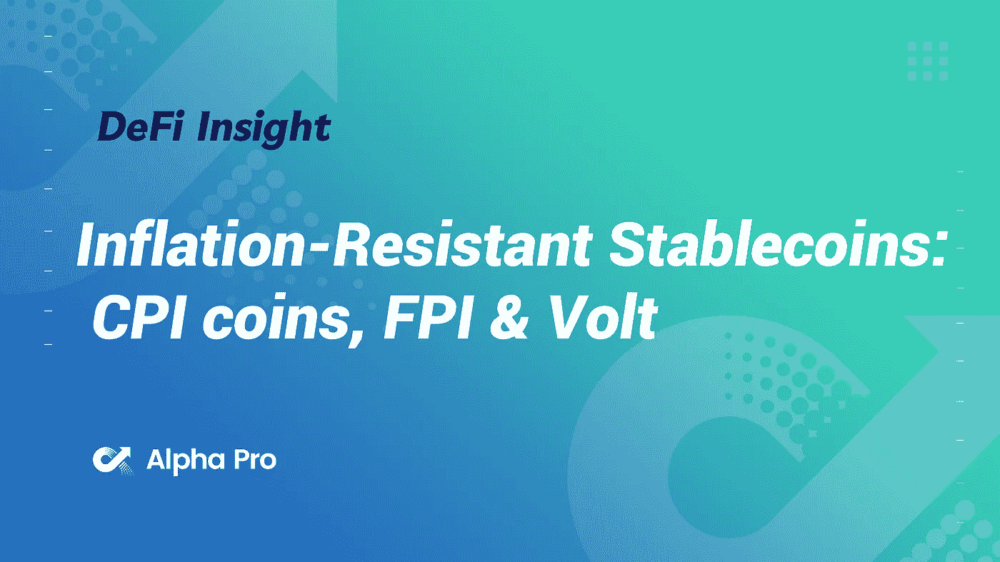
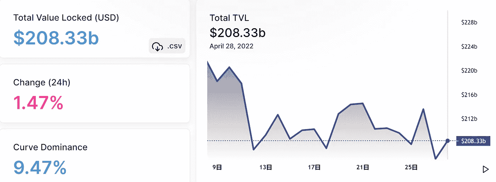
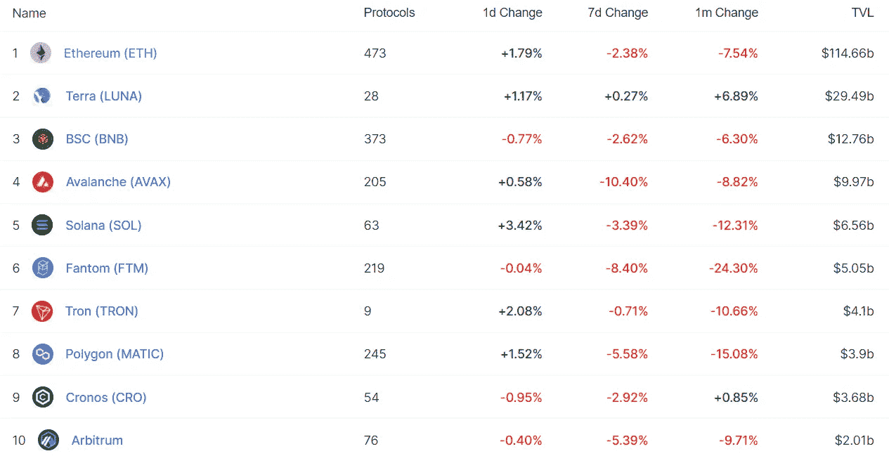
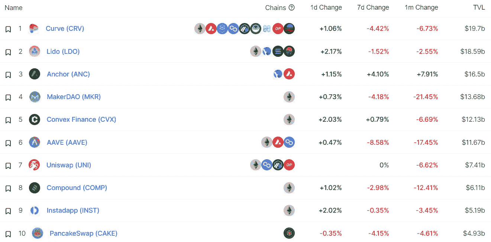
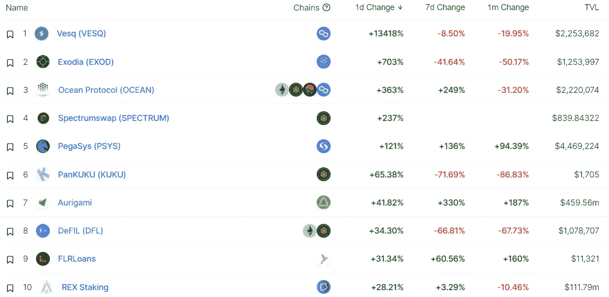
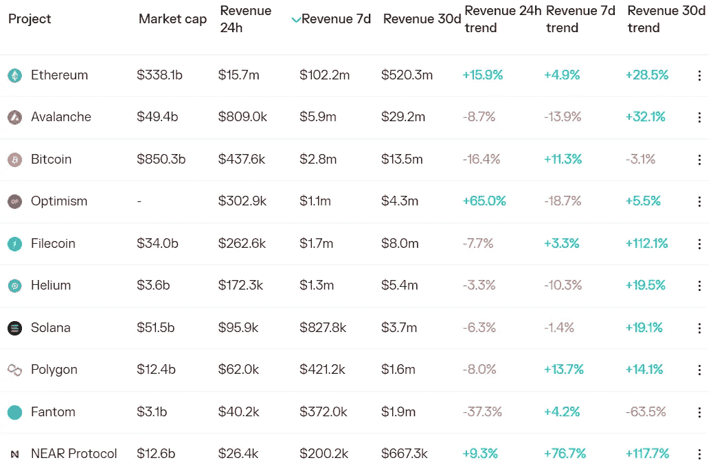
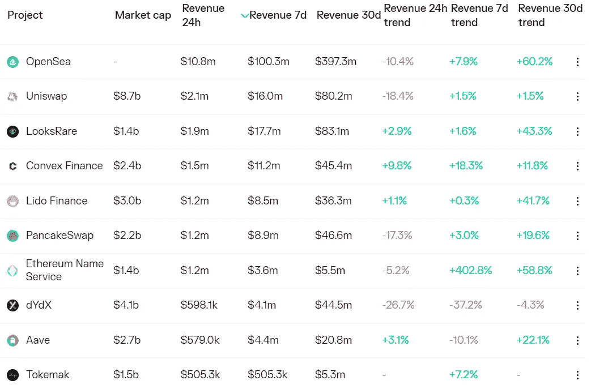
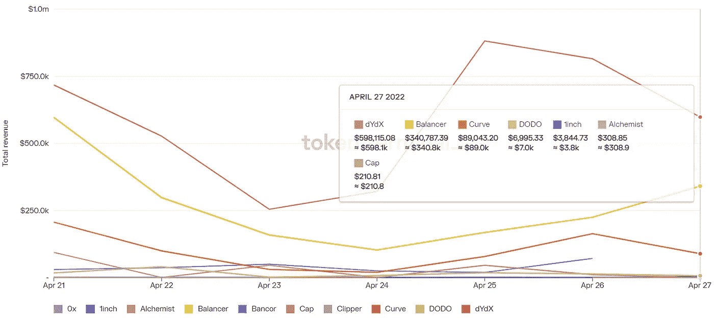
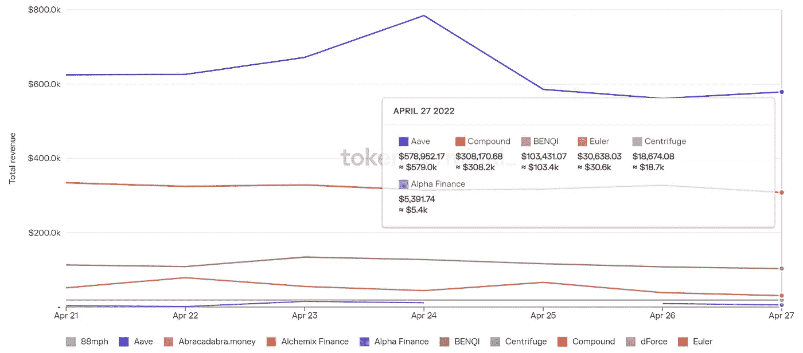

# DeFi Insight |抗通胀稳定硬币:CPI 硬币、FPI 和 Volt

> 原文：<https://medium.com/coinmonks/defi-insight-inflation-resistant-stablecoins-cpi-coins-fpi-volt-dffaa84a7e14?source=collection_archive---------20----------------------->

2022 年 4 月 28 日

*今日 DeFi 数据&由 DeFi Insight 为您带来的新闻。*

> *人们普遍认为 stablecoins 是 crypto 的杀手级应用之一。这种产品非常吸引人，吸引了大批新用户使用 crypto。鉴于 stablecoins 占市值前 20 名的 25%，我认为这是一个公平的评估。但稳定债券的一个突出问题是，在侵蚀购买力的高通胀环境中，就像我们今天所处的环境，持有稳定债券是非常无利可图的。*
> 
> *有一种新的替代原始货币威胁着稳定的货币统治地位，这种独特的货币供应解决了这种无利可图的情况，并在不考虑通货膨胀的情况下保持了购买力:CPI 代币。*[***来源***](https://themothership.substack.com/?utm_source=%2Fprofile%2F39850567-defi-education&utm_medium=reader2-nav)**

# **最新消息**

## **指标**

****/**基于 Evmos 的 [DEX 扩散金融](https://twitter.com/diffusion_fi/status/1519454627707641857)已上线，并将空投至 Uniswap 社区**

## **AMM**

****基于 Evmos 的 [AMM 克洛诺斯金融](/@cronusfinance/cronus-tokenomics-8ea871253661)在 Mainnet 上直播并宣布了$CRN Tokenomics****

## ****产量****

****币安将发布银河计划(GAL)****

## ****桥梁****

******/**跨链桥[雪崩桥](https://twitter.com/avalancheavax/status/1519393039193722881)总交易额超过 500 亿美元****

## ****|令牌****

****比特币基地将增加对 [GMT 和](https://twitter.com/CoinbaseAssets/status/1519346082576277504)GST 的支持****

## ****钱包****

****PayPal 首席执行官表示公司将在数字钱包上“加倍努力”****

## ****提议****

******[永久协议](https://station.terra.money/proposal/1046)关于 Terra 上市的议案已经开始投票******

********Terraform Labs 成员提议向 Evmos 上的$UST LP 提供[奖励](https://agora.terra.money/t/ust-goes-interchain-evmos-edition/6038)********

## ********空投********

**********[认领](https://evmos.blog/claiming-your-evmos-rektdrop-10daead868a8)你的 Evmos Rektdrop**********

## ********投资组合********

**********DeFi 社交交易平台 Nested 宣布[发布](https://twitter.com/NestedFi/status/1519296568100274176)乐观**********

## ********|工具********

**********/**南森[推出](https://twitter.com/ASvanevik/status/1519343982278365184)新 Terra 仪表盘********

## ******NFT******

********STEPN 现已[推出](https://twitter.com/opensea/status/1519513602071351297?s=20&t=wce4KlJk_Nw5mAmX85tvjA) NFT 市场 OpenSea********

********高盛表示，它正在探索实物资产的令牌化********

********MoonPay 的新造币即服务工具宣称自己是“面向非功能性金融工具的 AWS”********

********索拉纳链条上的 NFT 交易总额超过了 20 亿美元********

## ********基金********

**********德菲贸易服务公司 [bloXroute](https://twitter.com/bloXrouteLabs/status/1519397490163920896) 获得 IOBC 资本的战略投资**********

********贝莱德的首只加密挂钩 ETF [在低迷的市场首次亮相](https://news.bloomberglaw.com/securities-law/blackrocks-first-crypto-linked-etf-debuts-in-lackluster-market)********

********B2B 支付平台[部落](https://www.coindesk.com/business/2022/04/27/plataforma-de-pagos-b2b-tribal-completa-venta-de-tokens-por-41-millones/)在比特币基地风险投资公司和其他公司的参与下筹集了 4100 万美元的资金********

# ********数据和分析********

## ********锁定的总价值(TVL)********

********目前全网 DeFi 总锁定量为 2083.3 亿美元，24 小时增长 1.47%。********

****************

## ********TVL 评出的十大连锁酒店********

****************

## ********|最新 TVL 十大项目********

****************

## ********|过去 24 小时内 TVL 增长的前 10 个项目********

****************

## ********协议收入********

## ********|累计总收入最高的项目(24H)_ 区块链(L1)********

****************

## ********|累计总收入最高的项目(24H) _Dapps(L2)********

****************

## ********|前 10 大交易所的每日收入********

****************

## ********|十大贷款协议的每日收入********

****************

# ********深潜********

**********[**EVM 等价**](https://newsletter.banklesshq.com/p/evm-equivalence?s=r)**********

****** [## EVM 等价

### 亲爱的无银行国家，EVM 等价范式将开启以太坊发展的下一阶段。DeFi 2020 年夏季…

newsletter.banklesshq.com](https://newsletter.banklesshq.com/p/evm-equivalence?s=r) 

**[**退出**](https://defieducation.substack.com/p/exit-strategies-fundamentals-and?s=r) **策略、基本面和清理房子****

** [## 退出战略、基本原则和清理门户

### 如果你与密码评论家交谈，你通常会听到类似“密码正在重新学习为什么法规…

defieducation.substack.com](https://defieducation.substack.com/p/exit-strategies-fundamentals-and?s=r) 

**[**为什么**](https://fatmac.substack.com/p/why-maple-finances-milkshakes-will?s=r) **枫叶金融的奶昔会把所有男生(银行)带到(DeFi)院子****

** [## 为什么枫叶金融的奶昔会把所有的男孩(银行)带到院子里

### 虽然 DeFi 协议的 TVL 已经从 2020 年夏天的 10 亿美元膨胀到今天的 2000 多亿美元，但这个数字是…

fatmac.substack.com](https://fatmac.substack.com/p/why-maple-finances-milkshakes-will?s=r) 

**[**财政部**](https://www.egirlcapital.com/writings/12135%E2%80%A6) **在鱼尾狮密码中管理****

 **[## 埃吉尔资本

### 编辑描述

www.egirlcapital.com](https://www.egirlcapital.com/writings/12135%E2%80%A6)** 

****[**龙取**](https://lex.substack.com/p/long-take-deriving-polygon-supernets?s=r) **:通过自然法则推导多边形超网和雪崩子网值累加******

**** [## 长远考虑:通过定律推导多边形超网和雪崩子网的价值增长…

### Gm Fintech Architects -今天，我们将深入探讨以下主题:摘要:这是一个关于如何…

lex.substack.com](https://lex.substack.com/p/long-take-deriving-polygon-supernets?s=r) 

**[**安德烈·克罗尼**](https://members.delphidigital.io/media/andre-cronje-out-of-the-crypto-badlands-into-a-regulated-future) **:走出加密的不毛之地走向规范的未来******** 

# ****报告****

******Q1 22 市场** [**破落**](https://messari.io/article/nft-q1-22-market-rundown)**_ 梅萨里******

> ******2022 年第一季度，二级市场销售额达到创纪录的 100 亿美元。
> 以太坊仍然主导着 NFT 二级市场，占据了 NFT 二级市场约 84%的交易量，或整个 Q1 22 年 85 亿美元的销售额。据 Immutable X 报道，在过去的 60 天里，NFT 的交易额达到了 7000 万美元，主要来自 GaryVee 的新 NFT 项目。
> 静态 NFT(PFPs、艺术品和收藏品)仍占 NFT 总市值的大部分。******

********NFTWorlds:**[**利用**](https://www.theblockresearch.com/nftworlds-leveraging-on-minecrafts-source-code-141220) **对《我的世界》的源代码** _theblockresearch******

******新** [**Dapps 报道**](https://dappradar.com/blog/new-dapps-report-moonbirds-to-the-moon-and-beyond) **:月鸟——到月球和更远的地方** _dappradar****

******关于:******

****DeFi Insight 是顶级 DeFi 和加密新闻和更新的来源。****

******https://twitter.com/AlphaPro_io 推特:******

********❤RSS:**[**https://medium.com/feed/@alphapro.project**](https://medium.com/feed/@alphapro.project)******

****提供的信息应被视为发展新闻，而不是投资建议。****

> ****加入 Coinmonks [电报频道](https://t.me/coincodecap)和 [Youtube 频道](https://www.youtube.com/c/coinmonks/videos)了解加密交易和投资****

# ****另外，阅读****

*   ****[3 商业评论](/coinmonks/3commas-review-an-excellent-crypto-trading-bot-2020-1313a58bec92) | [Pionex 评论](https://coincodecap.com/pionex-review-exchange-with-crypto-trading-bot) | [Coinrule 评论](/coinmonks/coinrule-review-2021-a-beginner-friendly-crypto-trading-bot-daf0504848ba)****
*   ****[莱杰 vs Ngrave](/coinmonks/ledger-vs-ngrave-zero-7e40f0c1d694) | [莱杰 nano s vs x](/coinmonks/ledger-nano-s-vs-x-battery-hardware-price-storage-59a6663fe3b0) | [币安评论](/coinmonks/binance-review-ee10d3bf3b6e)****
*   ****[Bybit Exchange 评论](/coinmonks/bybit-exchange-review-dbd570019b71) | [Bityard 评论](https://coincodecap.com/bityard-reivew) | [Jet-Bot 评论](https://coincodecap.com/jet-bot-review)****
*   ****[3 commas vs crypto hopper](/coinmonks/3commas-vs-pionex-vs-cryptohopper-best-crypto-bot-6a98d2baa203)|[赚取加密利息](/coinmonks/earn-crypto-interest-b10b810fdda3)****
*   ****最好的比特币[硬件钱包](/coinmonks/hardware-wallets-dfa1211730c6) | [BitBox02 回顾](/coinmonks/bitbox02-review-your-swiss-bitcoin-hardware-wallet-c36c88fff29)**************