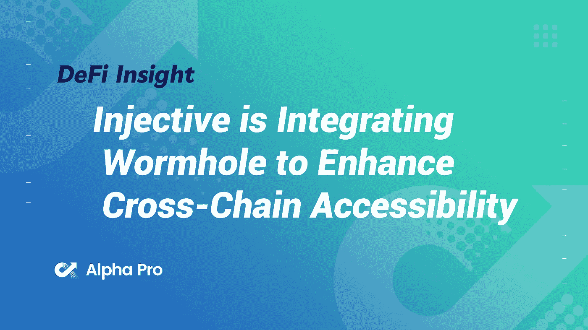
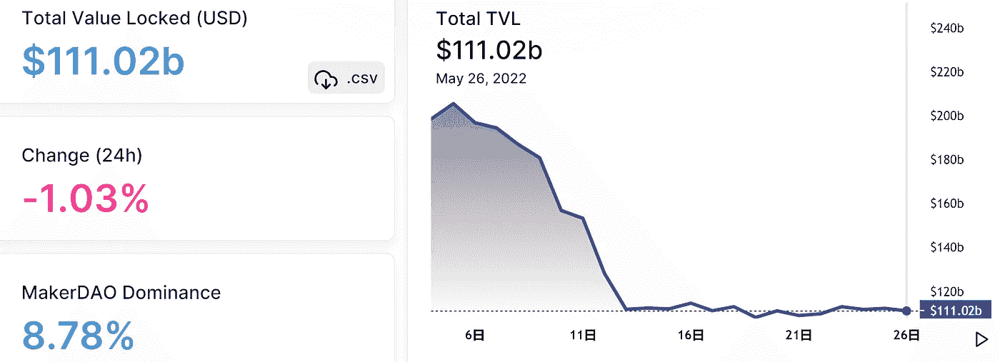
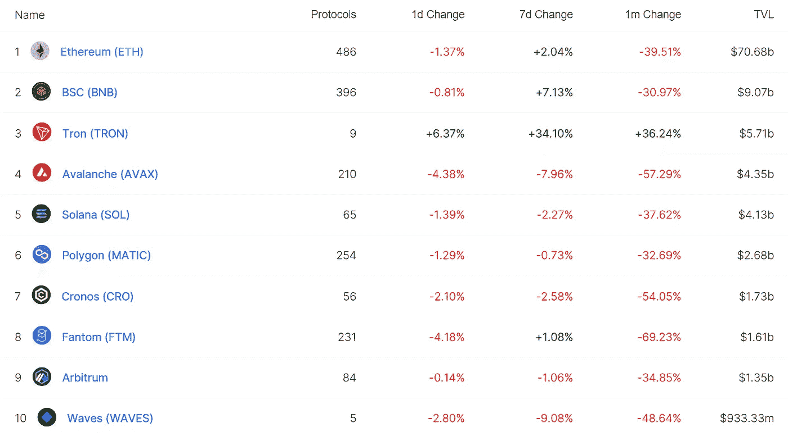
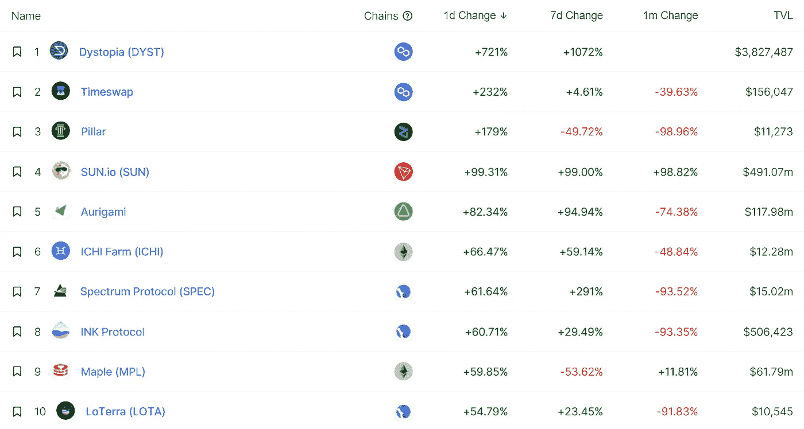
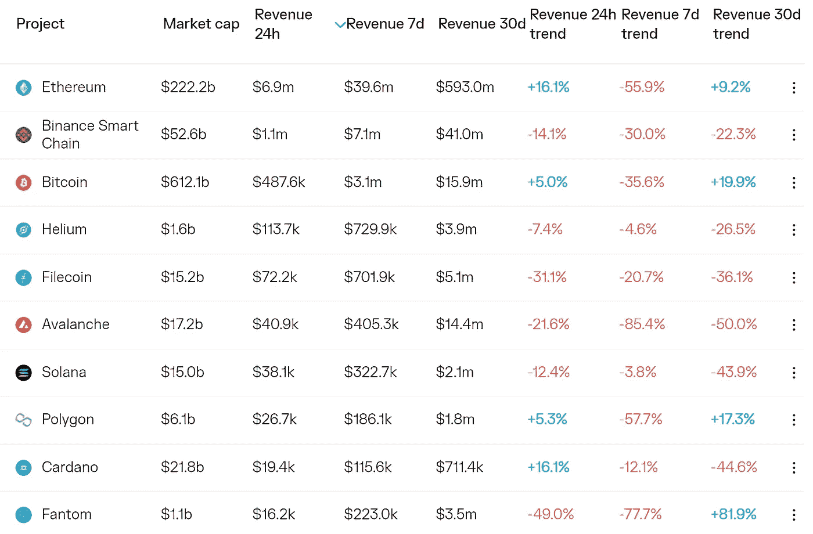
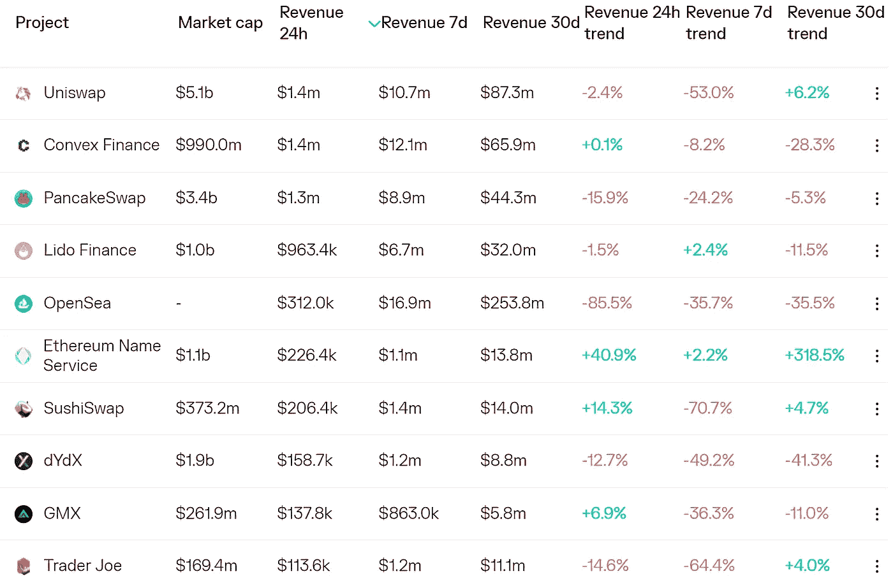
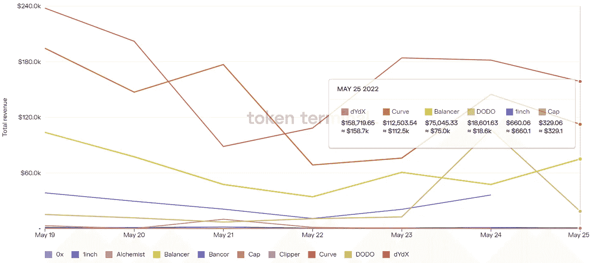
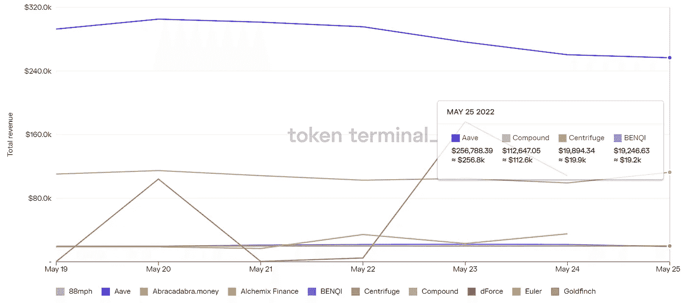

# DeFi Insight | Injective 正在整合虫洞以增强跨链可访问性

> 原文：<https://medium.com/coinmonks/defi-insight-injective-is-integrating-wormhole-to-enhance-cross-chain-accessibility-9d4cd025b1de?source=collection_archive---------38----------------------->

2022 年 5 月 26 日

*今日 DeFi 数据&由 DeFi Insight 为您带来的新闻*

> *“*Injective 正与虫洞合作，将 10 个新区块链引入其已经可互操作的网络。通过这一整合，Injective 将成为区块链中交叉链连接数量最多的公司之一。
> 
> Injective 天生能够连接以太坊、宇宙和许多其他 IBC 链。与虫洞的新合作将使 Injective 成为 Solana 和其他著名的第 1 层链的跨链本地资产进入宇宙的主要门户。*“@*[*来源*](https://blog.injective.com/injective-is-integrating-wormhole-to-enhance-cross-chain-accessibility/)

# 最新消息

## 外汇

**[比特币基地](https://twitter.com/CoinbaseAssets/status/1529490278670901248)将列出$沙**

## **产量**

****更多关于[光环金融](https://mirror.xyz/0xfEE0Bbe31345a7c27368534fEf45a57133FF3A86/pHF9FFR2sn2ZTLNh6YCyCivb0p7W_uPB5m4diS4jz58)和我们的上市计划****

## ****打桩****

******[锁定采用](https://beincrypto.com/staking-adoption-is-being-hindered-by-lock-up-requirements/?utm_source=blockworks-research)受到锁定要求的阻碍******

## ******稳定币******

******火币和币安密码交易所表示支持 Terra LUNA 2.0******

## ******保险******

******保险公司称将在 Terra 崩溃后向索赔者支付数百万美元******

## ******第二层******

******StarkNet 合同版本 1.0******

## ******|子网******

******Avalanche 的新提议希望 ApeCoin 出现在它的子网中******

## ******支付******

********[条纹和底漆](https://bitcoinist.com/stripe-and-primer-lightning-bitcoin-payments/) Go Lightning:通过 OpenNode 的新比特币支付解决方案********

## ******|令牌******

********分散的世界地毯拉[流失](https://dappradar.com/blog/decentraworld-rug-pull-drains-over-1-million-in-bnb)超过 100 万美元在 BNB********

## ******鲸鱼******

******柴犬:这就是捕鲸业对 SHIB 的影响******

## ******采矿******

******在经历了数月的下滑后，Nvidia 的加密挖掘芯片收入现在“名义上”******

## ******政策与法规******

******世界银行不会支持中非共和国的桑戈加密中心******

******中国最高法院呼吁司法系统大规模收养区块链******

## ******NFT******

********介绍[编写 NFTs](https://dev.mirror.xyz/5gt60vKFJZ_tR1BjoJ7-Y0sNw7REebStHjzFU5x73J0?w)********

## ******基金******

******a16z 为其有史以来最大的加密基金筹集了 45 亿美元******

********、**新 DeFi 指数目标“已证实”[蓝筹资产](https://blockworks.co/new-defi-index-targets-proven-blue-chip-assets/)******

****前币安高管推出 1 亿美元的加密基金****

## ****观点****

****准确预测比特币和密码崩溃的分析师为 BTC 确定了底部目标价****

****摩根大通在市场低迷时期看好比特币和加密技术****

******密码分析师解释[为什么](https://www.cryptoglobe.com/latest/2022/05/crypto-analyst-explains-why-cardano-ada-remains-a-top-10-cryptoasset/)Cardano(ADA)仍然是十大密码资产******

********[美国参议员](https://news.bitcoin.com/us-senator-cruz-incredibly-bullish-on-bitcoin-says-i-have-a-weekly-buy/)克鲁兹“非常看好”比特币——他说“我每周都会买一次”********

# ******数据和分析******

## ******锁定的总价值(TVL)******

******目前全网 DeFi 总锁定量为 1100.2 亿美元，24 小时下降 1.03%。******

************

## ******TVL 评出的十大连锁酒店******

************

## ******|最新 TVL 十大项目******

************

## ******|过去 24 小时内 TVL 增长的前 10 个项目******

************

## ******协议收入******

## ******|累计总收入最高的项目(24H)_ 区块链(L1)******

************

## ******|累计总收入最高的项目(24H) _Dapps (L2)******

************

## ******|前 10 大交易所的每日收入******

************

## ******|十大贷款协议的每日收入******

************

# ******深潜******

********情绪对** [**比特币价格的影响**](https://bitcoinmagazine.com/markets/social-sentiment-effects-on-bitcoin-price)******

**** [## 情绪对比特币价格的影响

### 最近加入比特币网络的潜在新投资者表达了对该资产的社会兴趣。是否…

bitcoinmagazine.com](https://bitcoinmagazine.com/markets/social-sentiment-effects-on-bitcoin-price) 

**为什么要搞清楚 DeFi 上交易的** [**结构**](https://eigenphi.substack.com/p/why-you-should-figure-out-the-structures?utm_source=%2Finbox&utm_medium=reader2&s=r) **？**

 [## 为什么你应该弄清楚 DeFi 上的交易结构？

### 根据彭博的调查，在过去的 12 个月中，全球加密技术的采用率增长了 881%,所有这些都可以…

eigenphi.substack.com](https://eigenphi.substack.com/p/why-you-should-figure-out-the-structures?utm_source=%2Finbox&utm_medium=reader2&s=r) 

**比特币价格维持在区间内，为什么多头需要** [**掌控**](https://www.newsbtc.com/analysis/btc/bitcoin-price-range-30k/)

 [## TA:比特币价格仍在区间内，为什么多头需要控制

### 比特币兑美元重新测试了关键的 28500 美元支撑区。BTC 正在上涨，多头可能会采取明确的行动…

www.newsbtc.com](https://www.newsbtc.com/analysis/btc/bitcoin-price-range-30k/) 

**[**NFTs**](https://www.bsc.news/post/the-state-of-nfts-in-volatile-markets)**在震荡行情中的状态****

** [## 动荡市场中非正规金融机构的状况

### 在过去的 30 天里，非上市公司的总交易量下降了 50%以上，从 5 月 1 日的 575 亿美元降至 273.5 亿美元…

www.bsc.news](https://www.bsc.news/post/the-state-of-nfts-in-volatile-markets) 

******哪些加密货币最安全？******

**** [## 哪些加密货币最安全？隐板岩

### 👋想和我们一起工作吗？CryptoSlate 正在招聘几个职位！密码行业的安全性是一个热门话题…

cryptoslate.com](https://cryptoslate.com/which-cryptocurrencies-are-the-most-secure/)**** 

# ****报告****

******以太世界** _glassnode 的一个 [**简史**](https://insights.glassnode.com/a-short-history-of-the-etherverse/)****

> ******就以太坊的用途而言，以太坊有很多用途。从早期的原生资产支付网络，到 2018 年的可替代令牌，以及最近的不可替代令牌，许多用例都成为该平台最大的费用支付者。与最初的以太坊设想一致，我们不得不承认以太坊看起来是一台通用的分散式计算机，对它所执行的计算几乎是不可知的。******

********[**目中无人**](https://members.delphidigital.io/reports/defiant-in-the-face-of-volatility) **面对波动** _delphidigital********

******[**Flexa**](https://messari.io/article/flexa-you-can-have-your-crypto-and-spend-it-too)**:你可以拥有你的密码，也可以花掉它** _messari******

******筹划** [**北海巨妖**](https://www.theblockresearch.com/mapping-out-krakens-acquisitions-investments-148472) **的收购&投资** _theblockresearch****

******关于:******

****DeFi Insight 是顶级 DeFi 和加密新闻和更新的来源。****

******https://twitter.com/AlphaPro_io**❤****

********❤RSS:**[**https://medium.com/feed/@alphapro.project**](https://medium.com/feed/@alphapro.project)******

****提供的信息应被视为发展新闻，而不是投资建议。****

> ****加入 Coinmonks [电报频道](https://t.me/coincodecap)和 [Youtube 频道](https://www.youtube.com/c/coinmonks/videos)了解加密交易和投资****

# ****另外，阅读****

*   ****[Bookmap 点评](https://coincodecap.com/bookmap-review-2021-best-trading-software) | [美国 5 大最佳加密交易所](https://coincodecap.com/crypto-exchange-usa)****
*   ****最佳加密[硬件钱包](/coinmonks/hardware-wallets-dfa1211730c6) | [Bitbns 评论](/coinmonks/bitbns-review-38256a07e161)****
*   ****[新加坡十大最佳加密交易所](https://coincodecap.com/crypto-exchange-in-singapore) | [购买 AXS](https://coincodecap.com/buy-axs-token)****
*   ****[红狗赌场评论](https://coincodecap.com/red-dog-casino-review) | [Swyftx 评论](https://coincodecap.com/swyftx-review) | [CoinGate 评论](https://coincodecap.com/coingate-review)****
*   ****[投资印度的最佳密码](https://coincodecap.com/best-crypto-to-invest-in-india-in-2021)|[WazirX P2P](https://coincodecap.com/wazirx-p2p)|[Hi Dollar Review](https://coincodecap.com/hi-dollar-review)****
*   ****[加拿大最佳加密交易机器人](https://coincodecap.com/5-best-crypto-trading-bots-in-canada) | [库币评论](https://coincodecap.com/kucoin-review)****
*   ****[用于 Huobi 的加密交易信号](https://coincodecap.com/huobi-crypto-trading-signals) | [HitBTC 审查](/coinmonks/hitbtc-review-c5143c5d53c2)**********