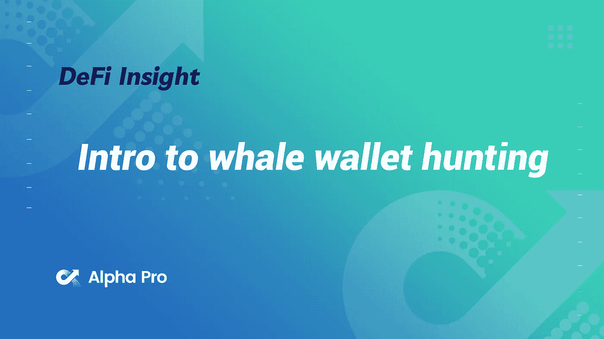
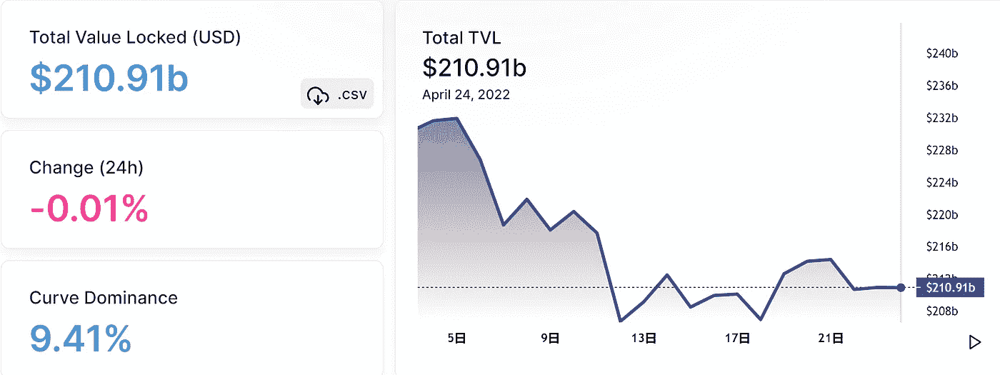
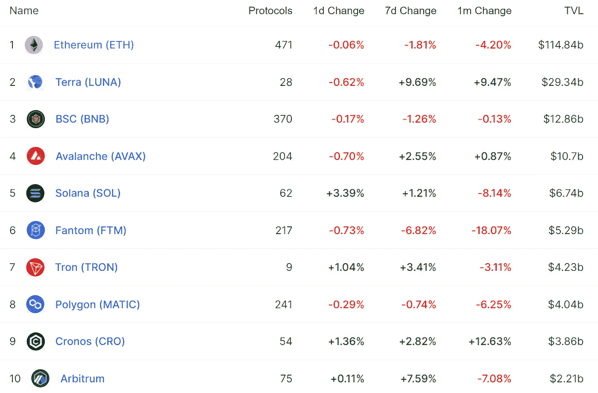
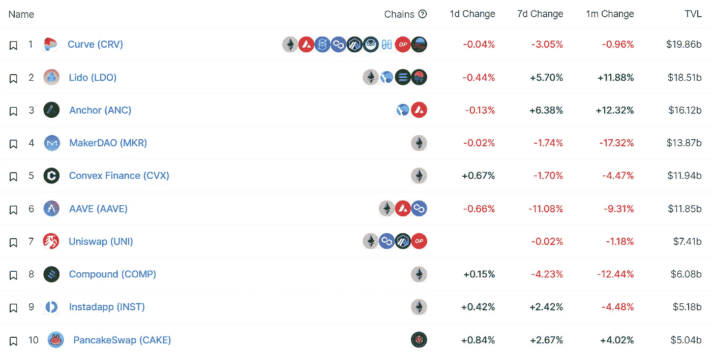
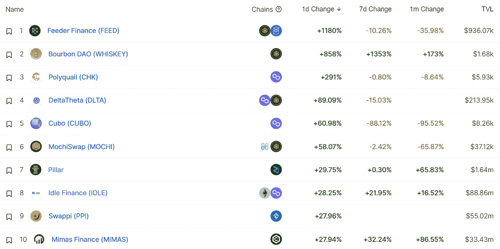
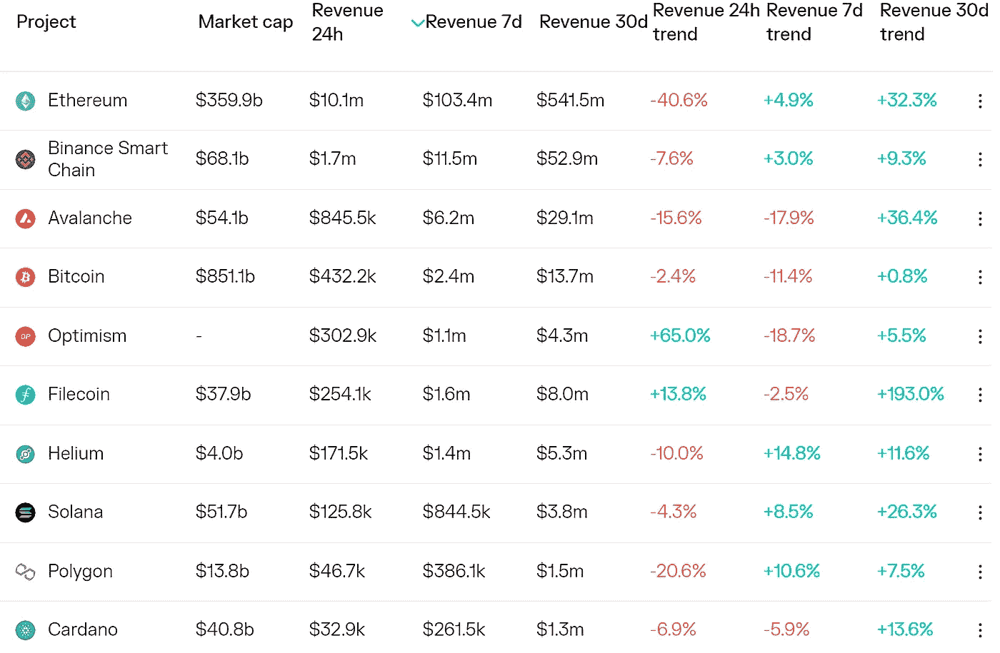
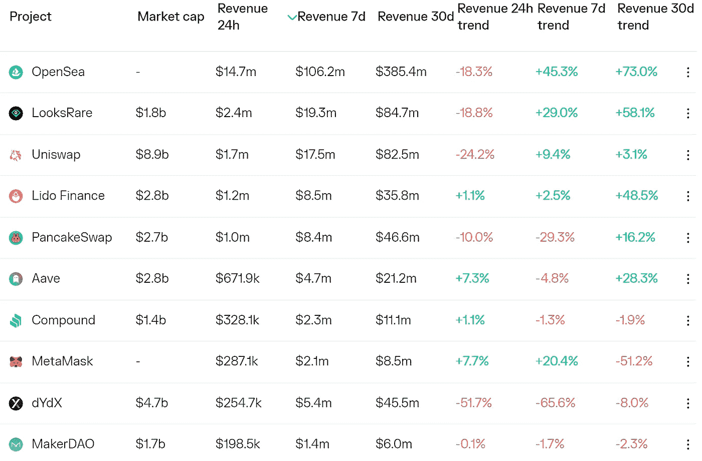
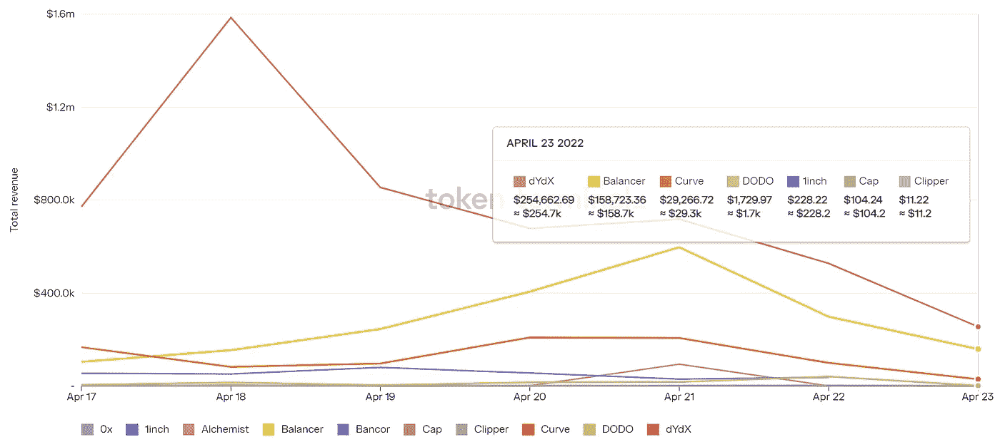
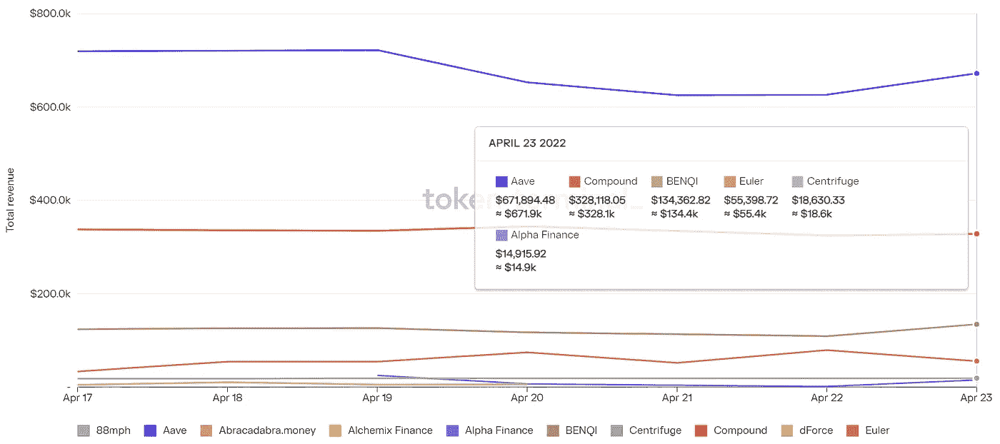

# DeFi Insight |猎鲸钱包介绍

> 原文：<https://medium.com/coinmonks/defi-insight-intro-to-whale-wallet-hunting-33c769ce3e0f?source=collection_archive---------8----------------------->

2022 年 4 月 24 日

*今日 DeFi 数据&由 DeFi Insight 为您带来的新闻。*

> “鲸鱼拥有所有的阿尔法。他们总是领先一步。
> 借助合适的工具，我们可以看到鲸鱼做的一切。这些信息可以让你变得富有。
> 以下是识别鲸鱼并分析它们的交易如何影响市场的指南。” [@pothu](https://twitter.com/cryptoPothu/status/1517473267757371393)

# 最新消息

## 指标

THORChain DEX ASGARDEX [发布 v0.14.0 版本](https://twitter.com/asgardex/status/1517889129375309826)

## 稳定币

**币安[支持](https://twitter.com/GoonsNft/status/1517611124098752512)USDC 在多边形链上的存取款服务**

****USDC 发行雪崩链[超过](https://usdc.cool/avalanche)13 亿美元，创历史新高****

******Abracadabra[推出](https://abracadabramoney.medium.com/introducing-cauldrons-v3-919a64742e0f)借贷市场大锅 V3 版本******

## ******叉子******

********[ConsenSys](https://twitter.com/ajsutton/status/1517869283883331586)总工程师:以太坊 mainnet 影叉 2 非常流畅********

## ******道******

********Notifi[将](https://www.theblockbeats.info/flash/78260)世界上第一个 Web3 消息传递 SDK 与索拉纳 SPL 治理相集成********

## ******|令牌******

********[数据](https://news.bitcoin.com/while-apecoin-reaches-new-price-highs-data-shows-top-100-ape-holders-control-52-of-the-supply/)显示前 100 名 APE 持有者控制了 52%的供应量********

## ******NFT******

******以太坊 NFT 市场推出后，比特币基地股票创历史新低******

********Injective Pro[推出](https://blog.injective.com/injective-pro-launches-the-first-ever-bored-ape-nft-floor-price-perpetuals/)有史以来第一个无聊的猿 NFT 底价永久物********

********NFT 项目[Akutars](https://twitter.com/akudreams):Github 上有铸造合同的代码供审查和测试********

********巴黎圣日耳曼推出梅西主题金球奖 [NFT](https://www.marca.com/en/football/psg/2022/04/22/6262d782e2704e54508b4585.html)********

## ******基金******

********[ETC 集团](https://www.businesswire.com/news/home/20220422005211/en/ETC-Group-Launches-XRP-Backed-ETC-on-Xetra)推出追踪 XRP 的 ETP 产品********

## ******观点******

******Gerber Kawasaki 首席执行官:加密货币将以难以想象的方式颠覆传统金融******

******荷兰中央银行行长:加密货币市场可能很快会对全球金融稳定构成威胁******

# ******数据和分析******

## ******锁定的总价值(TVL)******

******目前全网 DeFi 总锁定量为 2109.1 亿美元，24 小时下降 0.01%******

************

## ******TVL 评出的十大连锁酒店******

************

## ******|最新 TVL 十大项目******

************

## ******|过去 24 小时内 TVL 增长的前 10 个项目******

************

## ******协议收入******

## ******|累计总收入最高的项目(24H)_ 区块链(L1)******

************

## ******|累计总收入最高的项目(24H) _Dapps(L2)******

************

## ******|前 10 大交易所的每日收入******

************

## ******|十大贷款协议的每日收入******

************

# ******深潜******

********[**10 课**](https://www.getrevue.co/profile/route2fi/issues/10-lessons-from-a-blackjack-card-counter-on-how-to-make-it-in-crypto-1146556) **从一个二十一点的算牌人那里学到如何做密码**********

**** [## ♠️ 10 教训从一个 21 点卡计数器就如何使它在🂡加密

### 定义和加密很容易解释📈-这一期的时事通讯很特别。DeFi 教育家同意做一个…

www.getrevue.co](https://www.getrevue.co/profile/route2fi/issues/10-lessons-from-a-blackjack-card-counter-on-how-to-make-it-in-crypto-1146556) 

**[**密码先生**](https://apricitas.substack.com/p/mr-crypto-goes-to-washington?s=r) **去华盛顿****

** [## Crypto 先生去了华盛顿

### 本博客表达的观点完全是我个人的，不一定代表劳动局的观点…

apricitas.substack.com](https://apricitas.substack.com/p/mr-crypto-goes-to-washington?s=r)** 

# **报告**

****Q1 dYdX 2022**的状态 _ 梅萨里**

> **与上一季度相比，Q1 的 dYdX 交易量下降了 23.8%，这与其他基于现货的 dex 交易量下降以及加密市值整体下降相吻合。从 1 月到季度末，使用该协议的周交易者数量一直呈上升趋势。
> 本季度新账户储户在 2020 年第三季度达到峰值后连续第二个季度下降
> dYdX 宣布了该协议的新功能，包括一款新移动应用的测试版，一个游戏化的交易联盟平台，独特的用户配置文件，以及一个名为 Hedgies 的相应的新 NFT 头像集合。
> 今年剩余时间最值得期待的目标之一是发布 dYdX V4，这将使协议完全去中心化，并防止任何一方控制协议的收入。**

****关于:****

**DeFi Insight 是顶级 DeFi 和加密新闻和更新的来源。**

****https://twitter.com/AlphaPro_io 推特:****

******❤RSS:**[**https://medium.com/feed/@alphapro.project**](https://medium.com/feed/@alphapro.project)****

****提供的信息应被视为发展新闻，而不是投资建议。****

> *****加入 Coinmonks* [*电报频道*](https://t.me/coincodecap) *和* [*Youtube 频道*](https://www.youtube.com/c/coinmonks/videos) *了解加密交易和投资*****

# ****另外，阅读****

*   ****[有哪些交易信号？](https://coincodecap.com/trading-signal) | [Bitstamp vs 比特币基地](https://coincodecap.com/bitstamp-coinbase) | [买索拉纳](https://coincodecap.com/buy-solana)****
*   ****[ProfitFarmers 点评](https://coincodecap.com/profitfarmers-review) | [如何使用 Cornix 交易机器人](https://coincodecap.com/cornix-trading-bot)****
*   ****[十大最佳加密货币博客](https://coincodecap.com/best-cryptocurrency-blogs) | [YouHodler 评论](https://coincodecap.com/youhodler-review)****
*   ****[MyConstant Review](https://coincodecap.com/myconstant-review) | [8 款最佳摇摆交易机器人](https://coincodecap.com/best-swing-trading-bots)****
*   ****[MXC 交易所评论](/coinmonks/mxc-exchange-review-3af0ec1cba8c) | [Pionex vs 币安](https://coincodecap.com/pionex-vs-binance) | [Pionex 套利机器人](https://coincodecap.com/pionex-arbitrage-bot)********