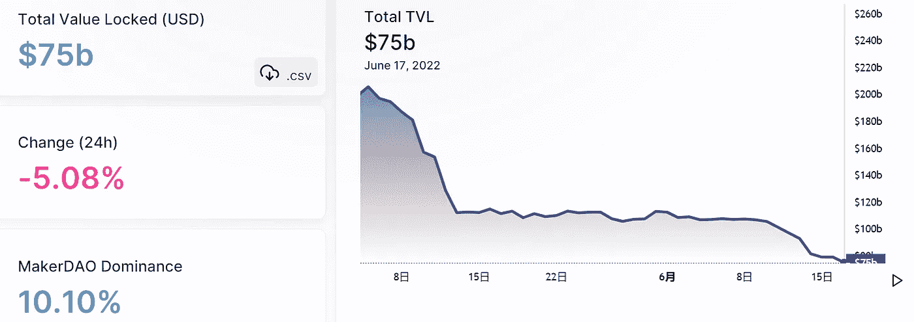

# DeFi Insight |被 DeFi？

> 原文：<https://medium.com/coinmonks/defi-insight-is-defi-ded-fd0731ae3fb8?source=collection_archive---------20----------------------->

2022 年 6 月 17 日

*今日 DeFi 数据&由 DeFi Insight 为您带来的新闻*

> *熊市正在肆虐整个 crypto。*
> 
> *价格下跌得很厉害。主要的行业参与者都牺牲在它的祭坛上。加密 Twitter 上的市场情绪感觉就像在葬礼上接受休克疗法。*
> 
> *Terra 和 Celsius 在几天之内就被市场力量暴露出来并被剥离。现在，三箭资本(3AC)被传言面临资不抵债。*“@*[*来源*](https://newsletter.banklesshq.com/p/is-defi-ded?utm_source=%2Finbox&utm_medium=reader2)*

# *最新消息*

## *贷款*

***/**[block fi](https://twitter.com/BlockFiZac/status/1537499455007645696)最近为有超额保证金贷款义务的大客户清算和对冲抵押品*

## *外汇*

***[霍比](https://beincrypto.com/huobi-thailand-shutter-july-1-heres-why/)泰国将于 7 月 1 日关闭***

*****[德里比特](https://twitter.com/DeribitExchange/status/1537459035213074433)确认三箭资本为其母公司股东，经营不受影响*****

*****CZ 否认关于币安考虑重新进入南韩市场的报道*****

## *****产量*****

*****光环金融的光环存款和空投索赔是实时的*****

## *****交叉链*****

*******[卡瓦](/kava-labs/kava-partners-with-celer-cbridge-to-enable-cross-chain-asset-transfers-3f75efbaed3c)网络与 Celer cBridge 达成合作关系*******

*********[WOOFi](/woonetwork/woofi-launches-cross-chain-swaps-between-avalanche-fantom-and-bsc-bc5080672e60)在 Avalanche、Fantom 和 BNB 链之间发起跨链互换*********

## *******第二层*******

*********[乐观](https://twitter.com/optimismPBC/status/1537533861562880001)将于世界协调时 6 月 23 日升级公共端点基础设施*********

*********,**Zerion 将其非托管 Web3 智能钱包带到 [Polygon](https://blog.polygon.technology/zerion-brings-its-non-custodial-web3-smart-wallet-to-polygon/?utm_source=Twitter-Main+&utm_medium=Tweet+&utm_campaign=Tier-1-Announcement+)*******

## *****EVM*****

*******[EOS 网络基金会创始人](https://twitter.com/BigBeardSamurai/status/1537573454416863233) : EOS EVM 已经部署在 Testnet 上*******

## *******|警报*******

*********[刀匠攻击者](https://twitter.com/PeckShieldAlert/status/1537594264414490625)给龙卷风转账 100 万美元戴。现金*********

## *******叉子*******

*********[以太坊](https://twitter.com/TimBeiko/status/1537548845265039360)将于 6 月 29 日经历灰色冰川分叉，以推回难度炸弹*********

## *******政策与法规*******

*******德克萨斯州证券监管机构正在调查 Celsius 账户冻结——官方*******

*********[CFTC 专员](https://www.coindesk.com/policy/2022/06/16/cftc-commissioner-i-like-being-an-underdog-versus-the-sec/) : CFTC 处理事件的反应可能比证交会更快*********

## *******基金*******

*******游戏开发商[发条实验室](https://clockwork-labs.medium.com/press-release-june-16-2022-aa54b5fd0fa2)在 a16z 领投的首轮融资中筹集了 2200 万美元*******

*********NFT 智能钱包[城堡](https://twitter.com/CastleLinkHQ/status/1537528863038836739)完成由蜻蜓资本领投的 150 万美元种子前融资*********

*********、**零知识证明初创公司 [zCloak Network](https://www.theblock.co/post/152423/zero-knowledge-proof-startup-zcloak-network-raises-5-8-million?utm_source=onecryptofeed&amp%3Butm_medium=onecryptofeed) 融资 580 万美元*******

*****全球新兴市场支持印尼区块链公司融资 6000 万美元*****

# *****数据和分析*****

## *****锁定的总价值(TVL)*****

*****目前全网 DeFi 总锁定量为 750 亿美元，24 小时下降 5.08%。*****

**********

## *****TVL 评出的十大连锁酒店*****

**********

## *****|最新 TVL 十大项目*****

**********

## *****|过去 24 小时内 TVL 增长的前 10 个项目*****

**********

## *****协议收入*****

## *****|累计总收入最高的项目(24H)_ 区块链(L1)*****

**********

## *****|累计总收入最高的项目(24H) _Dapps (L2)*****

**********

## *****|前 10 大交易所的每日收入*****

**********

## *****|十大贷款协议的每日收入*****

**********

# *****深潜*****

*******比特币价格** [**分析**](https://bitcoinmagazine.com/markets/bitcoin-price-analysis-and-macro-overview) **和宏观概述*******

***** [## 比特币价格分析和宏观概述

### 在 YouTube 上观看这一集或在这里收听这一集:“美联储观察”是比特币创造者的宏播客…

bitcoinmagazine.com](https://bitcoinmagazine.com/markets/bitcoin-price-analysis-and-macro-overview) 

**对于至少一个利益群体:游戏玩家来说，加密价格的暴跌可能是个好消息**

** [## 一个可能乐于看到加密崩溃的群体是游戏玩家

### 随着比特币和以太网价格下跌，加密矿工可能会放弃他们的 GPU，这意味着游戏玩家可以在…

fortune.com](https://fortune.com/2022/06/17/crypto-crash-graphics-card-price-nvidia-amd-bitcoin-ether-mining/) 

**[**你需要了解的一切**](https://www.bsc.news/post/everything-you-need-to-know-about-binance-convert) **关于币安皈依****

** [## 你需要知道的关于币安转换的一切

### 新功能允许用户以有保证的价格进行经济高效的交易，而没有意外风险…

www.bsc.news](https://www.bsc.news/post/everything-you-need-to-know-about-binance-convert)** 

# **报告**

****是** [**的脱钩利多押上**](https://coinshares.com/research/is-the-decoupling-of-lidos-staked-eth-another-stablecoin-collapse) **另一稳定币崩**_ 币股**

> **Lido 是一种流动的赌注服务，允许用户下注 ETH，并收到一张被称为 stETH 的令牌化借据。这允许用户获得赌注的回报，但仍然可以获得流动资产。利多的 stETH 是最受欢迎的流动性赌注衍生品，大约有 1/3 的赌注被锁定在合约中。最近几个月，以太坊社区开始关注利多积聚的力量，以及其背后的中央集权力量。如果一个恶意行为者控制了 33%的股份，那么后果可能是有害的，因此这些流动股份服务引起了争议。关于此类服务的风险和回报的辩论在网上变得越来越活跃，但还没有提供任何银弹解决方案。**

********与网络身份的社会建构 3**_ the block 研究******

******[**鞍式金融**](https://messari.io/article/saddle-finance-amm-dex-for-pegged-assets) **:挂钩资产的 AMM-德克斯**_ 梅萨里******

******[**Chain link**](https://tokeninsight.com/en/research/analysts-pick/chainlink-bridging-real-world-and-on-chain-economy)**—沟通现实世界与连锁经济** _tokeninsight******

******关于:******

****DeFi Insight 是顶级 DeFi 和加密新闻和更新的来源。****

******https://twitter.com/AlphaPro_io 推特:******

********❤RSS:**[**https://medium.com/feed/@alphapro.project**](https://medium.com/feed/@alphapro.project)******

****提供的信息应被视为发展新闻，而不是投资建议。****

> ****加入 Coinmonks [电报频道](https://t.me/coincodecap)和 [Youtube 频道](https://www.youtube.com/c/coinmonks/videos)了解加密交易和投资****

# ****另外，阅读****

*   ****[AscendEx Staking](https://coincodecap.com/ascendex-staking)|[Bot Ocean Review](https://coincodecap.com/bot-ocean-review)|[最佳比特币钱包](https://coincodecap.com/bitcoin-wallets-india)****
*   ****[霍比评论](https://coincodecap.com/huobi-review) | [OKEx 保证金交易](https://coincodecap.com/okex-margin-trading) | [期货交易](https://coincodecap.com/futures-trading)****
*   ****[电网交易机器人](https://coincodecap.com/grid-trading) | [Cryptohopper 审核](/coinmonks/cryptohopper-review-a388ff5bae88) | [Bexplus 审核](https://coincodecap.com/bexplus-review)****
*   ****[7 个最佳零费用加密交易平台](https://coincodecap.com/zero-fee-crypto-exchanges)****
*   ****[氹欞侊贸易评论](https://coincodecap.com/anny-trade-review) | [霍比融资融券交易](/coinmonks/huobi-margin-trading-b3b06cdc1519)****
*   ****[分散交易所](https://coincodecap.com/what-are-decentralized-exchanges) | [比特 FIP](https://coincodecap.com/bitbns-fip) | [Pionex 审查](https://coincodecap.com/pionex-review-exchange-with-crypto-trading-bot)***********