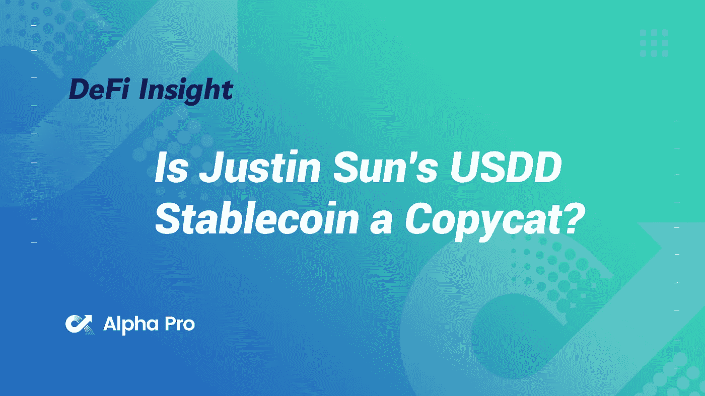
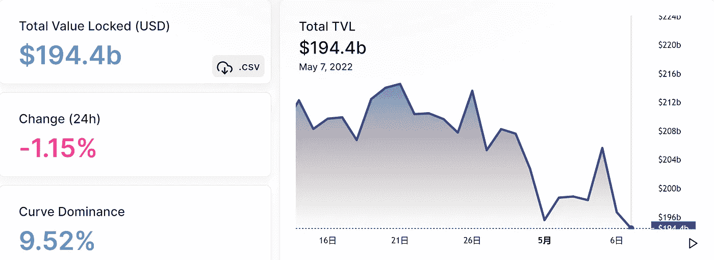
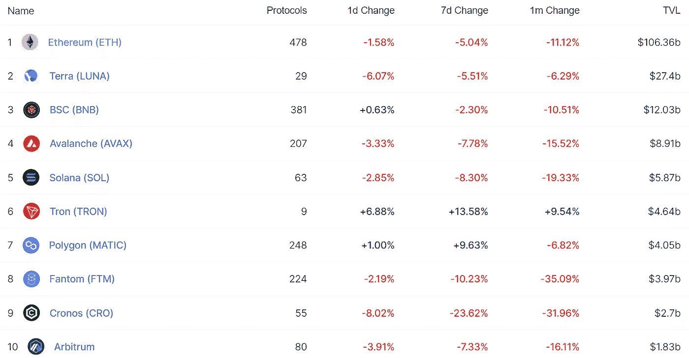
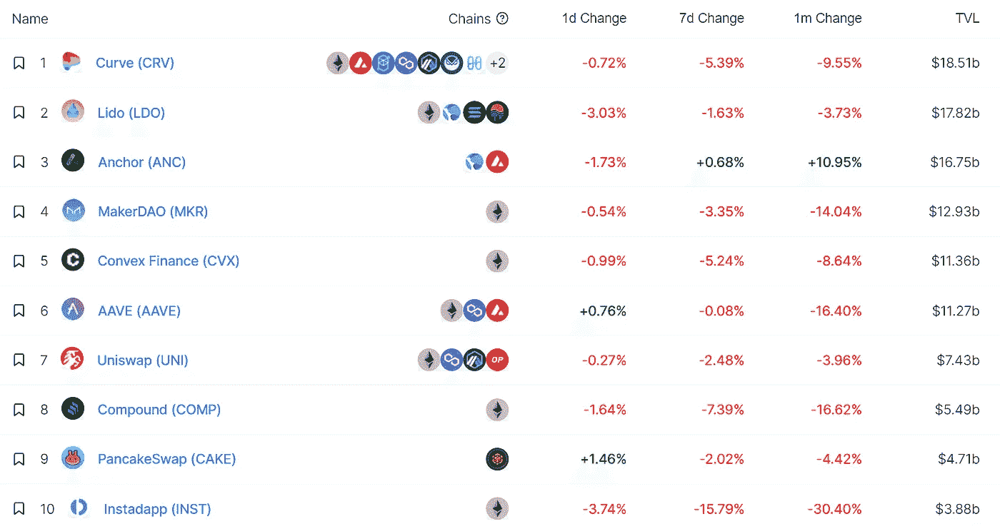
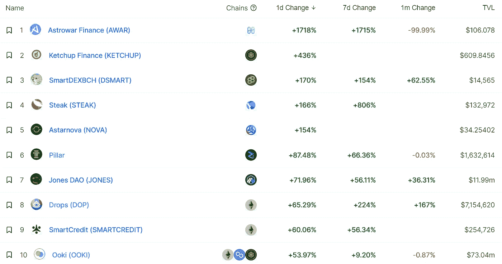
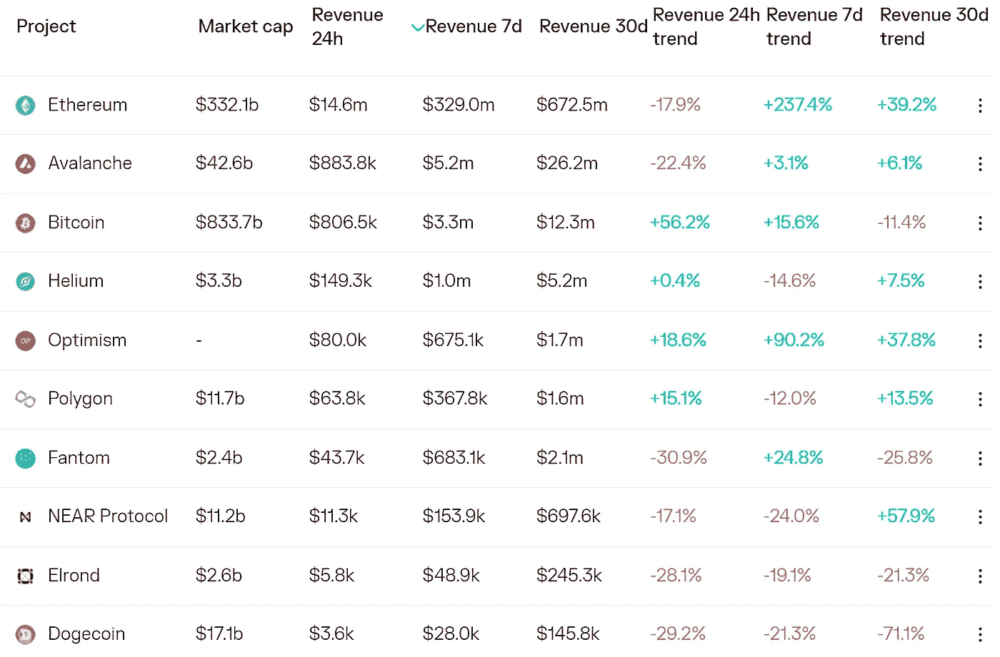
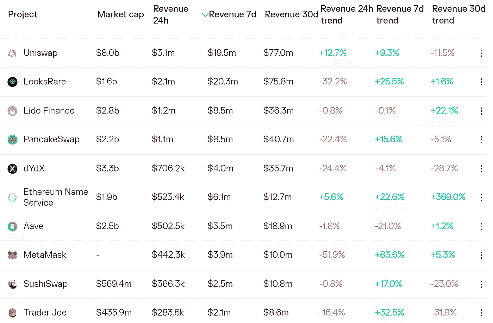
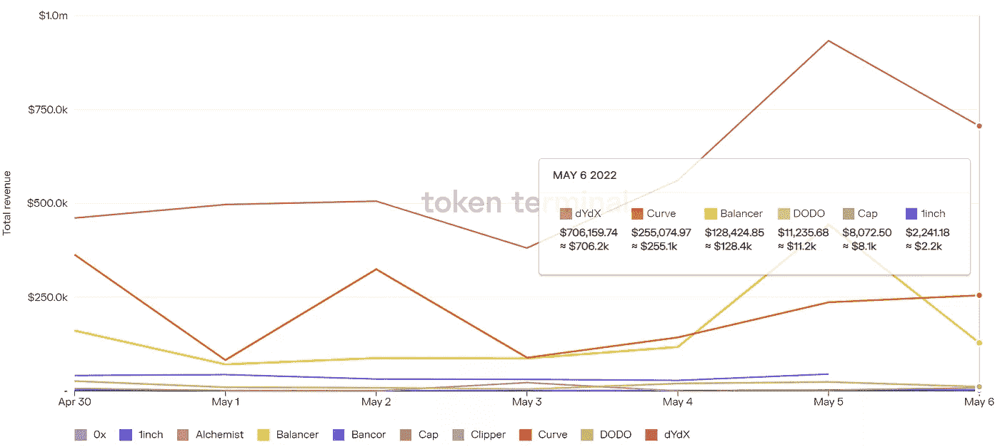
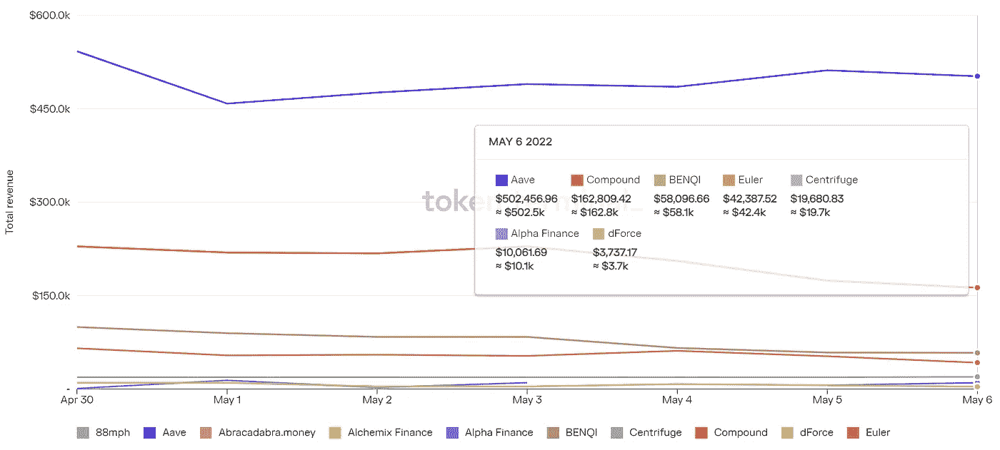

# 孙正义的 USDD 稳定币是模仿品吗？

> 原文：<https://medium.com/coinmonks/defi-insight-is-justin-suns-usdd-stablecoin-a-copycat-f0d4c483561e?source=collection_archive---------21----------------------->

2022 年 5 月 7 日

*今日 DeFi 数据&由 DeFi Insight 为您带来的新闻。*

> *“*密码分析师对 Tron 创始人 Justin Sun 的新算法 stablecoin 分散美元(USDD)进行了抨击，称其为 Terra 的 UST 币的克隆。”Hash”小组讨论了 Tron 的白皮书据称是以太坊的翻版、UST 的快速发展以及算法稳定币采用增加的迹象。*“@*[*来源*](https://finance.yahoo.com/video/hash-5-5-22-2-181151976.html)

# 最新消息

## 贷款

**/**[@ goldfinch _ fi](https://twitter.com/tokenterminal/status/1522507071962423298)未偿还借款超过 1 亿美元。

## 指标

**、**雷迪来[发射](https://twitter.com/RaydiumProtocol/status/1522519448854274050)$新星/$USDH 聚变池

## 产量

**[掌舵协议](https://twitter.com/HelmProtocol/status/1522349061227089922):为主播量身打造的收益与治理平台**

## **打桩**

****、**南森:以太坊 2.0 下注金额[超过](https://pro.nansen.ai/eth2-deposit-contract)1240 万，创历史新高**

## **稳定币**

****TRON stable coin $ USDD 发布[路线图](https://twitter.com/usddio/status/1522493066988646400?s=20&t=t4oo89tMAfK8bsSWdsYKPA)****

******IOST 着手[推出](/iost/iost-sets-to-launch-a-decentralized-algorithmic-stablecoin-abf9faacf7ba)一款分散式算法稳定器******

********、**、 [3 只稳定的货币](https://coinmarketcap.com/)位于前 10 大加密货币市值中******

## ****测试网****

******、** BNB 链条测试网将进行名为[欧拉](https://www.bnbchain.world/en/blog/bnb-smart-chain-testnet-euler-upgrade/)的硬分叉升级****

## ****钱包****

******web 3 钱包[彩虹](https://twitter.com/rainbowdotme/status/1522276598925467649?s=20&t=OKdfketE2r5_jliiQ_DRnw)推出钱包连接工具彩虹套件******

## ******资产管理******

********DeFi 资产管理协议[酵素](https://twitter.com/enzymefinance/status/1522553386767376384?s=20&t=QnWMJnBIzWCeIfppsINwMA)宣布支持用户构建和管理 Uniswap V3 策略********

## ******政策与法规******

******个人退休计划中应该允许使用**加密货币[。这就是为什么我要提出金融自由法案](https://www.cnbc.com/2022/05/05/allow-cryptocurrency-in-individual-retirement-plans-sen-tuberville.html)********

******西班牙证券监管机构命令币安[停止](https://news.bitcoin.com/spanish-securities-regulator-orders-binance-to-stop-offering-cryptocurrency-derivatives/)提供加密货币衍生品******

## ******NFT******

********Crypto.com 打造首款此类产品 [NFT 系列](https://crypto.com/company-news/crypto-com-to-create-first-of-its-kind-nft-collection-generated-by-the-speed-and-sound-of-the-formula-1-crypto-com-miami-grand-prix)由 f1 Crypto.com 大奖赛的速度和声音产生********

********志那都红豆空投 NFT 项目 Beanz 官方市值[超过](https://nftgo.io/collection/beanz-official/overview) 1 亿美元********

********multi coin Capital Partner[蒋](https://twitter.com/Mable_Jiang/status/1522751061374631936)宣布离职加入 STEPN********

********NFT 贷款协议滴滴道[推出](https://dropsnft.medium.com/the-drops-dao-mainnet-is-live-8859da17fc99)其 Mainnet 并部署宇迦实验室贷款池********

********你的**NFT[边缘](https://metaversal.banklesshq.com/p/your-nft-edge?utm_source=%2Finbox&utm_medium=reader2&s=r)******

******当大多数密码价格下跌时，聪明的投资者[NFT 的交易却上升了:南森数据](https://www.coindesk.com/layer2/2022/05/06/while-most-crypto-prices-went-down-smart-money-nft-trades-were-up-nansen-data/)******

******到 2027 年，NFT 市场将增长 35%，成为一个价值 136 亿美元的产业******

## ******基金******

********stable coin liquidity protocol Klein Finance[获得 100 万美元的种子期投资](https://twitter.com/KleinSwap/status/1522216909910921217)，KuCoin Ventures 也参与其中********

******由 Aave 支持的 NFT 借贷协议 OpenSky 已经完成了一轮 200 万美元的融资，并将于 5 月在 mainnet 上发布******

## ******观点******

******在更广泛的市场抛售中，比特币跌破 36000 美元******

# ******数据和分析******

## ******锁定的总价值(TVL)******

******目前全网 DeFi 总锁定量为 1944 亿美元，24 小时下降 1.15%。******

************

## ******TVL 评出的十大连锁酒店******

************

## ******|最新 TVL 十大项目******

************

## ******|过去 24 小时内 TVL 增长的前 10 个项目******

************

## ******协议收入******

## ******|累计总收入最高的项目(24H)_ 区块链(L1)******

************

## ******|累计总收入最高的项目(24H) _Dapps(L2)******

************

## ******|前 10 大交易所的每日收入******

************

## ******|十大贷款协议的每日收入******

************

# ******深潜******

********宇宙的** [**状态**](https://tokenterminal.substack.com/p/research-series-139?utm_source=%2Finbox&utm_medium=reader2&s=r)******

****** [## 研究系列

### 这是我们研究系列的第六篇文章。在这个系列中，我们发布了对特定区块链的数据驱动分析…

tokenterminal.substack.com](https://tokenterminal.substack.com/p/research-series-139?utm_source=%2Finbox&utm_medium=reader2&s=r) 

**我们现在处于熊市——下面是** [**什么**](https://twitter.com/xbt002/status/1522521218695499778) **这意味着**

**[**过去一周跳出来的 6 个加密图表**](https://mhonkasalo.substack.com/p/6-crypto-charts-that-jumped-out-in?s=r)**

**** [## 上周突然出现的 6 个加密图表

### Lido 现在是 L1s 之外最大的协议，这一差距将会进一步扩大。TVL 图表将…

mhonkasalo.substack.com](https://mhonkasalo.substack.com/p/6-crypto-charts-that-jumped-out-in?s=r)**** 

# ****报告****

******更新后的** [**查看**](https://www.theblockresearch.com/an-updated-look-at-on-chain-structured-product-protocols-145581) **在线结构化产品协议**_ 区块研究****

> ****可组合性仍然是链上衍生协议和集中式协议之间的主要区别。用例在很大程度上局限于自动期权销售和基差交易的金库。
> 随着衍生产品协议在复杂性方面的不断发展，分散式结构化产品的设计空间也大大扩展，本文将对此进行探讨。****

******[**破译**](https://www.theblockresearch.com/deciphering-the-metaverse-yuga-labs-and-the-anatomy-of-an-empire-145521) **元宇宙:宇迦实验室与帝国解剖** _theblockresearch******

******[**跳跃空投**](https://messari.io/article/the-hop-airdrop) _messari******

******[**Deri 协议 V3**](https://messari.io/article/deri-protocol-v3-upgrade-analysis) **:升级分析** _messari******

******[**无银行令牌**](https://newsletter.banklesshq.com/p/bankless-token-report-may-2022?s=r) **: BTRFLY、LDO、DYDX、PERP 和 COMP**_ 无银行******

******关于:******

****DeFi Insight 是顶级 DeFi 和加密新闻和更新的来源。****

******https://twitter.com/AlphaPro_io 推特:******

********❤RSS:**[**https://medium.com/feed/@alphapro.project**](https://medium.com/feed/@alphapro.project)******

****提供的信息应被视为发展新闻，而不是投资建议。****

> ****加入 Coinmonks [电报频道](https://t.me/coincodecap)和 [Youtube 频道](https://www.youtube.com/c/coinmonks/videos)了解加密交易和投资****

# ****另外，阅读****

*   ****[Bookmap 评论](https://coincodecap.com/bookmap-review-2021-best-trading-software) | [美国 5 大最佳加密交易所](https://coincodecap.com/crypto-exchange-usa)****
*   ****最佳加密[硬件钱包](/coinmonks/hardware-wallets-dfa1211730c6) | [Bitbns 评论](/coinmonks/bitbns-review-38256a07e161)****
*   ****[新加坡十大最佳加密交易所](https://coincodecap.com/crypto-exchange-in-singapore) | [收购 AXS](https://coincodecap.com/buy-axs-token)****
*   ****[红狗赌场评论](https://coincodecap.com/red-dog-casino-review) | [Swyftx 评论](https://coincodecap.com/swyftx-review) | [CoinGate 评论](https://coincodecap.com/coingate-review)****
*   ****[投资印度的最佳加密软件](https://coincodecap.com/best-crypto-to-invest-in-india-in-2021)|[WazirX P2P](https://coincodecap.com/wazirx-p2p)|[Hi Dollar Review](https://coincodecap.com/hi-dollar-review)**********