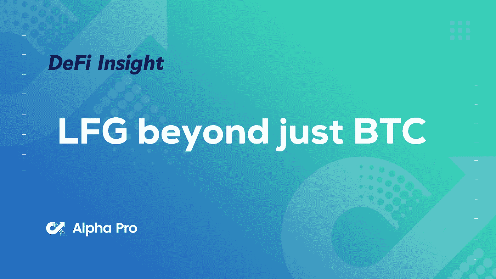
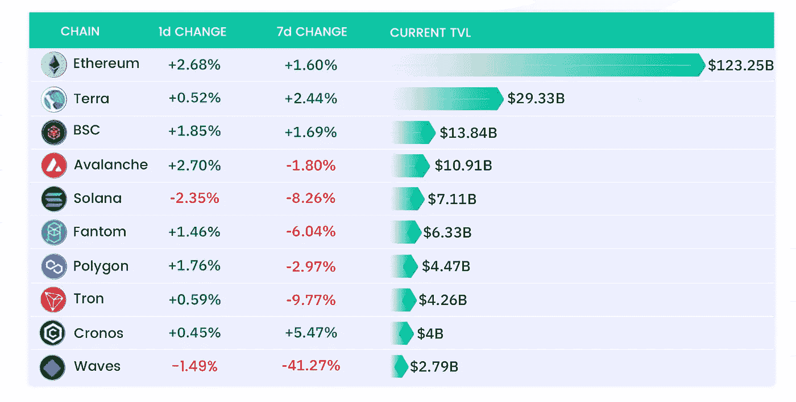
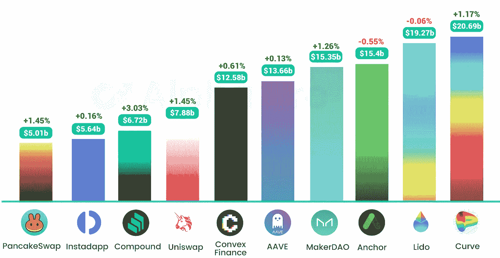
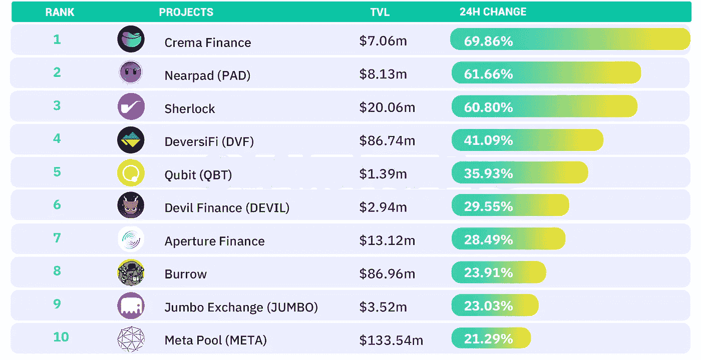
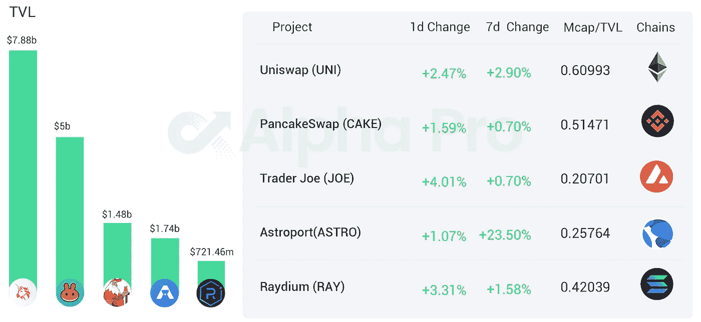
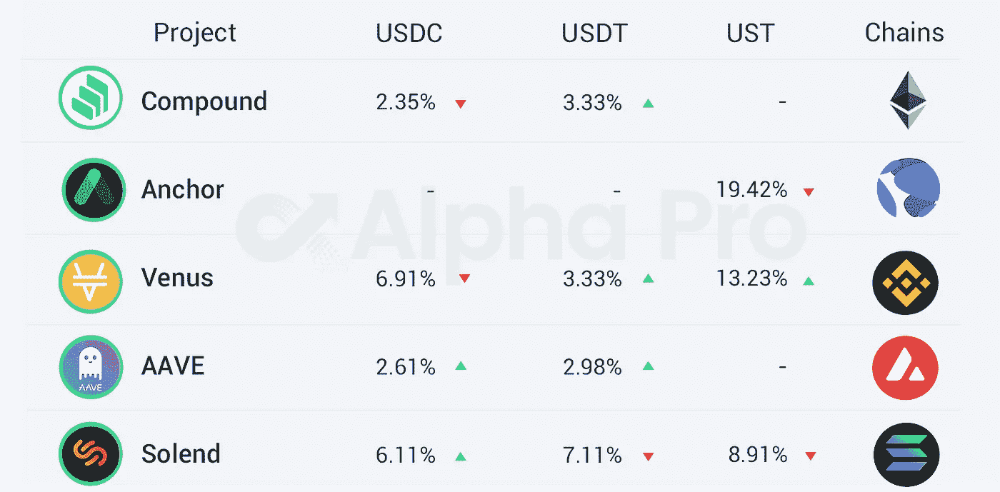

# DeFi Insight |LFG 为稳定币储备购买 1 亿美元的 AVAX 代币

> 原文：<https://medium.com/coinmonks/defi-insight-lfg-buys-100-million-in-avax-tokens-for-stablecoin-reserve-18a96a54c6?source=collection_archive---------36----------------------->

## 2022 年 4 月 8 日

*今日 DeFi 数据&由 DeFi Insight 为您带来的新闻。*

> LFG 前一天购买了 2.31 亿美元的比特币，也是为了增加其 UST 储备，但这似乎是 LFG 首次购买另一种加密货币。由于 AVAX 的市场份额远小于比特币，LFG 现在是 AVAX 的重要市场买家。【 [**来源**](https://www.theblockcrypto.com/linked/141136/luna-foundation-guard-buys-100-million-in-avax-tokens-for-stablecoin-reserve)

# 最新消息

## |比特币 2022

泰尔称巴菲特“反社会”，[墨西哥亿万富翁在 BTC 拥有 60%的股份](https://cointelegraph.com/news/bitcoin-2022-thiel-calls-buffett-sociopathic-mexican-billionaire-has-60-in-btc)

## 贷款

**,**密码借贷公司 [Celcius 持有超过 15 万 BTC](https://www.yahoo.com/now/over-150-000-bitcoin-celsius-173000953.html)

## 稳定币

Terra 创始人道权:UST 将成为雪崩原生资产

**Crypto Insiders 创始人:[近五月推出](https://captainkole.substack.com/p/the-future-is-near?s=r)其原生 stablecoin，APR 20%**

****财政部的珍妮特·耶伦:“没人能保证你的稳定收益能够被赎回。”****

****Frax 金融公司可能会购买大量的主要加密货币来支持其稳定的货币****

******[UST 正在 Synapse 上直播](https://synapseprotocol.medium.com/ust-is-live-on-synapse-6356b1f4e1d7)******

## ******第一层******

********宇宙 L1 网络朱诺宣布 [mainnet 重新启动](https://twitter.com/JunoNetwork/status/1512246092259377156)********

## ******测试网******

********、**多边形效用:解锁[模块化区块链未来](https://blog.polygon.technology/polygon-avail-unlocking-the-modular-blockchain-future/)******

## ****支付****

******Strike 首席执行官 Jack Mallers 宣布 [Shopify 合作](https://www.theblockcrypto.com/linked/141178/strike-ceo-jack-mallers-announces-shopify-partnership-new-payment-network)，新的支付网络******

********本影协议启动[乐观和仲裁](https://twitter.com/UmbraCash/status/1512077408161042435)********

## ******钱包******

******罗宾汉向 200 万用户推出加密钱包******

## ******空投******

********[复古空投讲解](/@Retrogrademoney/retro-airdrop-explained-d8a539e1b89d)********

## ******政策与法规******

******NPCI 声明:我们不知道任何使用合众国际社的[密码交易](https://www.npci.org.in/PDF/npci/press-releases/2022/Statement-by-NPCI-on-7th-April-2022.pdf)******

********联邦存款保险公司要求所有银行[报告加密活动](https://www.coindesk.com/policy/2022/04/07/fdic-asks-all-banks-to-report-crypto-activities/)********

******斯洛文尼亚引入 5%的固定秘密税******

******没有数据支持俄罗斯总理的声明“10 万亿卢布用于加密”******

******MicroStrategy 的 Saylor 和 ARK Invest 的 Wood 并不担心比特币和监管******

******RBI 副行长:[稳定的威胁](https://www.aliens.com/livenews/latest/rbi-deputy-governor-stablecoin-threat-creates-need-for-cbdcs) t 创造了对 CBDCs 的需求******

## ******|工具******

********南森通过聚合器增加[对 Opensea 和 LooksRare 销售的支持](https://twitter.com/nansen_ai/status/1511769666108203017?s=20&t=PSdbHK5WZATDtW0BQj6WEg)********

## ******NFT******

********NFT 项目 [Ghxsts 与 NBA 芝加哥公牛队](https://twitter.com/Ghxsts/status/1512282114309652482)合作“特别项目”********

********[出于对 NFTs 的热爱](https://ripple.com/insights/for-the-love-of-nfts-vsa-partners-and-rare-air-media-bring-jordan-nfts-to-the-xrpl/?utm_source=twitter&utm_medium=organic_social) : VSA 合作伙伴和稀有航空媒体将乔丹 NFTs 带到 XRPL********

********报道:[由于用户流失到抖音，脸书盯上了“扎克雄鹿”](https://kotaku.com/metaverse-nfts-crypto-facebook-meta-zuck-bucks-diem-1848765863)********

********,**数据:超过 160 万个 [Solana 钱包](https://twitter.com/solana/status/1512070830842277892)目前持有 NFT******

## ****基金****

****制作者筹集了 1400 万美元为元宇宙制作衣柜****

******独家报道: [Crypto Fund Paradigm 管理的资产](https://venturebeat.com/2022/04/07/fabricant-raises-14m-to-build-the-wardrobe-for-the-metaverse/)攀升 343%，达到 132 亿美元******

********前花旗三人组推出[加密投资管理公司](https://www.theblockcrypto.com/linked/141216/former-citi-trio-launch-crypto-investment-management-firm?utm_source=cryptopanic&utm_medium=rss)********

******波特金融公司筹集了 500 万美元给 DAOs******

********、**、 [Direxion 向 SEC](https://www.coindesk.com/business/2022/04/07/direxion-re-files-with-sec-for-short-bitcoin-futures-etf/) 备案做空比特币期货 ETF******

******前 Blockstream 高管 Samson Mow 为[比特币初创公司 JAN3](https://www.coindesk.com/business/2022/04/07/ex-blockstream-exec-samson-mow-raises-21m-for-bitcoin-startup-jan3/) 融资 2100 万美元******

********高盛报告:[区块链相关股票](https://www.coindesk.com/business/2022/04/07/blockchain-exposed-stocks-could-show-massive-sales-growth-despite-recent-underperformance-goldman-says/)预计到 2024 年将大幅增长********

# ******数据和分析******

## ******TVL 增长排名前 10 的连锁店******

************

## ******最新 TVL 十大项目******

************

## ******过去 24 小时 TVL 变化的前 10 个项目******

************

## ******德克斯 TVL 排名******

*******指数中涨幅最大的是* [乔氏](https://defillama.com/protocol/trader-joe) *，上涨 4.01%*******

************

## ******APY DeFi 贷款公司******

*******USDC:最高贷款利率:*[*V*enus](https://app.venus.io/market)*6.91% APY*******

*******USDT:最高贷款利率:* [*索伦德*](https://solend.fi/dashboard)*7.11% APY*******

************

# ******深潜******

********[**RWA 深潜**](https://defieducation.substack.com/p/rwa-deep-dive-centrifuge?s=r) **:离心机**********

**** [## RWA 深潜:离心机

### 欢迎头像！今天的帖子是关于真实世界的资产。本周早些时候，我们更广泛地报道了这一领域。今天…

defieducation.substack.com](https://defieducation.substack.com/p/rwa-deep-dive-centrifuge?s=r) 

**任何人都可以成为** [**节点验证器**](https://newsletter.banklesshq.com/p/how-to-get-price-exposure-to-the?s=r)

 [## 如何获得合并的价格敞口

### 亲爱的无银行国家，在过去的几周里，我们已经谈论了很多关于…

newsletter.banklesshq.com](https://newsletter.banklesshq.com/p/how-to-get-price-exposure-to-the?s=r) 

**[**索拉纳**](https://www.veradiverdict.com/p/options-on-solana?s=r) 上的选项**

** [## 索拉纳期权

### PsyOptions 致力于成为分散金融的事实上的连锁金融服务平台。核心团队…

www.veradiverdict.com](https://www.veradiverdict.com/p/options-on-solana?s=r) 

**[**桥梁**](https://antiape.substack.com/p/whats-wrong-with-bridges-and-whats?s=w) **怎么了？****

** [## 桥有什么不好？

### 跨链设计领域还没有明确的赢家。我们期望在 IBC/零层之后看到进一步的迭代。我们…

antiape.substack.com](https://antiape.substack.com/p/whats-wrong-with-bridges-and-whats?s=w) 

**[**流动性大战**](https://www.tokebase.org/tokebase/the-liquidity-wars-impact/) **:冲击****

** [## 流动性战争:影响

### 在一个随机的星期三，我拖着疲惫的身体走进漏雨的酒吧。我站在那里等待一个…

www.tokebase.org](https://www.tokebase.org/tokebase/the-liquidity-wars-impact/) 

**[**Terra v Maker**](https://dirtroads.substack.com/p/-36-terra-v-maker-war-of-the-worlds?s=r)**:世界之战****

** [## # 36 | Terra v 制造商:世界之战

### 1938 年 10 月 30 日星期日，美国收到了火星上发生气体爆炸的消息，紧接着是一个奇怪的…

dirtroads.substack.com](https://dirtroads.substack.com/p/-36-terra-v-maker-war-of-the-worlds?s=r) 

**如何在 Layerzero 协议**上启动 [**全链 NFT**](/@Tim4l1f3/how-to-launch-an-ominchain-nft-on-layerzero-protocol-fab717635b3b)

** [## 如何在 Layerzero 协议上启动 ominchain NFT？

### 一个教程贡献给了 LZ 社区

medium.com](/@Tim4l1f3/how-to-launch-an-ominchain-nft-on-layerzero-protocol-fab717635b3b) 

**11 个关于如何在** [**中成功的最佳线程**](https://twitter.com/Route2FI/status/1512060699979448326)

**[**密码基本面分析**](https://twitter.com/jacknakamoto/status/1511220125776687109)**** 

# ****报告****

******下一个伟大的**[**Crypto on boarding Even**](https://messari.io/article/the-next-great-crypto-onboarding-event-sports-nfts)**t:Sports NFTs _ messari . io******

> ****体育 NFT 是体育卡和梦幻体育的交集。现有的梦幻/运动卡玩家有 300 亿美元的市场机会。
> 与传统系统相比，体育 NFT 为球迷和球队带来了令人兴奋的价值主张。
> 与传统加密相比，现有平台为用户提供了更简单的入门服务，为带来数亿用户提供了可能性。Top Shot 和 Sorare 是先行者，但 NFL All Day 和 FanCraze(板球)正在加入这场竞赛，并将加速该行业的增长。德勤估计，仅今年一年，来自非体育赛事的收入就有 20 亿美元****

******[**逐层第 27 期**](https://www.theblockresearch.com/layer-by-layer-issue-27-ethereum-terra-avalanche-and-fantom-141038) **:以太坊、Terra、雪崩、Fantom_theblockresearch********

******[**你需要知道的一切【Concordium**](/momentum6/everything-you-need-to-know-about-concordium-the-compliant-enterprise-blockchain-a640f1046e53) **—合规的企业区块链 _ 教育研究********

****一场 **回合:******

****DeFi Insight 是顶级 DeFi 和加密新闻和更新的来源。****

******https://twitter.com/AlphaPro_io 推特:******

********❤RSS:**[**https://medium.com/feed/@alphapro.project**](https://medium.com/feed/@alphapro.project)******

****提供的信息应被视为发展新闻，而不是投资建议。****

> ****加入 Coinmonks [电报频道](https://t.me/coincodecap)和 [Youtube 频道](https://www.youtube.com/c/coinmonks/videos)了解加密交易和投资****

# ****另外，阅读****

*   ****[Bookmap 评论](https://coincodecap.com/bookmap-review-2021-best-trading-software) | [美国 5 大最佳加密交易所](https://coincodecap.com/crypto-exchange-usa)****
*   ****最佳加密[硬件钱包](/coinmonks/hardware-wallets-dfa1211730c6) | [Bitbns 评论](/coinmonks/bitbns-review-38256a07e161)****
*   ****[新加坡十大最佳加密交易所](https://coincodecap.com/crypto-exchange-in-singapore) | [购买 AXS](https://coincodecap.com/buy-axs-token)****
*   ****[红狗赌场评论](https://coincodecap.com/red-dog-casino-review) | [Swyftx 评论](https://coincodecap.com/swyftx-review) | [CoinGate 评论](https://coincodecap.com/coingate-review)****
*   ****[投资印度的最佳密码](https://coincodecap.com/best-crypto-to-invest-in-india-in-2021)|[WazirX P2P](https://coincodecap.com/wazirx-p2p)|[Hi Dollar Review](https://coincodecap.com/hi-dollar-review)****************