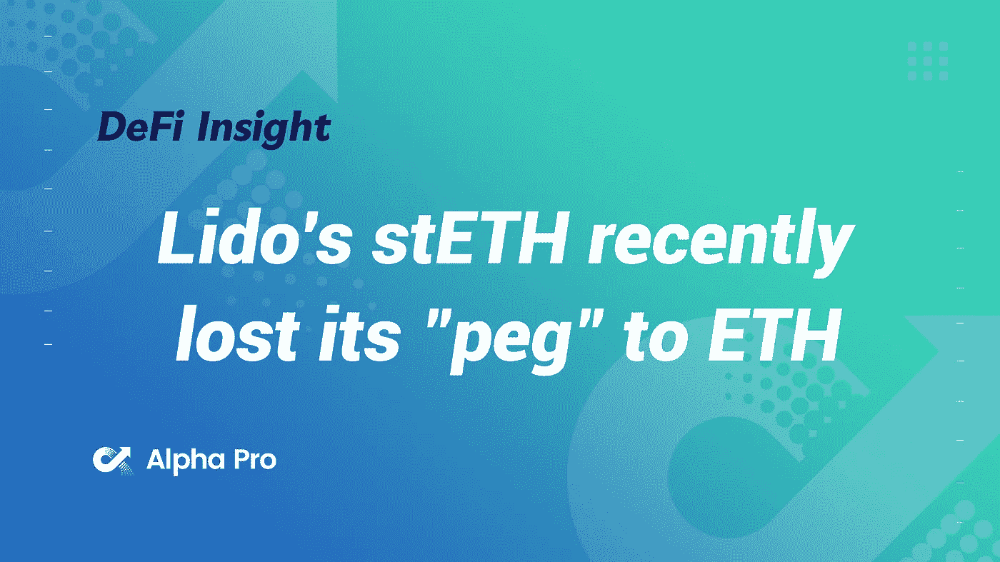
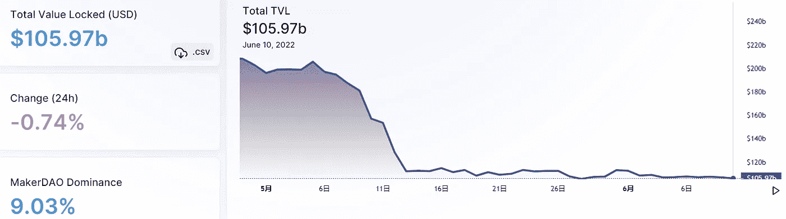
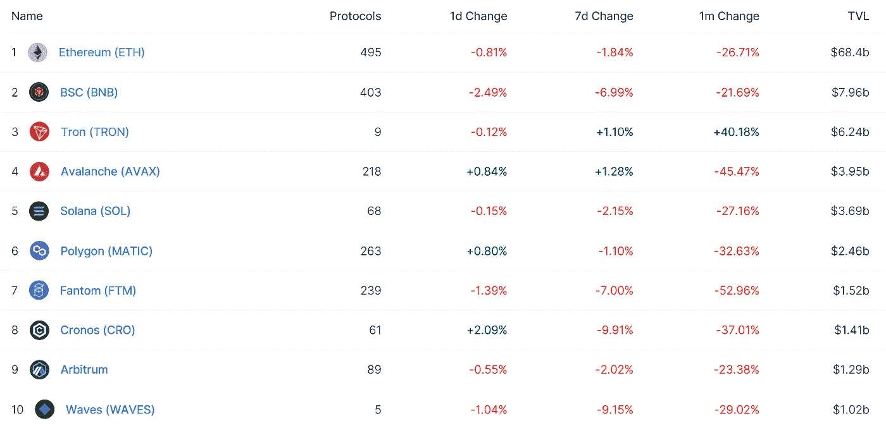
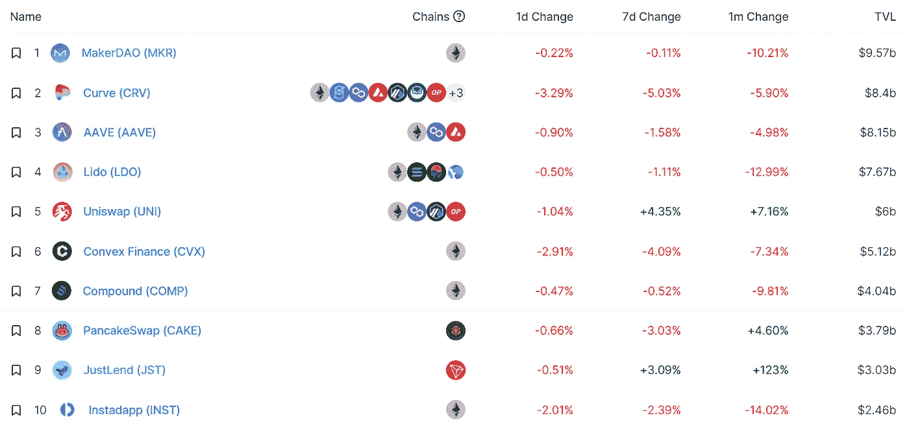
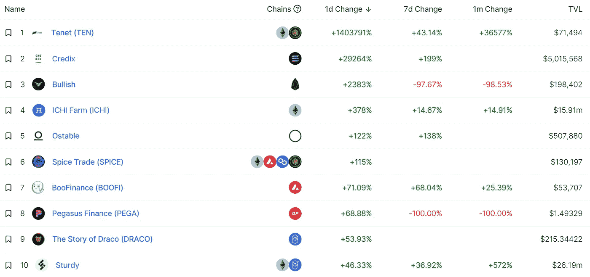
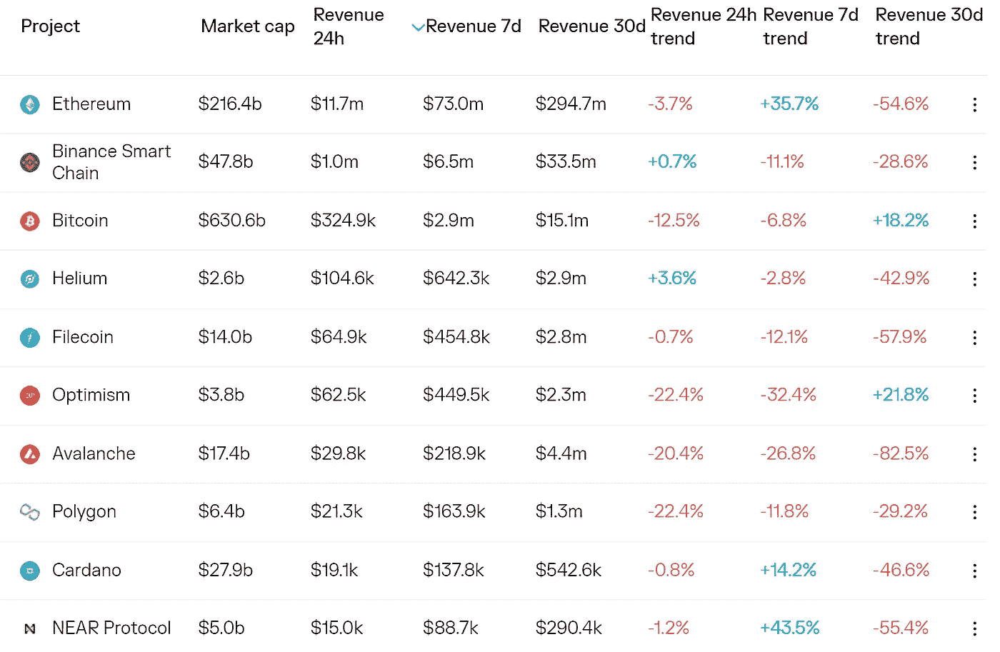
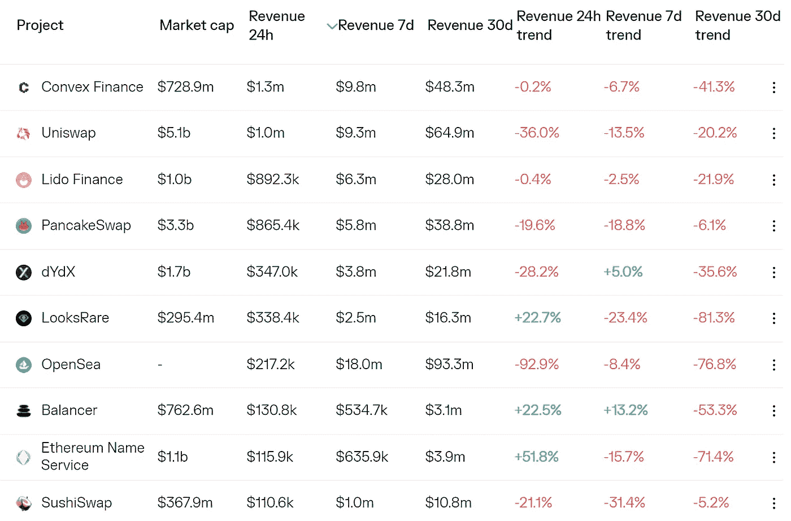
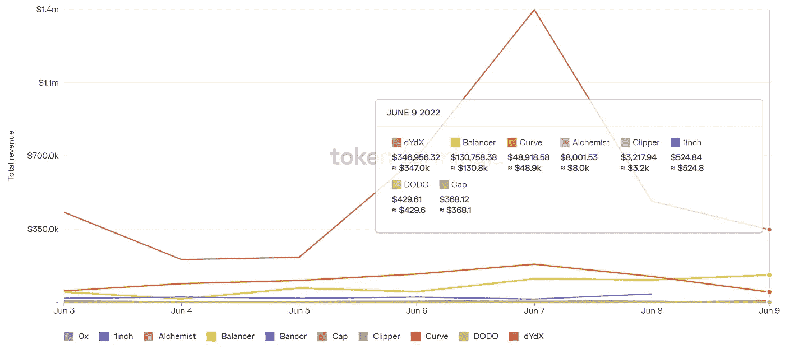
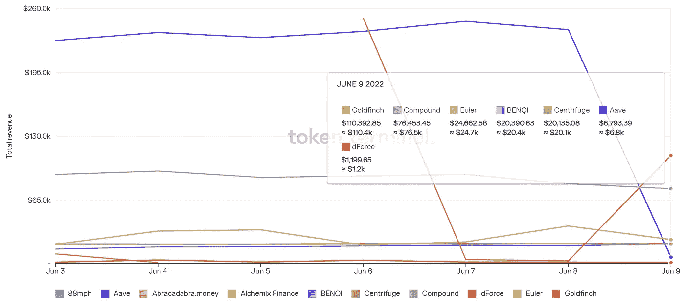

# DeFi Insight |丽都的 stETH 最近失去了与 ETH 的“挂钩”？

> 原文：<https://medium.com/coinmonks/defi-insight-lidos-steth-recently-lost-its-peg-to-eth-a5e826ef318a?source=collection_archive---------17----------------------->

2022 年 6 月 10 日

*今日 DeFi 数据&由 DeFi Insight 为您带来的新闻*

> [@ small cap science](https://twitter.com/SmallCapScience/status/1535097594187087872):[$ stETH](https://twitter.com/search?q=%24stETH&src=cashtag_click)/[$ ETH](https://twitter.com/search?q=%24ETH&src=cashtag_click)钉住不放，流动性快速耗尽。”
> 
> [@ lido fince](https://twitter.com/LidoFinance):*"*$ stETH 是来自 lido fince 的$ETH 的 staked 版本，旨在确保$ETH 合并后的安全。$stETH 由$ETH 以 1:1 的比例完全支持，在几个月后合并之前，它的流动性非常差。这从来都不是问题，因为有一条曲线。流动资金池。

# *最新消息*

## *稳定币*

***Tether 将 USDT 带入 [Tezos](https://ihodl.com/topnews/2022-06-10/tether-brings-usdt-tezos-blockchain/) 区块链***

## ***第二层***

***不可改变的联合创始人说:“现在不是我们放松油门的时候。”***

## ***测试网***

***分散式 RPC 网络 BlockPI 与 Klaytn 一起发布了它的测试网***

## ***支付***

***数字支付公司 Flexa 收购 Drop Party***

*****/**[万事达卡](https://u.today/mastercard-dives-deeper-into-nfts)更深入地探讨非金融交易***

*****[Nimiq](https://www.cryptoninjas.net/2022/06/10/nimiq-set-to-launch-upgraded-version-of-crypto-payment-tool-cryptopayment-link/?utm_source=blockworks-research)将推出加密支付工具 Cryptopayment.link 的升级版*****

## *****|令牌*****

*****[SafeMoon](https://bravenewcoin.com/insights/how-will-partnership-between-safemoon-and-evergrow-affect-price-of-sfm?utm_source=blockworks-research) 和恒丰的合作将如何影响 SFM 的价格？*****

## *****鲸鱼*****

*******[顶级加密鲸](https://dailyhodl.com/2022/06/10/top-crypto-whales-keep-a-firm-grip-on-ethereum-eth-while-accumulating-one-top-25-altcoin-analytics-firm/)牢牢控制以太坊(ETH)，同时积累一个排名前 25 的 Altcoin:分析公司*******

## *******甲骨文*******

*********[链节](https://avalancheavax.medium.com/chainlink-keepers-and-chainlink-vrf-go-live-on-avalanche-3ebee050ebef)守护者和链节 VRF 上雪崩直播*********

*********/**[chain LINK](https://ambcrypto.com/chainlink-mapping-out-the-red-flags-in-links-recent-bull-run/):绘制林克近期牛市中的红旗*******

## *****政策与法规*****

*****宣布非法交易——美国人担心超过 600 美元的支付的 1099-K 税收规则*****

*****美国财政部长珍妮特·耶伦警告退休计划中存在秘密*****

## *****NFT*****

*******华纳兄弟携手俏皮推出 [Looney Tunes NFT](https://bitcoinist.com/warner-bros-nifty-to-launch-looney-tunes-nft/)*******

*********[【久违的事情】](https://decrypt.co/102473/stranger-things-netflix-nfts-face-fan-backlash)网飞 NFTs 面对粉丝的反弹*********

## *******观点*******

*******蒂姆·德雷珀仍然认为比特币(BTC)到年底将超过 25 万美元*******

*******蜻蜓的哈齐布·库雷希仍然对隐秘的熊市持乐观态度*******

*********[PGIM·首席运营官](https://cryptoslate.com/pgim-coo-urges-crypto-investors-to-adopt-a-pick-and-shovel-play/)敦促加密投资者采取“挑铲”策略*********

*********Mad Money 的[吉姆·克莱姆](https://news.bitcoin.com/mad-moneys-jim-cramer-offers-advice-on-cryptocurrency-investing/)提供加密货币投资建议*********

*******富达的阿比盖尔·约翰逊重申熊市中的秘密承诺*******

# *******数据和分析*******

## *******锁定的总价值(TVL)*******

*******目前全网 DeFi 总锁定量为 1059.7 亿美元，24 小时下降 0.74%。*******

**************

## *******TVL 评出的十大连锁酒店*******

**************

## *******|最新 TVL 十大项目*******

**************

## *******|过去 24 小时内 TVL 增长的前 10 个项目*******

**************

## *******协议收入*******

## *******|累计总收入最高的项目(24H)_ 区块链(L1)*******

**************

## *******|累计总收入最高的项目(24H) _Dapps (L2)*******

**************

## *******|前 10 大交易所的每日收入*******

**************

## *******|十大贷款协议的每日收入*******

**************

# *******深潜*******

*********比特币网络一如既往的** [**健康**](https://bitcoinmagazine.com/markets/the-bitcoin-network-is-as-healthy-as-ever)*******

******* [## 比特币网络一如既往地健康

### 以下节选自比特币杂志 Pro 的最近一期，比特币杂志的高级市场时事通讯…

bitcoinmagazine.com](https://bitcoinmagazine.com/markets/the-bitcoin-network-is-as-healthy-as-ever) 

**[**分析**](/@migalabs/analysis-of-ethereum-2-consensus-clients-dfede8e0145e) **以太坊 2、共识客户****

** [## 以太坊分析 2，共识客户端

### 以太坊正在进行一次重大升级，旨在使网络更加可持续，从…

medium.com](/@migalabs/analysis-of-ethereum-2-consensus-clients-dfede8e0145e) 

**密码律师** [**拆封**](https://thedefiant.io/lummis-bill-crypto-regulation-questions/) **参议院特大法案的矛盾与挑战**

 [## 加密律师解开矛盾和挑战，在参议院大型法案-挑衅

### 当参议员辛西娅·卢米斯(R-Wy。)和参议员柯尔斯顿·吉利布兰德(D-NY)本周早些时候放弃了他们的巨额加密法案…

thedefiant.io](https://thedefiant.io/lummis-bill-crypto-regulation-questions/) 

**[**如何**](https://beincrypto.com/how-ethereum-security-model-make-unique-asset/) **以太坊安全模式将使其成为独特的资产****

** [## 以太坊安全模型如何使其成为独特的资产

### 以太坊成为本周的头条新闻，备受期待的合并部署在 Ropsten 上进行最终测试…

beincrypto.com](https://beincrypto.com/how-ethereum-security-model-make-unique-asset/)** 

# **报告**

****[**阿尔法领航员**](https://content-hub-static.crypto.com/wp-content/uploads/2022/06/20220609_CDC_Alpha-Navigator.pdf) **:寻找阿尔法【2022 年 5 月】** _crypto****

> ****当前的加密下降主要是由美国加息和 UST depeg 推动的，这是 BTC 历史上第四大下降，为 63%。如果以史为鉴，70%的缩减= BTC 20.7 万美元，80%的缩减= BTC 13.8 万美元。加密和科技股是两种可能承受持续货币和金融条件收紧冲击的风险资产类别——其中有多少已经反映在价格中，将是投资者最关心的问题。****

******[**逐层第 34 期**](https://www.theblockresearch.com/layer-by-layer-issue-34-optimism-avalanche-and-solana-151109) **:乐观、雪崩、索拉纳** _theblockresearch******

******引发 UST 崩盘的** [**交易**](https://blog.chainalysis.com/reports/how-terrausd-collapsed/)**_ chain analysis******

********[**波巴网**](https://messari.io/article/boba-network-an-optimistic-approach-to-ethereum-scaling) **:以太坊缩放的乐观方法** _messari********

******关于:******

****DeFi Insight 是顶级 DeFi 和加密新闻和更新的来源。****

******https://twitter.com/AlphaPro_io 推特:******

********❤RSS:**[**https://medium.com/feed/@alphapro.project**](https://medium.com/feed/@alphapro.project)******

****提供的信息应被视为发展新闻，而不是投资建议。****

> ****加入 Coinmonks [电报频道](https://t.me/coincodecap)和 [Youtube 频道](https://www.youtube.com/c/coinmonks/videos)了解加密交易和投资****

# ****另外，阅读****

*   ****[CoinLoan 评论](https://coincodecap.com/coinloan-review) | [YouHodler 评论](/coinmonks/youhodler-4-easy-ways-to-make-money-98969b9689f2) | [BlockFi 评论](https://coincodecap.com/blockfi-review)****
*   ****[XT.COM 评论](https://coincodecap.com/profittradingapp-for-binance) | [币安评论](https://coincodecap.com/xt-com-review)****
*   ****[SmithBot 评论](https://coincodecap.com/smithbot-review) | [4 款最佳免费开源交易机器人](https://coincodecap.com/free-open-source-trading-bots)****
*   ****[比特币基地僵尸工具](/coinmonks/coinbase-bots-ac6359e897f3) | [AscendEX 审查](/coinmonks/ascendex-review-53e829cf75fa) | [OKEx 交易僵尸工具](/coinmonks/okex-trading-bots-234920f61e60)****
*   ****[如何在印度购买比特币？](/coinmonks/buy-bitcoin-in-india-feb50ddfef94) | [瓦济克斯评论](/coinmonks/wazirx-review-5c811b074f5b)*************