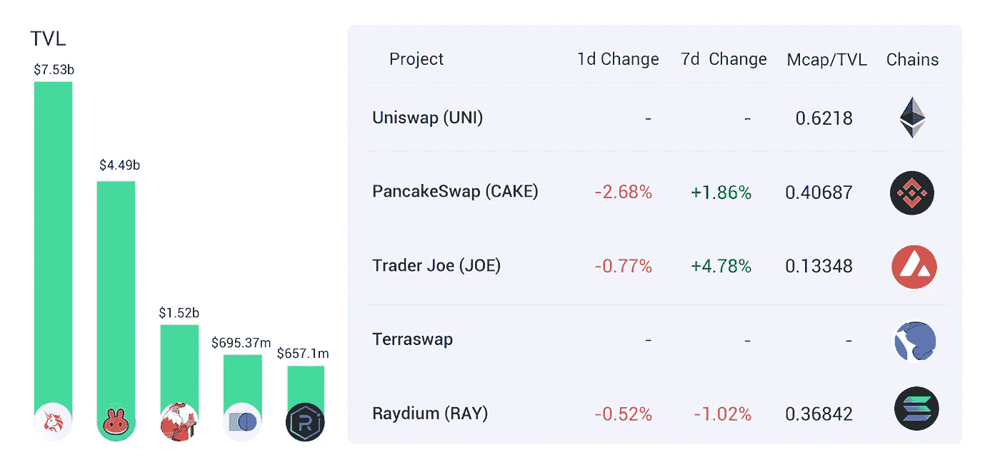

# DeFi Insight | LUNA 超越 ETH 成为第二大抵押资产；2 月份 DeFi 漏洞利用中被盗的 3 . 39 亿美元资金

> 原文：<https://medium.com/coinmonks/defi-insight-luna-surpasses-eth-to-become-the-second-largest-collateralized-asset-339m-in-e1ce06464d03?source=collection_archive---------27----------------------->

## 2022 年 3 月 2 日

*今日 DeFi 数据&由 DeFi Insight 为您带来的新闻。*

**宏观趋势:** [LUNA 超越 ETH](https://www.coindesk.com/business/2022/03/02/terras-luna-passes-ether-to-become-second-largest-staked-asset/?utm_medium=referral&utm_source=rss&utm_campaign=headlines) 成为第二大抵押资产

**TVL 动向:**目前全网 [DeFi](https://defillama.com/) 总锁定量为 210.59 亿美元，24 小时增长 1.16%

**观点:**如何让区块链成为一种新的[经济引擎](https://www.coindesk.com/layer2/2022/03/02/how-to-make-blockchain-a-new-kind-of-economic-engine/)

# 最新消息

## 定义

2 月份，DeFi 漏洞利用导致 3 . 39 亿美元资金被盗

税单，解释:美国税单指南和[加密报告](https://www.coinbase.com/learn/your-crypto/tax-documents-explained)

## 协议

雪崩宣布 [Wirex 整合](https://www.binance.com/en/news/top/7062162)

@solidlyexchange 和 [@SolidexFantom](https://twitter.com/solidexfantom/status/1498728828071739392?s=21)https://twitter.com/solidexfantom/status/1498728828071739392?s=21) 的鸟瞰图

即将来到 EVMOS 的 dForce ！

Cosmos liquid staking protocol[Quicksilver](https://www.aliens.com/livenews/latest/cosmos-liquid-staking-protocol-quicksilver-plans-to-launch-testnet-in-q2)计划在 Q2 推出 testnet

## 借出

*[主播协议](https://forum.anchorprotocol.com/t/dynamic-anchor-earn-rate/3042/4)社区新提案:动态主播赚取率

Hashstack Finance 完成了 100 万美元的种子融资

Solend 宣布启动星图池

## 互换

*[雪崩【Wirex 支付生态系统中的 450 万用户现在可以访问区块链](https://cointelegraph.com/news/avalanche-blockchain-now-accessible-to-4-5m-users-across-wirex-payment-ecosystem)

# 数据和分析

## TVL 和 ATH 排名前六的连锁酒店对比

## 最新 TVL 十大项目

## 过去 24 小时 TVL 变化的前 10 个项目

## 德克斯 TVL 排名

*DEX 跌幅最大的是*[*PancakeSwap*](https://defillama.com/protocol/pancakeswap)*，损失了 2.68%*

## APY DeFi 贷款公司

*USDC:最高借贷者:索伦德，利率为 3.77% APY*

*USDT:最高贷款人:索伦德，利率为 4.84% APY*

## 稳定的 APY

# 深潜

一种风险不能统治所有风险

 [## 份额融资:一种风险不能统治所有风险

### 以下报告是由 Messari Hub 的成员 Tranche Finance 委托编写的。如需更多信息，请…

梅萨里·io](https://messari.io/article/tranche-finance-one-risk-doesnt-rule-them-all) 

越过分散 M & A 的[阈值](https://messari.io/article/crossing-the-threshold-of-decentralized-m-and-a)

 [## 跨过 M&A 分权的门槛

### 作为第一次分散应用程序合并的产物，Threshold(也称为 Keep Network / NuCypher)希望…

梅萨里·io](https://messari.io/article/crossing-the-threshold-of-decentralized-m-and-a) 

一个一个**值得信赖的资源为一切事物 DeFi**

> **DeFi Insight** 是顶级 DeFi 和加密新闻和更新的来源。
> 
> 提供的信息应被视为发展新闻，而不是投资建议。

> 加入 Coinmonks [电报频道](https://t.me/coincodecap)和 [Youtube 频道](https://www.youtube.com/c/coinmonks/videos)了解加密交易和投资

# 另外，阅读

*   [什么是融资融券交易](https://coincodecap.com/margin-trading) | [成本平均法](https://coincodecap.com/dca)
*   [维护卡审核](https://coincodecap.com/uphold-card-review) | [信任钱包 vs 元掩码](https://coincodecap.com/trust-wallet-vs-metamask)
*   [Exness 评测](https://coincodecap.com/exness-review)|[moon xbt Vs bit get Vs Bingbon](https://coincodecap.com/bingbon-vs-bitget-vs-moonxbt)
*   [如何开始通过加密贷款赚取被动收入](https://coincodecap.com/passive-income-crypto-lending)
*   [BigONE 交易所点评](/coinmonks/bigone-exchange-review-64705d85a1d4) | [电网交易 Bot](https://coincodecap.com/grid-trading)
*   [氹欞侊贸易评论](https://coincodecap.com/anny-trade-review) | [CoinSpot 评论](https://coincodecap.com/coinspot-review)
*   [新加坡十大最佳加密交易所](https://coincodecap.com/crypto-exchange-in-singapore) | [购买 AXS](https://coincodecap.com/buy-axs-token)
*   [投资印度的最佳加密软件](https://coincodecap.com/best-crypto-to-invest-in-india-in-2021) | [WazirX P2P](https://coincodecap.com/wazirx-p2p)
*   [7 个最佳零费用加密交易平台](https://coincodecap.com/zero-fee-crypto-exchanges)