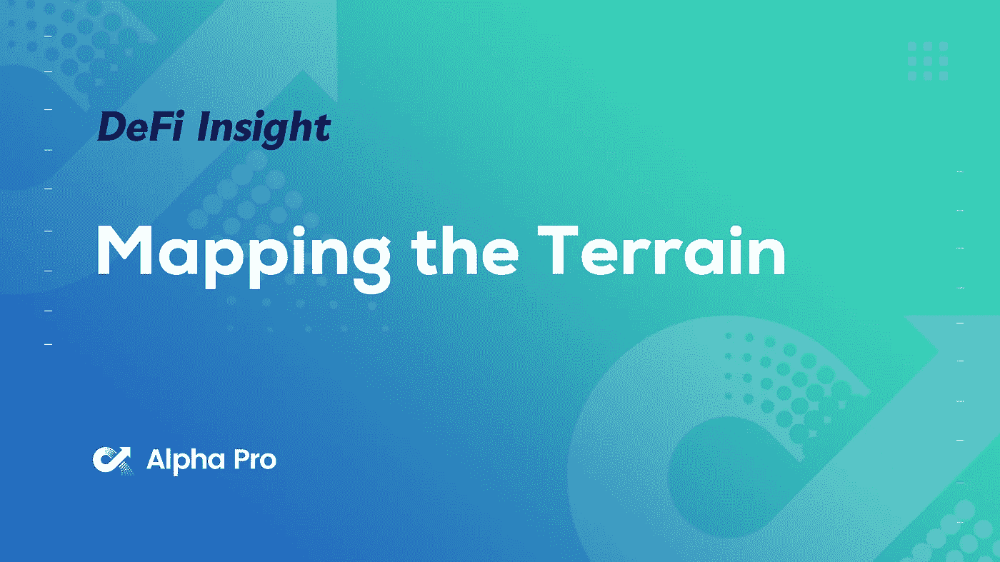
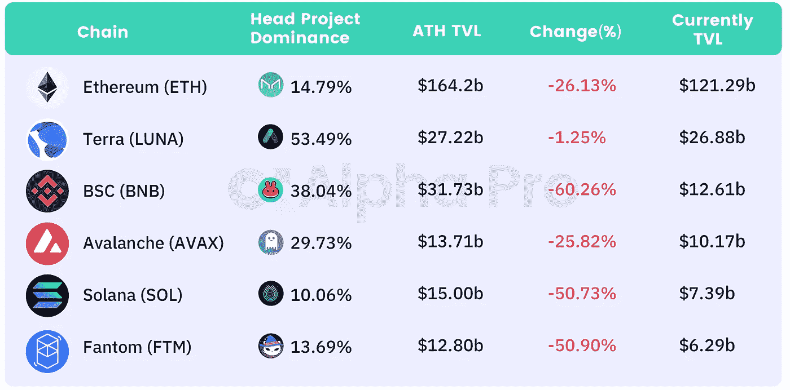
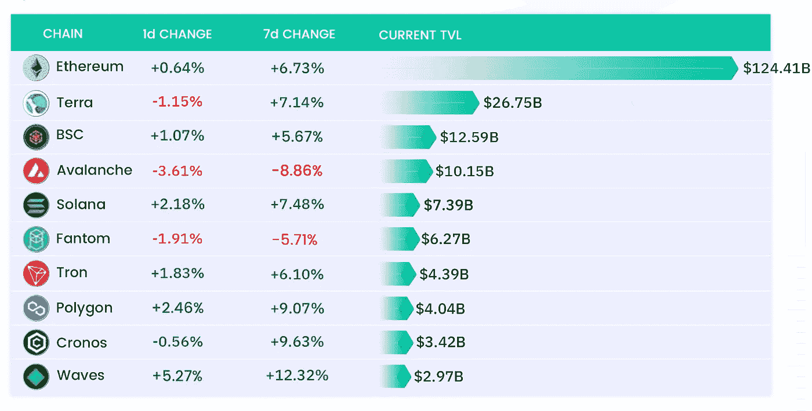
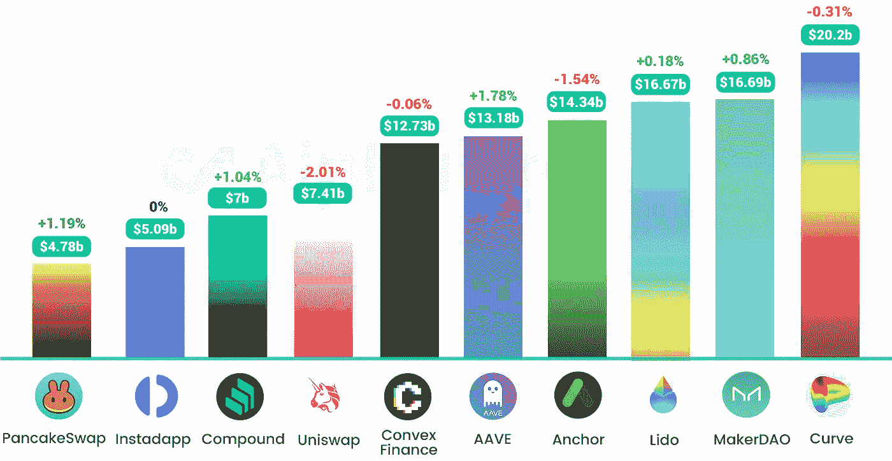
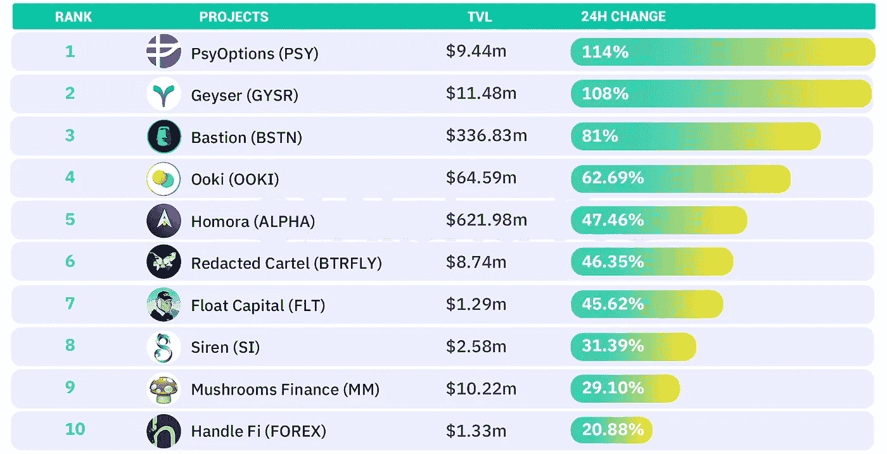
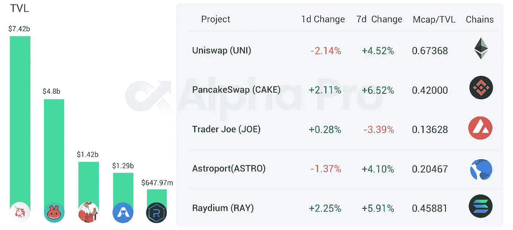
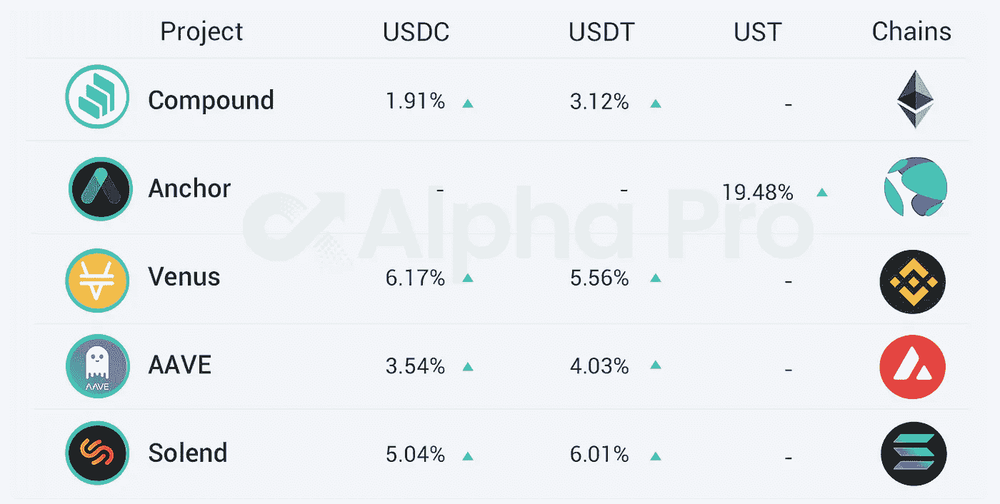

# DeFi Insight |绘制地形图；将 BTC 连接到 Harmony 的以太坊虚拟机

> 原文：<https://medium.com/coinmonks/defi-insight-mapping-the-terrain-bridging-btc-to-harmonys-ethereum-virtual-machine-12626cd14497?source=collection_archive---------34----------------------->

## 2022 年 3 月 25 日

*今日 DeFi 数据&由 DeFi Insight 为您带来的新闻。*

> 在 2022 年的前 2.5 个月，LUNA 的价格回报超过了其他智能合约生态系统令牌的总和 7:1。
> Terra 在新兴智能合约生态系统中的 TVL 市场份额在 90 天内增长了 54%,目前占新兴生态系统 TVL 的三分之一。
> TVL 的大部分增长来自债务协议，因为 Anchor 在 30 天内增长了 50 亿美元。存款在很大程度上追逐 Anchor 20%的收益率，因为债务相对于存款仅增长了三分之一。【[**报告**](https://messari.io/article/mapping-the-terrain)

# 最新消息

## 定义

俄罗斯愿意接受用比特币出售天然气

CFTC 延长关于 FTX 请求修订 DCO 注册令的公众意见征询期

**萨尔瓦多总统:将通过 Bitfinex 发行[比特币火山债券](https://twitter.com/nayibbukele/status/1506765451967279109)**

****首先针对以色列银行业，Leumi 启用[密码交易](https://www.reuters.com/business/finance/first-israeli-banking-leumi-enable-crypto-trade-2022-03-24/)****

******[乐观](https://twitter.com/optimismPBC/status/1507077884594241547?s=20&t=Bdvm0G4jangJ8SrP7IQzWw)宣布推出 Calldata 压缩，将降低 40%的转让费******

********[**南森**](https://pro.nansen.ai/auth/signup)**现开放免费版本注册**********

## ******贷款******

******比特币基地钱包整合[金星](https://twitter.com/CoinbaseWallet/status/1507042445573320704)******

******[收益协议](https://twitter.com/yield/status/1506709155830063106?s=20&t=EbXbANiAYdGPdOPCfE8Wpw)上的 ETH 借款现已可用******

******锚协议将每月调整利率，ANC 下降 5%******

## ******桥梁******

******LayerZero 的跨链桥 [Stargate Finance](https://stargate.finance/) 的总锁定量超过 25 亿美元******

******[Cross-chain DEX zkLink](https://twitter.com/zkLinkorg/status/1507209829000966145?s=20&t=MA5OQS9ACpzh7x0V015M2g) 宣布 Groth16 zk-SNARK 证明系统在 Solana 上成功实施******

## ******稳定币******

********策勒网络支持[奥喀斯金融](https://twitter.com/Orcus_Finance/status/1507106149442727938)********

********【正确】有误:圆会计篡改 [USDC 认证小字](https://www.coindesk.com/layer2/2022/03/24/correctly-was-wrong-circles-accountant-tweaks-fine-print-of-usdc-attestation/)********

## ******道******

********[挑战](https://www.theblockcrypto.com/post/139162/defiance-capital-rescues-13-3-million-at-risk-of-being-stolen)资本拯救 1330 万美元被盗风险********

## ******产量******

********、** DeFi 协议[比例财务](https://twitter.com/RatioFinance/status/1507293448822566917)对 Raydium 进行 IDO******

## ****伙伴关系****

******比特币基地阿尔维耶宣布比特币基地主要合作伙伴关系，将允许全球品牌提供[加密交换](https://www.businesswire.com/news/home/20220324005346/en/Alviere-Coinbase-Announce-Coinbase-Prime-Partnership-That-Will-Allow-Global-Brands-to-Offer-Crypto-Exchange)******

## ******NFT******

******谷歌支持的 Glance 在 NFT 收购游戏平台 Gambit******

********[**本田讴歌**](https://acuraverse.com/)**在分散地推出 NFT 和虚拟展厅**********

********、**逸秀:Animoca Brands 不会对其 [ApeCoin DAO 提案](https://twitter.com/ysiu/status/1507057496011132938?s=20&t=Rwu-rvRsjRWCEyfgHfcB_g)进行投票******

******[XCOPY](https://niftygateway.com/marketplace/artist/5622)发布 NFT 新作，公映版作品 10 分钟内成交额超过 2300 万美元******

********、**[Meebits](https://nftgo.io/collection/meebits/overview)系列 NFT 24 小时交易额超过 2300 万美元******

******[小贝](https://www.prnewswire.co.uk/news-releases/david-beckham-enters-the-metaverse-and-becomes-global-ambassador-for-digitalbits-blockchain-845689236.html)入主元宇宙，成为 DigitalBits 区块链全球大使******

********麦当娜将推特头像改为修改后的 [BAYC #4988](https://twitter.com/Madonna/status/1507183071551971330)********

********,**DOJ 在调查中揭露指控[弗洛斯提斯 into“拉地毯”](https://www.theblockcrypto.com/linked/139169/doj-unveils-charges-amid-investigation-into-frosties-nft-rug-pull)******

# ****数据和分析****

## ****TVL 和 ATH 排名前六的连锁酒店对比****

********

## ****TVL 增长排名前 10 的连锁店****

********

## ****最新 TVL 十大项目****

********

## ****过去 24 小时 TVL 变化的前 10 个项目****

********

## ****德克斯 TVL 排名****

****指数中涨幅最大的是[瑞迪](https://defillama.com/protocol/raydium)，上涨 2.25 **%******

********

## ****APY DeFi 贷款公司****

*****USDC:最高贷款利率:*[*V*enus](https://app.venus.io/market)*6.17% APY*****

*****USDT:最高贷款利率:* [*索伦德*](https://solend.fi/dashboard)*6.01% APY*****

********

# ****深潜****

******[**宇宙生态系统**](https://newsletter.banklesshq.com/p/hottest-tokens-in-the-cosmos-ecosystem?s=r) 中最热门的代币******

**** [## 宇宙生态系统中最热门的代币

### 亲爱的无银行国家，本周早些时候，威廉写了一本宇宙入门书…

newsletter.banklesshq.com](https://newsletter.banklesshq.com/p/hottest-tokens-in-the-cosmos-ecosystem?s=r) 

**解锁**[**v model**](/balancer-protocol/unlocking-the-vemodel-f363d2d7bd91)

 [## 解锁 veModel

### veModel 是令牌组学的圣杯，它协调用户激励并关注长期协议性能。

medium.com](/balancer-protocol/unlocking-the-vemodel-f363d2d7bd91) 

**吸血鬼银行家:进化的** [**密码借贷**](https://dirtroads.substack.com/p/-35-morpho-gentleman-vampire?s=r)

 [## # 35 |大闪蝶，绅士吸血鬼

### 原谅我，史蒂夫，但是从我第一次听到这句话的时候，我就发现了这样一句话，你只能把点点滴滴联系起来…

dirtroads.substack.com](https://dirtroads.substack.com/p/-35-morpho-gentleman-vampire?s=r) 

**[**市场**](https://www.getrevue.co/profile/route2fi/issues/i-m-afraid-the-markets-will-pump-without-me-if-i-take-a-break-from-the-screen-1101151) **如果我离开屏幕休息一会儿，恐怕没有我也能正常运作****

** [## 如果我离开屏幕休息一下，我担心市场会在没有我的情况下波动

### 在我们进入今天的时事通讯之前，让我们听听赞助商的话。今天的时事通讯是由 Nexo…

www.getrevue.co](https://www.getrevue.co/profile/route2fi/issues/i-m-afraid-the-markets-will-pump-without-me-if-i-take-a-break-from-the-screen-1101151)** 

# **报告**

****《NFT 铸币行为:数据告诉了我们什么？@nansen.ai****

> **通过参与造币厂来尽早进入非功能性饮食应该经过仔细的考虑。在决定是否参与 NFT 造币厂时，应该考虑他们的风险偏好。对潜在项目进行彻底的尽职调查是至关重要的，例如研究社区、他们的路线图和创始团队的历史。对于一个更加基于证据的方法，人们可以利用南森的 NFT 神模式来检查具体项目的交易数据。人们还可以利用 Mint Master 来收集关于著名的 NFT 铸币商正在做什么的见解，并跟踪智能货币与智能货币项目的互动。尽管 NFT 造币可能看起来像是微观层面的活动，但理解 NFT 市场的宏观前景至关重要。你可以从南森市场趋势仪表板中受益；因为了解更广泛的宏观趋势可以影响一个人的前景。**

****市场洞察——从底层开始，现在我们在这里**[**@**Delphi digital . io](https://members.delphidigital.io/reports/market-insights-started-from-the-bottom-now-were-here)**

****《一层一层》第 25 期:雪崩、Terra、BNB 链、宇宙**[@ the block research . com](https://www.theblockresearch.com/layer-by-layer-issue-25-avalanche-terra-bnb-chain-and-cosmos-139170)**

****DeFi 王国:走向游戏即服务**[@ the block research . com](https://www.theblockresearch.com/defi-kingdoms-moving-towards-games-as-a-service-138367)**

****/$ Push it(Real Good):多链世界中的分散通知服务**[**@**Delphi digital . io](https://messari.io/article/push-it-real-good-decentralized-notification-service-in-a-multichain-world)**

****将 BTC 桥接到 Harmony 的以太坊虚拟机** [**@** messari.io](https://messari.io/article/bridging-btc-to-harmony-s-ethereum-virtual-machine)**

**一场 **回合:****

**DeFi Insight 是顶级 DeFi 和加密新闻和更新的来源。**

****https://twitter.com/AlphaPro_io 推特:****

******❤RSS:**[**https://medium.com/feed/@alphapro.project**](https://medium.com/feed/@alphapro.project)****

****提供的信息应被视为发展新闻，而不是投资建议。****

> ****加入 Coinmonks [电报频道](https://t.me/coincodecap)和 [Youtube 频道](https://www.youtube.com/c/coinmonks/videos)了解加密交易和投资****

# ****另外，阅读****

*   ****[分散交易所](https://coincodecap.com/what-are-decentralized-exchanges) | [比特 FIP](https://coincodecap.com/bitbns-fip) | [宾邦评论](https://coincodecap.com/bingbon-review)****
*   ****[用信用卡购买密码的 10 个最佳地点](https://coincodecap.com/buy-crypto-with-credit-card)****
*   ****[加拿大最佳加密交易机器人](https://coincodecap.com/5-best-crypto-trading-bots-in-canada) | [Bybit vs 币安](https://coincodecap.com/bybit-binance-moonxbt)****
*   ****[阿联酋 5 大最佳加密交易所](https://coincodecap.com/best-crypto-exchanges-in-uae) | [SimpleSwap 评论](https://coincodecap.com/simpleswap-review)****
*   ****[购买 Dogecoin 的 7 种最佳方式](https://coincodecap.com/ways-to-buy-dogecoin) | [ZebPay 评论](https://coincodecap.com/zebpay-review)****
*   ****[最佳期货交易信号](https://coincodecap.com/futures-trading-signals) | [流动性交易所评论](https://coincodecap.com/liquid-exchange-review)********