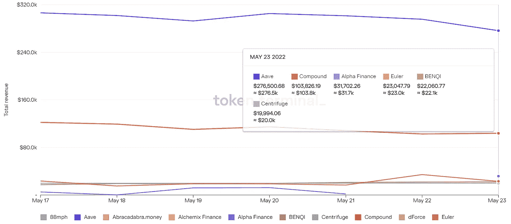

# DeFi Insight |正在制定新的空投标准

> 原文：<https://medium.com/coinmonks/defi-insight-new-airdrop-standards-are-being-set-a93c3a3993f5?source=collection_archive---------22----------------------->

2022 年 5 月 24 日

*今日 DeFi 数据&由 DeFi Insight 为您带来的新闻。*

> *"* 乐观派宣布，他们一直在仔细分析$OP 空投#1 是否有漏网之鱼。现在，他们已经移除了额外的 17k sybil 地址，并恢复了超过 1400 万美元的 OP。所有恢复的$OP 将按比例重新分配给 Airdrop #1 的其他接收者。*“@*[*来源*](https://twitter.com/optimismPBC/status/1528830231322165249)

# 最新消息

## 指标

**[ape swap](https://www.bsc.news/post/apeswap-launches-banana-maximizer-vaults)推出香蕉最大化库**

## **外汇**

**比特币基地 510 亿美元的暴跌不仅仅是关于加密冬天**

## **稳定币**

****朝鲜翻脸[卢娜](https://beincrypto.com/korea-against-luna-head-police-request-lfg-fund-freeze/?utm_source=blockworks-research)头当警察要求冻结 LFG 资金****

******/**[astro port+Terra 2.0](https://astroport.medium.com/astroport-terra-2-0-a-new-path-forward-b7b328171e4b):新的前进道路****

## ****测试网****

****Amarok 在公共测试网上！****

## ****支付****

******、**tec tum 如何使用 [SoftNote](https://bitcoinist.com/how-tectum-is-using-softnote-to-replace-paper-money-and-rewarding-users-in-our-ecostream/) 来取代纸币，并在我们的 ecostream 中奖励用户****

## ****钱包****

******[GameStop](https://www.zdnet.com/finance/blockchain/gamestop-launches-non-custodial-ethereum-wallet-to-store-cryptocurrency-and-nfts/)推出非托管以太坊钱包，存储加密货币和 NFTs******

********/**在[比特币基地钱包](https://blog.coinbase.com/trade-thousands-of-tokens-on-your-choice-of-network-in-coinbase-wallet-2ffee57da0bb)中选择的网络上交易数千枚代币******

## ****空投****

****跳跃协议正在制定新的空投标准****

## ****资产管理****

******[摩根士丹利](https://blockworks.co/morgan-stanley-blockfi-execs-disagree-on-spot-bitcoin-etfs/)，BlockFi 高管对现货比特币 ETF 意见不一******

## ******政策与法规******

******以下是市场认为澳大利亚人应该优先考虑的事情******

## ******基金******

********[Protego Trust Bank](https://www.theblockcrypto.com/post/148226/protego-trust-bank-fundraise)在悄悄筹集 7000 万美元后，目标是 20 亿美元的估值********

********数字证券平台 [ADDX](https://www.theblockcrypto.com/linked/148400/digital-securities-platform-addx-raises-58-million?utm_source=cryptopanic&utm_medium=rss%3Futm_source%3Dblockworks-research) 融资 5800 万美元********

******在 DMCC 化学技术公司的最新一轮融资中，Hedonova 以 3.3 亿美元的估值筹集了 1840 万美元******

******PlatinX 科技公司为 PTX ALGO 交易软件公司获得 500 万美元的投资******

## ******观点******

********[Pharma Bro Martin shk reli](https://decrypt.co/101209/pharma-bro-martin-shkreli-ethereum-vitalik-buterin):以太坊的 Vitalik Buterin“才华横溢”，但也“满口胡言”********

******国际货币基金组织总裁说没有资产支持的稳定债券是一个“金字塔”，暗示 UST 的崩溃导致市场崩溃******

********[英国央行行长](https://u.today/bank-of-england-governor-claims-bitcoin-will-fail-as-payment-method)声称比特币作为支付方式将会失败********

# ******数据和分析******

## ******锁定的总价值(TVL)******

******目前全网 DeFi 总锁定量为 1139.1 亿美元，24 小时增长 3.83%。******

************

## ******TVL 评出的十大连锁酒店******

************

## ******|最新 TVL 十大项目******

************

## ******|过去 24 小时内 TVL 增长的前 10 个项目******

************

## ******协议收入******

## ******|累计总收入最高的项目(24H)_ 区块链(L1)******

************

## ******|累计总收入最高的项目(24H) _Dapps (L2)******

************

## ******|前 10 大交易所的每日收入******

************

## ******|十大贷款协议的每日收入******

************

# ******深潜******

********比特币如何为 10 亿人** [**解锁海洋的能量**](https://bitcoinmagazine.com/business/bitcoin-unlocks-ocean-energy)******

****** [## 比特币如何为 10 亿人释放海洋的能量

### 比特币有潜力帮助释放 2 至 4 太瓦的清洁、持续和全年基本负载电力…

bitcoinmagazine.com](https://bitcoinmagazine.com/business/bitcoin-unlocks-ocean-energy) 

**区块链能否提供** [**方案**](https://cryptoslate.com/can-blockchain-offer-the-solution-to-crowdfunding/) **进行众筹？**

 [## 区块链能提供众筹的解决方案吗？隐板岩

### 众筹是创业公司为新产品筹集资金的一种流行方法。然而，几乎 10%的众筹…

cryptoslate.com](https://cryptoslate.com/can-blockchain-offer-the-solution-to-crowdfunding/) 

**尽管事态发展，为什么** [**链环的【链环】**](https://ambcrypto.com/despite-developments-why-is-chainlinks-link-unable-to-break-out-of-bearish-shackles/?utm_source=blockworks-research) **无法挣脱看跌的枷锁**

 [## 尽管有发展，为什么 Chainlink 的[LINK]无法挣脱看跌的枷锁- AMBCrypto

### Chainlink 是一个分散式网络，旨在通过以下方式扩展区块链的功能

ambcrypto.com](https://ambcrypto.com/despite-developments-why-is-chainlinks-link-unable-to-break-out-of-bearish-shackles/?utm_source=blockworks-research) 

**[**收益递减**](https://insights.glassnode.com/the-week-onchain-week-21-2022/)**

** [## 收益递减的熊市

### 过去 12 个月的价格表现可谓乏善可陈，压低了长期 CAGR 利率…

insights.glassnode.com](https://insights.glassnode.com/the-week-onchain-week-21-2022/)** 

# **报告**

****[**数字资产资金流**](https://coinshares.com/research/digital-asset-fund-flows) **每周** _coinshares****

> ****这份周刊是一份简短的概要，涵盖了热门 etp、共同基金和场外信托的投资流入和流出，涉及比特币、以太网和其他数字资产。****
> 
> ****它涵盖了提供商和资产的流量，帮助投资者了解数字资产领域最近价格波动的驱动因素和投资者情绪。****

******[**GMX**](https://members.delphidigital.io/reports/gmx-users-increase-king-dollar-hopping-thru-l2s)**用户增加，王者美元，跳穿 L2s** _delphidigital******

******[**克罗诺斯**](https://messari.io/article/cronos-an-introduction-and-analysis-of-a-new-l1) **:新 L1**_ 梅萨里介绍与分析******

******[**Crypto.com**](https://www.theblockresearch.com/crypto-com-company-intelligence-148287)**公司情报** _theblockresearch******

******[**分散式**](https://dappradar.com/blog/decentraland-mega-tower-sells-for-238k-nft-highlights) **巨型塔楼售价 238k——NFT 集锦** _dappradar******

******关于:******

****DeFi Insight 是顶级 DeFi 和加密新闻和更新的来源。****

******https://twitter.com/AlphaPro_io**❤****

********❤RSS:**[**https://medium.com/feed/@alphapro.project**](https://medium.com/feed/@alphapro.project)******

****提供的信息应被视为发展新闻，而不是投资建议。****

> ****加入 Coinmonks [电报频道](https://t.me/coincodecap)和 [Youtube 频道](https://www.youtube.com/c/coinmonks/videos)了解加密交易和投资****

# ****另外，阅读****

*   ****[3 商业评论](/coinmonks/3commas-review-an-excellent-crypto-trading-bot-2020-1313a58bec92) | [Pionex 评论](https://coincodecap.com/pionex-review-exchange-with-crypto-trading-bot) | [Coinrule 评论](/coinmonks/coinrule-review-2021-a-beginner-friendly-crypto-trading-bot-daf0504848ba)****
*   ****[莱杰 vs n rave](/coinmonks/ledger-vs-ngrave-zero-7e40f0c1d694)|[莱杰 nano s vs x](/coinmonks/ledger-nano-s-vs-x-battery-hardware-price-storage-59a6663fe3b0) | [币安评论](/coinmonks/binance-review-ee10d3bf3b6e)****
*   ****[Bybit Exchange 审查](/coinmonks/bybit-exchange-review-dbd570019b71) | [Bityard 审查](https://coincodecap.com/bityard-reivew) | [Jet-Bot 审查](https://coincodecap.com/jet-bot-review)****
*   ****[3 commas vs crypto hopper](/coinmonks/3commas-vs-pionex-vs-cryptohopper-best-crypto-bot-6a98d2baa203)|[赚取加密利息](/coinmonks/earn-crypto-interest-b10b810fdda3)****
*   ****最好的比特币[硬件钱包](/coinmonks/hardware-wallets-dfa1211730c6) | [BitBox02 回顾](/coinmonks/bitbox02-review-your-swiss-bitcoin-hardware-wallet-c36c88fff29)****
*   ****[BlockFi vs 摄氏度](/coinmonks/blockfi-vs-celsius-vs-hodlnaut-8a1cc8c26630) | [Hodlnaut 审核](/coinmonks/hodlnaut-review-best-way-to-hodl-is-to-earn-interest-on-your-bitcoin-6658a8c19edf) | [KuCoin 审核](https://coincodecap.com/kucoin-review)**********