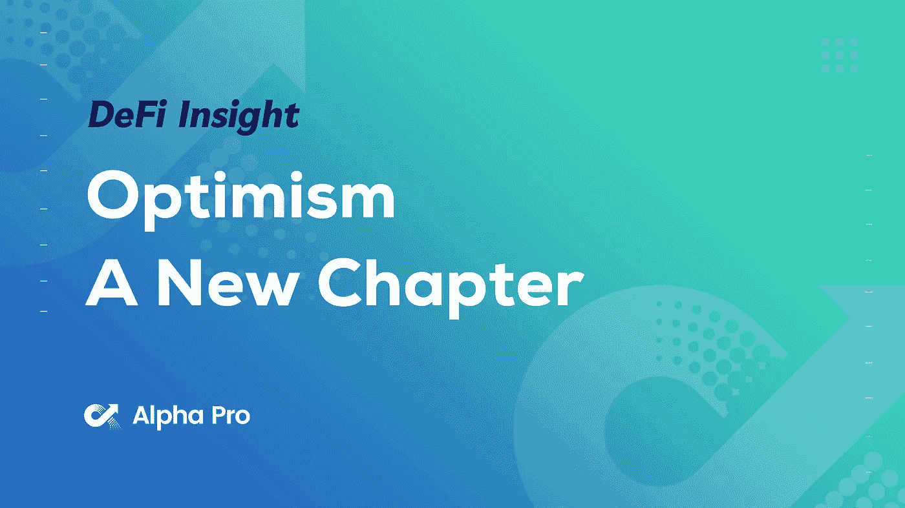
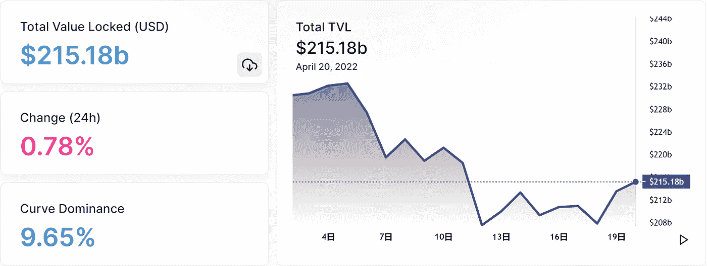
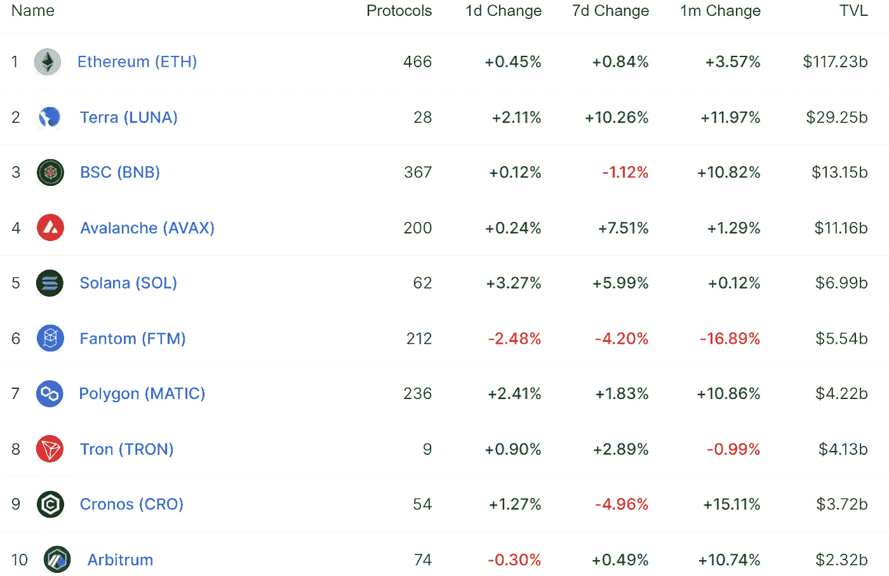
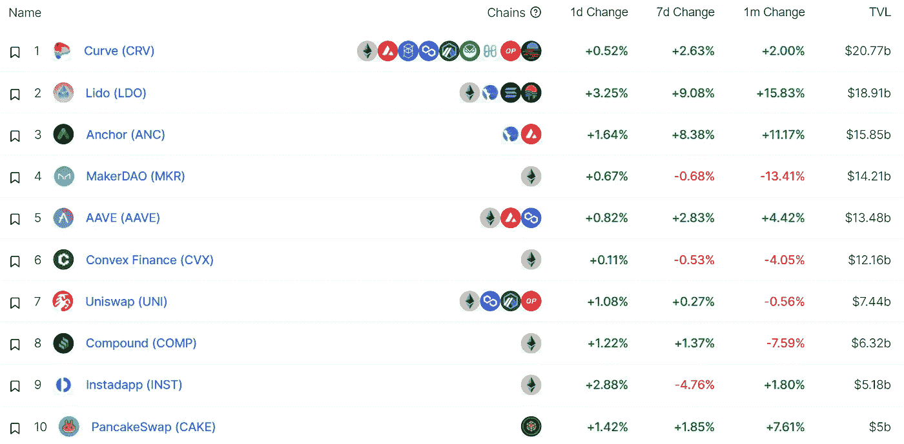
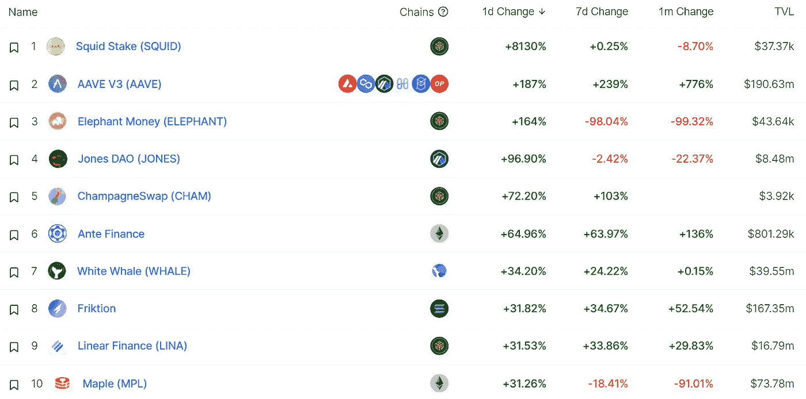
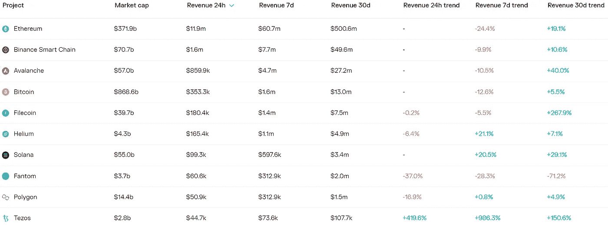
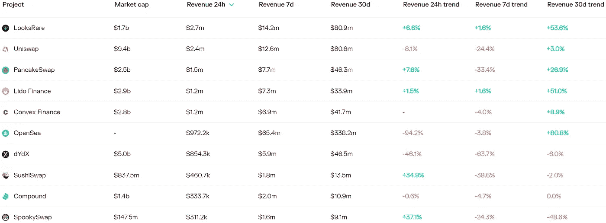
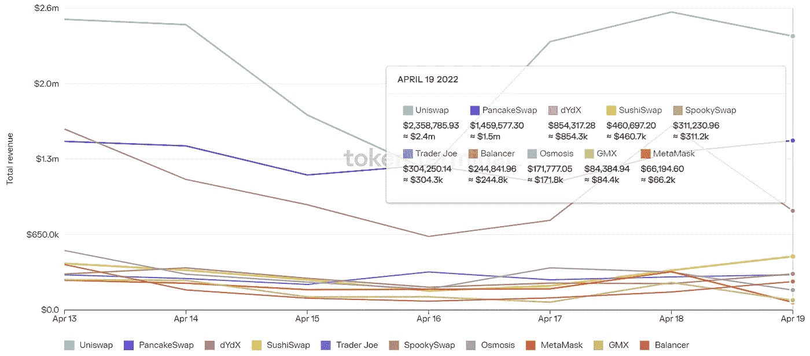
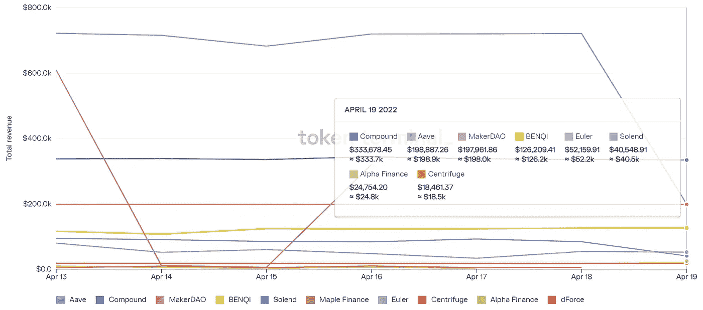

# 乐观主义宣告新篇章，赢得以太坊的战斗开始了

> 原文：<https://medium.com/coinmonks/defi-insight-optimism-announces-new-chapter-the-battle-to-win-ethereum-is-on-8644a629db6f?source=collection_archive---------27----------------------->

## 2022 年 4 月 20 日

*今日 DeFi 数据&由 DeFi Insight 为您带来的新闻。*

> “很难相信，但乐观 mainnet 在一年多前就启动了。从那时起，我们已经:
> 
> 为用户节省了超过 11 亿美元的天然气费用
> 部署了超过 6，800 份合同
> 提供了超过 30 万个唯一地址
> 获得了超过 9 亿美元的价值
> 促成了超过 174 亿美元的交易量
> 产生了超过 2450 万美元的收入
> 向公共产品基金捐赠了超过 100 万美元[**乐观主义**](https://optimism.mirror.xyz/Fdpds7l4yE2VDpLN4AZQUCjpBYdoPrIHw6a4uzUepmw)

# **最新消息**

## **贷款**

****Yeti Finance 在[雪崩](/avalancheavax/yeti-finance-launches-on-avalanche-expanding-borrowing-strategies-and-liquidity-d6c84d1f2128)时推出，扩大借贷策略和流动性****

## ****产量****

******DeFi Yield[优化](https://twitter.com/StakeDAOHQ/status/1515998762992291847?s=20&t=b9nEF7eM3PC6n4uoccgWCw)平台桩道推出液舱******

## ******采矿******

********Aave V3 已经开始流动性[开采](https://twitter.com/luigidemeo/status/1516561114640916480)雪崩********

## ******稳定币******

********stable coin 协议 [Volt 协议](/volt-protocol/presenting-volt-f0ea2a38eb2e)于 4 月 23 日启动 mainnet********

## ******空投******

******DETF 基金会— [你需要知道的](/defund-finance/airdrop-d-c2685d282858)******

## ******|警报******

********、** DeFi 交易加速工具 [bloXroute](https://twitter.com/bloXrouteLabs/status/1514656207709089797) :平台不发放令牌；谨防骗局******

## ****叉子****

****ether 2.0 核心开发者:以太坊主网的影子[分叉](https://twitter.com/dapplion/status/1516334127305342977?s=20&t=hYjCjNHd5arGfjWuBdcARQ)测试将于本周六再次进行****

## ****|开发****

******[以太坊基金会](https://thedefiant.io/eth-amd-polkadot-7m-zprize/)、AMD、Polkadot 发起 700 万美元竞赛，推动零知识扩展******

## ******组合******

********介绍币安投资组合保证金[计划](https://www.binance.com/en/support/announcement/c013c3ceaa604a3eaa362647b06441a1)********

# ******数据和分析******

## ******锁定的总价值(TVL)******

******目前全网 DeFi 总锁定量为 2151.8 亿美元，24 小时增长 0.78%******

************

## ******TVL 评出的十大连锁酒店******

************

## ******|最新 TVL 十大项目******

************

## ******|过去 24 小时内 TVL 增长的前 10 个项目******

************

## ******协议收入******

## ******|累计总收入最高的项目(24H)_ 区块链(L1)******

************

## ******|累计总收入最高的项目(24H) _Dapps(L2)******

************

## ******|前 10 大交易所的每日收入******

************

## ******|十大贷款协议的每日收入******

************

# ********深潜********

********[**Terra**](https://newsletter.banklesshq.com/p/a-beginners-guide-to-terra?utm_source=%2Finbox&utm_medium=reader2&s=r)初级指南********

**** [## Terra 入门指南

### 亲爱的无银行国家，上个月，我们在无银行时事通讯中展示了宇宙，并附有终极入门指南和…

newsletter.banklesshq.com](https://newsletter.banklesshq.com/p/a-beginners-guide-to-terra?utm_source=%2Finbox&utm_medium=reader2&s=r) 

**[**月鸟**](https://metaversal.banklesshq.com/p/march-of-the-moonbirds?utm_source=%2Finbox&utm_medium=reader2&s=r) 三月**

** [## 月鸟进行曲

### 亲爱的无银行国家，月鸟 NFT 系列的到来与 NFT 生态系统的任何事情都不一样…

metaversal.banklesshq.com](https://metaversal.banklesshq.com/p/march-of-the-moonbirds?utm_source=%2Finbox&utm_medium=reader2&s=r) 

**如何使用** [**图块浏览器**](https://defieducation.substack.com/p/how-to-use-a-block-explorer?utm_source=%2Finbox&utm_medium=reader2&s=r)

 [## 如何使用块浏览器

### 欢迎头像！今天，我们解释如何使用块资源管理器访问链上的数据。什么是块浏览器，为什么…

defieducation.substack.com](https://defieducation.substack.com/p/how-to-use-a-block-explorer?utm_source=%2Finbox&utm_medium=reader2&s=r) 

# 报告

**对等协议 NFT** [**出借**](https://messari.io/article/peer-to-protocol-nft-lending-jpeg)**:$ JPEG _**messari . io

> 关键见解:
> NFT 股市的价值刚刚飙升。如果历史可以借鉴的话，对以 NFT 为中心的连锁贷款服务的需求可能会随之而来。历史上，大多数 NFT 借贷平台都使用点对点方式，但 JPEG'd 引入了一种集成令牌的点对点协议方式，以牺牲可定制性为代价来提高速度。
> 由于其效用驱动的令牌组学，对 JPEG 令牌的需求与最大限度地利用平台的需求相关联。

**概述最活跃的** [**区块链投资者**](https://www.theblockresearch.com/an-overview-of-the-most-active-blockchain-investors-in-q122-142497) **在 Q1‘22 _**the block research

**比较** [**dYdX 和 ZigZag**](https://www.theblockresearch.com/comparing-dydx-and-zigzag-protocol-141873) **协议 _** 阻塞研究

**短期痛苦，但** [**长期**](https://insights.glassnode.com/the-week-onchain-week-16-2022/) **收获？_**insight . glass node

**数字资产** [**资金流向**](https://blog.coinshares.com/volume-75-digital-asset-fund-flows-weekly-report-4a847cde4458) **周报 _** coinshares

一场一场**的较量:**

DeFi Insight 是顶级 DeFi 和加密新闻和更新的来源。

**https://twitter.com/AlphaPro_io 推特:**

****❤RSS:**[**https://medium.com/feed/@alphapro.project**](https://medium.com/feed/@alphapro.project)**

**提供的信息应被视为发展新闻，而不是投资建议。**

> **加入 Coinmonks [电报频道](https://t.me/coincodecap)和 [Youtube 频道](https://www.youtube.com/c/coinmonks/videos)了解加密交易和投资**

# **另外，阅读**

*   **[用信用卡购买密码的 10 个最佳地点](https://coincodecap.com/buy-crypto-with-credit-card)**
*   **[最好的卡达诺钱包](https://coincodecap.com/best-cardano-wallets) | [Bingbon 副本交易](https://coincodecap.com/bingbon-copy-trading)**
*   **[印度最佳 P2P 加密交易所](https://coincodecap.com/p2p-crypto-exchanges-in-india) | [柴犬钱包](https://coincodecap.com/baby-shiba-inu-wallets)**
*   **[八大加密附属计划](https://coincodecap.com/crypto-affiliate-programs) | [eToro vs 比特币基地](https://coincodecap.com/etoro-vs-coinbase)**
*   **[最佳以太坊钱包](https://coincodecap.com/best-ethereum-wallets) | [电报上的加密货币机器人](https://coincodecap.com/telegram-crypto-bots)**
*   **[交易杠杆代币的最佳交易所](https://coincodecap.com/leveraged-token-exchanges) | [购买 Floki](https://coincodecap.com/buy-floki-inu-token)********