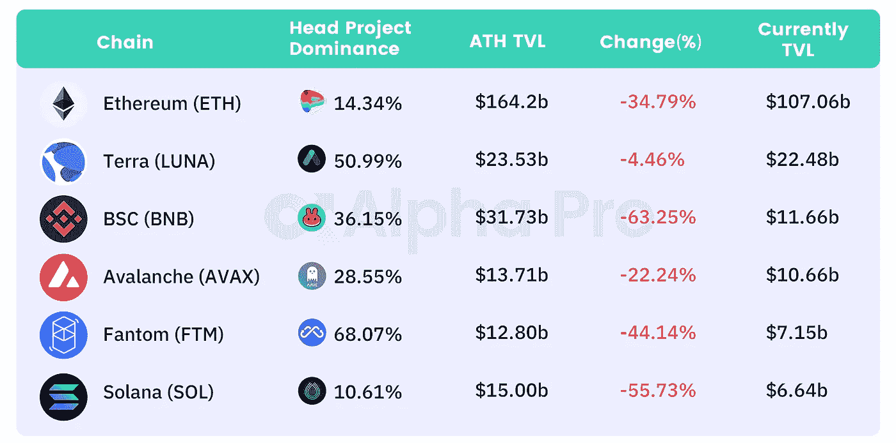
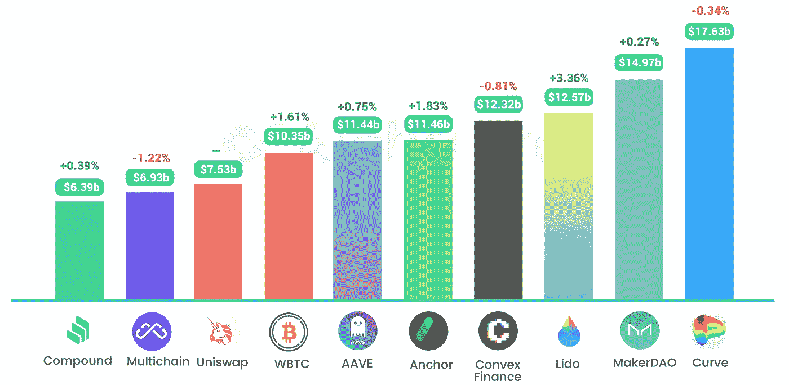
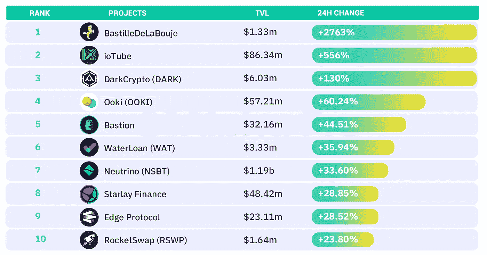
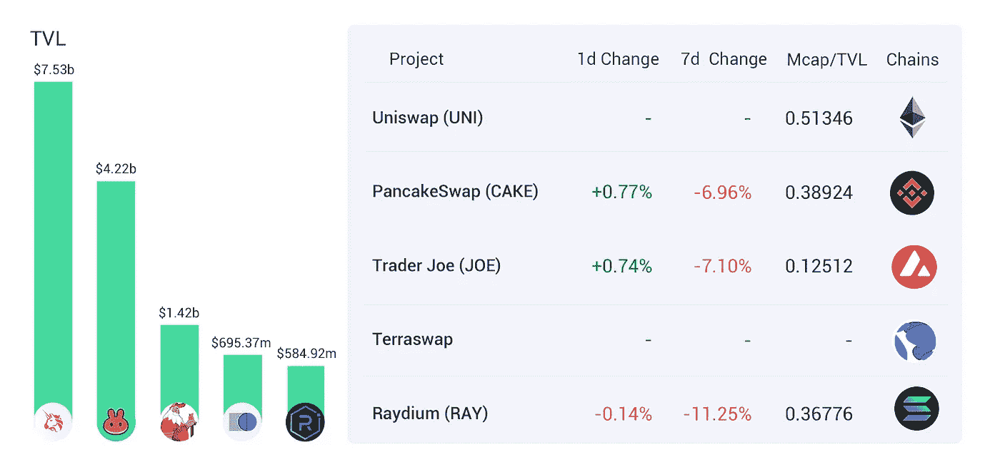
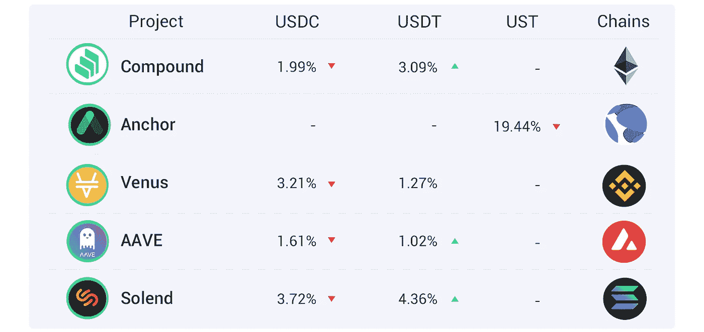
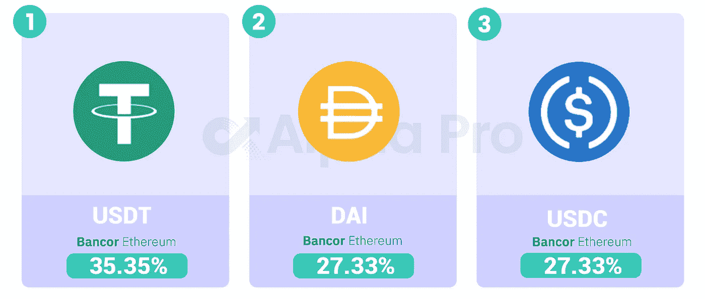

# DeFi Insight | Playbook 充分利用熊市；以太坊在所有网络中的 TVL 份额首次低于 55%

> 原文：<https://medium.com/coinmonks/defi-insight-playbook-to-make-the-most-out-of-a-bear-market-ethereums-tvl-share-across-all-3f857f17772d?source=collection_archive---------43----------------------->

## 2022 年 3 月 8 日

*今日 DeFi 数据&由 DeFi Insight 为您带来的新闻。*

**宏观趋势:**乔·拜登本周将签署关于[密码](https://blockworks.co/us-president-joe-biden-to-sign-executive-order-on-crypto-this-week-report/)的行政命令

**TVL 动向:**目前全网 [DeFi](https://defillama.com/) 总锁定量为 1944.4 亿美元，24 小时增长 1.16%

**Stablecoin:** Tether 在 TRON 上额外发放了 10 亿个[USDT](https://twitter.com/whale_alert/status/1500859730041974788)

# 最新消息

## 定义

以太坊在所有网络中的 TVL 份额首次低于 55%

Nanse: 7 天[活动地址链](https://twitter.com/nansen_ai/status/1500833666162855937)
区块链大部分地区的活动地址数量都有所增加，尤其是 Arbitrum、Polygon、& Ronin

全球委员会增加了 [DeFi banking](https://cointelegraph.com/news/global-council-adds-defi-banking-firm-scallop-to-help-secure-payment-data) 公司扇贝来帮助保护支付数据

SEBA 银行高管表示，明确的法规将加速[加密技术的采用](https://cointelegraph.com/news/clear-regulations-will-accelerate-crypto-adoption-says-seba-bank-exec)

## 协议

Aave 发起对将 UST 加入 AAVE v2 的提案[的投票](https://app.aave.com/#/governance/65-QmYcKbka4WWgwVTcxE7esz2NJfzQbza5ya6oTUKhuFzPrN)

DeFi 交易平台 DeversiFi 宣布推出 [Arbitrum 跨链桥](https://twitter.com/deversifi/status/1500853979479261185)

宣布推出 DexGuru DAO，被选中的用户可以创建早期治理 NFT

德利金融宣布成功完成其 210 万美元的种子私人融资

*[感知协议](/sensefinance/sense-protocol-guarded-launch-a9628fdf29ec)保护启动

## 稳定币

为什么[稳定币](https://www.coindesk.com/layer2/2022/03/07/why-stablecoin-interest-rates-are-so-damn-high/)利率如此之高

鲸鱼的稳定货币购买力在一个月内增长了 7%:这意味着什么

## 打桩

*[draft kings](https://www.globenewswire.com/news-release/2022/03/07/2398061/0/en/DraftKings-Joins-Forces-With-Zero-Hash-to-Earn-Staking-Rewards-on-Polygon.html)与 Zero Hash 联手在多边形上赢得赌注奖励

# 数据和分析

## TVL 和 ATH 排名前六的连锁酒店对比

## 最新 TVL 十大项目

## 过去 24 小时 TVL 变化的前 10 个项目

## 德克斯 TVL 排名

指数中涨幅最大的是*上涨 0.77 **%***

**

## *APY DeFi 贷款公司*

**USDC:最高贷款人:索伦德，利率为 3.72% APY**

**USDT:最高贷款人:索伦德，利率为 4.36% APY**

**

## *稳定的 APY*

**

# *深潜*

***剧本充分利用** [**熊市**](https://twitter.com/thedefiedge/status/1500898103225827330)*

***[**Crypto:**](https://zoomeroracle.substack.com/p/crypto-the-unwritten-rules-of-the?s=r)**狂野西部的潜规则*****

*** [## 密码:狂野西部的不成文规则。

### 大家好，在 Twitter 上问你们是否想要一篇关于如何在 crypto 中获得 alpha 的文章后，我很惊讶…

zoomeroracle.substack.com](https://zoomeroracle.substack.com/p/crypto-the-unwritten-rules-of-the?s=r) 

**[**心理模型**](https://rainandcoffee.substack.com/p/mental-models-for-crypto?s=r) **为密码****

** [## 密码的心理模型

### 如果有人要我简化人生旅程，我会说这是一长串的决定(最终…

rainandcoffee.substack.com](https://rainandcoffee.substack.com/p/mental-models-for-crypto?s=r)** 

# **研究**

****L1s 的未来近在眼前:对一个** [**新兴协议**](https://messari.io/article/the-future-of-l1s-is-near-an-analysis-of-an-emerging-protocol) 的分析**

> **一级区块链已经成为一个拥挤和竞争激烈的竞技场。当比特币在 2008 年首次推出时，在任何真正的挑战者出现之前，它拥有自己的空间多年。今天，有超过 100 个不同的第 1 层区块链在竞争分配给更广泛的加密生态系统的近 2 万亿美元。尽管市场规模巨大，但仅比特币和以太坊两家公司就控制了整个市场的 50%以上。大多数新进入者都专注于智能合约领域，以太坊在这一领域一直占据市场主导地位。在过去的 18 个月里，大量新玩家成功地获得了令人印象深刻的吸引力。看看锁定的总价值(TVL)，这是一个衡量协议中存放的资产的指标，以太坊在 2021 年初占据了整个智能合约市场的 97%。截至 2022 年 3 月，这一数字已降至 60%以下。**

**一个 **值得信赖的资源，为万物所不容****

> **一场较量:**
> 
> **DeFi Insight 是顶级 DeFi 和加密新闻和更新的来源。**
> 
> **提供的信息应被视为发展新闻，而不是投资建议。*****