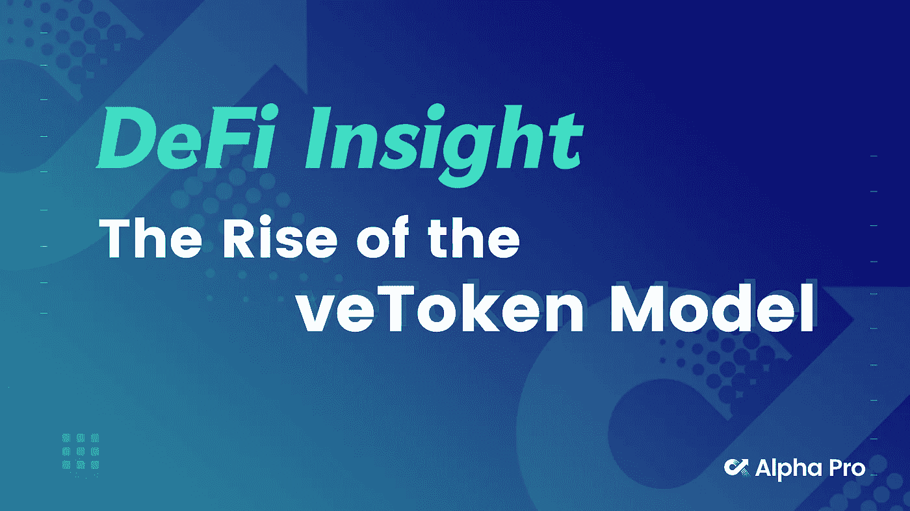
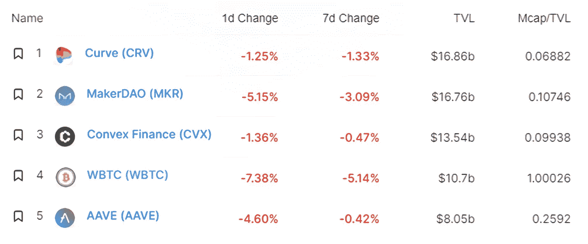
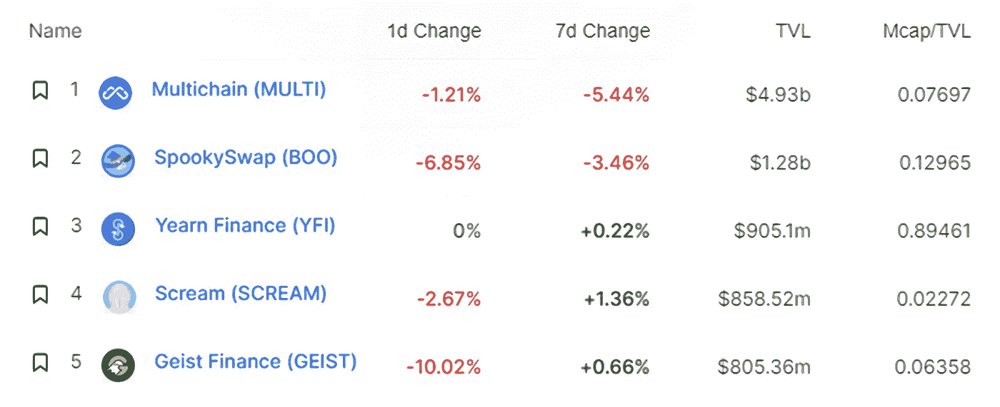
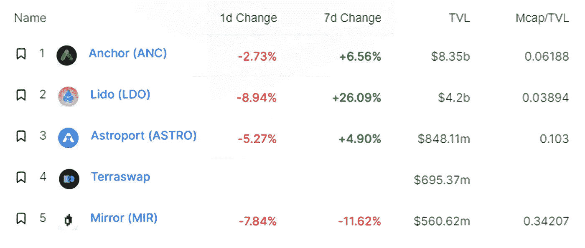
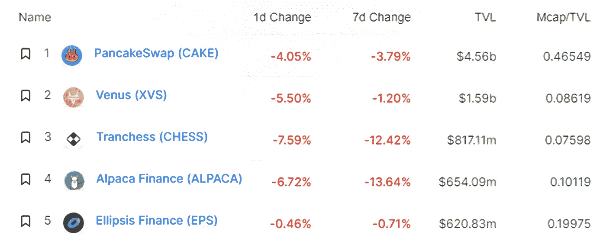
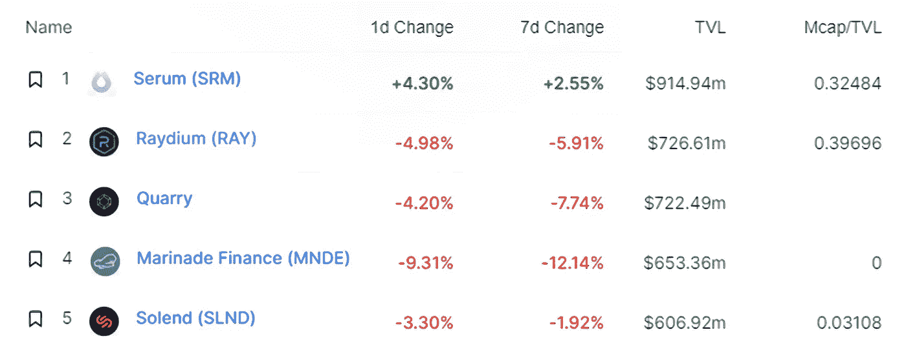
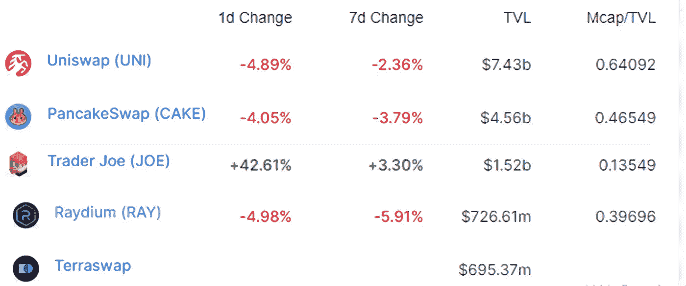
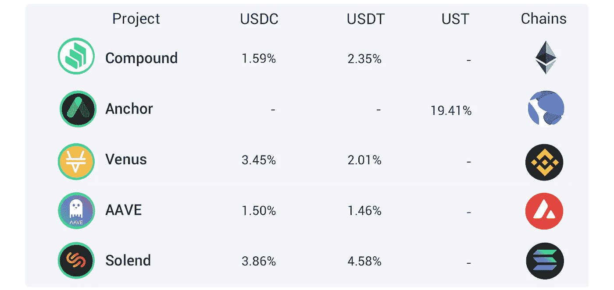

# DeFi Insight | veto ken 模式的兴起；雪崩桥的 TVL 达到 62 亿美元

> 原文：<https://medium.com/coinmonks/defi-insight-retrograde-core-team-proposes-to-launch-veanc-token-economics-tvl-of-avalanche-a8e356f50d31?source=collection_archive---------8----------------------->

## 2022 年 2 月 18 日

*今日 DeFi 数据&由 DeFi Insight 为您带来的新闻。*

**宏观趋势:** [加密“最佳地点”](https://cointelegraph.com/news/crypto-best-place-to-store-wealth-during-fed-rate-hike-pantera-ceo)美联储加息期间储存财富:潘迪拉首席执行官

**TVL 走势:**价值锁定德菲受到打击， [TVL 在 24 小时内下跌 3.18%](https://defillama.com/)

**德指动态:**德指涨幅最大的是[操盘手](https://defillama.com/protocol/trader-joe)，上涨 42.61 **%**

**Stablecoin:** [USDC 发行人圈](https://www.businesswire.com/news/home/20220217005290/en/Centre-Announces-Verite---A-Decentralized-Identity-Solution-for-Crypto-Finance)宣布与特殊目的收购公司的新交易条款

# 最新消息

## 定义

Terra 首席执行官 Do Kwon 被命令遵守与[镜像协议调查](https://www.coindesk.com/business/2022/02/18/terra-ceo-do-kwon-ordered-to-comply-with-sec-subpoena-related-to-mirror-protocol-investigation/)相关的 SEC 传票

Uniswap 创始人海登·亚当斯: [veToken](https://twitter.com/haydenzadams/status/1494473292819795968) 就像一场短期金钱游戏

## 借出

*[欧拉金融](https://blog.euler.finance/uniswap-oracle-attack-simulator-42d18adf65af)发布 Uniswap oracle 攻击模拟器

## 互换

[多多](https://twitter.com/BreederDodo/status/1494157541181247494)与 pltfinance 合作开展流动性挖掘

Raydium 发射 [FUJI-SOL 聚变池](https://mobile.twitter.com/RaydiumProtocol/status/1494281202122969088)

## 稳定币

USDC 发行人圈宣布与特殊目的收购公司的新交易条款

## 协议

逆行核心团队提议推出 [veANC Token Economics](https://forum.anchorprotocol.com/t/proposal-veanc-evolving-anchor-tokenomics/2773/)

投资者用 2 . 05 亿美元的生态系统基金支持图表

跨链桥[清创](/debridge/debridge-mainnet-is-here-f441fabc83c0)宣布 mainnet 发布

[雪崩桥](https://dune.xyz/queries/145516/286804)的 TVL 达到 62.38 亿美元

{[game Dao 将在 Acala](/acalanetwork/gamedao-to-launch-on-acala-leveraging-ausd-and-defi-platform-for-fundraising-ownership-and-90326061bf40) 上发布，利用 aUSD 和 DeFi 平台进行游戏玩家之间的筹款、所有权和协调

DeFi Technologies 宣布与 RockX 建立战略合作伙伴关系，通过金融产品提供[赌注收益](https://ca.finance.yahoo.com/news/defi-technologies-announces-strategic-partnership-123000010.html)

丝带来到索拉纳身边

*[条](https://strips-finance.medium.com/strips-liquidity-farming-reward-design-explained-4a371d97f9ac)流动资金养殖奖励设计说明

# 数据和分析

## 锁定的总价值(TVL)

## TVL 的六大连锁品牌

*哪些*链/协议*当前将最多的资产存放在它们的智能合同中？*

> TVL 的五大协议

> TVL 的五大协议

> TVL 的五大协议

> **# BNB**TVL 的五大协议

> TVL 的五大协议

> TVL 的五大礼仪

## 德克斯 TVL 排名

DEX 中涨幅最大的是[操盘手](https://defillama.com/protocol/trader-joe)，上涨 42.61 **%**

## APY DeFi 贷款公司

*USDC:最高贷款人:索伦德，利率为 3.86% APY*

*USDT:最高贷款人:索伦德，利率为 4.58% APY*

# 深潜

**💹否决派崛起的基本纲要**

> ve-token 模型已成为 Dao 中无价值治理令牌机制的流行替代方案，它鼓励以长期为导向的决策，协调协议利益相关方的激励措施，并为价格升值创造更有利的供需动态。

 [## WTF 是否决派

### 在 USDC 赚取 8%的固定利率亲爱的无银行国家，毫无价值的治理代币。大多数 DeFi 协议都是这么做的…

newsletter.banklesshq.com](https://newsletter.banklesshq.com/p/wtf-are-vetokens?utm_source=url) 

**💹如何分析记号组学**

一个 **值得信赖的资源，为万物所不容**

> 一场较量:
> 
> 分散金融(DeFi)指的是从传统的中央金融系统向区块链促成的点对点金融系统的转变。
> 
> DeFi Insight 是顶级 DeFi 和加密新闻和更新的来源。
> 
> 提供的信息应被视为发展新闻，而不是投资建议。

> *加入 Coinmonks* [*电报频道*](https://t.me/coincodecap) *和* [*Youtube 频道*](https://www.youtube.com/c/coinmonks/videos) *了解加密交易和投资*

# 另外，阅读

*   [交易信号是什么？](https://coincodecap.com/trading-signal) | [Bitstamp vs 比特币基地](https://coincodecap.com/bitstamp-coinbase) | [买索拉纳](https://coincodecap.com/buy-solana)
*   [ProfitFarmers 回顾](https://coincodecap.com/profitfarmers-review) | [如何使用 Cornix Trading Bot](https://coincodecap.com/cornix-trading-bot)
*   [十大最佳加密货币博客](https://coincodecap.com/best-cryptocurrency-blogs) | [YouHodler 评论](https://coincodecap.com/youhodler-review)
*   [my constant Review](https://coincodecap.com/myconstant-review)|[8 款最佳摇摆交易机器人](https://coincodecap.com/best-swing-trading-bots)
*   [MXC 交易所评论](/coinmonks/mxc-exchange-review-3af0ec1cba8c) | [Pionex vs 币安](https://coincodecap.com/pionex-vs-binance) | [Pionex 套利机器人](https://coincodecap.com/pionex-arbitrage-bot)
*   [我的密码交易经验](/coinmonks/my-experience-with-crypto-copy-trading-d6feb2ce3ac5) | [比特币基地评论](/coinmonks/coinbase-review-6ef4e0f56064)
*   [CoinFLEX 评论](https://coincodecap.com/coinflex-review) | [AEX 交易所评论](https://coincodecap.com/aex-exchange-review) | [UPbit 评论](https://coincodecap.com/upbit-review)
*   [AscendEx 保证金交易](https://coincodecap.com/ascendex-margin-trading) | [Bitfinex 赌注](https://coincodecap.com/bitfinex-staking) | [bitFlyer 评论](https://coincodecap.com/bitflyer-review)
*   [麻雀交换评论](https://coincodecap.com/sparrow-exchange-review) | [纳什交换评论](https://coincodecap.com/nash-exchange-review)