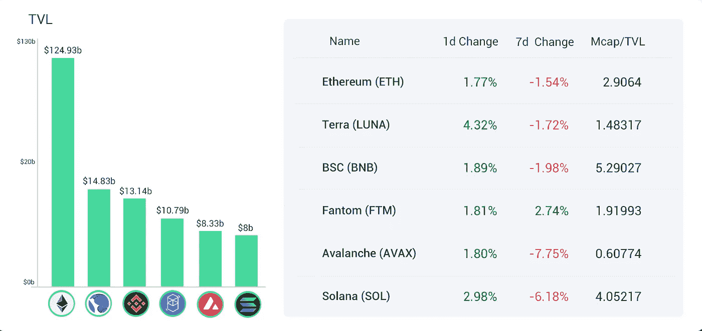
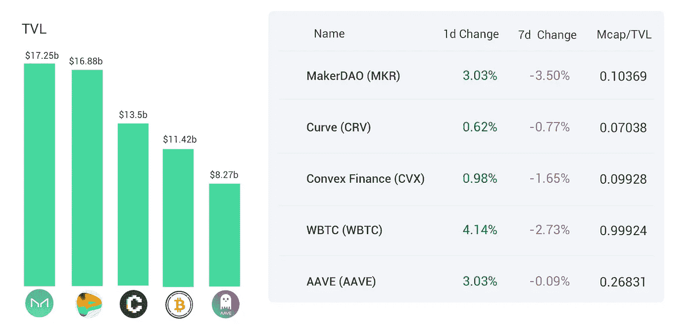
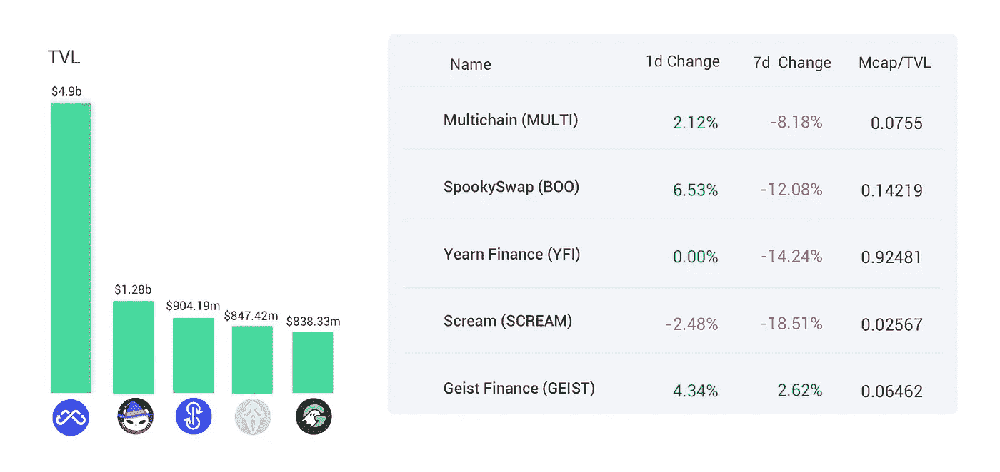
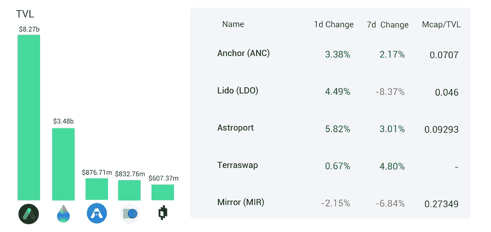
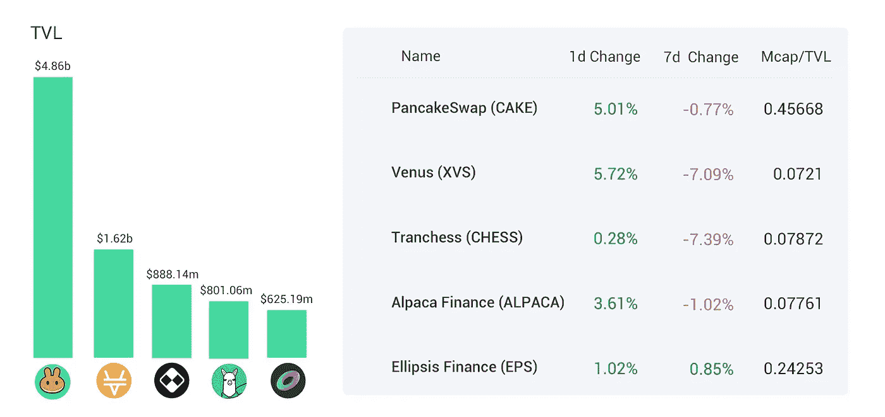
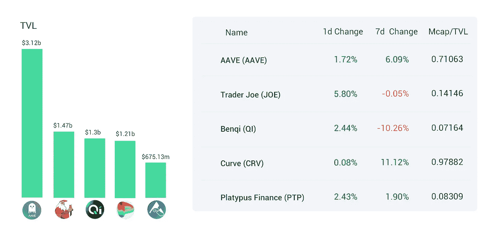
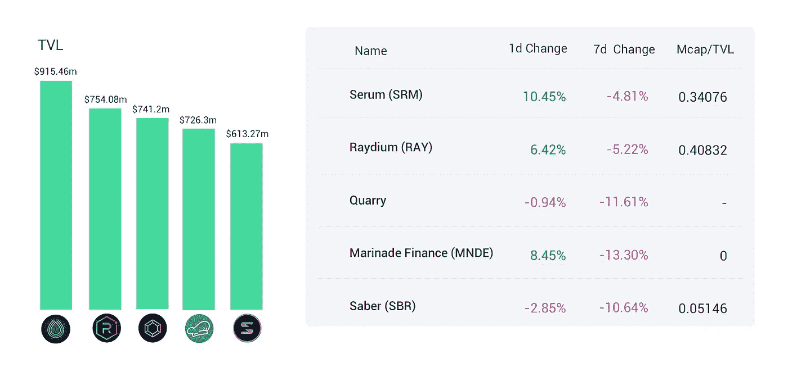
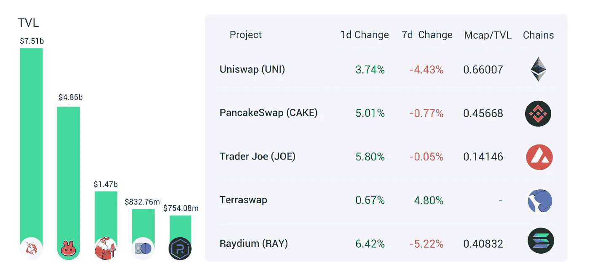
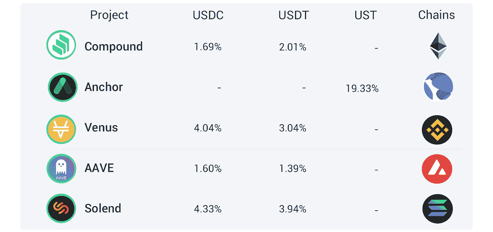

# 证券交易委员会对仙境的执法可能意味着对 DeFi 的麻烦；美国加密税收指南 2022

> 原文：<https://medium.com/coinmonks/defi-insight-sec-enforcement-against-wonderland-could-mean-trouble-for-defi-us-crypto-tax-81a07f835b66?source=collection_archive---------5----------------------->

## 2022 年 2 月 15 日

*今日 DeFi 数据&由 DeFi Insight 为您带来的新闻。*

**宏观趋势:**放大 ETFs CEO:你[想在通胀中拥有比特币](https://blockworks.co/amplify-etfs-ceo-you-want-to-own-bitcoin-amid-inflation/)

**TVL 走势:**[TVL 总量](https://defillama.com/)在过去 24 小时内上涨了 2.79%

**DEX Dynamics:**DEX 中涨幅最大的是 [Raydium](https://defillama.com/protocol/raydium) ，上涨 6.42%

**Stablecoin:** Acala 推出波尔卡多特-原生 stablecoin [aUSD](/acalanetwork/acala-launches-polkadots-native-stablecoin-ausd-a-decentralized-multi-collateral-stable-1b2efd029326)

# 最新消息

## 定义

▪ 🔔美国[秘密税](https://www.coindesk.com/learn/us-crypto-tax-guide-2022/)指南 2022

> 又到了一年中的这个时候，美国国税局(IRS)正从加密投资者那里寻找一磅肉。

RBI 副行长:禁止加密[‘最明智的选择’](https://cointelegraph.com/news/rbi-deputy-governor-banning-crypto-most-advisable-choice)

法国总统候选人:[我们必须支持加密货币](https://twitter.com/ZemmourEric/status/1493340014431944704)

放大交易所交易基金 CEO:你[想在通货膨胀中拥有比特币](https://blockworks.co/amplify-etfs-ceo-you-want-to-own-bitcoin-amid-inflation/)

比特币基地计划在 2022 年增加 2000 名产品、工程和设计员工

随着以太基金的好转，加密基金连续第四周出现资金流入

## 借出

DeFi Lending protocol[l mininterest](https://www.thestreet.com/press-releases/defi-lending-protocol-minterest-closes-successful-5-52m-sale-of-mnt-token-15909742)成功完成 552 万美元的 MNT 代币销售

*[Jet 协议](https://twitter.com/JetProtocol/status/1493231491945488388) :JetDAO/governance、JET airdrop 等

*[block fi](https://www.coindesk.com/business/2022/02/14/blockfi-moves-to-register-securities-product-with-sec/)向 SEC 注册借贷产品

## 互换

DeFi Technologies 在[法兰克福证券交易所](https://www.prnewswire.com/news-releases/defi-technologies-launches-valour-polkadot-and-cardano-etps-on-the-frankfurt-stock-exchange-301481449.html)推出 Valour Polkadot 和 Cardano ETPs

DARMA 资本推出 CFTC 监管的 [Filecoin 掉期产品](https://www.coindesk.com/business/2022/02/14/darma-capital-unveils-cftc-regulated-filecoin-swap-product/)

通过 [Nomad 和 Connext](https://evmos.blog/bridging-assets-to-evmos-with-nomad-and-connext-e8ec182145d5) 将资产连接到 Evmos

## 稳定币

Acala 推出波尔卡多特本地 stablecoin [aUSD](/acalanetwork/acala-launches-polkadots-native-stablecoin-ausd-a-decentralized-multi-collateral-stable-1b2efd029326)

*[d force](https://twitter.com/dForcenet/status/1493463852033265669?s=20&t=fcuxCKPxteci8uT1aMVNHg)—稳定账户风险参数更新

## 打桩

以太资本公司宣布追加 3800 万美元的以太坊赌注

## 协议

币安实验室宣布其孵化项目的第四季

*[曲线金融](https://twitter.com/CurveFinance/status/1493189161473486849)推出月光网

快船现在生活在乐观之中

*[live peer](https://www.binance.com/en/news/flash/6977156)完成向 Arbitrum 的迁移

*[Synthetix](https://blog.synthetix.io/the-polaris-release/)发布北极星版本更新

*[口袋网络](https://twitter.com/POKTnetwork/status/1493266818584227859)突破 3 万节点里程碑

*[01 交易所](https://01exchange.medium.com/01-exchange-implements-ethereum-as-collateral-7442658e6176)与虫洞合作实现以太坊作为抵押品

# 数据和分析

## 锁定的总价值(TVL)

## TVL 的六大连锁品牌

*哪些*链/协议*目前在其智能合同中存放了最多的资产？*

> TVL 的五大协议

> TVL 的五大协议

> TVL 的五大协议

> TVL 的五大协议

> **#雪崩**TVL 五大协议

> TVL 的五大协议

## 德克斯 TVL 排名

指数中涨幅最大的是 T21，上涨了 6.42%

## APY DeFi 贷款公司

*USDC:最高贷款人:索伦德，利率为 4.33% APY*

*USDT:最高贷款人:索伦德，利率为 3.94% APY*

# 深潜

💥**DeFi 什么时候真正去中心化？这个问题可能很快就会成为 SEC 调查的中心。**

 [## SEC 对仙境的执法可能意味着 DeFi 的麻烦

### 分散金融(DeFi)历史上最奇怪的故事之一，可能很快也会被列入最合法的…

www.coindesk.com](https://www.coindesk.com/policy/2022/02/14/sec-enforcement-against-wonderland-could-mean-trouble-for-defi/) 

一个 **值得信赖的资源，为一切事物定义**

> 一场回合:
> 
> 分散金融(DeFi)指的是从传统的中央金融系统向区块链促成的点对点金融系统的转变。
> 
> DeFi Insight 是顶级 DeFi 和加密新闻和更新的来源。
> 
> 提供的信息应被视为发展新闻，而不是投资建议。

> 加入 Coinmonks [电报频道](https://t.me/coincodecap)和 [Youtube 频道](https://www.youtube.com/c/coinmonks/videos)了解加密交易和投资

## 另外，阅读

*   [有哪些交易信号？](https://coincodecap.com/trading-signal) | [Bitstamp vs 比特币基地](https://coincodecap.com/bitstamp-coinbase) | [买索拉纳](https://coincodecap.com/buy-solana)
*   [ProfitFarmers 回顾](https://coincodecap.com/profitfarmers-review) | [如何使用 Cornix 交易机器人](https://coincodecap.com/cornix-trading-bot)
*   [十大最佳加密货币博客](https://coincodecap.com/best-cryptocurrency-blogs) | [YouHodler 评论](https://coincodecap.com/youhodler-review)
*   [iTop VPN 审查](https://coincodecap.com/itop-vpn-review) | [曼陀罗交易所审查](https://coincodecap.com/mandala-exchange-review)
*   [比特币基地 vs 瓦济克斯](https://coincodecap.com/coinbase-vs-wazirx) | [比特鲁点评](https://coincodecap.com/bitrue-review) | [波洛涅克斯 vs 比特鲁](https://coincodecap.com/poloniex-vs-bittrex)
*   [美国最佳加密交易机器人](https://coincodecap.com/crypto-trading-bots-in-the-us) | [变化回顾](https://coincodecap.com/changelly-review)
*   [A-Ads 审查](https://coincodecap.com/a-ads-review) | [Bingbon 审查](https://coincodecap.com/bingbon-review) | [Mudrex 投资](https://coincodecap.com/mudrex-invest-review-the-best-way-to-invest-in-crypto)
*   [最好的卡达诺钱包](https://coincodecap.com/best-cardano-wallets) | [Bingbon 副本交易](https://coincodecap.com/bingbon-copy-trading)
*   [氹欞侊贸易评论](https://coincodecap.com/anny-trade-review) | [Paybis 评论](https://coincodecap.com/paybis-review) | [Keevo 钱包评论](https://coincodecap.com/keevo-wallet-review)
*   [印度最佳 P2P 加密交易所](https://coincodecap.com/p2p-crypto-exchanges-in-india) | [柴犬钱包](https://coincodecap.com/baby-shiba-inu-wallets)