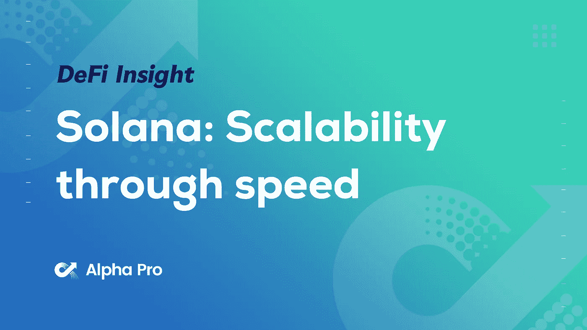
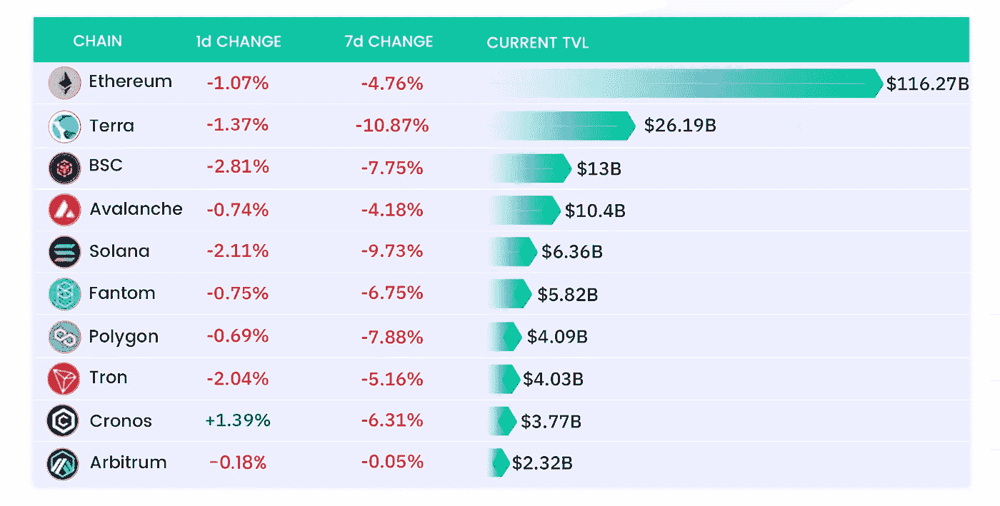
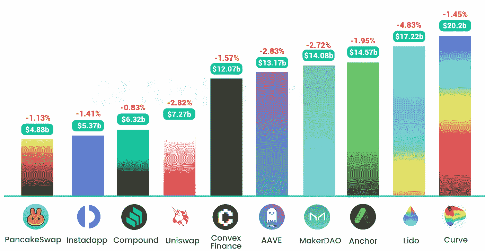
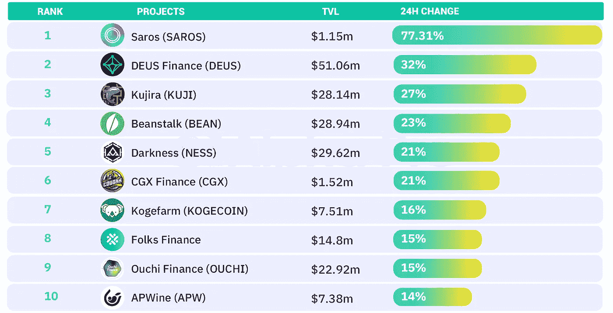
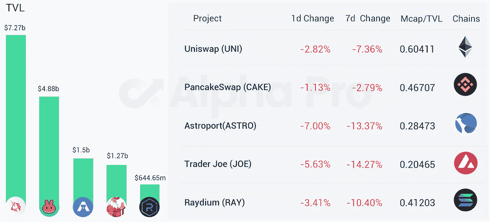
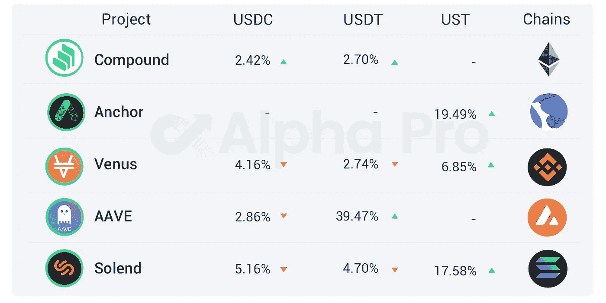

# DeFi Insight | Solana:通过速度实现可扩展性；STEPN 是下一个 Axie 吗？

> 原文：<https://medium.com/coinmonks/defi-insight-solana-scalability-through-speed-is-stepn-the-next-axie-335da5f39df5?source=collection_archive---------28----------------------->

## 2022 年 4 月 15 日

*今日 DeFi 数据&由 DeFi Insight 为您带来的新闻。*

> Solana 正在采取自己的方法来实现可扩展性，专注于实现与集中式系统相媲美的速度，同时从长远来看，不会放弃审查阻力和分散化。其高吞吐量网络吸引了开发商、投资者和用户的关注。黑客马拉松为开发人员在 Solana 上进行开发创造了肥沃的土壤，每一个新开发的应用都让我们离区块链驱动的世界更近了一步。Solana Pay 旨在将区块链带到大众面前，并为商家提供与客户互动的新方式。没有一条链是完美的，Solana 也有自己的问题，但考虑到这条链上构建的项目数量、用户数量以及团队推动区块链技术边界的承诺，这条链肯定值得关注。[南森 ](https://www.nansen.ai/research/solana-scalability-through-speed)

# 最新消息

## 热的

埃隆·马斯克说“推特的私密性应该由股东决定，而不是董事会”

SBF 提出了多种构建去中心化 Twitter 的建议

创始人提议与埃隆·马斯克一起建立一个去中心化的社交媒体平台

## 指标

1 英寸的网络扩展到了方顿

## 稳定币

**[**圈出**](https://beincrypto.com/circle-to-submit-banking-operation-application-imminently/?utm_source=twitter&utm_medium=embeded_automation&utm_campaign=news)**即将提交银行操作申请****

******[**奥林巴斯道**](https://www.coindesk.com/business/2022/04/14/olympusdao-co-founder-doxxed-lawsuit-claims-to-unmask-apollo/)**联合创始人 Doxxed？诉讼声称揭露“阿波罗”********

## ******钱包******

********[meta mask](https://docs.metamask.io/guide/snaps.html)推出 MetaMask Snaps，将支持比特币和更多区块链网络********

## ******投票******

********[**Arbitrum**](https://snapshot.org/#/arbitrum-odyssey.eth)**奥德赛投票移至快照，钱包余额大于 0.0002ETH 的账户有资格参与**********

## ******NFT******

********[志那都红豆的碎片化](https://twitter.com/AzukiOfficial/status/1514651681471930390)项目 Bobu“送 NFTs 上太空”的计划因故取消了********

********[Tezos](https://twitter.com/aleph_im/status/1514600829302411265)完成与 Aleph.im 的集成，为 NFTs 提供跨链的分散存储和计算网络服务********

********[阿联酋](https://www.emirates.com/media-centre/emirates-to-launch-nfts-and-experiences-in-the-metaverse)在元宇宙推出国家森林公园和体验********

******研究人员发现[罕见的](https://cointelegraph.com/news/researchers-find-security-flaw-in-rarible-users-could-have-lost-all-their-nfts)安全漏洞:用户可能会丢失所有的非功能性文件******

## ******基金******

******Symphony Digital 宣布其第一只基金以 4000 万美元的价格关闭******

********DeFi 平台 [Oasis.app](https://cointelegraph.com/press-releases/defi-platform-oasisapp-raises-6m-in-series-a-round-led-by-libertus) 在 Libertus 领投的 A 轮融资中融资 600 万美元********

********韩国智能合同审计平台 [Sooho.io](https://www.coindesk.com/business/2022/04/14/south-korean-smart-contract-auditing-platform-soohooio-raises-45m-series-a/) 融资 450 万美元********

********[面具网](https://masknetwork.medium.com/mask-network-receives-strategic-investment-from-hard-yaka-edcbf33cb12a)获得硬傅韵如战略投资********

********以太坊消息服务 [EPNS](/ethereum-push-notification-service/announcing-our-10-1-million-series-a-f9c029704f64) 完成 1010 万美元 A 轮融资，由 Jump Crypto 领投********

********[富爸爸穷爸爸作者](https://dailyhodl.com/2022/04/14/rich-dad-poor-dad-author-says-one-ethereum-competitor-is-just-getting-started-predicts-inflation-will-wipe-out-us-economy/)称一个以太坊的竞争者刚刚起步，预测通货膨胀将摧毁美国经济********

********2022 年全球最佳风险投资人[资本投资人](https://www.forbes.com/midas/?utm_medium=social&utm_source=ForbesMainTwitter&utm_campaign=socialflowForbesMainTwitter)********

## ******政策与法规******

********虚拟资产注册[服务商](https://www.bportugal.pt/en/page/registration-virtual-assets-service-providers-0)********

## ******|工具******

********,**链上钱包剖析器南森增加[索拉纳覆盖](https://www.coindesk.com/tech/2022/04/14/on-chain-wallet-profiler-nansen-adds-solana-coverage/)******

# ****数据和分析****

## ****TVL 增长排名前 10 的连锁店****

********

## ****最新 TVL 十大项目****

********

## ****过去 24 小时 TVL 变化的前 10 个项目****

********

## ****德克斯 TVL 排名****

****DEX 跌幅最大的是 [Astroport](https://defillama.com/protocol/astroport) ，下跌 7.00 **%******

********

## ****APY DeFi 贷款公司****

*****USDC:最高放贷:**[*索伦德*](https://solend.fi/dashboard)*5.18% APY******

******USDT:最高贷款利率:*[*AAVE*](https://app.aave.com/markets/)*39.47% APY******

**********

# *****深潜*****

*******[**STEPN**](https://lyceumgg.substack.com/p/is-stepn-the-next-axie?utm_source=%2Finbox&utm_medium=reader2&s=r)**是下一个 Axie 吗？*********

***** [## STEPN 是下一个 Axie 吗？

### 虽然通用汽车公司杜维廉的这句百年名言最多只是个比喻，但一款名为 STEPN 的应用程序现在承诺你将获得…

lyceumgg.substack.com](https://lyceumgg.substack.com/p/is-stepn-the-next-axie?utm_source=%2Finbox&utm_medium=reader2&s=r) 

**区块链** [**桥梁**](https://thedefiant.io/hackers-target-blockchain-bridges/) **如何成为黑客的首要目标**

 [## 区块链桥如何成为黑客的主要目标——挑衅

### 加密产业已经发展成为一个生态系统，将几个第一层(L1)区块链和第二层(L2)连接起来…

thedefiant.io](https://thedefiant.io/hackers-target-blockchain-bridges/) 

**[**戴蝶**](https://blog.bybit.com/en-US/post/will-dai-die-a-deep-dive-into-dai-the-3pool-and-the-4pool-bltef1bbcbe3f432d3f/) **？深入了解戴、3 号池和 4 号池****

** [## 戴会死吗？深入探讨戴、3 号池和 4 号池

### 本周我们将深入探讨戴的崛起，它是如何保持其联系汇率的，以及 pool 对戴的影响。更多关于本周的深度…

blog.bybit.com](https://blog.bybit.com/en-US/post/will-dai-die-a-deep-dive-into-dai-the-3pool-and-the-4pool-bltef1bbcbe3f432d3f/)** 

# **报告**

****·市场洞察力——**[**流动性去哪了**](https://members.delphidigital.io/reports/market-insights-whered-the-liquidity-go) **？**_ 德尔福数码**

****[**Arweave**](https://www.theblockresearch.com/arweave-a-technical-overview-140389)**:技术概述** _theblockresearch****

******层层发行 28:** [**近、远、远**](https://www.theblockresearch.com/layer-by-layer-issue-28-near-cosmos-and-solana-141891)**_ the block research******

********[**web 3 基础设施**](https://messari.io/article/web3-infrastructure-q1-22-revenue-report)**Q1 22 年营收报告 _messari**********

******一回合:******

****DeFi Insight 是顶级 DeFi 和加密新闻和更新的来源。****

******https://twitter.com/AlphaPro_io**❤[**t51】**](https://twitter.com/AlphaPro_io)****

******❤RSS:**[**https://medium.com/feed/@alphapro.project**](https://medium.com/feed/@alphapro.project)****

****提供的信息应被视为发展新闻，而不是投资建议。****

> ****加入 Coinmonks [电报频道](https://t.me/coincodecap)和 [Youtube 频道](https://www.youtube.com/c/coinmonks/videos)了解加密交易和投资****

# ****另外，阅读****

*   ****[Bookmap 点评](https://coincodecap.com/bookmap-review-2021-best-trading-software) | [美国 5 大最佳加密交易所](https://coincodecap.com/crypto-exchange-usa)****
*   ****最佳加密[硬件钱包](/coinmonks/hardware-wallets-dfa1211730c6) | [Bitbns 评论](/coinmonks/bitbns-review-38256a07e161)****
*   ****[新加坡十大最佳加密交易所](https://coincodecap.com/crypto-exchange-in-singapore) | [购买 AXS](https://coincodecap.com/buy-axs-token)****
*   ****[红狗赌场评论](https://coincodecap.com/red-dog-casino-review) | [Swyftx 评论](https://coincodecap.com/swyftx-review) | [CoinGate 评论](https://coincodecap.com/coingate-review)****
*   ****[投资印度的最佳密码](https://coincodecap.com/best-crypto-to-invest-in-india-in-2021)|[WazirX P2P](https://coincodecap.com/wazirx-p2p)|[Hi Dollar Review](https://coincodecap.com/hi-dollar-review)*********