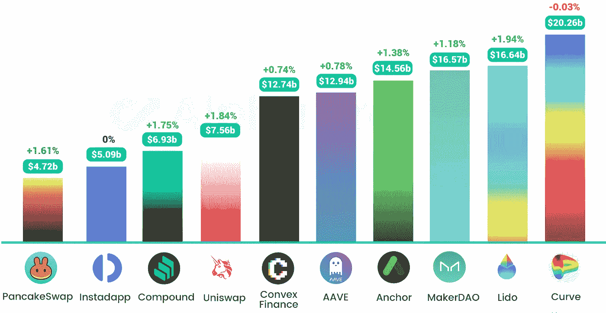

# DeFi Insight | Stargate Finance 在六天内吸引了 19 亿美元

> 原文：<https://medium.com/coinmonks/defi-insight-stargate-finance-attracts-1-9b-in-six-days-c2d3088a9c69?source=collection_archive---------18----------------------->

## 2022 年 3 月 24 日

*今日 DeFi 数据&由 DeFi Insight 为您带来的新闻。*

> Stargate Finance 是一个跨链协议，旨在帮助用户在不同的区块链之间转移资产，在推出不到一周的时间内，其总价值锁定(TVL)超过 19 亿美元。
> 
> Stargate 将自己推销为一种流动性传输协议，允许用户跨链交易本地资产，为分散金融(DeFi)用户提供在池中下注的选项，在池中以本地 Stargate token (STG)支付。
> 
> 快速增长的 TVL 很可能是因为“高达 26%的 APY”提供了稳定的农业货币存款。

# 最新消息

## 定义

印度提议的[秘密税](https://www.coindesk.com/policy/2022/03/23/indias-proposed-crypto-tax-rules-likely-to-become-law-thursday/)规则周四可能成为法律

欧盟将尝试基于区块链的股票、债券和[基金交易](https://www.coindesk.com/policy/2022/03/23/eu-set-to-experiment-with-blockchain-based-stock-bond-and-fund-trading/)

投资银行推出数字部门，旨在与大型公司竞争

## 贷款

锚协议将固定速率调整为半动态速率的提案通过

贸易巨头 [Jane Street](https://www.theblockcrypto.com/linked/138979/trading-giant-jane-street-backs-near-based-lending-protocol-in-new-funding-round) 在新一轮融资中支持近基础贷款协议

*[元素](https://mirror.xyz/0x3fcAf7DDf64E6e109B1e2A5CC17875D4a5993F39/pFib_X4fHJTL5pwLfXRMipGgE11B3z178wVSIes9yNM)的 DAO:呼吁代表&治理指导委员会成员

Union Finance 推出治理令牌 [UNION](/union-finance/intro-to-union-token-and-dao-d6040e0e7a8b) ，2%用于空投

## 桥梁

星门金融在六天内吸引了[19 亿美元](https://cointelegraph.com/news/stargate-finance-attracts-1-9b-in-six-days)

## 打桩

[火箭池](https://twitter.com/Rocket_Pool/status/1506519957986758659)节点佣金现在是固定的 15%

比特币基地扩大赌注服务，将 [Cardano](https://blog.coinbase.com/coinbase-expands-staking-offerings-to-include-cardano-e5cb35f7fb0e) 包括在内

## 稳定币

**[Acala](https://www.theblockcrypto.com/linked/139024/acala-announces-250-million-fund-to-fuel-adoption-of-ausd-stablecoin-on-polkadot?utm_source=twitter&utm_medium=social)宣布投资 2.5 亿美元，推动波尔卡多特采用 [aUSD stablecoin](https://www.theblockcrypto.com/linked/139024/acala-announces-250-million-fund-to-fuel-adoption-of-ausd-stablecoin-on-polkadot?utm_source=twitter&utm_medium=social)**

****Jump Trading 发布 [Terra](https://agora.terra.money/t/bitcoin-reserve-pool/5259) 治理提案，提议 LFG 启动 BTC 储备池以确保 UST 和 BTC 挂钩****

****ANZ 成为首家铸造稳定硬币的澳大利亚银行****

******[one ring](/oneringfinance/onering-official-reimbursement-plan-c7f90fabbadb)公务报销计划******

## ******|令牌******

********南韩第二大企业集团发行自己的[加密货币](https://forkast.news/headlines/south-korea-conglomerate-cryptocurrency/)********

## ******NFT******

******PUBG 开发商 Krafton Seals 与 Solana Lab 达成交易******

********、** ShowMe 与[月光网络](https://mirror.xyz/showmenft.eth/bvmGb9s0BSpN9lZbbLDWvFuYnIoFA_Z3u7WS5GpAbPE)集成******

****NFT 交易平台 [Nifty Gateway](https://twitter.com/niftygateway/status/1506307610173227011) 将于 4 月 5 日支持钱包间的 NFT 转账****

****音乐制作人提姆巴兰宣布投资宇迦实验室****

****匿名买家花费 [235 ETH](https://etherscan.io/tx/0xeb5015c947514de5b33d46c0606188fa5cd35215ff00d1f960f9d6b90489ef6c) 购买 10 台 MAYC 系列 NFT****

******时间:第一期— [维塔利克·布特林](https://twitter.com/timepieces/status/1506806057015943181?s=20&t=Rrf0hU6k_0N4CE1BedBhIg)******

# ******数据和分析******

## ******TVL 和 ATH 排名前六的连锁酒店对比******

************

******[https://defillama.com/](https://defillama.com/)******

## ******TVL 增长排名前 10 的连锁店******

************

******[https://defillama.com/chains](https://defillama.com/chains)******

## ******最新 TVL 十大项目******

************

******[https://defillama.com/](https://defillama.com/)******

## ******过去 24 小时 TVL 变化的前 10 个项目******

************

******[https://defillama.com/](https://defillama.com/)******

## ******德克斯 TVL 排名******

******指数中涨幅最大的是[瑞迪](https://defillama.com/protocol/raydium)，上涨 3.24 **%********

********

****[https://defillama.com/protocol/raydium](https://defillama.com/protocol/raydium)****

## ****APY DeFi 贷款公司****

*****USDC:最高贷款利率:* [*索伦德*](https://solend.fi/dashboard)*4.71% APY*****

*****USDT:最高贷款利率:* [*索伦德*](https://solend.fi/dashboard)*5.59% APY*****

********

# ****深潜****

******如何负责任地** [**猿**](https://newsletter.banklesshq.com/p/how-to-ape-responsibly?s=r)****

****** [## 如何负责任地模仿

### 亲爱的无银行国家，每个人都是猩猩。模仿意味着购买加密资产，而不需要太多…

newsletter.banklesshq.com](https://newsletter.banklesshq.com/p/how-to-ape-responsibly?s=r) 

**[**的分解注意**](https://theknower.substack.com/p/the-decomposition-of-attention?s=r)**

** [## 注意力的分解

### 首先我要感谢@ABTestingalpha 和@Galois_Capital 激励我写这篇文章。我在……

theknower.substack.com](https://theknower.substack.com/p/the-decomposition-of-attention?s=r)** 

# **报告**

****[**炼金术**](https://messari.io/article/the-alchemy-of-alchemix) **@M** 艾萨里****

> ****Alchemix 是一种信贷系统，其运作方式类似于部分准备金银行系统。Alchemix 协议的个人用户承担 DeFi 内银行的角色。
> 该协议通过降低用户的机会成本来激励 DeFi 的全市场流动性。核算 Alchemix 降低的机会成本会改变其系统内资金的时间价值。
> Alchemix V2 提供了一个灵活的可组合平台，可用于其他 DeFi 方案。值得注意的 V2 升级包括扩大抵押品类型和收益生成策略，以及委托信贷功能。****

******MOBOX 的不可思议的崛起:** [**NFT 农夫**](https://dappradar.com/blog/the-incredible-rise-of-mobox-nft-farmer) **@Dappradar******

> ****玩赚游戏和与 DeFi 和 NFT 机制交织在一起的游戏的兴起已经变得非常流行，MOBOX NFT 农民是冉冉升起的明星之一。这些 dapps 吸引了创纪录数量的用户，但它们也吸引了那些不太了解加密和区块链的用户，这些用户想进入 web3。****

****一场 **回合:******

****DeFi Insight 是顶级 DeFi 和加密新闻和更新的来源。****

******https://twitter.com/AlphaPro_io 推特:******

********❤RSS:**[**https://medium.com/feed/@alphapro.project**](https://medium.com/feed/@alphapro.project)******

****提供的信息应被视为发展新闻，而不是投资建议。****

> ****加入 Coinmonks [电报频道](https://t.me/coincodecap)和 [Youtube 频道](https://www.youtube.com/c/coinmonks/videos)了解加密交易和投资****

# ****另外，阅读****

*   ****[5 款最佳加密交易终端](https://coincodecap.com/crypto-trading-terminals) | [最佳 DeFi 应用](https://coincodecap.com/best-defi-apps)****
*   ****[在美国如何使用 BitMEX？](https://coincodecap.com/use-bitmex-in-usa) | [BitMEX 评论](https://coincodecap.com/bitmex-review)****
*   ****[最佳期货交易信号](https://coincodecap.com/futures-trading-signals) | [流动性交易所评论](https://coincodecap.com/liquid-exchange-review)****
*   ****[南非的加密交易所](https://coincodecap.com/crypto-exchanges-in-south-africa) | [BitMEX 加密信号](https://coincodecap.com/bitmex-crypto-signals)****
*   ****[MoonXBT 副本交易](https://coincodecap.com/moonxbt-copy-trading) | [阿联酋的加密钱包](https://coincodecap.com/crypto-wallets-in-uae)****
*   ****[雷米塔诺评论](https://coincodecap.com/remitano-review)|[1 inch 协议指南](https://coincodecap.com/1inch) | [购买 Floki](https://coincodecap.com/buy-floki-inu-token)**********