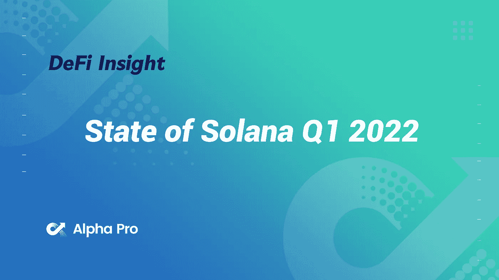
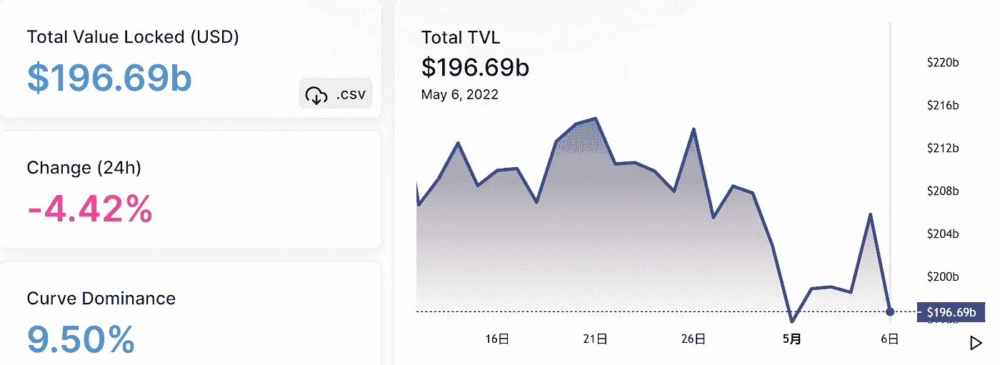
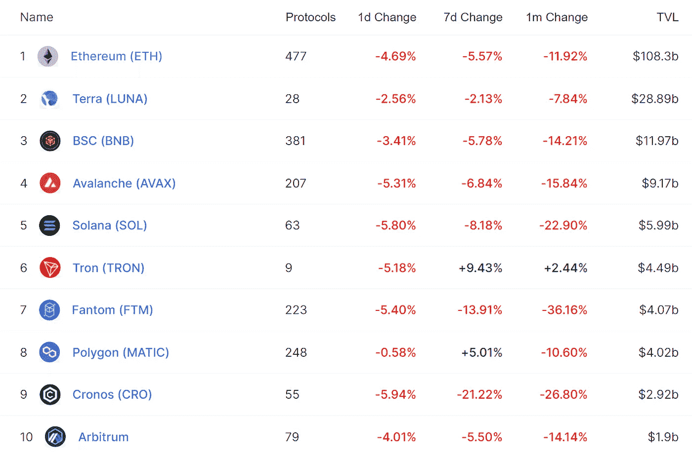
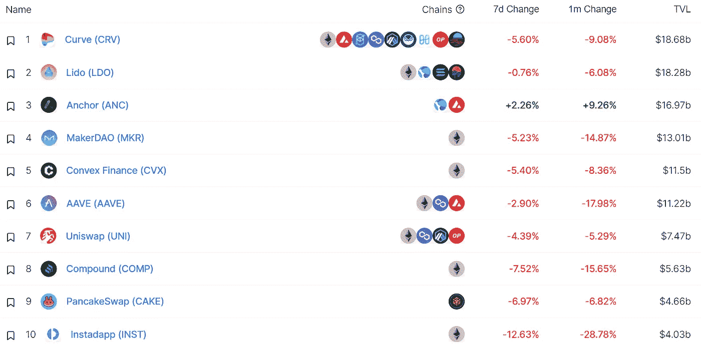
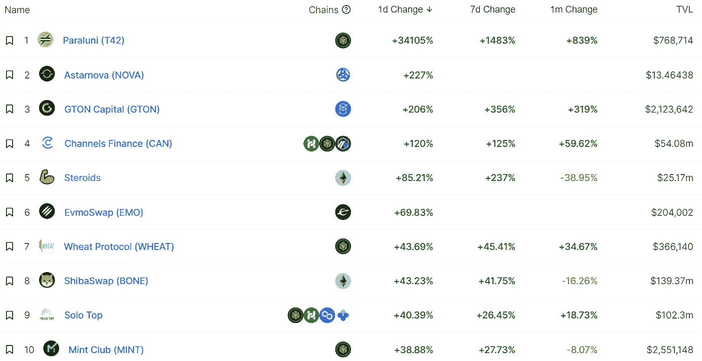
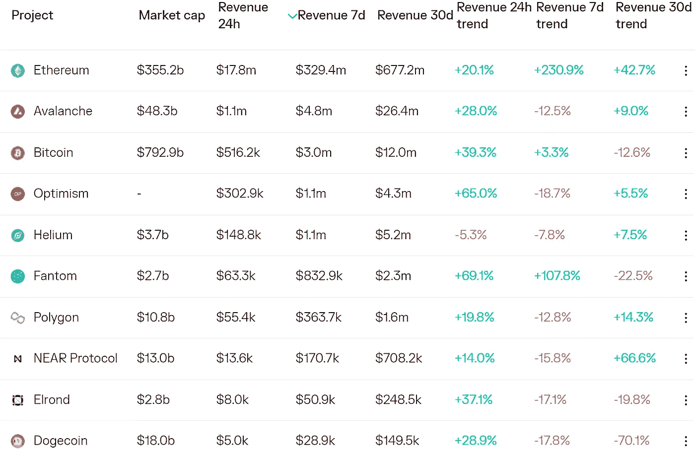
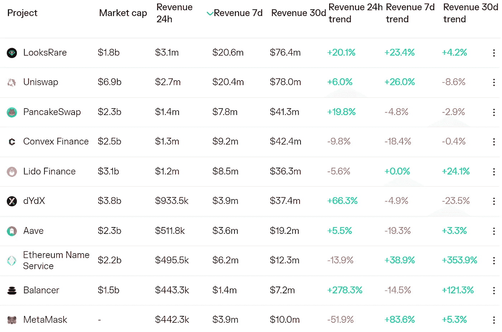
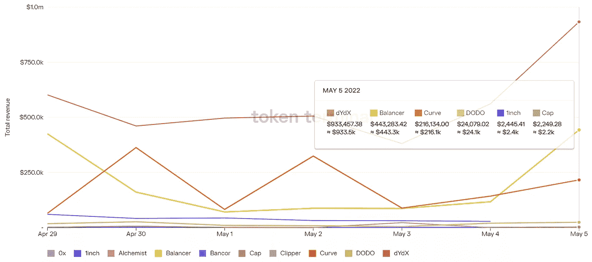

# DeFi Insight |索拉纳 Q1 州 2022

> 原文：<https://medium.com/coinmonks/defi-insight-state-of-solana-q1-2022-6a51330bc7ee?source=collection_archive---------29----------------------->

2022 年 5 月 6 日

*今日 DeFi 数据&由 DeFi Insight 为您带来的新闻。*

> *"* 本季度，Solana 在网络使用、开发人员活动、网络基础设施和整体生态系统方面持续增长。
> Solana 还经历了网络性能挑战和财务业绩下滑。
> 在 2 月份利用虫洞桥之后，整个季度出现了更多网络性能下降的情况。
> 到本季度末，Solana 成为二级 NFT 销量第二大的协议，仅次于以太坊。
> Solana 的增长战略以改善用户访问和 UX 为中心，寻求战略投资和合作伙伴，并扩展到几个新兴领域。
> 核心平台优化和霓虹 EVM 层的重大技术进步即将到来。*“@*[*梅萨里*](https://messari.io/article/state-of-solana-q1-2022)

# 最新消息

## 贷款

**、** Alchemix Fantom [发射](https://alchemixfi.medium.com/alchemix-fantom-launch-c31b4f06fc2b)

## 指标

**[曲线金融](https://www.coindesk.com/markets/2022/05/05/curve-finance-integrates-with-nears-aurora-network/)与 Near 的极光网整合**

**基于 Evmos 宣布的私下出售和 IDO**

****/**Cronos economic DEX[MM . Finance](/@MMFinance/dns-hi-jacking-post-mortem-compensation-3e2b5bb21183)遭遇前端攻击，损失 200 多万美元**

****[范式](https://www.paradigm.xyz/2022/05/the-dominance-of-uniswap-v3-liquidity)发布 Uniswap V3 以太坊对深度对比分析****

## ****稳定币****

******[Ape 金融](https://twitter.com/apedotfinance/status/1522420916340199424)宣布推出 Ape 支持的 apeUSD******

## ******交叉链******

********Hop 协议正式公布 native Token [HOP](https://twitter.com/HopProtocol/status/1522284534598967300?s=20&t=X6M-Jm4Z7GlO7mc9dolLjw) ，并已开启 Hop 空投查询页面********

## ******|选项******

********期权流动性聚集协议多项式协议[推出](https://earn.polynomial.fi/)比特币期权金库********

## ******保险******

********雪崩生态保险协议发布[视频](https://degis.medium.com/income-sharing-tutorial-91619e5da8ca)********

## ******支付******

********/**[Solana Pay](https://solana.com/news/solana-pay-transaction-requests-bring-on-chain-interactivity-to-the-off-chain-world)交易请求为链外世界带来了链上互动******

## ****政策与法规****

****法国警告说，NFT 证券发行者可能必须根据欧盟的 MiCA 规则进行集中和注册****

## ****鲸鱼****

******[LFG](https://twitter.com/LFG_org/status/1522234947070689280):在 BTC 购买了约 15 亿美元，目前是第七大股东******

## ******投资组合******

********[介绍](/zapper-protocol/introducing-zapper-studio-9dfd2d506bde) Zapper 工作室********

## ******NFT******

******OpenSea 发布 Stream API 的测试版******

******比特币基地的 NFT 市场在对公众开放的第一天就增加了不到 150 个用户******

********NFT 市场[仿植物怪兽佐拉](https://www.theblockcrypto.com/linked/145358/nft-marketplace-zora-raises-50-million-in-round-led-by-haun-ventures)融资 5000 万美元，由 Haun Ventures 领投********

********NFT 交易活动[在 2021 年爆发式增长后，2022 年趋于稳定](https://blog.chainalysis.com/reports/chainalysis-web3-report-preview-nfts/?utm_campaign=twitter&utm_source=OrganicSocial&utm_content=Thread)********

******NFT 游戏公司[将于 6 月 2 日举行首次土地拍卖](https://illuvium.medium.com/45-land-sale-commences-june-2nd-84f0ed62359c)******

## ******基金******

********[KoinBasket](https://forkast.news/headlines/koinbasket-raises-2-mln-from-investors/)从全球知名投资者那里筹集了 200 万美元********

********密码交易初创公司 Amber 寻求[价值 100 亿美元的融资](https://www.bloomberg.com/news/articles/2022-05-05/crypto-trading-startup-amber-seeks-funding-at-10-billion-value)********

********,**早期 Wyre Backer 为“中等增长”加密技术推出了2 亿美元的基金******

# ****数据和分析****

## ****锁定的总价值(TVL)****

****目前全网 DeFi 总锁定量为 1966.9 亿美元，24 小时下降 4.42%。****

********

## ****TVL 评出的十大连锁酒店****

********

## ****|最新 TVL 十大项目****

********

## ****|过去 24 小时内 TVL 增长的前 10 个项目****

********

## ****协议收入****

## ****|累计总收入最高的项目(24H)_ 区块链(L1)****

********

## ****|累计总收入最高的项目(24H) _Dapps(L2)****

********

## ****|前 10 大交易所的每日收入****

********

## ****|十大贷款协议的每日收入****

********

# ****深潜****

******[**投资加密货币要注意的事情**](https://www.nansen.ai/research/things-to-look-out-for-when-investing-in-cryptocurrencies)******

****** [## 投资加密货币时需要注意的事项

### 在本文中，我们将分解关键因素和衡量标准，以便在对加密产品进行尽职调查时加以注意

www.nansen.ai](https://www.nansen.ai/research/things-to-look-out-for-when-investing-in-cryptocurrencies) 

**NFT**[**借贷场景**](https://metaversal.banklesshq.com/p/nft-lending-?utm_source=%2Finbox&utm_medium=reader2&s=r)

 [## NFT 贷款🔥

### 亲爱的无银行国家，本周早些时候，我写了 NFT 生态系统的某些部分最近是如何激增的。在…

metaversal.banklesshq.com](https://metaversal.banklesshq.com/p/nft-lending-?utm_source=%2Finbox&utm_medium=reader2&s=r) 

**稳定的战争** [**战争**](https://newsletter.banklesshq.com/p/the-stablecoin-wars-5c4?s=r)

 [## Stablecoin 战争！

### 谁赢了？谁输了？这是我们的稳定币排名

newsletter.banklesshq.com](https://newsletter.banklesshq.com/p/the-stablecoin-wars-5c4?s=r) 

**[**资本结构**](https://dirtroads.substack.com/p/-38-capital-structures-for-stablecoin?s=r) **稳定资本协议(二):融资剖析****

** [## # 38 |融资剖析

### 当我坐下来写《稳定币协议的资本结构:西斯的复仇》时，我不能…

dirtroads.substack.com](https://dirtroads.substack.com/p/-38-capital-structures-for-stablecoin?s=r)** 

# **报告**

****[**乐观值**](https://messari.io/article/the-value-of-optimism)**_ 梅萨里******

> ******乐观空投和生态系统激励计划将开启以太坊扩展解决方案的新时代。
> 永久协议、Uniswap 和 Synthetix 是乐观上最大的应用，主导交易活动和 TVL。
> 网络通过其定序器产生收入。OP 令牌持有者与市民之家共享治理权，但保持对网络的足够控制，以产生价值。
> 根据我们的估值模型，乐观应该是上市时市值约 90 亿美元的前 20 大加密资产。
> 乐观空投已经宣布，L2 战争已经开始。******

********[**STEPN**](https://members.delphidigital.io/reports/stepn-sprinting-away)**冲刺而去** _delphidigital********

******关于:******

****DeFi Insight 是顶级 DeFi 和加密新闻和更新的来源。****

******https://twitter.com/AlphaPro_io**❤[t27】](https://twitter.com/AlphaPro_io)****

******❤RSS:**[**https://medium.com/feed/@alphapro.project**](https://medium.com/feed/@alphapro.project)****

****提供的信息应被视为发展新闻，而不是投资建议。****

> ****加入 Coinmonks [电报频道](https://t.me/coincodecap)和 [Youtube 频道](https://www.youtube.com/c/coinmonks/videos)了解加密交易和投资****

# ****另外，阅读****

*   ****[3 商业评论](/coinmonks/3commas-review-an-excellent-crypto-trading-bot-2020-1313a58bec92) | [Pionex 评论](https://coincodecap.com/pionex-review-exchange-with-crypto-trading-bot) | [Coinrule 评论](/coinmonks/coinrule-review-2021-a-beginner-friendly-crypto-trading-bot-daf0504848ba)****
*   ****[莱杰 vs n rave](/coinmonks/ledger-vs-ngrave-zero-7e40f0c1d694)|[莱杰 nano s vs x](/coinmonks/ledger-nano-s-vs-x-battery-hardware-price-storage-59a6663fe3b0) | [币安评论](/coinmonks/binance-review-ee10d3bf3b6e)****
*   ****[Bybit 交易所评论](/coinmonks/bybit-exchange-review-dbd570019b71) | [Bityard 评论](https://coincodecap.com/bityard-reivew) | [Jet-Bot 评论](https://coincodecap.com/jet-bot-review)****
*   ****[3 commas vs crypto hopper](/coinmonks/3commas-vs-pionex-vs-cryptohopper-best-crypto-bot-6a98d2baa203)|[赚取加密利息](/coinmonks/earn-crypto-interest-b10b810fdda3)****
*   ****最好的比特币[硬件钱包](/coinmonks/hardware-wallets-dfa1211730c6) | [BitBox02 回顾](/coinmonks/bitbox02-review-your-swiss-bitcoin-hardware-wallet-c36c88fff29)****
*   ****[block fi vs Celsius](/coinmonks/blockfi-vs-celsius-vs-hodlnaut-8a1cc8c26630)|[Hodlnaut 审核](/coinmonks/hodlnaut-review-best-way-to-hodl-is-to-earn-interest-on-your-bitcoin-6658a8c19edf) | [KuCoin 审核](https://coincodecap.com/kucoin-review)**********