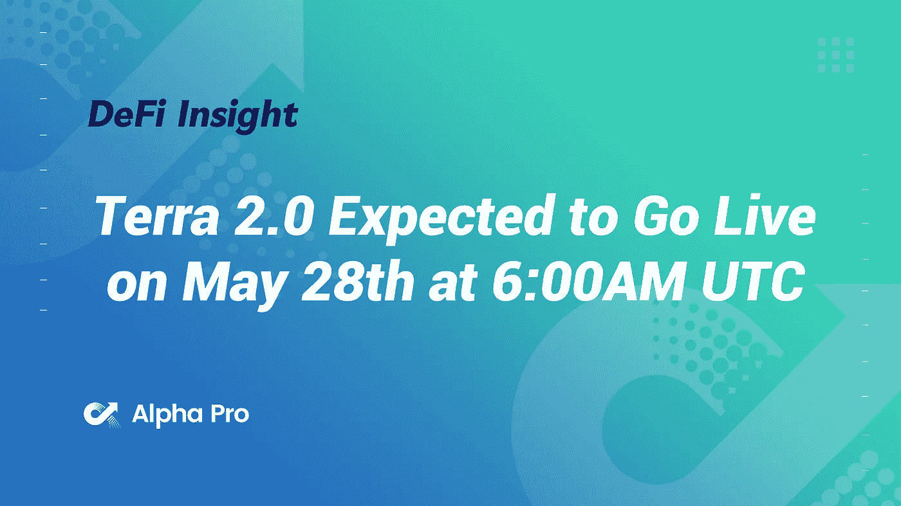
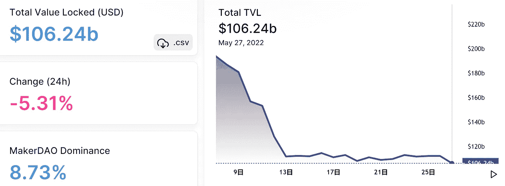
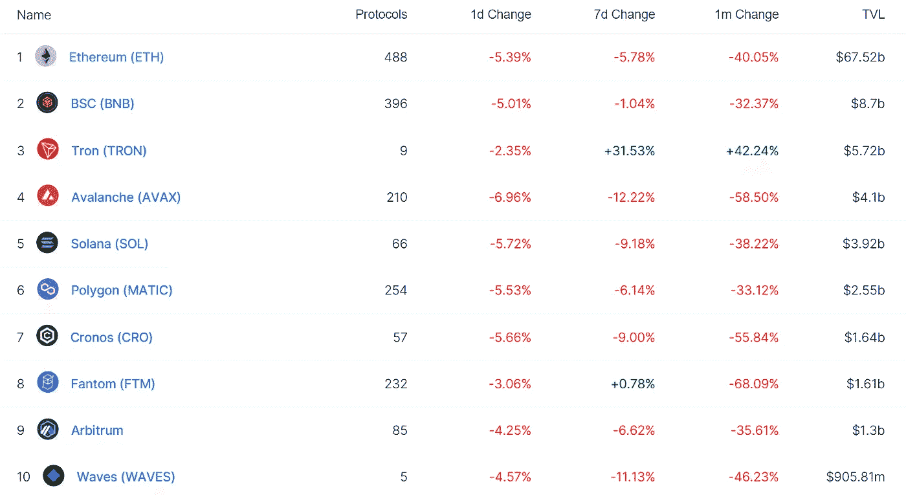
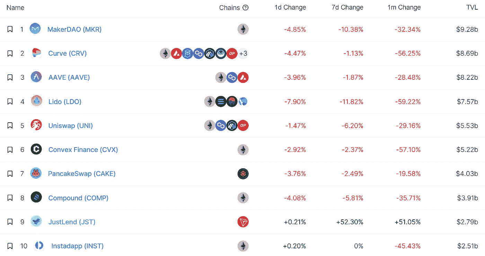
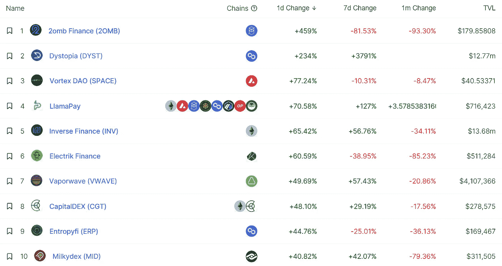
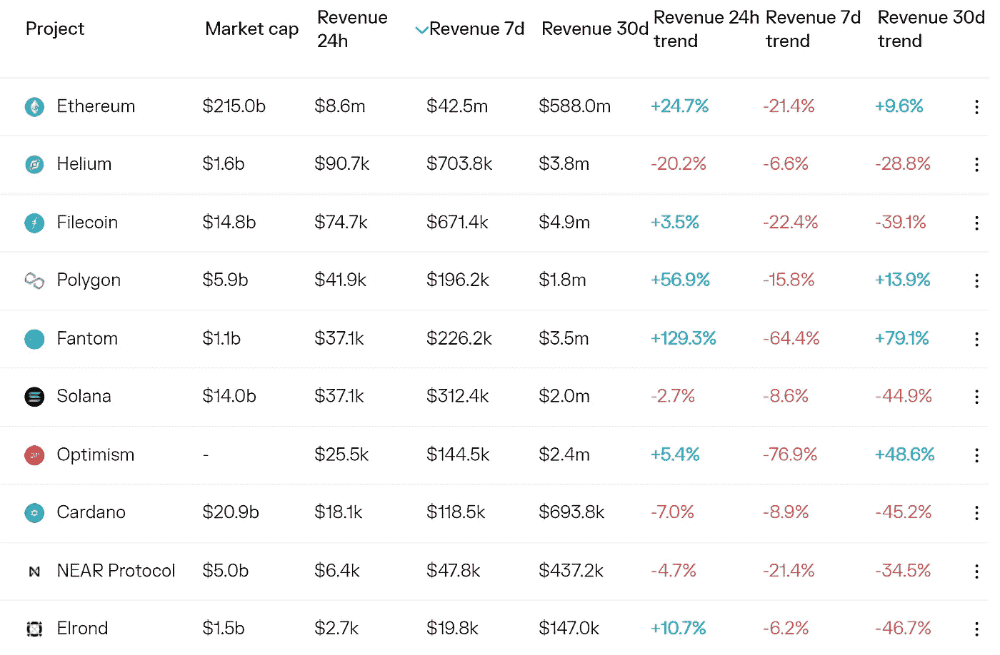
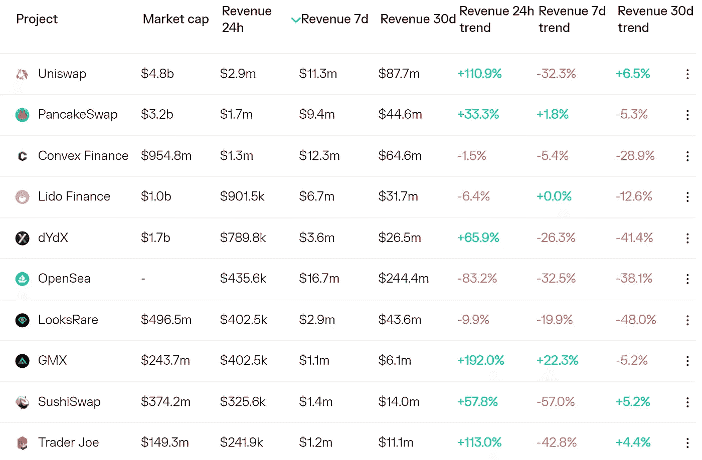
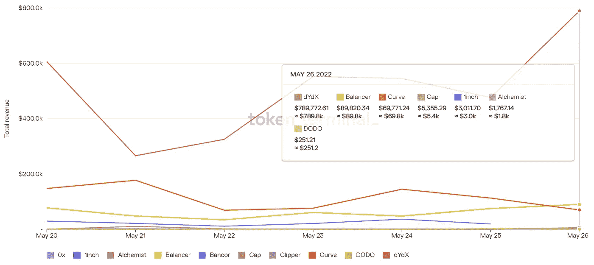
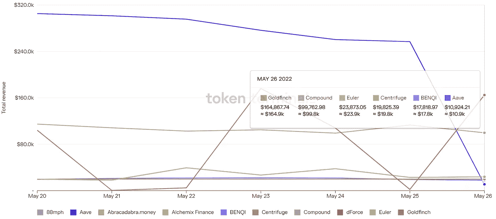

# DeFi Insight |Terra 2.0 预计将于世界协调时 5 月 28 日上午 6:00 上线

> 原文：<https://medium.com/coinmonks/defi-insight-terra-2-0-expected-to-go-live-on-may-28th-at-6-00am-utc-3988adac659?source=collection_archive---------49----------------------->

2022 年 5 月 27 日

*今日 DeFi 数据&由 DeFi Insight 为您带来的新闻*

> *"* 据说新链的第一个区块将在绝大多数互联验证器同时运行后产生。当网络上线时，Terra 站、Terra Finder 和 Terra Observer 都将拥有完整的功能。*“@*[*来源*](https://twitter.com/terra_money/status/1530047587709067264)

# 最新消息

## 贷款

**[摩根大通](https://www.bloomberg.com/news/articles/2022-05-26/jpmorgan-finds-new-use-for-blockchain-in-collateral-settlement)发现区块链在交易和借贷中的新用途**

## **指标**

****[赛车场](https://twitter.com/VelodromeFi/status/1529966504883675147)将于 5 月 31 日乐观推出****

******/**Terra 的 DEX 和 NFT 市场 [Loop Finance](https://twitter.com/loop_finance/status/1529861044172075008) 迁移到 Juno Network****

## ****外汇****

****币安加入近地天体委员会，启动与 N3 基础设施的紧密整合****

******[霍比](https://www.coindesk.com/business/2022/05/26/huobi-acquires-latin-american-crypto-exchange-bitex/)收购拉美密码交易所 Bitex******

## ******第二层******

********[Bosonic](https://www.prnewswire.com/news-releases/bosonic-launches-enterprise-solutions-for-digital-assets-clearing-and-settlement-301556153.html)推出数字资产清算和结算企业解决方案********

## ******|令牌******

******乐观主义的 [$OP Token](https://thedefiant.io/op-airdrop-speculation/) 可能即将到来******

********、**、[九州币](https://bitcoinist.com/kyuubi-token-announces-first-of-its-kind-3-1-altcoin-contract/) Token 宣布首张 3-1 替代币合约******

## ****拍卖****

******2022 年欧洲歌唱大赛获奖者为乌克兰慈善拍卖发布 NFT******

## ******提议******

********[Jet 协议](https://govern.jetassociation.org/#/proposal/GbDZ435wGwiG8TkKKQohRFY5PXi3j2hboYZNTQHjLubm/Should-Jet%20Prot?programId=JPGov2SBA6f7XSJF5R4Si5jEJekGiyrwP2m7gSEqLUs)是否应该将 USDC 列为担保类型？********

## ******|警报******

********索拉纳黑客世界获得[诈骗](https://cryptoslate.com/world-of-solana-hacker-gets-scammed-in-community-sting/)社区刺********

## ******鲸鱼******

******价格下跌时，XRP 鲸鱼一直在悄悄地积累代币******

## ******政策与法规******

********[泰国央行](https://beincrypto.com/thailand-central-bank-not-rushing-to-deploy-cbdc-crypto-vat-gets-delayed/)不急于部署 CBDC，加密增值税被推迟********

******参议员起草法案，禁止在美国的移动应用程序中使用数字元******

## ******NFT******

******随着销售持续低迷，OpenSea 重新设计了其 NFT 商店的一部分******

## ******基金******

********、**、[方舟投资](https://forkast.news/headlines/ark-investment-21shares-spot-bitcoin-etf/?utm_source=blockworks-research)、21 股再一次尝试现货比特币 ETF******

## ****观点****

****资深比特币创造者丹·赫尔德表示，今年的“加密冬天”不会像以往那样严酷****

******,**[Vitalik](https://cointelegraph.com/news/vitalik-how-to-create-algo-stablecoins-that-don-t-turn-into-ponzis-or-collapse):如何创建不会变成 ponzis 或崩溃的 algo stablecoins****

****CZ 在送披萨前打开了 AMA 的红迪网****

****欧洲央行行长兼比特币评论家克里斯汀·拉加德称她的儿子从事加密交易****

# ****数据和分析****

## ****锁定的总价值(TVL)****

****目前全网 DeFi 总锁定量为 1062.4 亿美元，24 小时下降 5.31%。****

********

## ****TVL 评出的十大连锁酒店****

********

## ****|最新 TVL 十大项目****

********

## ****|过去 24 小时内 TVL 增长的前 10 个项目****

********

## ****协议收入****

## ****|累计总收入最高的项目(24H)_ 区块链(L1)****

********

## ****|累计总收入最高的项目(24H) _Dapps (L2)****

********

## ****|前 10 大交易所的每日收入****

********

## ****|十大贷款协议的每日收入****

********

# ****深潜****

******[**工作证明与股权证明**](https://bitcoinmagazine.com/technical/proof-of-work-vs-proof-of-stake-why-bitcoin-wont-change) **:为什么比特币不会变********

**** [## 工作证明与利益证明:为什么比特币不会改变

### 比特币的共识机制，即工作证明(PoW)，往往会在社会上带来分裂的意见。有些人认为…

bitcoinmagazine.com](https://bitcoinmagazine.com/technical/proof-of-work-vs-proof-of-stake-why-bitcoin-wont-change) 

**对比** [**2022 年的市场崩盘**](https://thedefiant.io/dappradar-winter-is-coming/) **到 2018 年的隐秘寒冬**

 [## 对比 2022 年的市场崩溃和 2018 年的秘密冬天-挑衅

### 密码行业面临着其年轻历史上最关键的时期之一。自从达到一个…

thedefiant.io](https://thedefiant.io/dappradar-winter-is-coming/) 

**[**橛子**](https://doseofdefi.substack.com/p/pegs-what-are-they-good-for?utm_source=%2Finbox&utm_medium=reader2&s=r) **:它们有什么用？****

** [## 佩格斯:它们有什么用？

### 围绕 UST 死亡螺旋的呼声仍在 crypto 中回响。至少，这一传奇将削弱风险偏好，而且…

doseofdefi.substack.com](https://doseofdefi.substack.com/p/pegs-what-are-they-good-for?utm_source=%2Finbox&utm_medium=reader2&s=r)** 

# **报告**

****[**系绳**](https://coinshares.com/research/is-tether-a-systemic-risk-to-the-crypto-market) **是否对加密市场构成系统性风险？** _coinshares****

> ****我们看看支持 Tether 的 USDT 稳定币的储备，并将其与 DeFi(分散金融)和 TradFi(传统金融)中的其他类似持有进行比较。TerraUSD (UST)的崩溃增加了对所有稳定资本的怀疑，无论是算法上的还是非算法上的，并提出了新的问题，即哪些储备(如果有的话)实际上在支持这些稳定资本。投资者和用户以及政治家和监管机构都表达了这些担忧。许多人认为，稳定的消费对消费者和整体经济都构成了风险。****

******[**搭便车**](https://members.delphidigital.io/reports/the-hitchhikers-guide-to-ethereum) **以太坊指南** _delphidigital******

******[**达普拉达元宇宙报道#1**](https://dappradar.com/blog/dappradar-metaverse-report-1-virtual-worlds-soulbound-tokens-and-more) **—虚拟世界、灵魂绑定令牌以及更多**_ 达普拉达******

******[**汇总**](https://www.theblockresearch.com/an-updated-view-of-rollups-development-146733) **开发**_ 区块研究的更新视图******

******[**UMA**](https://research.thetie.io/universal-market-access-report/)**:现代激励结构** _thetieto******

******关于:******

****DeFi Insight 是顶级 DeFi 和加密新闻和更新的来源。****

******https://twitter.com/AlphaPro_io 推特:******

********❤RSS:**[**https://medium.com/feed/@alphapro.project**](https://medium.com/feed/@alphapro.project)******

****提供的信息应被视为发展新闻，而不是投资建议。****

> ****加入 Coinmonks [电报频道](https://t.me/coincodecap)和 [Youtube 频道](https://www.youtube.com/c/coinmonks/videos)了解加密交易和投资****

# ****另外，阅读****

*   ****[Stormgain 评论](https://coincodecap.com/stormgain-review) | [Probit 评论](https://coincodecap.com/probit-review) | [北海巨妖评论](/coinmonks/kraken-review-6165fc1056ac)****
*   ****[如何在势不可挡的域名上购买域名？](https://coincodecap.com/buy-domain-on-unstoppable-domains)****
*   ****[印度的加密税](https://coincodecap.com/crypto-tax-india) | [altFINS 审查](https://coincodecap.com/altfins-review) | [Prokey 审查](/coinmonks/prokey-review-26611173c13c)****
*   ****[Blockfi vs 比特币基地](https://coincodecap.com/blockfi-vs-coinbase) | [BitKan 评论](https://coincodecap.com/bitkan-review) | [期货交易机器人](/coinmonks/futures-trading-bots-5a282ccee3f5)****
*   ****[南非的加密交易所](https://coincodecap.com/crypto-exchanges-in-south-africa) | [BitMEX 加密信号](https://coincodecap.com/bitmex-crypto-signals)****
*   ****如何在 WazirX 上购买柴犬(SHIB)硬币？********