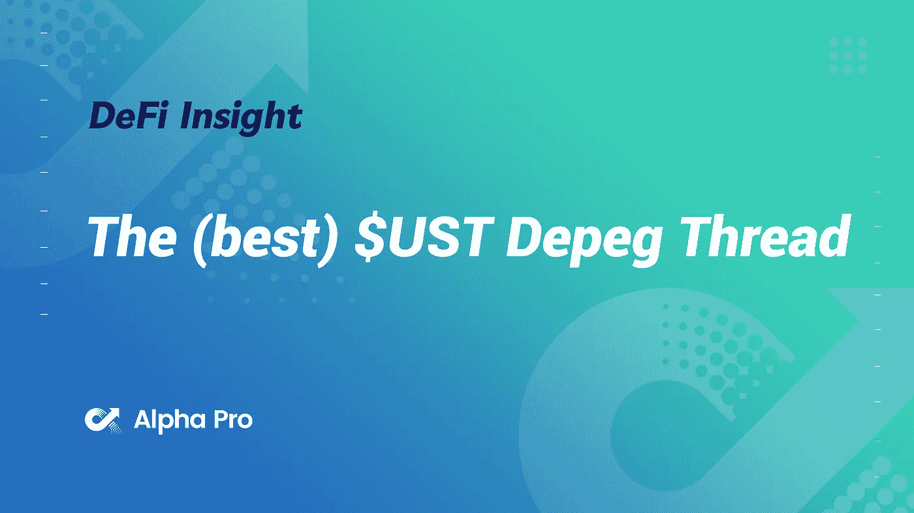
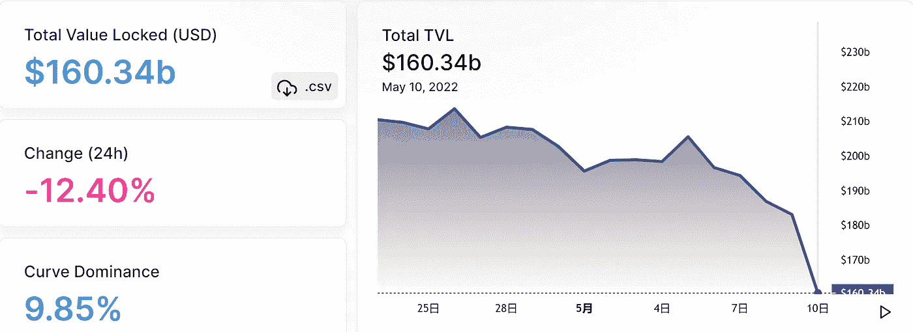
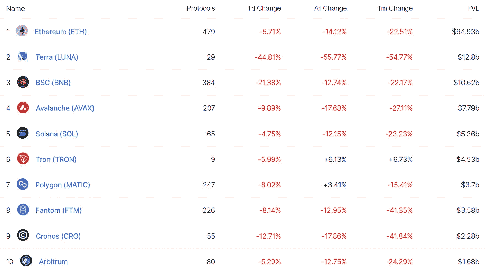
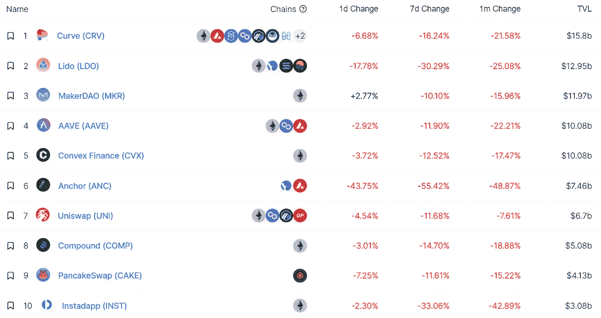
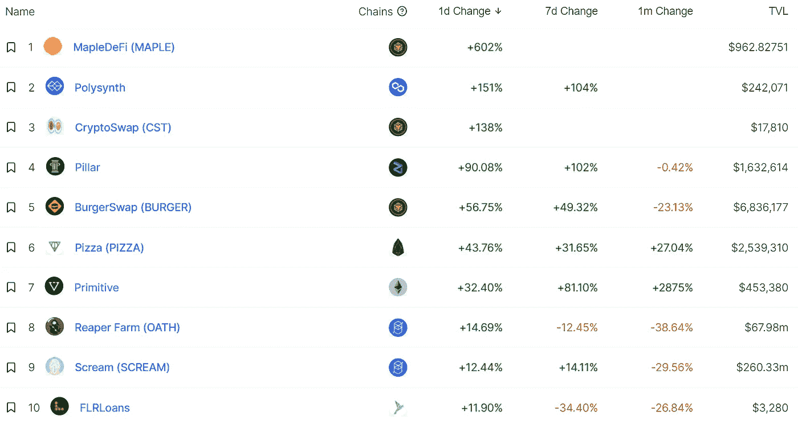
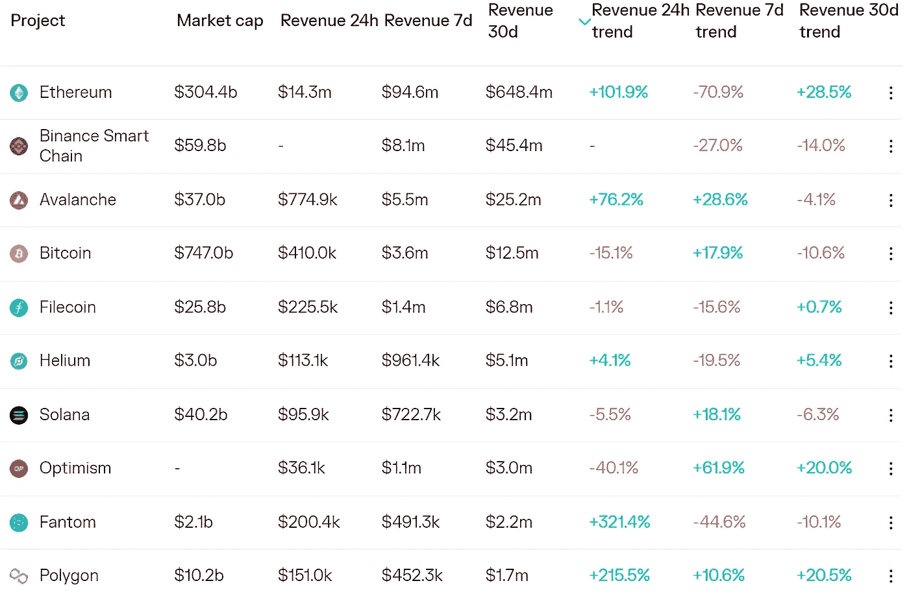
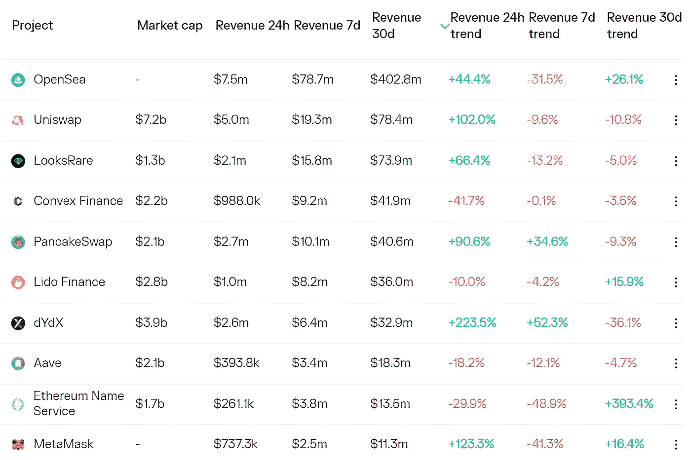
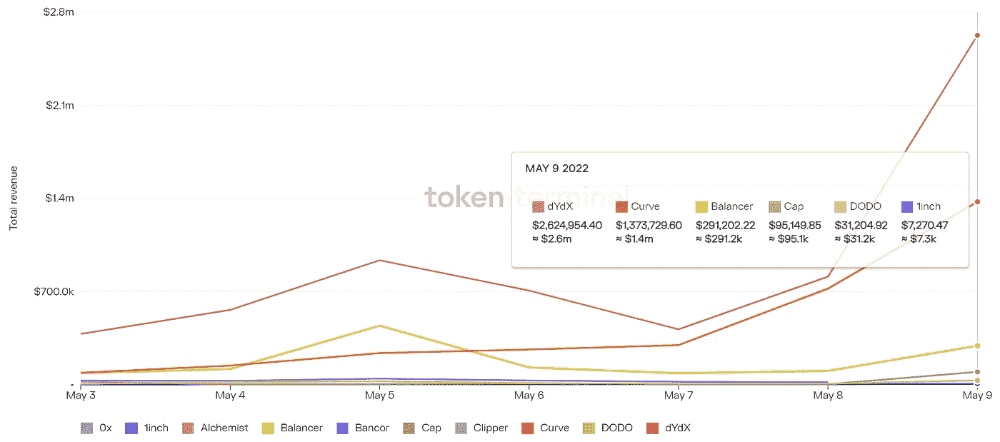
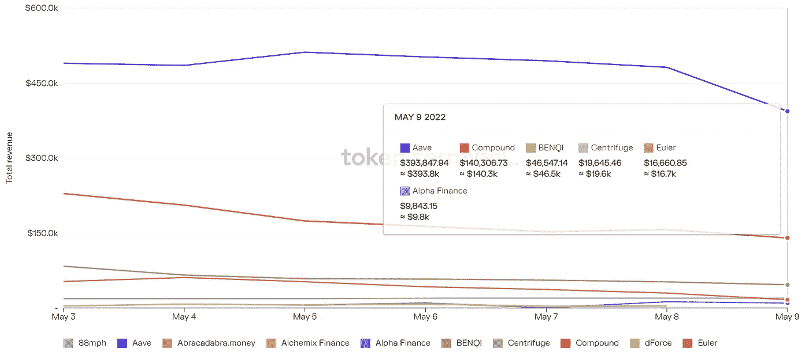

# DeFi Insight |(最佳)$ UST·德佩格线程

> 原文：<https://medium.com/coinmonks/defi-insight-the-best-ust-depeg-thread-68fbe1254fc?source=collection_archive---------22----------------------->

2022 年 5 月 10 日

*今日 DeFi 数据&由 DeFi Insight 为您带来的新闻。*

> *"* 由于算法稳定性的种种神奇混乱，一枚价值 180 亿美元的稳定硬币正在失去其与美元的挂钩，同时还出现了一点比特币系统风险的戏剧性事件。这里有[你需要知道的一切。](https://t.me/UniswapEarlyCalls/716)*[*@*jonwu _](https://twitter.com/jonwu_/status/1523793482850050048)*

# *最新消息*

## *贷款*

***[复合国债](/compound-finance/compound-treasury-sp-credit-rating-897aff3a6f8c)获得 S & P 信用评级***

## ***指标***

***Polkadex [赢得了](https://twitter.com/Polkadot/status/1523641447932518405) Polkadot 的第 16 次副链拍卖***

*****[寿司](/sushiswap-org/searching-for-a-sushi-head-chef-81915e0beb82)宣布公开招聘 CEO*****

*****在 Gnosis Chain 上部署 Uniswap v3 的提案已经开始投票*****

*******曲线上的 [sUSD-3crv 池](https://optimism.curve.fi/factory/0)乐观情绪开启激励*******

## *******产量*******

*********[Fabric 1st $ fUSD](https://twitter.com/official_fabric/status/1523805164225712130)stable coin pool 将于明天发布*********

## *******稳定币*******

*******评论家努里埃尔·鲁比尼正在研究一种象征性的美元替代品*******

## *******桥梁*******

*******跨链桥 [StarkGate Alpha](https://twitter.com/StarkWareLtd/status/1523664511642726400) 在 mainnet 上发布，用户现在可以将资产从以太坊转移到 StarkNet Alpha*******

## *******|令牌*******

*********[币安](https://www.binance.com/en/blog/launchpad/binance-launchpad-the-last-6-months-of-token-launches-421499824684903829)发射台:最近 6 个月的令牌发射*********

## *******拍卖*******

*********公平推出拍卖平台[铜](https://twitter.com/CopperPlatform/status/1523605275663421440)现支持雪崩*********

## *******钱包*******

*********新 [SafePal](https://blog.safepal.io/important-changes-about-binance-dapp-identity-verification/) 用户从 5 月 12 日起需要完成中间认证才能使用币安 DApp 的所有功能*********

## *******NFT*******

*********、**[志那都红豆](https://nftgo.io/collection/azuki/overview)系列 NFT 24 小时交易额超过 2900 万美元*******

*******[哈希夫](https://twitter.com/hashflow_/status/1523727041254010880)5 月 10 日抓拍哈希夫 NFT 持有者*******

*******流行歌手麦当娜将在 NFT 与皮普尔合作*******

# *******数据和分析*******

## *******锁定的总价值(TVL)*******

*******目前全网 DeFi 总锁定量为 1603.4 亿美元，24 小时下降 12.4%。*******

**************

## *******TVL 评出的十大连锁酒店*******

**************

## *******|最新 TVL 十大项目*******

**************

## *******|过去 24 小时内 TVL 增长的前 10 个项目*******

**************

## *******协议收入*******

## *******|累计总收入最高的项目(24H)_ 区块链(L1)*******

**************

## *******|累计总收入最高的项目(24H) _Dapps (L2)*******

**************

## *******|前 10 大交易所的每日收入*******

**************

## *******|十大贷款协议的每日收入*******

**************

# *******深潜*******

*********[**远航**](https://mhonkasalo.substack.com/p/navigating-the-ust-crash?utm_source=%2Finbox&utm_medium=reader2&s=r)**UST 坠机***********

***** [## 在 UST 坠机事件中导航

### 首先，我想说，这种爆炸对经历过的人来说是可怕的。没有享受。加密…

mhonkasalo.substack.com](https://mhonkasalo.substack.com/p/navigating-the-ust-crash?utm_source=%2Finbox&utm_medium=reader2&s=r) 

**向着** [**更好的**](/bankless-dao/towards-better-token-distribution-26f056dc5e55) **令牌分发**

 [## 实现更好的令牌分发

### Lockdrop +流动性自举拍卖强调价格稳定和社区

medium.com](/bankless-dao/towards-better-token-distribution-26f056dc5e55) 

**[**探索**](/momentum6/exploring-stablecoins-dd7b901370f1) **稳定点****

** [## 探索稳定的角落

### 所有稳定股票的总市值接近 2000 亿美元。创建与美元挂钩的代币有几种方法。

medium.com](/momentum6/exploring-stablecoins-dd7b901370f1)** 

# **报告**

****[**开社交**](https://messari.io/article/the-open-social-map) **地图**_ 梅萨里****

> ****开放社交是 Web3-native 的社交方式，是完全可组合和去中心化的。作为一个行业，它有潜力开启加密的下一波增长。****

******[**glass node**](https://insights.glassnode.com/the-week-onchain-week-19-2022/)**:加息推动市场走低** _insights******

******[**数字资产资金流向**](https://blog.coinshares.com/volume-79-digital-asset-fund-flows-weekly-report-7c2742eacb77) **周报** _coinshares******

******关于:******

****DeFi Insight 是顶级 DeFi 和加密新闻和更新的来源。****

******https://twitter.com/AlphaPro_io 推特:******

********❤RSS:**[**https://medium.com/feed/@alphapro.project**](https://medium.com/feed/@alphapro.project)******

****提供的信息应被视为发展新闻，而不是投资建议。****

> ****加入 Coinmonks [电报频道](https://t.me/coincodecap)和 [Youtube 频道](https://www.youtube.com/c/coinmonks/videos)了解加密交易和投资****

# ****另外，阅读****

*   ****[如何在 FTX 交易所交易期货](https://coincodecap.com/ftx-futures-trading) | [OKEx vs 币安](https://coincodecap.com/okex-vs-binance)****
*   ****[CoinLoan 评论](https://coincodecap.com/coinloan-review) | [YouHodler 评论](/coinmonks/youhodler-4-easy-ways-to-make-money-98969b9689f2) | [BlockFi 评论](https://coincodecap.com/blockfi-review)****
*   ****[XT.COM 评论](https://coincodecap.com/profittradingapp-for-binance)币安评论 | [的 ProfitTradingApp](https://coincodecap.com/xt-com-review)****
*   ****[SmithBot 评论](https://coincodecap.com/smithbot-review) | [4 款最佳免费开源交易机器人](https://coincodecap.com/free-open-source-trading-bots)****
*   ****[比特币基地僵尸程序](/coinmonks/coinbase-bots-ac6359e897f3) | [AscendEX 审查](/coinmonks/ascendex-review-53e829cf75fa) | [OKEx 交易僵尸程序](/coinmonks/okex-trading-bots-234920f61e60)*********